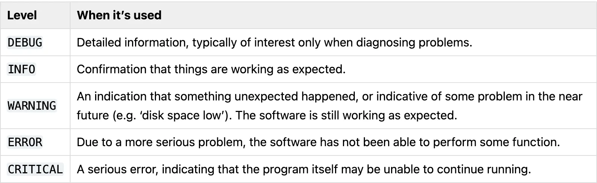

### What is Logging

- Logging is a means of tracking events that happen when some software runs.
- The software’s developer adds logging calls to their code to indicate that certain events have occurred.
- An event is described by a descriptive message which can optionally contain variable data (i.e. data that is potentially different for each occurrence of the event).

---

### Why Not Just `print()`

- While `print()` statements can be useful for quick checks during development, logging offers significant advantages, especially as your application grows.
- **Control over detail**: Logging allows you to **control the level of detail** in your output. You can easily enable or disable messages based on their severity without modifying code.

---

### Why Not Just `print()`

- **Multiple destinations**: Logs can be **directed to various destinations** like the console, files, network sockets, HTTP endpoints, or email, simultaneously.
- **Contextual information**: Logging can **automatically include useful metadata** such as timestamps, logger names, file names, line numbers, and process IDs, which is difficult to achieve consistently with `print()`.

---

### Why Not Just `print()`

- **Error handling**: The `logging` module provides built-in mechanisms to **capture and format stack traces** for exceptions.
- **Reduced maintenance burden**: Using logging **decreases the maintenance burden** by centralizing configuration and providing flexible control over log output.

---

### Python's `logging` Module

- The [`logging` module](https://docs.python.org/3/library/logging.html#module-logging/) in Python’s standard library is a ready-to-use, powerful module that’s designed to meet the needs of beginners as well as enterprise teams.
- `logging` module's key components: **loggers, handlers, filters, and formatters**. Log event information is passed between these components in a `LogRecord` instance.

---

### The Root Logger

```python
import logging

logging.warning("Remain calm!")
# WARNING:root:Remain calm!
```

- The output shows the **severity level** before each message along with `root`, which is the name the `logging` module gives to its default logger.
- The default format that can be configured to include things like a timestamp or other details.

---

### Log Level

- The `logging` module provides you with a default logger that allows you to get started with logging without needing to do much configuration.

 

---

### Default Severity Level

- By default, the logging module logs the messages with a severity level of `WARNING` or above. You can change that by configuring the logging module to log events of all levels.

```python
logging.debug("This is a debug message")
logging.info("This is an info message")
logging.warning("This is a warning message")
# WARNING:root:This is a warning message
logging.error("This is an error message")
# ERROR:root:This is an error message
logging.critical("This is a critical message")
# CRITICAL:root:This is a critical message
```

---

### Adjusting the Log Level

- To set up your basic logging configuration and adjust the log level, the `logging` module comes with a [`basicConfig()`](https://docs.python.org/3/library/logging.html#logging.basicConfig) function.

```python
# Demo in REPL
import logging

logging.basicConfig(level=logging.DEBUG)
logging.debug("This will get logged.")
# DEBUG:root:This will get logged.
```

---

### Log Output Formatting

- By default, logs contain the log level, the logger’s name, and the log message.
- The `format` parameter accepts a string that can contain a number of [predefined attributes](https://docs.python.org/3/library/logging.html#logrecord-attributes).

```python
import logging

# The default value of format looks like this:
logging.basicConfig(
    format="%(levelname)s:%(name)s:%(message)s"
)
logging.warning("Hello, Warning!")
# WARNING:root:Hello, Warning!
```

---

### Log Output Formatting

- Besides the message text and the log level, it usually makes sense to also have a timestamp in the log record. A timestamp can give you the exact time the program sent the log message.
- This can help you [monitor code performance](https://realpython.com/python-timer/) or notice patterns around when some errors occur.
- Use the `asctime` attribute in your `format` string of `baseConfig()` or add `datefmt` to customize the timestamp.

---

### Log Output Formatting

```python
# Demo in REPL
import logging

logging.basicConfig(
    format="{asctime} - {levelname} - {message}", style="{",
    # Prefix your logs with a timestamp. The directives you
    # use to format the timestamp in the datefmt string are
    # year (%Y), month (%m), day (%d),
    # hour (%H), and minutes (%M).
    datefmt="%Y-%m-%d %H:%M",
)

logging.error("Something went wrong!")
# 2025-06-20 11:33 - ERROR - Something went wrong!
```

---

### Logging to a File

- Set up your logger’s `baseConfig()` with the `filename` argument to save your logs in a file.
- Just like opening a file in Python, you must provide a filepath. It’s also good practice to set an encoding and the [mode](https://docs.python.org/3/library/functions.html#filemodes). 
- Besides formatting your log records, it can also be a good idea to archive your logs in date-formatted folders and adjust the names of the log files.

---

### Logging to a File

```python
import logging

logging.basicConfig(
    filename="app.log",
    encoding="utf-8",
    # mode 'a': appending to the end of file if it exists.
    filemode="a",
    format="{asctime} - {levelname} - {message}",
    style="{",
    datefmt="%Y-%m-%d %H:%M",
)

logging.error("Oops!")
# File app.log: 2025-06-20 11:41 - ERROR - Oops!
```

---

### Displaying Variable Data

- By leveraging [Python’s f-strings](https://realpython.com/python-f-strings/#self-documenting-expressions-for-debugging), you can create verbose debug messages that contain variable information.

```python
import logging

logging.basicConfig(
    format="{asctime} - {levelname} - {message}", style="{",
    datefmt="%Y-%m-%d %H:%M",
)

school = "SADT"
logging.error(f"{school=}")
# 2025-06-20 11:47 - ERROR - school='SADT'
```

---

### Capturing Stack Traces

- The `logging` module also allows you to capture the full stack traces in an application.

```python
import logging

logging.basicConfig(
    filename="app.log", encoding="utf-8", filemode="a",
    format="{asctime} - {levelname} - {message}",
    style="{", datefmt="%Y-%m-%d %H:%M",
)

donuts, guest = 5, 0
try:
    donuts_per_guest = donuts / guest
except ZeroDivisionError:
    logging.error("DonutCalculationError", exc_info=True)
```

---

### Capturing Stack Traces

- [Exception information](https://realpython.com/python-exceptions/) can be captured if the `exc_info` parameter is passed as `True`.
- If `exc_info` isn’t set to `True`, the output wouldn’t tell you anything about the exception.
- Since you’re logging into the `app.log` file, you can keep track of stack traces in the file.

```
2025-06-20 11:52 - ERROR - DonutCalculationError
Traceback (most recent call last):
  File "<python-input-0>", line 11, in <module>
    donuts_per_guest = donuts / guest
                       ~~~~~~~^~~~~~~
ZeroDivisionError: division by zero
```

---

### Advanced Logging

- The logging module has four categories of components: **loggers**, **handlers**, filters, and formatters.

  - Loggers expose the interface that application code directly uses.

  - Handlers send the log records (created by loggers) to the appropriate destination.

---

### Advanced Logging

- The logging module has four categories of components: loggers, handlers, **filters**, and **formatters**.

  - Filters provide a finer grained facility for determining which log records to output.

  - Formatters specify the layout of log records in the final output.

---

### Creating a Custom Logger

- Calling the default logger directly is a handy way to get a first impression of how logging works.
- The downside of working with the `root` logger directly is that the configuration can be cumbersome as you’re relying on a single `basicConfig()`. For bigger projects, you’ll need more flexibility for your logging needs.
- Generally, it’s a good idea to define your own custom logger.

---

### Creating a Custom Logger

- You can instantiate a `Logger` class by calling the `logging.getLogger()` function and providing a name for your logger.
- It’s good practice to pass `__name__` as the name parameter. That way, your logger’s name is always the module’s name in the [Python package namespace](https://realpython.com/python-namespaces-scope/).

---

### Creating a Custom Logger

- When you call `logger.warn()`, there is no additional logging information, such as the logger’s name or the log level.
- To format the log, configure your custom logger using handlers and formatters.

```python
# Demo in REPL
import logging

logger = logging.getLogger(__name__)
logger.warning("Look at my logger!")
# Look at my logger!
```

---

### Using Destination Handlers

- To send the log messages to different destinations like the standard output stream or a file, create two handlers.

```python
import logging

logger = logging.getLogger(__name__)
console_handler = logging.StreamHandler()
file_handler = logging.FileHandler(
    "app.log", mode="a", encoding="utf-8"
)
logger.addHandler(console_handler)
logger.addHandler(file_handler)

logger.warning("Watch out!")
# Displayed in console and saved to app.log: Watch out!
```

---

### Using Formatting Handlers

- Create an instance `formatter` of the [`Formatter`](https://docs.python.org/3/library/logging.html#formatter-objects) class, then call handler's `.setFormatter()` with `formatter` as an argument.

```python
import logging

logger = logging.getLogger(__name__)
console_handler = logging.StreamHandler()
logger.addHandler(console_handler)
formatter = logging.Formatter(
    "{asctime} - {levelname} - {message}",
     style="{", datefmt="%Y-%m-%d %H:%M",)
console_handler.setFormatter(formatter)
logger.warning("Stay calm!")
# 2025-06-20 22:14 - WARNING - Stay calm!
```

---

### Log Levels of Custom Loggers

- Call `setLevel()` method of **logger and handler** to customize severity level.
- This is useful when you want to set multiple handlers for the same logger but want different severity levels for each.
- While developing an application, you may want logs with level `DEBUG` and higher to be logged to the console, but everything with level `WARNING` and above to be saved to a file.

---

### Log Levels of Custom Loggers

```python
import logging

logger = logging.getLogger(__name__)
logger.setLevel("DEBUG")
console_handler = logging.StreamHandler()
console_handler.setLevel("DEBUG")
logger.addHandler(console_handler)
file_handler = logging.FileHandler("app.log", mode="a", encoding="utf-8")
file_handler.setLevel("WARNING")
logger.addHandler(file_handler)

logger.debug("Just checking in!")
logger.warning("Stay curious!")
logger.error("Stay put!")
```

---

### Key Takeaways

- Logging is vital for reliable software.
- Python's logging module is the de-facto standard.
- Log levels (DEBUG to CRITICAL) indicate message severity.
- Key components: Loggers (interface), Handlers (destination), Formatters (layout), Filters (control).
- Avoid the root logger in application code; use named loggers.

---

### Sources:

- https://realpython.com/python-logging/
- https://docs.python.org/3/library/logging.html
- https://docs.python.org/3/howto/logging.html
- https://docs.python.org/3/howto/logging-cookbook.html