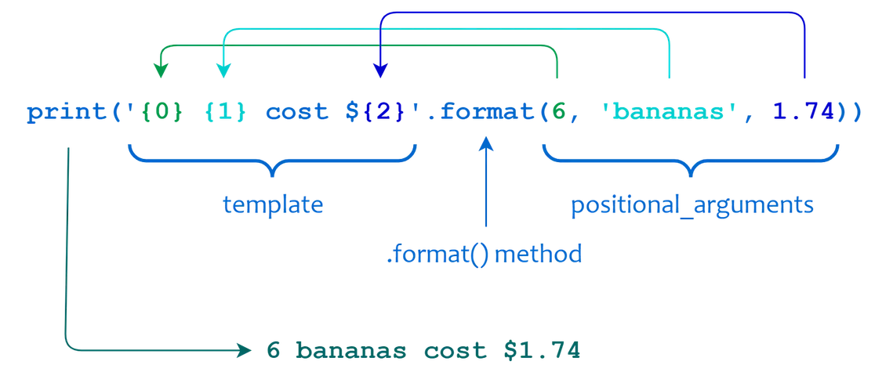

### Split a String in Python

- Python’s `.split()` method lets you divide a string into a list of substrings based on a specified delimiter. By default, `.split()` separates at whitespace, including spaces, tabs, and newlines.
- You can customize `.split()` to work with specific delimiters using the `sep` parameter, and control the amount of splits with `maxsplit`.

---

### Python `.split()` Method

- `split()` is particularly handy when dealing with plain text where words are separated by spaces. It also **strips newlines by default**.

```python
sentence = "Python is awesome."
print(sentence.split())	# ['Python', 'is', 'awesome.']

text = """Line one
Line two"""
print(text.split()) # ['Line', 'one', 'Line', 'two']
```

---

### Pair `.split()` with `.strip()`

- Use this pair when dealing with text that contains whitespace characters at the beginning and end of text: `text.strip().split()`
- You may see results like this when working with data that you received through web scraping, copy-paste artifacts from PDFs, log message processing, or even regular user input.

---

### Pair `.split()` with `.strip()`

- First remove superfluous whitespace characters from the beginning and end of the string using `.strip()`. This operation returns a new string object without that whitespace.
- Then chain `.split()` to this cleaned output, allowing it to break the text into elements—in this case, individual words.

---

### Pair `.split()` with `.strip()`

```python
text = "    Hello   world  "
print(text.strip().split())	# ['Hello', 'world']
print(text.split())	# ['Hello', 'world']
```

- If you’re only dealing with messy whitespace, however, then you don’t need to use `.strip()` to get to a clean result.
- However, due to developer habits and a preference for explicitness, you may still come across this combination of string methods in the wild.

---

### Return Value of `.split()`

- `.split()` returns a list of substrings. This means that you can iterate over the result, access individual elements using indexing, or unpack the iterable into separate variables.

```python
user_input = "John Doe 30"
user_data = user_input.split()
print(user_data) # ['John', 'Doe', '30']

first_name, _, age = user_data
print(f"Welcome {first_name}! You're {age} years old.")
# Welcome John! You're 30 years old.
```

---

### Split With Different Delimiters

- Real-world scenarios require splitting strings using other delimiters. You can use the `sep` parameter to specify the delimiter.

```python
# CSV files are a popular format for storing tabular data,
# where each line represents a row and each value within 
# a line is separated by a comma.
# It’s best to use Python’s csv library when you’re 
# working with CSV files.

csv_line = "Ankita,Vishal,Jane,Naga,Emily,Maria"
print(csv_line.split(sep=","))
# ['Ankita', 'Vishal', 'Jane', 'Naga', 'Emily', 'Maria']
```

---

### Split With Different Delimiters

- The `sep` parameter is not limited to commas. You can use any character—or even a sequence of characters—as a delimiter.

```python
#  ";)" is passed as a positional argument instead of as a
# keyword argument through sep. In practice, you’ll see the
# separator string more often passed as a positional argument,
# but both ways lead to the same result.

# By specifying ";)" as the sep argument, the .split() method 
# will break the string into individual fruit names.
fruits = "Apple;)Orange;)Lemon;)Date"
print(fruits.split(";)"))
# ['Apple', 'Orange', 'Lemon', 'Date']
```

---

### Limit the Amount of Splits

- Python’s `.split()` method provides an optional `maxsplit` parameter that allows you to specify the maximum number of splits to perform.
- Once Python reaches the specified number of splits, it returns the remaining part of the string as the final element in the list.

---

### Limit the Amount of Splits

```python
line = "2025-06-15 08:45:23 INFO User logged in from IP 10.0.1.1"

date, time, log_level, message = line.split(maxsplit=3)

print(f"Date: {date}")
print(f"Time: {time}")
print(f"Log Level: {log_level}")
print(f"Message: {message}")

# Date: 2025-06-15
# Time: 08:45:23
# Log Level: INFO
# Message: User logged in from IP 10.0.1.1
```

---

### Go Backwards Using `rsplit()`

- Python’s string method `.rsplit()` allows you to split a string like `.split()` does, but instead of starting from the left, it starts splitting from the right.
- Without specifying `maxsplit`, `.split()` and `.rsplit()` produce identical results.

```python
countdown = "3-2-1"
print(countdown.split("-"))  # ['3', '2', '1']
print(countdown.rsplit("-")) # ['3', '2', '1']
```

---

### Go Backwards Using `rsplit()`

- In combination with `maxsplit`, this method comes in handy for string splitting tasks.

```python
# This allows you to extract the filename while keeping
# the rest of the string as one element, which you assign
# to directory.
path = "/home/user/student/notes.txt"
directory, filename = path.rsplit("/", maxsplit=1)
print(directory) # /home/user/student
print(filename) # notes.txt
```

---

### Split Strings by Lines

- When processing multiline text, you might often need to split it into individual lines—for example, when you’re reading data from a file or dealing with text generated by an application.

```python
text = """Hello, World!
How are you doing?
"""
print(text.split("\n"))
# ['Hello, World!', 'How are you doing?', ''] <- note the ''
# .split() adds an empty string when the text ends with 
# a final newline. This may not always be what you want.
```

---

### Split Strings by Lines

- Python provides a dedicated string method called [`.splitlines()`](https://docs.python.org/3/library/stdtypes.html#str.splitlines) for it, which also avoids the awkward empty string in the final index.
- The `.splitlines()` method splits a string at line boundaries, such as the newline characters (`\n`), carriage returns (`\r`), and some combinations like `\r\n`. It returns a list of lines that you can iterate over or manipulate further.

---

### Split Strings by Lines

- In this example, the string `text` contains again two lines with text, and a final newline. When you call `.splitlines()`, it returns a list with each line as a separate element. The final line break doesn’t result in an extra empty string element.

```python
text = """Hello, World!
How are you doing?
"""
print(text.splitlines())
# ['Hello, World!', 'How are you doing?']
```

---

### A Practical Situation of `splitlines()`

```python
log_data = """2025-06-15 08:45:23 INFO User logged in
2025-06-15 09:15:42 ERROR Failed to connect to server
2025-06-15 10:01:05 WARNING Disk space running low"""

log_lines = log_data.splitlines()

for line in log_lines:
    if "ERROR" in line: # membership test
        print(line)
# 2025-06-15 09:15:42 ERROR Failed to connect to server
```

---

### F-Strings for String Interpolation

- Python has a string formatting tool called **f-strings**, which stands for **formatted string literals**.
- F-strings are string literals that you can create by prepending an `f` or `F` to the literal.
- They allow you to do string interpolation and formatting by inserting variables or expressions directly into the literal.

---

#### Interpolating Variables Into F-Strings

- The variable that you insert in a replacement field is evaluated and converted to its string representation. The result is interpolated into the original string at the replacement field’s location.

```python
# Python retrieves the value of site when it runs
# the string literal, so if location isn’t defined
# at that time, then you get a NameError exception. 
location = "SAIT main campus"
print(f"Welcome to {location}!")
# Welcome to SAIT main campus!
```

---

#### Embedding Expressions in F-Strings

- You can embed almost any Python expression in an f-string, including arithmetic, Boolean, and conditional expressions.
- You can also include function calls, attribute access, common sequence operations like indexing and slicing, and more.

```python
quantity, item, price = (6, "bananas", 1.74)
print(f"{quantity} {item} cost ${price * quantity}")
# 6 bananas cost $10.44
```

---

#### `.format()` Method for String Interpolation

- You typically call the method on a string template, which is a string containing **replacement fields**. The [`*args` and `**kwargs`](https://realpython.com/python-kwargs-and-args/) arguments allow you to specify the values to insert into the template. The resulting string is [returned](https://realpython.com/python-return-statement/) from the method.

```python
template_string.format(*args, **kwargs)
```

---

#### `.format()` Method for String Interpolation

- Use [positional arguments](https://realpython.com/defining-your-own-python-function/#positional-arguments) in the method call, then use integer indices to determine which replacement field to insert each value into.



---

#### `.format()` Method for String Interpolation

- The indices don’t have to follow a strict consecutive order or be unique in the template. This allows you to customize the position of each argument in the final string.
- If a replacement field number is out of range, IndexError will be raised.

```python
print("{2}.{1}.{0}/{0}{2}".format("foo", "bar", "baz"))
# baz.bar.foo/foobaz
```

---

#### `.format()` Method for String Interpolation

- You can also omit the indices in the replacement fields, in which case Python will assume a sequential order. This is referred to as **automatic field numbering**.

```python
print("{} {} cost ${}".format(6, "bananas", 1.74 * 6))
# 6 bananas cost $10.44
```

---

#### Keyword Arguments and Named Fields

- You can also use [keyword arguments](https://realpython.com/defining-your-own-python-function/#keyword-arguments) instead of positional argument to produce the same result.

```python
print("{quantity} {item} cost ${cost}".format(
    quantity=6,
    item="bananas",
    cost=1.74 * 6,
    ))
# 6 bananas cost $10.44

print("{x} {y} {z}".format(x="foo", y="bar", z="baz"))
# foo bar baz
```

---

### The `width` Component

- The `width` component specifies the minimum width of the output field.

```python
# s in :8s means presentation type is String
print(f"{'Hi':8s}")          # 'Hi      '
print("{0:8s}".format("Hi")) # 'Hi      '

# d in :8d means presentation type is Decimal integer
print(f"{123:8d}")           # '     123'
print("{0:8d}".format(123))  # '     123'

# {0:2s} is a minimum field width. If a value
# is longer than the minimum, width is effectively
# ignored.
print("{0:2s}".format("Pythonista")) # Pythonista
```

---

### The `align` and `fill` Components

- The `align` and `fill` components allow you to control how the formatted output is padded and positioned within the specified field width.

```python
# `<`  Aligns the value to the left
print(f"{'Hi':<8s}")  # 'Hi      '
# `>` Aligns the value to the right
print(f"{'Hi':>8s}")  # '      Hi'
# `^` Centers the value
print(f"{123:^8d}")   # '  123   '
# `=` Aligns the sign of numeric values
print(f"{123:+8d}")   # '    +123'
print(f"{-123:+8d}")  # '    -123'
# fill component allows you to replace the extra space
print(f"{'Hi':$>8s}") # '$$$$$$Hi'
print(f"{'Hi':*^8s}") # '***Hi***'
```

---

### The `sign` Component

- The `sign` component controls whether a sign appears in numeric output with of your format specifiers.

```python
# The plus sign (+) indicates that the value should
# always display a leading sign.
print(f"{123:+6d}")   	# '  +123'
print(f"{-123:+6d}")  	# '  -123'
# The minus sign (-) indicates that only negative
# numeric values will include a leading sign.
print(f"{123:-6d}")   	# '   123'
print(f"{-123:-6d}")  	# '  -123'
# The space sign (" ") means that a sign is included
# for negative values and a space for positive values.
print(f"{123:*> 6d}") 	# '** 123'
print(f"{-123:*> 6d}")	# '**-123'
```

---

### The `precision` Component

- The `precision` component specifies the number of digits after the decimal point for floating-point presentation types.
- The `precision` is separated from the `width` by a literal dot (`.`).

```python
# Use different precision values to display the number.
print(f"{1234.5678:8.2f}")	# ' 1234.57'
print(f"{1.23:8.4f}")				# '  1.2300'
print(f"{1234.5678:8.2e}")	# '1.23e+03'
print(f"{1.23:8.4e}")				# '1.2300e+00'
```

---

### Key Takeaways

- Use `.split()` to **break strings** down by **whitespace**.
- Provide a **custom delimiter**, like commas, tabs, and semicolons, with the `sep` parameter.
- Control splitting behavior with `maxsplit` to **limit the number of substrings** you extract.
- **Split by lines** using `.splitlines()`, with or without line breaks.

---

### Key Takeaways

- Used **f-strings** and the **`.format()`** method for string interpolation.
- **Formatted** the input values using different components of a replacement field.
- Created **custom format specifiers** to format your strings.

---

### Sources:

- https://realpython.com/python-split-string/
- https://realpython.com/python-formatted-output/
- https://realpython.com/python-string-formatting/