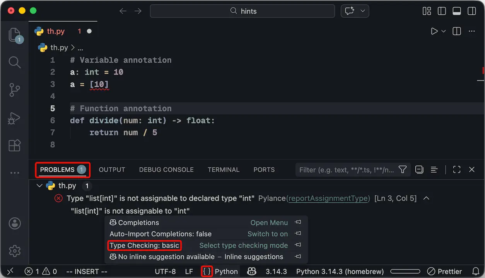

### Python Type Hints

- Python is a **dynamic language**. This means a variable can be a string on one line and an integer on the next. While flexible, this can lead to runtime `TypeError`s.
- **Type Hints** (introduced in [PEP 484](https://peps.python.org/pep-0484/)) allows you to annotate variables and functions with types.
- **Important:** Type hints are just *hints*. The Python runtime (interpreter) ignores them and does not enforce them. They are designed for **Static Analysis** tools (like [Pyright](https://github.com/microsoft/pyright), [mypy](https://mypy-lang.org/), or IDEs) to catch errors *before* the code runs.

---

### Basic Annotations

- You can add types to variables, function arguments, and return values.
- Modern IDEs (like [VS Code with Pyright](https://marketplace.visualstudio.com/items?itemName=ms-pyright.pyright), or [Pylance](https://marketplace.visualstudio.com/items?itemName=ms-python.vscode-pylance)) will flag type mismatches immediately.

```python
# Variable annotation
a: int = 10
# a: int = '10'  <-- Static analysis will flag this error

# Function annotation
def divide(num: int) -> float:
    return num / 5
```

---

### Type Checking in IDE



---

### Complex Types and Containers

- For containers like lists and dictionaries, you often need to specify what they contain.
- **Lists:** `list[str]` (A list of strings).
- **Dictionaries:** `dict[str, float]` (Keys are strings, values are floats).
- **Tuples:** Tuples are immutable and often have a fixed structure. `tuple[float, float]` implies exactly two float elements (e.g., coordinates).

```python
class Student:
    def __init__(self, courses: list[str],
                 grades: dict[str, float], 
                 location: tuple[float, float]):
        self.courses = courses
        self.grades = grades
        self.location = location
```

---

### Define Your Own Type

- Defining your own types (Type Aliasing) makes your code much more readable and easier to maintain. Instead of repeating complex types, you give them a meaningful name.

```python
Coordinate = tuple[float, float]
current_pos: Coordinate = (10.1, 20.5)
```

---

### Unions and Optionals

- Sometimes a variable can hold more than one type.
- Use the pipe operator `|` to represent a **Union**.
- If a value can be `None`, it is considered Optional.

```python
from datetime import datetime

# birthdate can be a datetime object OR a string
birthdate: datetime | str 

# location is a tuple OR None (if not provided)
location: tuple[float, float] | None = None
```

---

### Unions and Optionals

```python
from typing import Optional

# Pre-Python 3.10
def func_old(arg: Optional[int]) -> Optional[str]:
    if arg is None:
        return None
    return str(arg)

# Python 3.10+ (preferred)
def func_new(arg: int | None) -> str | None:
    if arg is None:
        return None
    return str(arg)
```

Source: https://peps.python.org/pep-0604/

---

### Unions and Optionals

- It is crucial to understand that the `Optional` type hint refers to whether the *value* can be `None`, not whether the *argument* is syntactically optional in a function call.

```python
def baz(arg: str | None = None):
    if arg is None:
        # handle default behavior
        pass

baz()        # Valid, default is None <- `= None`
baz("hello") # Valid, <- `str`
baz(None)    # Valid, <- `| None`
```

---

### Literals

- Sometimes a string isn't just any string; it must be one of a specific set of values.
- Use `Literal` from the `typing` module to enforce specific values (similar to Enums).

```python
from typing import Literal

# The type checker will error if you pass 'AB' or 'SK'
Province = Literal['Alberta', 'Saskatchewan']

student_home: Province = "Alberta"  # Valid
student_home: Province = "AB"       # Invalid
```

---

### Forward References

- A common issue arises when defining a class method that references the class itself (e.g., a `follow` method in a `Student` class).
- Since `Student` isn't fully defined yet inside its own body, Python used to raise a `NameError`.
- **Solution:** Use `from __future__ import annotations`. This postpones the evaluation of type hints. Generally unnecessary in Python 3.14 and later.

```python
from __future__ import annotations

class Student:
    # Referencing Student inside Student works due to annotations
    def follow(self, other: Student):
        pass
```

---

### Robustness: `Iterable` vs `list`

- **Postel's Law:** "Be liberal in what you accept, and conservative in what you send."
- When typing function arguments, prefer abstract interfaces like `Iterable` over concrete types like `list`. This allows the function to accept lists, tuples, or generators.
- When typing return values, be specific (e.g., return `list`).

```python
from collections.abc import Iterable

# Accepts list, tuple, set, etc.
def print_names(names: Iterable[str]) -> None:
    for name in names:
        print(name)
```

---

### Generics (`TypeVar`)

- Sometimes you want the input type and return type to match, regardless of what that type actually is.
- Use `TypeVar` to create a generic type variable.

```python
from typing import TypeVar

T = TypeVar('T', int, str)

# If a is int, return is int. If a is str, return is str.
def add_two_items(a: T, b: T) -> T:
    return a + b

add_two_items(1, 2)                   # Valid
add_two_items("Hello", "world!")      # Valid
add_two_items(1, "world!")            # Invalid
```

---

### Modern Generics (Python 3.12+)

- Python 3.12 introduced a cleaner syntax for generics, eliminating the need to instantiate `TypeVar`.

```python
# Constrained Generics (e.g., only int or str)
def add_constrained[T: (int, str)](a: T, b: T) -> T:
    return a + b

add_constrained(1, 2)                 # Valid
add_constrained("Hello", "world!")    # Valid
add_constrained(1, "world!")          # Invalid
```

---

### Gradual Typing

- **No Runtime Impact:** Since the Python interpreter ignores type hints, you can add them file-by-file or function-by-function without breaking your application.
- **Gradual Typing:** This is the process of slowly introducing static typing to a dynamic codebase. You don't need to refactor the entire project at once.
- **Implicit Any:** By default, unannotated code is treated as having the type Any, meaning static analysis tools will ignore it, allowing you to focus only on the parts you are currently working on.

---

### Code is Documentation

- **Live Documentation:** Traditional comments and docstrings can rot (become outdated) because code changes but comments often don't.
- **Static Verification:** Type hints are "live" documentation. If the code changes but the types don't, the static analysis tool will yell at you.
- Reading the type signature tells you exactly how to use the function without needing to read the implementation details.

---

### Sources:

- https://docs.python.org/3/library/typing.html
- https://peps.python.org/pep-0484/
- https://docs.python.org/3/library/collections.abc.html
- https://microsoft.github.io/pyright/
- https://mypy-lang.org/