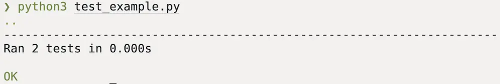
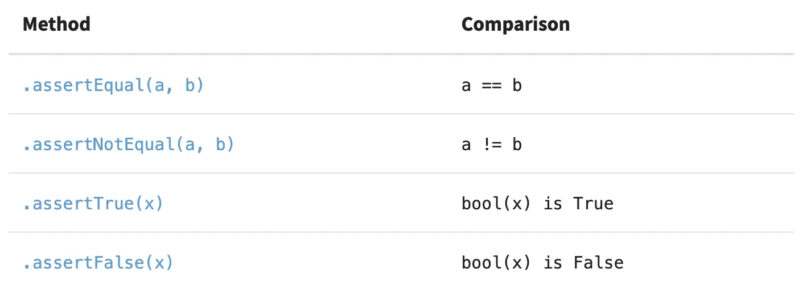
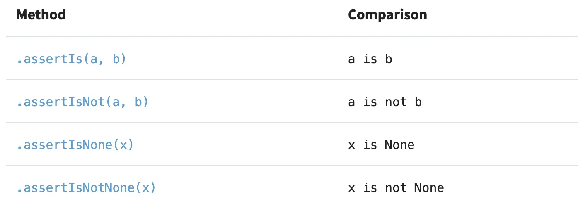
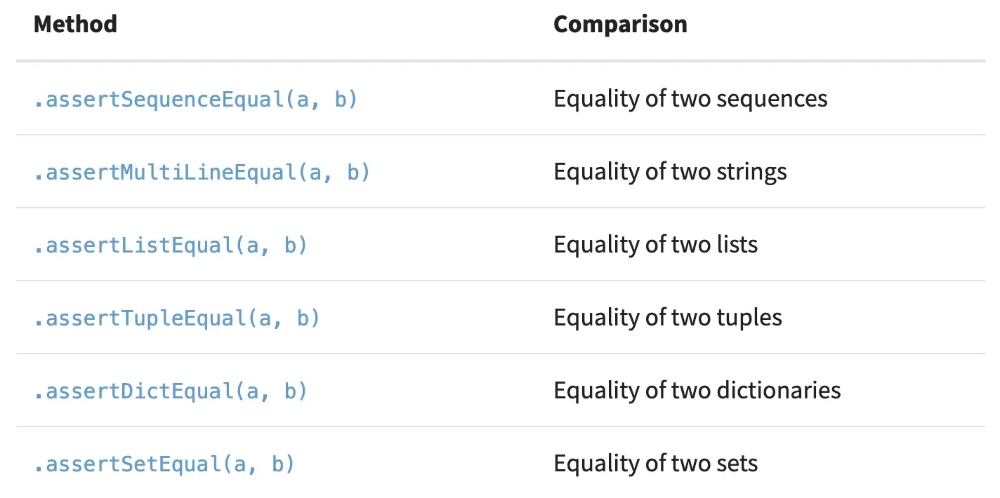
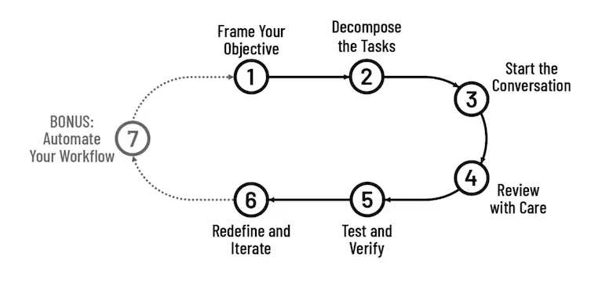

### Testing Your Python Code

- **Code testing** or [software testing](https://en.wikipedia.org/wiki/Software_testing) is a fundamental part of a modern software development cycle. Through code testing, you can verify that a given software project works as expected and fulfills its requirements. Testing enforces code quality and robustness.
- You’ll do code testing during the development stage of an application or project. You’ll write tests that isolate sections of your code and verify its correctness.
- A well-written battery or suite of tests can also serve as documentation for the project at hand.

---

### What is `unit` Test

- A **unit** is often a small part of a program that takes a few inputs and produces an output. [Functions](https://realpython.com/defining-your-own-python-function/), [methods](https://realpython.com/python-classes/#providing-behavior-with-methods), and other [callables](https://realpython.com/python-callable-instances/) are good examples of units that you’d need to test.
- The `unittest` unit testing framework was originally inspired by JUnit and has a similar flavor as major unit testing frameworks in other languages. It supports test automation, sharing of setup and shutdown code for tests, aggregation of tests into collections, and independence of the tests from the reporting framework.

---

### Create a Test Case

- A test case is created by subclassing [`unittest.TestCase`](https://docs.python.org/3/library/unittest.html#unittest.TestCase).
- Defined tests with methods whose names start with the letters `test`. This naming convention informs the test runner about which methods represent tests.
- [`unittest.main()`](https://docs.python.org/3/library/unittest.html#unittest.main) provides a command-line interface to the test script.

---

### Basic Example

```python
import unittest

class TestStringMethods(unittest.TestCase):
    def test_upper(self):
        self.assertEqual('foo'.upper(), 'FOO')

    def test_isupper(self):
        self.assertTrue('FOO'.isupper())
        self.assertFalse('Foo'.isupper())

if __name__ == '__main__':
    unittest.main()
```

 

---

### Basic Example

```python
import unittest

class TestStringMethods(unittest.TestCase):
    # ...
    # Add new individual test
    def test_split(self):
        s = 'hello world'
        self.assertEqual(s.split(), ['hello', 'world'])
        # check that s.split fails when the separator is not a string
        with self.assertRaises(TypeError):
            s.split(2)

if __name__ == '__main__':
    unittest.main()
```

---

### Test Discovery

- Unittest supports simple test discovery. In order to be compatible with test discovery, all of the test files must be [modules](https://docs.python.org/3/tutorial/modules.html#tut-modules) or [packages](https://docs.python.org/3/tutorial/modules.html#tut-packages) importable from the top-level directory of the project (this means that their filenames must be valid [identifiers](https://docs.python.org/3/reference/lexical_analysis.html#identifiers)).

```
cd project_directory
python -m unittest discover
```

---

### Available Assert Methods

- The `TestCase` class provides a set of assert methods. You can use these methods to check multiple conditions while writing your tests. 
- There are over twenty methods in total. They let you compare *single values*, such as numbers and Booleans, and *collections*, such as lists, tuples, dictionaries, and more.

---

### Comparing Values



---

### Comparing Objects by Their Identity



---

### Comparing Collections



---

### More on `unittest`

- [Command-Line Interface](https://docs.python.org/3/library/unittest.html#command-line-interface)
- [Organizing test code](https://docs.python.org/3/library/unittest.html#organizing-test-code)
- [Skipping tests and expected failures](https://docs.python.org/3/library/unittest.html#skipping-tests-and-expected-failures)

---

### Test-Driven Development

- **Test-driven development** (**TDD**) is a way of writing [code](https://en.wikipedia.org/wiki/Source_code) that involves writing an [automated](https://en.wikipedia.org/wiki/Test_automation) [unit-level](https://en.wikipedia.org/wiki/Unit_testing) [test case](https://en.wikipedia.org/wiki/Test_case_(software)) that fails, then writing just enough code to make the test pass, then [refactoring](https://en.wikipedia.org/wiki/Refactoring) both the test code and the production code, then repeating with another new test case.
- **TDD** is a software development process relying on short, iterative cycles where automated unit tests are written *before* functional code. 

---

### RGB(`Red-Green-Refactor`)

- Write a test for the next bit of functionality you want to add.
- Write the functional code until the test passes.
- Refactor both new and old code to make it well structured.


Credit: https://martinfowler.com/bliki/TestDrivenDevelopment.html

---

### Benefits of TDD

- **High Quality & Reliability:** Continuous testing leads to fewer bugs and more robust, reliable code.
- **Improved Design:** The process often leads to modular, flexible, and better-documented code.
- **Faster Debugging:** Because tests are written for small increments, identifying the cause of failures is much faster.
- **Confidence in Changes:** A comprehensive test suite allows developers to refactor or modify code without fear of breaking existing functionality.

---

### Common Pitfalls of TDD

- Forgetting to run tests frequently
- Writing too many tests at once
- Writing tests that are too large or coarse-grained
- Writing overly trivial tests, for instance omitting assertions
- Writing tests for trivial code, for instance, accessors

---

### Testing in the Age of Vibe Coding

- **You’re responsible for the quality of the code**, whether you wrote it or AI did. This works best when writing your tests and expectations before generating the code.
- Fail fast, fix fast, and ask AI to help you spot subtle mistakes that might linger unnoticed.



---

### Sources:

- https://docs.python.org/3/library/unittest.html
- https://learn.microsoft.com/en-us/visualstudio/python/unit-testing-python-in-visual-studio
- https://realpython.com/python-unittest/
- https://itrevolution.com/articles/the-vibe-coding-loop/
- https://martinfowler.com/bliki/TestDrivenDevelopment.html
- https://agilealliance.org/glossary/tdd/