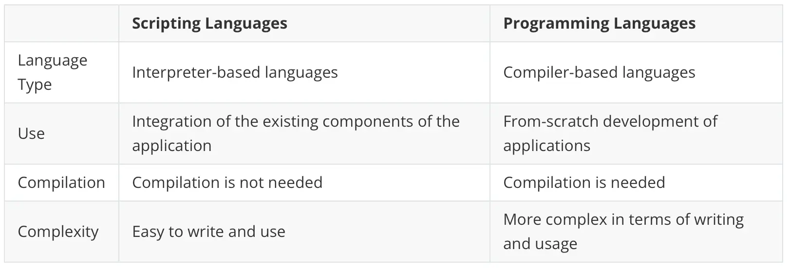

### What is a scripting language?

- A **scripting language** is a type of programming language that is interpreted rather than compiled. It is typically used to **automate tasks**, **control software applications**, or **glue together components** of a system.
- Scripts are often written to be executed by an **interpreter**, which reads and executes the code line-by-line at runtime, rather than being compiled into machine code beforehand.

---

### Key Characteristics of Scripting Languages

- **Interpreted, not compiled**

  Scripting languages are usually interpreted, meaning the code is executed directly without a separate compilation step.

- **High-level and easy to use**

  They are designed to be simple and expressive, allowing developers to write code quickly and with fewer lines.

---

### Key Characteristics of Scripting Languages

- **Automation-focused**

  Scripting languages are often used to automate repetitive tasks, such as file manipulation, system administration, or web scraping.

- **Integration with other systems**

  They are commonly used to integrate and communicate with other programs, APIs, or system components.
---

### Key Characteristics of Scripting Languages

- **Rapid development and prototyping**

  Scripting languages support fast development cycles, making them ideal for prototyping and small-scale applications.

---

### Examples of Scripting Languages

- **Python**: Web development, automation, data science
- **JavaScript**: Web development (client and server-side)
- **Bash**: Shell scripting, system administration, DevOps tasks
- **Powershell**: Windows automation, DevOps tasks

---

### Examples of Scripting Languages

- **Ruby**: Web development, scripting, automation
- **PHP**: Server-side web development
- **Perl**: Text processing, system administration

---

### Scripting Languages vs. Programming Languages

---

### Scripting Languages vs. Programming Languages

---

### Scripting Languages vs. Programming Languages

- The line between scripting and programming languages is becoming increasingly blurred.

- Many modern languages like Python and JavaScript can be used for both scripting and full-scale application development.

---

### You can compile Python

- Whenever you run a Python program, that program (and anything it imports) will be compiled from Python source code to Python bytecode, and then the bytecode is what’s executed.
- This all happens automatically for you, and you might not even notice it happening. 
- You can run an explicit compilation step on a Python application, to compile the source code to bytecode. It’s just relatively rare to do so.

---

### Real-world uses for scripting language

- Real-life systems are made up of multiple programs all working together. Scripts can be used to help each separate program work together.
- Different scripting languages have different capabilities. For example, you might use PHP to manage cookies and manipulate databases. Or you might use Ruby to write code for web applications designed to run on specific operating systems.

---

### Big names that use scripting languages

- Node.js is used in the real world for the apps of big-name companies like Paypal, Netflix, eBay, Uber, and LinkedIn.

- PHP is popular for use by global websites, including Etsy, WordPress, Facebook, Slack, and Wikipedia.

---

### Big names that use scripting languages

- Ruby is commonly used on applications like Hulu, MyFitnessPal, Goodreads, and Airbnb.

- Python is a general-purpose programming language used by well-known companies such as Netflix, Google, and Goldman Sachs.

---

### Required skills

- Curiosity
- The desire to solve problems
- Excellent communication
- The ability to work as part of a team
- Patience and positivity
- Accountability

---

### What is Python?

- Python is a **high-level**, **interpreted**, and **general-purpose** programming language.
- Created by Guido van Rossum and first released in 1991.
- Known for its **simple syntax**, **readability**, and **versatility**.
---

### Why Use Python as a Scripting Language?

- **Cross-Platform Compatibility**:
  - Runs on Windows, macOS, Linux, and more.
  - Write once, run anywhere (with minimal changes).
- **Easy to Learn and Read**
  - Clean and minimal syntax.
  - Great for beginners and rapid development.
  - Uses indentation to define code blocks.

---

### Why Use Python as a Scripting Language?

- **Very Extensive Standard Library**
  - Comes with "batteries included".
  - Built-in modules for:
    - File I/O
    - Networking
    - System administration
    - Data parsing (JSON, XML, CSV)

---

### Why Use Python as a Scripting Language?

- **Extensive Third-Party Libraries via PyPI**
  - Libraries for:
    - Web development (Flask, Django, FastAPI)
    - Automation (Requests, Playwright)
    - DevOps (Ansible, Fabric)
    - Data science (Pandas, NumPy)

---

### Why Use Python as a Scripting Language?

- **Great for Automation**
  - Ideal for writing scripts to automate:
    - File and directory operations
    - Text processing
    - System monitoring
    - Web scraping

---

### Why Use Python as a Scripting Language?

- **Active Community and Support**

  - Large, active community.

  - Abundant tutorials, forums, and documentation.

  - Great for troubleshooting and learning.

---

### Python is the Lingua Franca of ML/AI

- Python gets rid of as much of the ML/AI developmental complexity as possible.
- Python is the dominant language in the AI/ML field. Most research, development, and job opportunities in AI heavily involve Python.
- Rich Ecosystem of AI/ML Libraries: TensorFlow, PyTorch, Keras, Scikit-learn, Pandas, NumPy.

---

### Python vs. Other Scripting Languages

---

#### Sources:

- https://www.coursera.org/ca/articles/scripting-language
- https://algodaily.com/lessons/scripting-vs-programming/differences-between-scripting-languages-and-programming-languages
- https://www.b-list.org/weblog/2023/dec/06/compile-python-bytecode/
