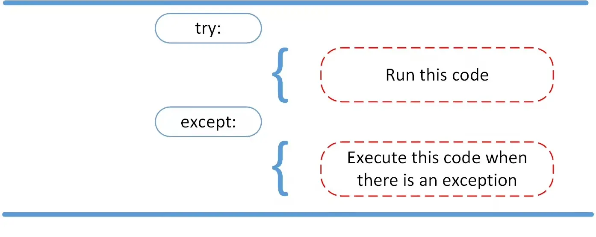
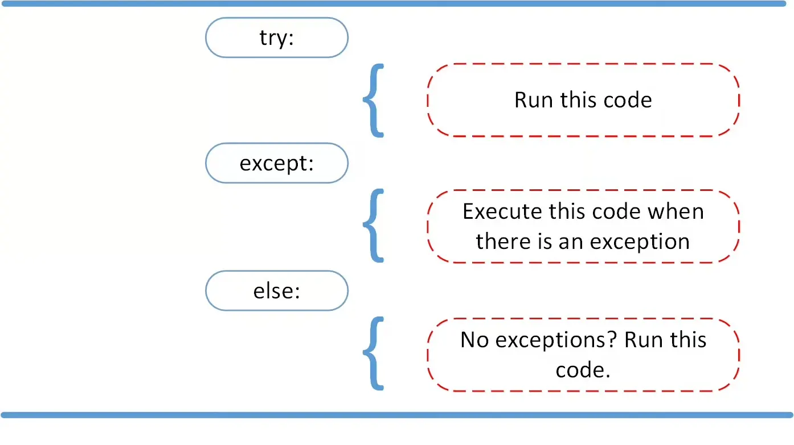
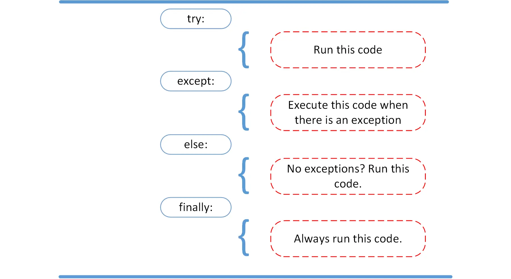

### What Are Errors in Python

- **Errors** happen when something goes wrong in your code.
- **Two main types of Error**:
  - **Syntax Errors**: Mistakes in the code structure (e.g., missing colon, typo).
  - **Runtime Errors (Exceptions)**: Errors that occur during execution (e.g., dividing by zero).

---

### Understanding Syntax Errors

```python
# This is an example of syntax error.

print(0 / 0))
```

- [Syntax errors](https://realpython.com/invalid-syntax-python/) occur when the parser detects an incorrect statement.

```shell
python3 syntax_err.py
  File "/home/student/syntax_err.py", line 3
    print(0 / 0))
                ^
SyntaxError: unmatched ')'
```

- The arrow indicates where the parser ran into the **syntax error**. Additionally, the error message gives you a hint about what went wrong.

---

### Understanding Runtime Errors

```python
# This is an example of runtime error ZeroDivisionError.

result = 10 / 0
print(result)
```

- When Python encounters an error, it shows a **traceback**:

```shell
python3 div_by_zero.py
Traceback (most recent call last):
  File "/home/student/div_by_zero.py", line 3, in <module>
    result = 10 / 0
             ~~~^~~
ZeroDivisionError: division by zero
```

- An **exception error** occurs whenever syntactically correct Python code results in an error.

---

### Understanding Runtime Errors

- Instead of just writing *exception error*, Python details what *type* of exception error it encountered.
- Error message breakdown
  - File name and line number
  - Type of error (`ZeroDivisionError`)
  - Description of the error (`division by zero`)

---

### Common Runtime Errors

- Division or math operations
  - `ZeroDivisionError`
- User input (could be unexpected)
  - `ValueError`
- Accessing files or directories
  - `FileNotFoundError`

- [List of Built-in Exceptions](https://docs.python.org/3/library/exceptions.html)

---

#### Handling Exceptions With `try-except` Block

- Use the `try` and `except` block to catch and handle exceptions.
- Python executes code following the `try` statement as a normal part of the program.
- The code that follows the `except` statement is the program’s response to any exceptions in the preceding `try` clause.

---

#### Handling Exceptions With `try-except` Block



---

#### Handling Exceptions With `try-except` Block

```python
try:
    num = int(input("Enter a number: "))
    print(10 / num)
except ValueError:
    print("Invalid input. Please enter a number.")
except ZeroDivisionError:
    print("You can't divide by zero!")
```

- Inside the `except` clause—the exception handler—you determine how the program responds to the exception.
- You can anticipate [multiple exceptions](https://realpython.com/python-catch-multiple-exceptions/) and differentiate how the program should respond to them.

---

### Avoid Using Bare `except` Clauses

```python
# One of the most self-destructive things in Python
try:
    do_something()
except:
    pass
```

- Bare `except` clauses can hide unexpected exceptions.
- Better to catch specific errors when possible.
- [The Most Diabolical Python Antipattern](https://realpython.com/the-most-diabolical-python-antipattern/)

---

#### Proceeding After a Successful `try` With `else`



---

#### Proceeding After a Successful `try` With `else`

```python
try:
    num = int(input("Enter a number: "))
    result = 100 / num
except ValueError:
    print("Please enter a valid number.")
except ZeroDivisionError:
    print("You can't divide by zero.")
else:
    print("Result is:", result)
```

- Use Python’s `else` statement to instruct a program to execute a certain block of code only in the absence of exceptions

---

#### Cleaning Up After Execution With `finally`



---

#### Python Will Always Execute Everything In The `finally` Clause

```python
try:
    num = int(input("Enter a number: "))
    result = 100 / num
except ValueError:
    print("Please enter a valid number.")
except ZeroDivisionError:
    print("You can't divide by zero.")
else:
    print("Result is:", result)
finally:
    print("Thank you for using this program!")
```

- The `finally` block **always runs**, whether there's an error or not.

---

#### Cleaning Up After Execution With `finally`

```python
try:
    file = open("data.txt", "r")
    print(file.read())
except FileNotFoundError:
    print("File not found.")
finally:
    file.close()
    print("File has been closed.")
```

- `finally` block ensures the file is closed even if an error occurs.
- Useful for **cleanup code**, like **closing files** or network connections.

---

### Raising an Exception in Python

- When you use the `raise` statement in Python to raise (or throw) an exception, you signal an error or an unusual condition in your program.
- With `raise`, you can trigger both built-in and custom exceptions.
- You can also include custom messages for more clarity or even re-raise exceptions to add context or handle further processing.

---

### Raising an Exception in Python

```python
# This is an example of raising an exception.

number = 10
if number > 5:
    raise Exception(
        f"The number should not exceed 5. ({number=})")
print(number)
```

- You can complement the statement with a custom message.
- The code in this example will raise an `Exception` object and pass it an informative custom message.

---

### Raising an Exception in Python

```shell
python3 low.py
Traceback (most recent call last):
  File "/home/student/low.py", line 5, in <module>
    raise Exception(
        f"The number should not exceed 5. ({number=})")
Exception: The number should not exceed 5. (number=10)
```

- The program comes to a halt and displays the exception to your [terminal](https://realpython.com/terminal-commands/) or [REPL](https://realpython.com/python-repl/), offering you helpful clues about what went wrong.
- Note that the final call to [`print()`](https://realpython.com/python-print/) never executed, because Python raised the exception before it got to that line of code.

---

### Handling a Raised Exception

```python
# This is an example of raising and handling an exception.

try:
    number = 10
    if number > 5:
        raise ValueError(
            f"The number should not exceed 5. ({number=})")
    print(number)
except ValueError as e:
    print("Caught an exception:", e)
else:
    print("No exceptions were raised. The number is valid.")
```

- With the `raise` keyword, you can raise any exception object in Python and stop your program when an unwanted condition occurs.

---

### When to Raise Exceptions

- **Signal errors and exceptional situations**: The most common use case of the `raise` statement is to signal that an error or exceptional situation has occurred.
- **Reraise exception after doing some additional processing**: A common use case of `raise` is to reraise an active exception after performing some operations. For example, when you need to log the error before raising the actual exception.

---

### LBYL vs EAFP

- Dealing with errors and exceptional situations is a common requirement in programming.
- Two strategies:
  - Preventing errors from occurring: **look before you leap** (LBYL)
  - Handling errors after they occur: **easier to ask forgiveness than permission** (EAFP)

---

#### The "Look Before You Leap" (LBYL) Style

- When you first check whether something will succeed and then only proceed if you know that it’ll work.
- [This coding style explicitly tests for pre-conditions before making calls or lookups. This style contrasts with the EAFP approach and is characterized by the presence of many `if` statements.](https://docs.python.org/3/glossary.html#term-LBYL)

---

#### LBYL (Look Before You Leap) Example

```python
import os

filename = "data.txt"

if os.path.exists(filename):
    file = open(filename, "r")
    print(file.read())
    file.close()
else:
    print(f"The file '{filename}' does not exist.")
```

- **Check** if the file exists using `os.path.exists()` before trying to open it.

---

#### The "Easier to Ask Forgiveness Than Permission" (EAFP) Style

- It suggests that right away, you should do what you expect to work.
- If it doesn’t work and an exception happens, then just catch the exception and handle it appropriately.
- [This clean and fast style is characterized by the presence of many `try` and `except` statements. The technique contrasts with the LBYL style common to many other languages such as C.](https://docs.python.org/3/glossary.html#term-EAFP)

---

#### EAFP (Easier to Ask for Forgiveness than Permission) Example

```python
try:
    file = open("data.txt", "r")
    print(file.read())
except FileNotFoundError:
    print("File not found.")
finally:
    file.close()
    print("File has been closed.")
```

- **Try to open and read the file**, and if a `FileNotFoundError` occurs, we handle it.

---

### When to Use LBYL or EAFP

- **Use LBYL for**
  - Operations that are likely to fail
  - Irrevocable operations, and operations that may have a side effect
  - Common exceptional conditions that can be quickly prevented beforehand

---

### When to Use LBYL or EAFP

- **Use EAFP for**
  - Operations that are unlikely to fail
  - Input and output (IO) operations, mainly hard drive and network operations
  - Database operations that can be rolled back quickly

---

### Key Takeaways

- Read and understand error messages.
- Anticipate where errors might happen.
- Validate user input.
- Use `try`, `except`, and `finally` to handle errors.
- Make your programs **robust and user-friendly**.

---

### Questions

- When should you catch exceptions raised by functions you call, and when should you not?
- How can you know what exception classes to catch?
- When you catch an exception, what should you do to "handle" it?
- Why is catching all exceptions considered a bad practice, and when is it okay to do it?

---

#### Sources:

- https://realpython.com/python-exceptions/
- https://realpython.com/python-lbyl-vs-eafp/
- https://blog.miguelgrinberg.com/post/the-ultimate-guide-to-error-handling-in-python
- https://realpython.com/python-raise-exception/
