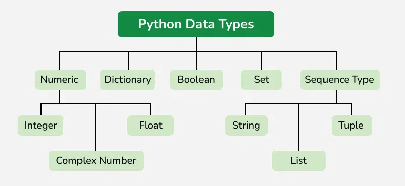
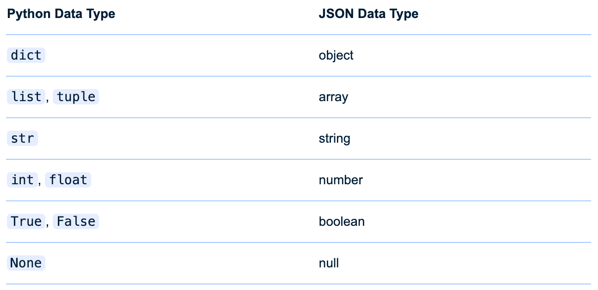

### What are Data Types?

*   In programming, data types are the **classification or categorization** of data items.
*   Think of it as assigning a category to your data, which determines:
    *   The possible values for that type.
    *   The operations that can be performed on that type.
    *   How the data is stored in memory.

---

### Data Types in Python

*   Python is **dynamically typed**, meaning you don't have to explicitly declare the data type of a variable; Python figures it out at runtime.

```python
x = 10       # x is an integer
print(x)     # 10

x = "Hello"  # Now x is a string
print(x)     # Hello
```

---

### Built-in Data Types in Python

*   **Numeric**: `int`, `float`, `complex`
*   **Sequence**: `str`, `list`, `tuple`
*   **Mapping**: `dict`
*   **Set**: `set`, `frozenset`
*   **Boolean**: `bool`
*   **None**: `NoneType`

---

### Built-in Data Types in Python

- **Binary**: `bytes`, `bytearray`, `memoryview`
- **Context Manager**
- **Custom Type**

[Python Built-in Types](https://docs.python.org/3/library/stdtypes.html)

---

#### Built-in Data Types in Python



---

### The `type()` Function

- The `type()` function in Python is used to determine the data type of an object.
- It can be used in two ways:
  - **With a single argument:** When passed a single object, `type()` returns the type of that object.
  - **With three arguments:** When passed three arguments `(name, bases, and dict)`, `type()` creates a new type object (a class). This is a more advanced usage, allowing for dynamic class creation.

---

### The `type()` Function Examples

```python
a = 10
print(type(a))  # <class 'int'>

b = 3.14
print(type(b))  # <class 'float'>

c = {"Alice":1, "in":2, "Wonderland":3}
print(type(c))  # <class 'dict'>

d = ("Alice", "in", "Wonderland")
print(type(d))  # <class 'tuple'>
```

---

### The `type()` Function Examples

```python
x = True
print(type(x))  # <class 'bool'>

y = "hello"
print(type(y))  # <class 'str'>

z = [1, 2, 3]
print(type(z))  # <class 'list'>
```

[`type()` function of three arguments](https://realpython.com/ref/builtin-functions/type/)

---

### What is a Data Structure?

* While a **data type** defines the kind of data a variable can hold (e.g., integer, string), a **data structure** is a way of **organizing, managing, and storing data** to enable efficient access and modification.
* Data structures provide a means to structure data in a way that is useful for specific tasks.

---

### Data Structures in Python

*   Many built-in Python types are also fundamental data structures:
    *   **Lists (`list`)**: Ordered collections, good for sequences of items that might change.
    *   **Tuples (`tuple`)**: Ordered collections, good for fixed sequences (immutable).
    *   **Dictionaries (`dict`)**: Key-value stores, great for lookups.
    *   **Sets (`set`)**: Collections of unique items, useful for membership testing and eliminating duplicates.

---

### List

- A list is a collection of items in a particular order.
- You can make a list that includes the letters of the alphabet, the digits from 0 to 9, or the names of all the people in your family.
- You can put anything you want into a list, and the items in your list don’t have to be related in any particular way.

---

### List Example

```python
# Create a list of fruits
fruits = ["apple", "banana", "cherry"]

# Access elements in the list
print(fruits[0])  # apple
print(fruits[1])  # banana

# Add a new fruit to the list
fruits.append("orange")
print(fruits)  # ['apple', 'banana', 'cherry', 'orange']

# Remove a fruit from the list
fruits.remove("banana")
print(fruits)  # ['apple', 'cherry', 'orange']
```

---

### Tuple

- Python refers to values that cannot change as immutable, and an immutable list is called a tuple.

- A tuple looks just like a list, except you use parentheses instead of square brackets.
- Once you define a tuple, you can access individual elements by using each item’s index, just as you would for a list.

---

### Tuple Example

```python
# Create a tuple of colors
colors = ("red", "green", "blue")

# Access elements in the tuple
print(colors[0])  # red
print(colors[1])  # green

# Tuples are immutable, so you cannot modify them
# colors[0] = "yellow"  # This will raise an error!
```

---

#### Dictionary

- A dictionary in Python is a collection of key-value pairs.
- Each key is connected to a value, and you can use a key to access the value associated with that key.
- A key’s value can be a number, a string, a list, or even another dictionary.
- You can use any object that you can create in Python as a value in a dictionary.

---

#### Dictionary

- In Python, a dictionary is wrapped in braces (`{}`) with a series of key-value pairs inside the braces.

  ```python
  alien_0 = {'color': 'green', 'points': 5}
  ```

- A key-value pair is a set of values associated with each other.

- When you provide a key, Python returns the value associated with that key.

- Every key is connected to its value by a colon, and individual key-value pairs are separated by commas.

---

### Accessing Values in a Dictionary

- To get the value associated with a key, give the name of the dictionary and then place the key inside a set of square brackets

```python
alien_0 = {'color': 'green', 'weapon': 'laser'}
print(alien_0['color'])		# Output: green
print(alien_0['weapon'])	# Output: laser
```

- You can have an unlimited number of key-value pairs in a dictionary.


---

#### Adding New Key-Value Pairs to a Dictionary

- Dictionaries are dynamic structures, and you can add new key-value pairs to a dictionary at any time.
- To add a new key-value pair, you would give the name of the dictionary followed by the new key in square brackets, along with the new value.

```python
alien_0 = {'color': 'green'}
print(alien_0)

alien_0['weapon'] = 'laser'
print(alien_0)
```

```
{'color': 'green'}
{'color': 'green', 'weapon': 'laser'}
```

---

### Set

- A set is an unordered collection with no duplicate elements.
- Basic uses include membership testing and eliminating duplicate entries.
- Set objects also support mathematical operations like union, intersection, difference, and symmetric difference.

[Sets in Python](https://realpython.com/python-sets/)

---

### Set Example

```python
num_lst = [1, 2, 2, 2, 3, 4, 5, 5]
numbers = set(numbers)
print(numbers)				# {1, 2, 3, 4, 5}

# Remove an element from the set
numbers.remove(3)			# numbers is {1, 2, 4, 5}

# Sets automatically ignore duplicate values
numbers.add(2)  			# Adding 2 again (already exists)
print(numbers)  			# Output: {1, 2, 4, 5}

# Check if an element is in the set
print(4 in numbers)		# Output: True
print(6 in numbers) 	# Output: False
```

---

### Set Example

```python
a = set('abracadabra')
b = set('alacazam')

# unique letters in a
print(a)				# {'b', 'r', 'c', 'a', 'd'}
# letters in a but not in b
print(a - b)		# {'b', 'r', 'd'}
# letters in a or b or both
print(a | b)		# {'b', 'z', 'r', 'c', 'm', 'a', 'l', 'd'}
# letters in both a and b
print(a & b)		# {'a', 'c'}
# letters in a or b but not both
print(a ^ b)		# {'z', 'b', 'm', 'r', 'l', 'd'}
```

---

### JSON

- JSON stands for **JavaScript Object Notation**.
- It's a lightweight format for storing and transporting data.
- Think of it like a universal language that different computer programs can use to talk to each other and exchange information.
- JSON is "self-describing" and easy to understand because it uses human-readable text.

---

#### Why is JSON important?

*   **Web APIs:** Many websites and applications use JSON to send and receive data.
*   **Configuration Files:** Software applications often use JSON files to store settings and configurations.
*   **Data Storage:** While not a database itself, JSON is often used to store data in NoSQL databases.
*   **Data Interchange:** It's a common format for exchanging data between different programming languages and systems.

---

### Basic JSON Syntax Rules

- **Data is in `name/value` pairs**

  - A name (also called a "key") is a string in double quotes.
  - A value can be a string, number, boolean (`true` or `false`), array, or another JSON object.
  - The name and value are separated by a colon (`:`).

  ```json
  "name": "John Doe"
  ```

---

### Basic JSON Syntax Rules

- **Data is separated by commas**

  ```json
  "firstName": "Jane",
  "lastName": "Doe"
  ```

- **Curly braces hold objects**

  -  A JSON object starts with `{` and ends with `}`.
  - Objects can contain multiple name/value pairs.

  ```json
  {
  	"city": "Calgary",
  	"province": "Alberta"
  }
  ```

---

### Basic JSON Syntax Rules

- **Square brackets hold arrays**

  - An array starts with `[` and ends with `]`.
  - Arrays contain a list of values (which can be strings, numbers, booleans, objects, or even other arrays).
  - Values in an array are separated by commas.

  ```json
  "courses": ["CPSY206", "CPRG217", "CMPH209"]
  ```

---

### JSON Example

```json
{
  "name": "John Doe",
  "major": "ITS",
  "semester": 2,
  "isFullTime": true,
  "courses": [
    "CPSY206",
    "CPRG217",
    "CMPH209"
  ],
  "college": "SAIT"
}
```

[The JSON Formatter & Validator](https://jsonformatter.curiousconcept.com/)

---

### JSON Syntax Pitfalls

- The [JSON standard](https://ecma-international.org/publications-and-standards/standards/ecma-404/) doesn’t allow any comments, trailing commas, or single quotes for strings.

```json
{
  "name": 'Frieda',
  "address": {
    "work": null, // Doesn't pay rent either
    "home": "Berlin",
  },
  "friends": [
    {
      "name": "Philipp",
      "hobbies": ["eating", "sleeping", "reading",]
    }
  ]
}
```

---

#### Working With JSON Data in Python

- JSON in Python is handled using the **standard-library `json` module**, which allows for **data interchange** between JSON and Python data types.
- JSON is a good data format to use with Python as it’s **human-readable** and straightforward to **serialize and deserialize**, which makes it ideal for use in **APIs and data storage**.

---

#### Working With JSON Data in Python

- You write JSON with Python using `json.dump()` to serialize data to a file.
- You can read JSON data from files with `json.load()` and parse JSON strings with `json.loads()`.
- You can **minify and prettify JSON** using Python’s `json.tool` module.

---

#### Convert Python Dictionaries to JSON

- One of the most common actions when working with JSON in Python is to convert a Python dictionary into a JSON object.
- After importing the `json` module, you can use [`.dumps()`](https://docs.python.org/3/library/json.html#json.dumps) to convert a Python dictionary to a **JSON-formatted string**, which represents a JSON object.

```python
import json
food_ratings = {"organic dog food": 2, "human food": 10}
json.dumps(food_ratings)
```

```shell
'{"organic dog food": 2, "human food": 10}'
```

---

### Serialize Python Data Types to JSON



---

### Write a JSON File With Python

- The JSON format can come in handy when you want to save data outside of your Python program.
- Instead of spinning up a database, you may decide to use a JSON file to store data for your workflows. 
- To write Python data into an external JSON file, you use `json.dump()`. This is a similar function to the one you saw earlier, but without the ***s*** at the end of its name.

---

### Write a JSON File With Python

- The `json.dump()` function has two required arguments: the object you want to write, and the file you want to write into.

```python
import json

# Data to be written
data = {
    "name": "Alice",
    "age": 30,
    "city": "Wonderland"
}

# Open a file for writing
with open('output.json', 'w') as f:
    # Write the data to the JSON file
    json.dump(data, f, indent=2)
```

---

### Key Takeaways

- Learn to use appropriate **data types** and **structures** for different tasks.
- Use **lists** for ordered mutable collections, **tuples** for fixed data, **dictionaries** for key-value mappings, and **sets** for unique items.
- Understand **JSON** syntax and how to work with it using Python’s `json` module.
- Practice converting between **Python dictionaries and JSON** for real-world applications like API calls or config files.

---

### Sources:

- https://docs.python.org/3/library/stdtypes.html
- https://www.geeksforgeeks.org/python-data-types/
- https://www.geeksforgeeks.org/python-type-function/
- https://realpython.com/python-json/