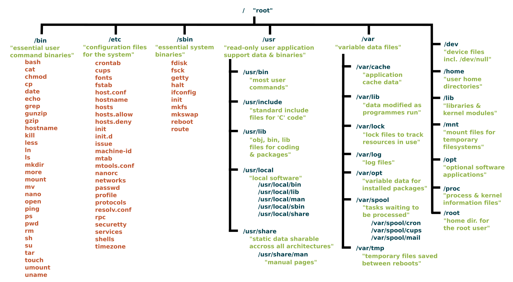

### Run Shell Commands From Python

- **Online tutorials:**
  - [An Introduction to Python Subprocess](https://www.datacamp.com/tutorial/python-subprocess)
  - [The Right Way to Run Shell Commands From Python](https://martinheinz.dev/blog/98)
  - [`sh` module](https://github.com/amoffat/sh)
- [subprocess_example.py](https://github.com/sait-its/awesome-cprg-217/blob/main/unit-04/subprocess_example.py)
- [sh_example.py](https://github.com/sait-its/awesome-cprg-217/blob/main/unit-04/sh_example.py)

---

### Unix/Linux File System



---

### Conventional Directory Layout

- Certain conventions exist for locating some kinds of files, such as programs, system configuration files, and users' [home directories](https://en.wikipedia.org/wiki/Home_directory).
- The details of the directory layout have varied over time. Although the file system layout is not part of the [Single UNIX Specification](https://en.wikipedia.org/wiki/Single_UNIX_Specification), several attempts exist to standardize (parts of) it, such as the [System V](https://en.wikipedia.org/wiki/UNIX_System_V) [Application Binary Interface](https://en.wikipedia.org/wiki/Application_Binary_Interface), ..., and [Linux Foundation](https://en.wikipedia.org/wiki/Linux_Foundation)'s [Filesystem Hierarchy Standard](https://en.wikipedia.org/wiki/Filesystem_Hierarchy_Standard) (FHS).

---

### Path

- A path is a unique location to a file or a folder in a file system of an OS. A path to a file is a combination of `/` and alpha-numeric characters.
- Absolute path: An absolute path is defined as the specifying the location of a file or directory from the root directory(`/`). In other words we can say absolute path is a complete path from start of actual filesystem from `/` directory.
- Relative path: Relative path is defined as path related to the present working directory(`pwd`).

---

### Essential Linux System Files

- `/etc/passwd` stores essential information about user accounts on the system.
- Each line represents a user and contains 7 colon-separated fields:

```sh
username:password:UID:GID:comment:home_directory:shell
```

- An example of user `johndoe` in `/etc/passwd` file

```sh
johndoe:x:1001:1001:John Doe:/home/johndoe:/bin/bash
```

---

### Python `pwd` module

- The `pwd` module can be used to read user information from the Unix password database (usually `/etc/passwd`).
- The read-only interface returns tuple-like objects with named attributes for the standard fields of a password record.
- You can query all users, user by name or user by UID

[pwd Module](https://pymotw.com/3/pwd/)

---

### Essential Linux System Files

- `/etc/group` stores essential information about groups on the system.
- Each line describes one group with 4 fields, separated by colons:

```shell
group_name:password:GID:user_list
```

- An example of group `developers` in `/etc/group` file

```shell
developers:x:1002:alice,bob,charlie
```

---

### Python `grp` module

- The `grp` module can be used to read information about Unix groups from the group database (usually `/etc/group`).
- The read-only interface returns tuple-like objects with named attributes for the standard fields of a group record.
- You can query all groups, group memberships for a user, find a group by name or find a group by ID.

[grp Module](https://pymotw.com/3/grp/)

---

### Linux Virtual Files Under `/proc`

- **Virtual File System:** `/proc` is a virtual file system, meaning it doesn't store actual files on the disk. It's populated with information dynamically by the kernel. 
- **Process Information:** Each running process has a subdirectory in `/proc`, named after its PID.
- **System Information:** CPU information (`/proc/cpuinfo`), memory information (`/proc/meminfo`), and kernel version (`/proc/version`). 

---

### Linux Virtual File `/proc/cpuinfo`

- `/proc/cpuinfo`  identifies the type of processor(s) used by your system.
- **processor**: Logical processor number (core ID).
- **vendor_id**: CPU manufacturer (e.g., GenuineIntel, AuthenticAMD).
- **cpu family**, **model**, **model name**: Details about the CPU model.
- **cache size**: L1/L2 cache size.
- **flags**: Supported CPU features and instruction sets (e.g., fpu, mmx, sse).

---

### Linux Virtual File `/proc/cpuinfo`

```shell
processor       : 0
vendor_id       : GenuineIntel
cpu family      : 6
model           : 79
model name      : Intel(R) Xeon(R) CPU E5-2673 v4 @ 2.30GHz
stepping        : 1
microcode       : 0xb000040
cpu MHz         : 2294.686
cache size      : 51200 KB
physical id     : 0
siblings        : 32
core id         : 0
cpu cores       : 32
flags           : fpu vme de pse tsc msr pae ......
```

---

### Linux Virtual File `/proc/meminfo`

- `/proc/meminfo` reports information about system memory usage.
- **MemTotal**: Total physical RAM (in kB).
- **MemFree**: Amount of RAM not in use at all.
- **MemAvailable**: Estimation of available memory for new applications, accounting for cache/buffers.
- **Buffers**: Memory used by kernel buffers.
- **Cached**: Memory used for file system cache.
- **SwapTotal/SwapFree**: Total and available swap space.

---

### Linux Virtual File `/proc/meminfo`

```shell
MemTotal:       65838192 kB
MemFree:         2401064 kB
MemAvailable:   63102560 kB
Buffers:         1050188 kB
Cached:         57354020 kB
SwapCached:            0 kB
Active:          3648240 kB
Inactive:       55456468 kB
......
Unevictable:       27708 kB
Mlocked:           27708 kB
SwapTotal:             0 kB
SwapFree:              0 kB
```

---

### systemd

- **systemd** is a suite of basic building blocks for a Linux system. It provides a system and service manager that runs as PID 1 and starts the rest of the system.
- It is responsible for initializing the system, managing system processes, and controlling services (also known as "**units**") during boot, runtime, and shutdown.
- **systemd** has become the default init system for many major Linux distributions.

---

### systemd - Key Concepts

- **Unit:** The basic object that systemd manages. Units can represent services, sockets, devices, mount points, and more. Common unit types:
    - `.service` — a system service
    - `.socket` — a socket for inter-process communication
    - `.target` — a group of units
    - `.mount` — a file system mount point

---

### systemd - Key Concepts

- Once the kernel loads `systemd`, `systemd` takes over and starts the other system services that are required to bring the system up and running.
- This includes services such as networking service, the login manager, etc.
- Once all the services are started, your system is ready to use and the login manager displays. You can now log in and start using the system.

---

### systemd unit Files Locations

- `/usr/lib/systemd/system/` - unit files distributed with installed packages.
- `/run/systemd/system/` - unit files created at run time.
- `/etc/systemd/system/` - unit files created by using the systemctl enable command as well as unit files added for extending a service.

---

### Viewing `systemd` information

- The `systemctl` command is used to examine and control the state of `systemd` and service manager.
- `systemctl list-units` lists the `systemd` units. Optional arguments:
  - `--state=running` to show the active units 
  - `--type=service` to show the exited and active units.

---

###  Managing `systemd` Services

- `systemctl status SERVICE` - Checks the status of the specific service.
- `systemctl show SERVICE` - Displays the service information.
- `systemctl start SERVICE` - Start system service in the current session. Root access required.
- `systemctl stop SERVICE` - Stop a system service in the current session. Root access required.

---

###  Managing `systemd` Services

- `systemctl restart SERVICE` - Restart system service in the current session.
  - Stop the selected service unit in the current session and immediately start it again.
  - Restart a service unit only if the corresponding service is already running.
  - Reload configuration of a system service without interrupting its execution.

---

###  Managing `systemd` Services

- `systemctl enable SERVICE` - Enable a service to start automatically at boot.
- Optionally, pass the `--now` option to the command to also start the unit right now.

---

### Key Takeaways

- `/etc/passwd` stores basic user account information.
- `/etc/group` contains information about system groups and their members.
- `/proc/cpuinfo` provides real-time details about the system’s CPU(s).
- `/proc/meminfo` displays current memory usage statistics.

---

### Key Takeaways

- **systemd** is the standard service and system manager for many Linux distributions, enabling reliable and parallelized service management.
- Services are defined as unit files (typically with a `.service` extension), specifying how and when they run.
- The `systemctl` command is the main tool for starting, stopping, enabling, and checking the status of services.

---

### Sources:

- https://www.datacamp.com/tutorial/python-subprocess
- https://martinheinz.dev/blog/98
- https://en.wikipedia.org/wiki/Unix_filesystem#Conventional_directory_layout
- https://www.linuxfoundation.org/blog/blog/classic-sysadmin-absolute-path-vs-relative-path-in-linux-unix
- https://docs.kernel.org/filesystems/proc.html

---

### Sources:

- https://realpython.com/python-subprocess/
- https://sh.readthedocs.io/en/latest/
- https://systemd.io/
- https://docs.redhat.com/en/documentation/red_hat_enterprise_linux/9/html/configuring_basic_system_settings/managing-systemd_configuring-basic-system-settings

---

### Credit:

- The image of Hierarchical structure of Unix file system is kindly supplied under a CC By-SA license by Paul Gardner.