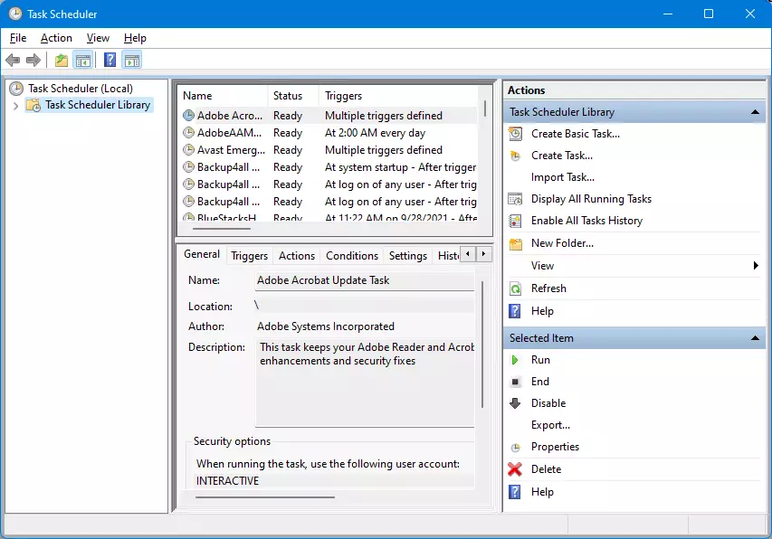

### Scheduling Automated Tasks

- Scheduling automated tasks is a fundamental aspect of system administration, allowing users and administrators to ensure that critical processes such as backups, updates, maintenance scripts, and custom workflows run reliably and on time.

- Two of the most widely used tools for task automation are **Windows Task Scheduler** and the **Linux Cron job**.

---

### What is Windows Task Scheduler

- Task Scheduler is a built-in Windows utility that allows users to automate the execution of programs, scripts, and various tasks at specific intervals or specific events.
- It simplifies the process of running repetitive tasks, managing background processes, and scheduling maintenance activities on a computer.

---

### Windows Task Scheduler

- Task Scheduler works by creating tasks that contain the details of the actions to be performed.
- The Task Scheduler does so by monitoring whatever criteria you choose (referred to as triggers) and then executing the tasks when those criteria are met.
- Some examples of tasks that you can use the Task Scheduler to execute are: starting an application; sending an email message; or displaying a message box.

---

### Windows Task Scheduler Triggers

- When a specific system event occurs.
- At a specific time.
- At a specific time on a daily/weekly/monthly/ day-of-week schedule.
- When the computer enters an idle state.
- When the task is registered.
- When the system is booted.
- When a user logs on.
- When a Terminal Server session changes state.

---

### Windows Task Scheduler Interface



---

### Task Scheduler - How To

[How to check scheduled tasks in Windows](https://www.digitalcitizen.life/first-steps-working-task-scheduler/)

[How to create a new task in Task Scheduler](https://www.backup4all.com/how-to-create-a-new-task-using-windows-task-scheduler-kb.html)

[Create an automated task using Task Scheduler](https://www.windowscentral.com/how-create-automated-task-using-task-scheduler-windows-10)

---

### What Is a Cron Job?

- A **Cron Job** is a Linux program that allows users to schedule the execution of a piece of software, often in the form of a shell script or a compiled executable.
- Cron is typically used when you have a task that needs to be run on a fixed schedule, and/or to automate repetitive tasks like downloading files or sending emails.

---

### crontab Features

- **Automate repetitive tasks:** System maintenance, backups, updates, and custom scripts can be scheduled.
- **Flexible scheduling:** Tasks can be run at virtually any time interval—every minute, hour, day, week, or month.
- **User-specific:** Each user can have their own crontab, enabling personalized automation.

---

### Cron Job Schedule Syntax

- A basic crontab entry looks something like this, with the cron job schedule first, followed by the command to run:

```shell
*    *    *    *    *   /home/user/bin/somecommand.sh
|    |    |    |    |            |
|    |    |    |    |    Command or Script to execute
|    |    |    |    |
|    |    |    | Day of week(0-6 | Sun-Sat)
|    |    |    |
|    |    |  Month(1-12)
|    |    |
|    |  Day of Month(1-31)
|    |
|   Hour(0-23)
|
Min(0-59)
```

---

### Cron Job Schedule Example

- To run the script `/home/user/scripts/backup.sh` every day at 2:30 AM:

```shell
30 2 * * * /home/user/scripts/backup.sh
```

[Online editor for cron schedule expressions](https://crontab.guru/)

---

### Crontab Entries

- Once cron is running, it checks for crontab entries in the following files every minute:
  - `/etc/crontab`
  - `/var/spool/cron/crontabs/$USER (where $USER is the currently logged-in user)`

---

### Crontab Commands

- `crontab -e` : Edit your user’s crontab file.
- `crontab -l` : List your current crontab entries.
- `crontab -r` : Remove your current crontab.

---

### Key Takeaways

- Windows Task Scheduler and Linux Cron Job are used to automate the execution of tasks (programs, scripts, or commands) at scheduled times or intervals.
- Windows Task Scheduler provides flexible scheduling options through its GUI, including triggers based on time, events, or system states.
- Cron uses a straightforward, compact syntax with five time fields followed by the command.

---

### Sources:

- https://www.lenovo.com/ca/en/glossary/task-scheduler/
- https://www.backup4all.com/how-to-create-a-new-task-using-windows-task-scheduler-kb.html
- https://www.windowscentral.com/how-create-automated-task-using-task-scheduler-windows-10
- https://cronitor.io/guides/cron-jobs
- https://docs.passwork.pro/crontab-basics
- https://crontab.guru/
