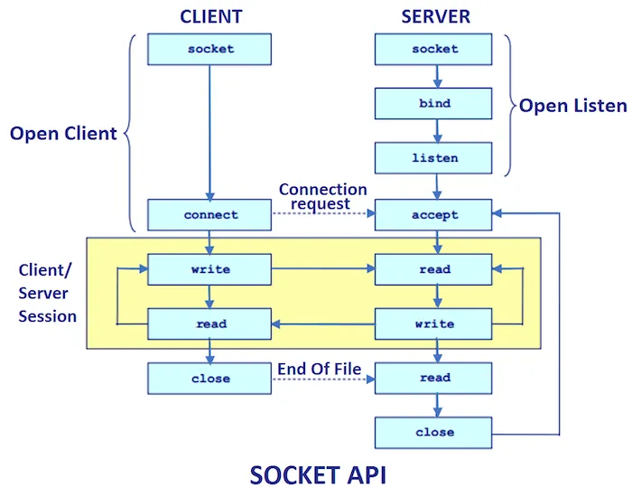
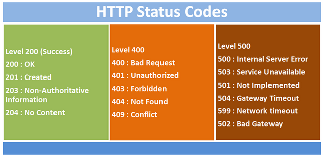
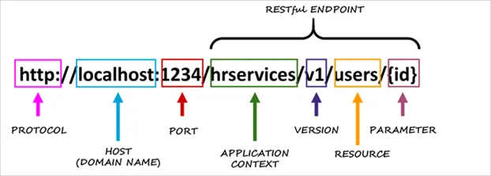

### Python Network Programming

- Python is a powerful language for network programming, enabling developers to build robust applications that communicate over networks.
- Two key approaches: **socket programming** and **REST API programming**.
- Socket programming allows direct communication between devices using low-level protocols (like TCP/UDP), operating primarily at the **Transport Layer (Layer 4)** of the OSI model.

---

### Python Network Programming

- REST API programming leverages HTTP protocols to exchange data between clients and servers, functioning at the **Application Layer (Layer 7)**.
- REST APIs provide simplicity, scalability, and interoperability for web-based services.
- REST APIs are ideal for building modern web and mobile applications that require seamless data exchange.

---

### Introduction to Sockets

- **What is a Socket?**

  - A socket is an endpoint of communication between two processes.

  - They are used for network communication (e.g., client-server model).

  - Sockets can be used across different platforms and are essential for internet-based applications.

---

### **Types of Sockets**

- Constants represent the address (and protocol) families:
  - `AF_INET`: IPv4 address family
  - `AF_INET6`: IPv6 address family
  - `AF_UNIX`: Used to communicate between processes on the same machine
- Constants represent the socket types:
  - `SOCK_STREAM`: TCP (streaming) sockets
  - `SOCK_DGRAM`: UDP sockets

---

### Client vs Server Sockets

- **Client Socket**

  - Used by the application to initiate a connection.

  - Example: Your browser connecting to a web server.

- **Server Socket**

  - Listens for incoming connections.

  - Acts as a switchboard operator, creating new client sockets for each connection.

---

#### Workflow Between Server and Client



---

#### Creating a Socket - Client

- When you use your browser to visit http://www.sait.ca, it did something like this:

```
# create an INET, STREAMing socket
s = socket.socket(socket.AF_INET, socket.SOCK_STREAM)
# now connect to the web server on HTTP port 80
s.connect(("www.sait.ca", 80))
```

- When the `connect` completes, the socket **`s`** can be used to send in a request for the text of the page. The same socket will read the reply, and then be **destroyed**. **Client** sockets are normally **only used for one exchange** (or a small set of sequential exchanges).

---

#### Creating a Socket - Server

- First, the web server creates a "server socket":

```python
# create an INET, STREAMing socket
serversocket = socket.socket(
    socket.AF_INET,
    socket.SOCK_STREAM
)

# bind the socket to a public host, and a well-known port
serversocket.bind((socket.gethostname(), 80))

# become a server socket
serversocket.listen(5)
```

---

### Creating a Socket - Server

- `bind()`: Binds the socket to a specific IP and port.

```python
serversocket.bind((socket.gethostname(), 80))
```

- `listen(5)`: Enables the socket to accept incoming connections. The maximum number of queued connections is 5.

```python
serversocket.listen(5)
```

---

### Server Accepting Connections

```python
while True:
    # accept connections from outside
    clientsocket, address = serversocket.accept()
    # Handle the client
```

- `accept()` blocks until a client connects.
- Returns a new socket object (`clientsocket`) and the client’s address.

---

### Server Accepting Connections

- This is *all* a “server” socket does. It doesn’t send any data. It doesn’t receive any data. It just produces “client” sockets.
- As soon as `clientsocket` is created, The server go back to listening for more connections.
- The two “clients” are free to chat it up - they are using some dynamically allocated port which will be recycled when the conversation ends.

---

### Using a Socket -  `send` and `recv`

```python
# Note: These methods work with raw bytes, not strings.
# send() sends bytes to the connected socket.
s.send(b"Hello, world!")

# recv() receives up to the specified number of bytes.
# When a recv returns 0 bytes, it means the other side
# has closed (or is closing) the connection. You will 
# not receive any more data on this connection.
data = s.recv(1024)

# Use encode()/decode() for text.
s.send(f"Hello, world!".encode())
s.recv(1024).decode()
```

---

### File-like Interface for Sockets

- **Advantages:**

  - Allows using `read()` and `write()` like file objects.

  - But remember to call `flush()` when writing to ensure data is sent immediately.

```python
import socket

s = socket.socket(...)
s.setblocking(False)
s.makefile("r")  # Read mode
s.makefile("w")  # Write mode
```

---

### Blocking vs Non-blocking Sockets

- **Blocking Sockets**

  - Default behavior.

  - `recv()` and `send()` will wait until data is available or sent.

- **Non-blocking Sockets**

  - Set using `s.setblocking(False)`.

  - `recv()` and `send()` may return immediately without data.

---

#### Handling Message Boundaries

- **Problem:**

  - `recv()` may return partial messages.

  - No built-in end-of-message signal.

- **Solutions:**

  - Fixed-length messages

  - Delimited messages (e.g., `\n`)

  - Length-prefixed messages

---

### Fixed-Length Message Example

```python
# A simple way to handle sending messages over sockets.
# Ensures all data is sent, even if it takes multiple calls.

def mysend(sock, msg):
    totalsent = 0
    while totalsent < len(msg):
        sent = sock.send(msg[totalsent:])
        if sent == 0:
            raise RuntimeError("Socket connection broken")
        totalsent += sent
```

---

### Closing Sockets Properly

```python
# If your socket just disappears without doing a close,
# the socket at the other end may hang indefinitely,
# thinking you’re just being slow.
s.close()
```

- **Best Practice:**

  - Always close sockets after use.

  - Python automatically closes sockets when they go out of scope, but this is not reliable.
  - Failure to close can lead to resource leaks and hanging connections.

---

### Socket Programming Activities

- A simple client and server implementation. The server will echo whatever it receives back to the client. [Echo Client and Server](https://realpython.com/python-sockets/#echo-client-and-server)
- File transfer is the process of copying or moving a file from one computer to another over a network or Internet connection. [How to Transfer Files in the Network using Sockets in Python](https://thepythoncode.com/article/send-receive-files-using-sockets-python)

---

### REST Architecture

- **REST** stands for [**re**presentational **s**tate **t**ransfer](https://en.wikipedia.org/wiki/Representational_state_transfer) and is a software architecture style that defines a pattern for [client and server](https://en.wikipedia.org/wiki/Client–server_model) communications over a network.
- REST provides a set of constraints for software architecture to promote performance, scalability, simplicity, and reliability in the system.
- REST is *not* a specification but a set of guidelines on how to architect a network-connected software system.

---

### REST APIs and Web Services

- A **REST web service** is any web service that adheres to REST architecture constraints. These web services expose their data to the outside world through an API. REST APIs provide access to web service data through public web URLs.
- You access data from a REST API by sending an [HTTP request](https://realpython.com/python-https/#what-is-http) to a specific URL and processing the response.

---

### REST APIs and Web Services

- The following [GitHub’s REST API](https://docs.github.com/en/free-pro-team@latest/rest) allows you to access information about a specific GitHub user. 

```sh
https://api.github.com/users/<username>
```

```shell
curl https://api.github.com/users/hong-sait

{
  "login": "hong-sait",
  "id": 81775267,
  "node_id": "MDQ6VXNlcjgxNzc1MjY3",
  "avatar_url": "https://avatars.githubusercontent.com/u/81775267?v=4",
  "gravatar_id": "",
  "url": "https://api.github.com/users/hong-sait",
  "html_url": "https://github.com/hong-sait",
  ...
}
```

---

### HTTP Methods

- REST APIs listen for [HTTP methods](https://developer.mozilla.org/en-US/docs/Web/HTTP/Methods) like `GET`, `POST`, and `DELETE` to know which operations to perform on the web service’s resources.
- A **resource** is any data available in the web service that can be accessed and manipulated with **HTTP requests** to the REST API.
- The HTTP method tells the API which action to perform on the resource.

---

### HTTP Methods

- The five [HTTP methods](https://docs.github.com/en/rest/using-the-rest-api/getting-started-with-the-rest-api#http-method) listed below are the most commonly used with REST APIs:
  - `GET`: Used for retrieving resources.
  - `POST`: Used for creating resources.
  - `PATCH`: Used for updating properties of resources.
  - `PUT`: Used for replacing resources or collections of resources.
  - `DELETE`: Used for deleting resources.

---

### HTTP Status Codes

- Once a REST API receives and processes an HTTP request, it returns an **HTTP response** with an **HTTP status code**. This code provides information about the results of the request.



---

### API Endpoints

- A REST API exposes a set of public URLs (**endpoints**) that client applications use to access the resources of a web service.

  

---

### Consuming APIs with Python

- To write code that interacts with REST APIs, most Python developers turn to [`requests`](https://realpython.com/python-requests/) to send HTTP requests.
- This library abstracts away the complexities of making HTTP requests.
- It’s one of the few projects worth treating as if it’s part of the standard library.

---

### GET

- `GET` is one of the most common HTTP methods. This method allows you to retrieve resources from a given API.
- `GET` is a **read-only** operation, so you shouldn’t use it to modify an existing resource.

```python
import requests

api_url = "https://api.github.com/users/hong-sait"
response = requests.get(api_url)
print(response.json())
# {'login': 'hong-sait', 'id': 81775267, ...}
print(response.status_code) # 200
```

---

### GET

- The response data of `GET` is formatted as [JSON](https://www.json.org/json-en.html), a key-value store similar to a [Python dictionary](https://realpython.com/python-dicts/). It’s a very popular data format and the de facto interchange format for most REST APIs.
- Beyond viewing the JSON data from the API, you can also view other things about the `response`
  - `response.status_code`
  - `response.headers["Content-Type"]`

---

### POST

- To test out the other methods in this section, let's use a service called [JSONPlaceholder](https://jsonplaceholder.typicode.com/). This free service provides fake API endpoints that send back responses that `requests` can process.
- To create a new resource, include JSON data in the `POST` request.

```json
{
    "userId": 1,
    "title": "Buy milk",
    "completed": false
}
```

---

### POST - The Standard Way

- Save the request body to a dictionary, covert it to json, and set `Content-Type` to `application/json`

```python
import json
import requests

api_url = "https://jsonplaceholder.typicode.com/todos"
todo = {"userId": 1, "title": "Buy milk", "completed": False}
headers = {"Content-Type":"application/json"}
response = requests.post(api_url,
                         data=json.dumps(todo),
                         headers=headers)
print(response.json())
# {'userId': 1, 'title': 'Buy milk',
#  'completed': False, 'id': 201}
print(response.status_code) # 201
```

---

### POST - The Easy Way

- Pass the dictionary to the `json` keyword argument of `requests.post()`, which automatically sets the request’s HTTP header `Content-Type` to `application/json`. It also serializes `todo` into a JSON string.

```python
import requests

api_url = "https://jsonplaceholder.typicode.com/todos"
todo = {"userId": 1, "title": "Buy milk", "completed": False}
response = requests.post(api_url, json=todo)
print(response.json())
# {'userId': 1, 'title': 'Buy milk', 'completed': False, 'id': 201}
print(response.status_code) # 201
```

---

### PUT

- Any data sent with a `PUT` request will **completely replace** the existing resources.

```python
import requests

api_url = "https://jsonplaceholder.typicode.com/todos/10"
print(requests.get(api_url).json())
# {'userId': 1, 'id': 10, 'title': 'illo ... aut',
#  'completed': True}

todo = {"userId": 1, "title": "Wash car", "completed": True}
response = requests.put(api_url, json=todo)
# {'userId': 1, 'title': 'Wash car',
#  'completed': True, 'id': 10}
print(response.json(), response.status_code)
```

---

### PATCH

- `PATCH` differs from `PUT` in that it doesn’t completely replace the existing resource. It **only modifies the values set in the JSON** sent with the request.

```python
import requests

api_url = "https://jsonplaceholder.typicode.com/todos/10"
todo = {"title": "Mow lawn"}
response = requests.patch(api_url, json=todo)
print(response.json())
# {'userId': 1, 'id': 10, 'title': 'Mow lawn', 
# 'completed': True}
print(response.status_code) # 200
```

---

### DELETE

- Use `DELETE` to completely remove a resource.
- Call `requests.delete()` with an API URL. This sends a `DELETE` request to the REST API, which then removes the matching resource. An empty JSON object indicates that the resource has been deleted.

```python
import requests

api_url = "https://jsonplaceholder.typicode.com/todos/10"
response = requests.delete(api_url)
print(response.json())      # {}
print(response.status_code) # 200
```

---

### Build REST APIs

- REST API design is a huge topic with many layers.
- Recommended steps: identify resources, define endpoints, pick data interchange format (XML and/or JSON), design success responses, design error responses.
- Responding to requests, both successful and erroneous, is one of the most important jobs of a REST API.

[Best practices for RESTful web API design](https://learn.microsoft.com/en-us/azure/architecture/best-practices/api-design)

---

### Flask

- [Flask](https://github.com/pallets/flask) is a Python microframework used to build web applications and REST APIs.
- Flask provides a solid backbone for your applications while leaving many design choices up to you.
- Flask’s main job is to handle HTTP requests and route them to the appropriate function in the application.

---

### Flask - `GET` Endpoint

```python
from flask import Flask, request, jsonify
import json, datetime

app = Flask(__name__) # Initialize the Flask application

# Simple GET endpoint for testing
@app.route("/", methods=["GET"])
def home():
    return jsonify({"status": "online",
            "message": "Server is running. POST to /api/data"})

if __name__ == "__main__":
    app.run(host="0.0.0.0", port=5000, debug=False)
    print("Starting server on port 5000...")
```

---

### Flask - `POST` Endpoint

```python
@app.route("/api/data", methods=["POST"])
def receive_data():
    try:
        timestamp = datetime.datetime.now()
            .strftime("%Y-%m-%d_%H-%M-%S")
        collected_info = {"data": request.get_json(),
                          "time": timestamp}
        filename = f"{timestamp}.json"
        # Add logging before return
        with open(filename, "w") as f:
            json.dump(collected_info, f, indent=4)
        return {"status": "success"}, 200
    except Exception as e:  # Add more specific Exceptions
        return {"status": "error", "message": str(e)}, 500
```

---

### Use `curl` to Test API Endpoints

- [`curl`](https://curl.se/) is a *command-line tool* for getting or sending data including files using URL syntax.

```shell
# Test the GET endpoint
curl http://127.0.0.1:5000
{"message":"Server is running. Send POST requests to /api/data","status":"online"}

# Test the POST /api/data endpoint
# `-X POST` sends a POST request. `-H` sets an HTTP header.
# `-d` sends the specified data in the request body.
curl -X POST http://localhost:5000/api/data \
     -H "Content-Type: application/json" \
     -d '{"name": "Mario", "age": 30, "occupation": "plumber"}'
{"status":"success"}
```

---

### Key Takeaways

- Sockets enable communication between processes.
- Use `socket.socket()` to create a socket.
- Client sockets connect, server sockets listen and accept.
- Use `send()`/`recv()` or file-like interfaces for data transfer.
- Handle blocking vs non-blocking sockets carefully.
- Always close sockets properly.

---

### Key Takeaways

- Understand the principles of REST architecture style.
- Use HTTP methods and interpret status codes correctly.
- Get and consume data from external APIs with requests.
- Design clear endpoints, data structures, and responses.
- Build REST APIs efficiently using Flask framework.

---

### Sources:

- https://docs.python.org/3/howto/sockets.html
- https://realpython.com/python-sockets/
- https://thepythoncode.com/article/send-receive-files-using-sockets-python
- https://www.datacamp.com/tutorial/a-complete-guide-to-socket-programming-in-python
- https://docs.python.org/3/library/socket.html

---

### Sources:

- https://www.redhat.com/en/topics/api/what-is-a-rest-api
- https://medium.com/@liberatoreanita/understanding-rest-restful-apis-and-apis-naming-conventions-and-best-practices-fb5c4c7f3bc2
- https://realpython.com/api-integration-in-python/
- https://flask.palletsprojects.com/en/stable/