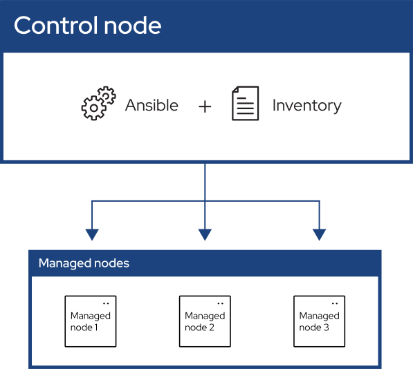

### What is Ansible?

- Ansible is an open source IT automation engine that automates provisioning, configuration management, application deployment, orchestration, and many other IT processes.
- It is free to use, and the project benefits from the experience and intelligence of its thousands of contributors.

---

### Common Use Cases for Ansible

- Eliminate repetition and simplify workflows
- Manage and maintain system configuration
- Continuously deploy complex software
- Perform zero-downtime rolling updates

---

### Ansible Design Principles

- **Agent-less architecture**. Low maintenance overhead by avoiding the installation of additional software across IT infrastructure.
- **Simplicity**. Automation playbooks use straightforward YAML syntax for code that reads like documentation. Ansible is also decentralized, using SSH with existing OS credentials to access to remote machines.

---

### Ansible Design Principles

- **Scalability and flexibility**. Easily and quickly scale the systems you automate through a modular design that supports a large range of operating systems, cloud platforms, and network devices.
- **Idempotence and predictability**. When the system is in the state your playbook describes Ansible does not change anything, even if the playbook runs multiple times.

---

### Ansible Architecture



---

### Ansible Architecture

- **Control node**: A system on which Ansible is installed. You run Ansible commands such as `ansible` or `ansible-inventory` on a control node.
- **Inventory**: A list of managed nodes that are logically organized. You create an inventory on the control node to describe host deployments to Ansible.
- **Managed node**: A remote system, or host, that Ansible controls.

---

### Building an Inventory

- Inventories organize managed nodes in centralized files that provide Ansible with system information and network locations. Using an inventory file, Ansible can manage a large number of hosts with a single command.
- You can create inventories in either `INI` files or in `YAML`. In most cases, such as the example in the preceding steps, `INI` files are straightforward and easy to read for a small number of managed nodes.

---

### Example of INI Inventory

- Add a new `[myhosts]` group to the `inventory.ini` file and specify the IP address, fully qualified domain name (FQDN) or Host in SSH config file of each managed node.

```ini
[myhosts]
192.0.2.50	# Can use FQDN or Host in SSH config file
192.0.2.51	# Can use FQDN or Host in SSH config file
192.0.2.52	# Can use FQDN or Host in SSH config file
```

---

### Inventory Verification

```shell
ansible-inventory -i inventory.ini --list
```

- **`ansible-inventory`**: CLI tool provided by Ansible to display or manage your inventory.
- **`-i inventory.ini`**: This specifies the inventory file to use.
- **`--list`**: This option tells Ansible to output the entire inventory in a JSON format. It lists all hosts, groups, and associated variables as Ansible understands them.

---

### Ping Hosts in the Inventory

```shell
ansible myhosts -m ping -i inventory.ini
```

- **`ansible`**: Ansible CLI tool used to run ad-hoc tasks.
- **`myhosts`**: This is the group of hosts or host pattern you want to target in the `inventory.ini` file.
- **`-m ping`**: Use Ansible **ping** module. It checks if it can connect to the remote hosts using the configured connection (usually SSH) and returns "pong" if successful.
- **`-i inventory.ini`**: This specifies the inventory file to use.

---

### Tips for Building Inventories

- Ensure that group names are meaningful and unique. Group names are also case sensitive.
- Avoid spaces, hyphens, and preceding numbers (use `floor_19`, not `19th_floor`) in group names.

---

### Tips for Building Inventories

- Group hosts in your inventory logically according to their **What**, **Where**, and **When**.
  - **What**: Group hosts according to the topology, for example: db, web, leaf, spine.
  - **Where**: Group hosts by geographic location, for example: datacenter, region, floor, building.
  - **When**: Group hosts by stage, for example: development, test, staging, production.

---

### Ansible Playbooks

- Playbooks are automation blueprints, in `YAML` format, that Ansible uses to deploy and configure managed nodes.
- If you need to execute a task with Ansible more than once, write a playbook and put it under source control.

[YAML Syntax](https://docs.ansible.com/ansible/latest/reference_appendices/YAMLSyntax.html)

[YAML Tutorial](https://spacelift.io/blog/yaml)

---

### What Can Ansible Playbooks Do?

- Declare configurations
- Orchestrate steps of any manual ordered process, on multiple sets of machines, in a defined order
- Launch tasks synchronously or [asynchronously](https://docs.ansible.com/ansible/latest/playbook_guide/playbooks_async.html#playbooks-async)

---

### Playbook Components

- **Playbook**: A list of plays that define the order in which Ansible performs operations, from top to bottom, to achieve an overall goal.
- **Play**: An ordered list of tasks that maps to managed nodes in an inventory.
- **Task**: A reference to a single module that defines the operations that Ansible performs.
- **Module**: A unit of code or binary that Ansible runs on managed nodes.

---

### Example of Playbook

```yaml
- name: My first play
  hosts: myhosts
  tasks:
   - name: Ping my hosts
     ansible.builtin.ping:

   - name: Print message
     ansible.builtin.debug:
       msg: Hello world
```

- Note: This playbook has two tasks and uses Ansible builtin modules `ping` and `debug`.
- Run the playbook.

```shell
ansible-playbook -i inventory.ini playbook.yaml
```

---

### Playbook Example - Update RHEL

```yaml
- name: Update RHEL nodes
  hosts: rhel_nodes
  become: yes
  tasks:
    - name: Update all packages to the latest version
      yum:
        name: "*"
        state: latest
```

- This playbook connects to all machines in the `rhel_nodes` group, elevates privileges, and then uses the `YUM/DNF` package manager to update every installed package to its newest version. This is a common way to keep RHEL-based systems up-to-date.

---

### Playbook Example - Update Ubuntu

```yaml
- name: Update Ubuntu nodes
  hosts: ubuntu_nodes
  become: yes
  tasks:
    - name: Update apt cache
      apt:
        update_cache: yes

    - name: Upgrade all packages to the latest version
      apt:
        upgrade: dist
```

- This playbook first updates the package list on all hosts in the `ubuntu_nodes` group and then upgrades all installed packages to their latest versions, ensuring the systems are up-to-date.

---

### Playbook Example - Remote Shell Script Execution

```yaml
- name: Copy and execute custom_task.sh on all nodes
  hosts: all
  become: yes
  tasks:
    - name: Copy custom_task.sh to remote nodes
      copy:
        src: custom_task.sh
        dest: /tmp/custom_task.sh
        mode: '0755'

    - name: Execute the custom_task.sh script
      command: /tmp/custom_task.sh
```

- This playbook demonstrates a common pattern for running custom scripts across multiple servers.

---

### Key Takeaways

- **Ansible**
  - A powerful open-source automation tool for IT tasks like configuration management, application deployment, and orchestration.
  - Agentless: manages nodes over SSH. No special software needed on managed machines.
  - Uses simple YAML syntax, making it easy to write and understand automation scripts.

---

### Key Takeaways

- **Ansible Inventory**
  - Defines the list of hosts and groups that Ansible will manage.
  - Can be static (INI, YAML files) or dynamic (scripts/cloud plugins).
  - Allows targeting specific sets of servers for tasks and playbooks.

---

### Key Takeaways

- **Ansible Playbook**
  - A YAML file that describes a set of automation tasks to be executed on managed hosts.
  - Supports idempotency: running a playbook multiple times yields the same result without causing issues.
  - Enables you to automate complex workflows, ensuring consistency and repeatability across environments.

---

### Sources:

- https://docs.ansible.com/ansible
- https://spacelift.io/blog/yaml