## Server Fundamentals 

## Client/Server Model

---

### Components of a Computer System

- By way of review - A fully functioning computer system consists of four components: **Hardware**, **Operating System**, **Applications**, **Users**.

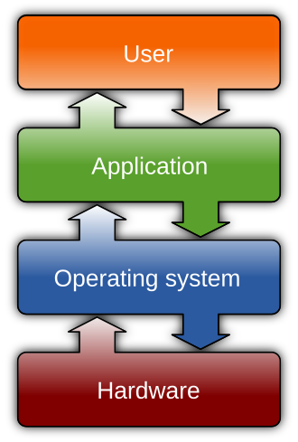

Credit: https://en.wikipedia.org/wiki/Operating_system

---

### Operating System

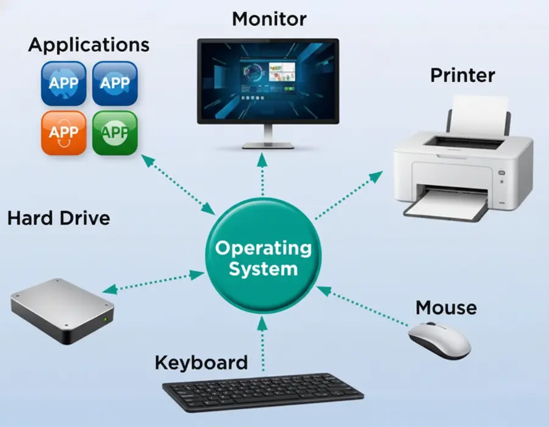 

Disclaimer: This image is generated by Google Nano Banana

---

### What is an Operating System

- **The Core Program (The Kernel):**
  - This is the program loaded initially by the **bootstrap** (BIOS/UEFI).
  - It runs continuously in the background, controlling the computer's resources and managing all other programs (processes) to ensure they run correctly.
- **The Resource Manager & Intermediary:**
  - **Hardware:** It manages the CPU, Memory, and Storage, abstracting the complexity away from software developers.
  - **I/O:** It handles data flow to and from devices (disks, networks, keyboards).
  - **Interface:** It provides the environment (CLI or GUI) allowing users and applications to interact with the system.

---

### What Does an Operating System Do

- An operating system (OS) provides the following tasks for the programs and applications that run on the computer:

  - Decides which programs should execute.

  - Decides what order multiple programs should run in.

  - Decides how much time each program should be allowed.

  - Decides how much memory each application can use.

  - Moves input and output from attached hardware devices, such as keyboards, hard disks, and printers.

  - Makes sure that different programs and users running at the same time do not interfere with each other.

---

### What is a File System

- An operating system’s method of organizing, managing, and accessing its files through logical structures and routines.

- Be careful not to confuse file systems with directories:
  - A **file system** interacts with the operating system.
  - A **directory** organizes files so that a user can find them on a hard disk or storage volume.
- Example of file systems:
  - **Windows**: FAT, FAT32, exFAT, NTFS, ReFS, CDFS, and UDFS
  - **Linux:** Ext3, Ext4, XFS, ZFS, Btrfs, etc.
  - **macOS**: MFS, HFS, HFS+, APFS

---

### File System - Windows

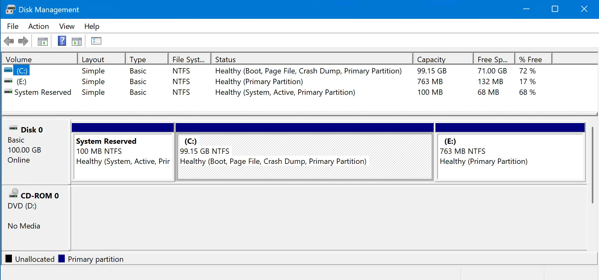

---

### File System - Linux

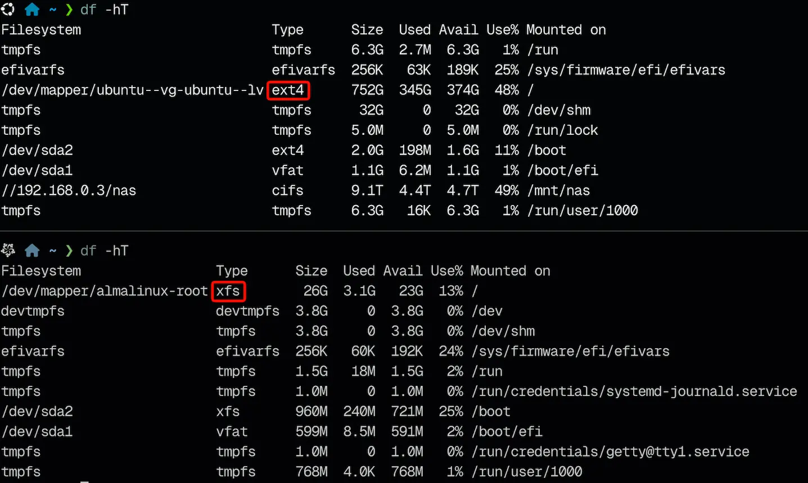

---

### File System - macOS

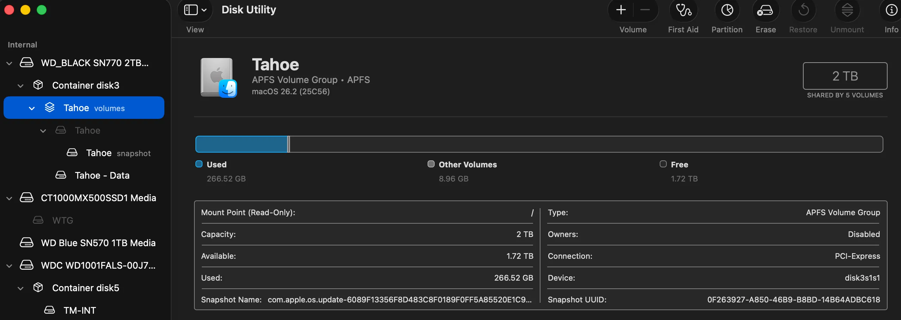

---

### Operating Systems & Networking

- **Historical Context ("Plain" OS):** Early systems (e.g., **MS-DOS**, **Windows 3.1**) were designed as **standalone** workstations.They contained **NO** native networking components. Connecting to a network required third-party software add-ons.
- **Network Operating Systems (NOS):** An OS designed with a built-in network stack (TCP/IP) to facilitate communication.**Core Functions:** Provides security, manages user authentication, and enables access to shared resources (files, printers).
- **The Modern Standard:** Today, **every** modern OS (Windows 11, Linux, macOS) is inherently a Network Operating System.**Current Distinction:** We no longer distinguish between "Networked" and "Non-networked"; instead, we distinguish between **Client OS** (optimized for user interaction) and **Server OS** (optimized for background services and multiple concurrent connections).

---

### Simple Peer-To-Peer Network

 

Credit: [Peer to Peer vs. Client-Server Networks](https://onlinecomputertips.com/support-categories/networking/673-peer-to-peer-vs-client-server-networks/)

---

### Disadvantages of P2P Workgroup

- **Decentralized Administration:**
  - Security, patching, and permissions must be managed manually on **every** individual computer.
  - **No Group Policy:** Centralized configuration and enforcement are impossible.
- **Identity Management Issues:** **Local Accounts Only**, No "Single Sign-On." Users require separate accounts and credentials for every specific machine they need to access.
- **Limited Scalability:** Designed for small peer-to-peer LANs (approx. 10–20 devices). Management becomes unmanageable as the network grows.
- **Security Risks:** Inconsistent security postures make the network vulnerable to malware and unauthorized access from non-work devices.

---

### Client-Server Based Network

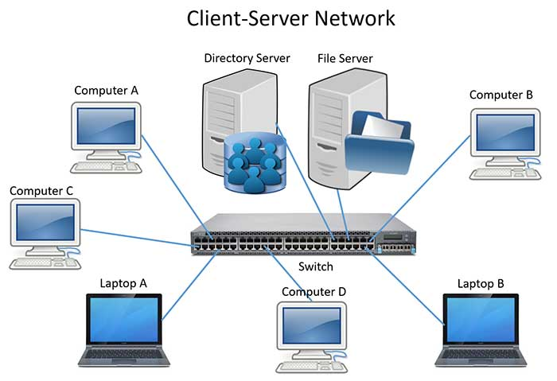 

Credit: [Peer to Peer vs. Client-Server Networks](https://onlinecomputertips.com/support-categories/networking/673-peer-to-peer-vs-client-server-networks/)

---

### Advantages of Client-Server Network

- **Centralized Administration:** Control security, users, and permissions from a single location.
- **Single Sign-On:** Users access all network resources with just one username and password.
- **Scalability:** Easily supports network growth without increasing management complexity.
- **Reliable Backups:** Centralized data storage makes backups and recovery significantly easier.

---

### Client/Server

- **Client  (The Requester)**
  - **It is a piece of software that uses services.**
  - It initiates communication by sending a request to the server.
  - Typically, a client is an application that runs on a personal computer and relies on a server to perform some operations.
  
- **Server (The Provider)**
  - **It is a piece of software that provides services.**
  - It "*listens*" for requests from clients and responds with the necessary resources (files, database entries, access).
  - The term can refer to the **software** (e.g., Apache Web Server) or the **physical machine** dedicated to running that software.

---

### Client/Server Attributes

- Processing is divided between client and server.
- Client and server can reside on the same or different machines.
- There may be one centralized server or several distributed servers.
- Client requests resources.
- Server supplies resources.
- Modular.
- Message based.

---

### Service/Server Implementation

- **Operating System Variation:** While the fundamental concept is universal, the implementation differs by OS (called **Services** in Windows and **Daemons** in Linux).
- **Background Execution (TSR):** Functions as a **TSR** (Terminate and Stay Resident) program.The program loads into memory and runs in the **background**, detached from the active user interface, waiting to be needed rather than closing after a task.
- **The "Listening" State:** The service constantly monitors a specific communication channel (usually a **TCP/IP port**) for incoming requests bound for that specific service.

---

### Services in Windows

- **Server vs. Service:**
  - Every network server application (like a Web or Database server) runs as a Windows Service.
  - However, **NOT** every service is a server; many are internal maintenance tasks (e.g., Print Spooler, Windows Update) that don't serve network clients.
- **Service States:** **Running**, **Stopped**, or **Paused**.
- **Startup Types:** **Disabled**, **Manual**, or **Automatic**.
- **Service Properties:** **Dependencies**, **Recovery**, and **Logon** instructions.

---

### Services in Windows

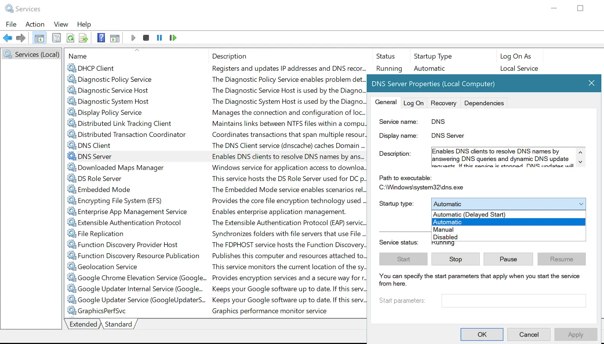 

---

### Services in Linux

- Similar to Windows, services (and services which operate as a server) are started either manually or at boot.
- Run in the background.
- Used to depend on the “run level” in “init” based systems – like safe mode in Windows – the difference between run levels was what services started.
- Now depends on “**systemd**” system - which uses “targets” and uses `systemctl`.
- Are known as “**daemons**”, but are the same thing.

---

### Services in Linux

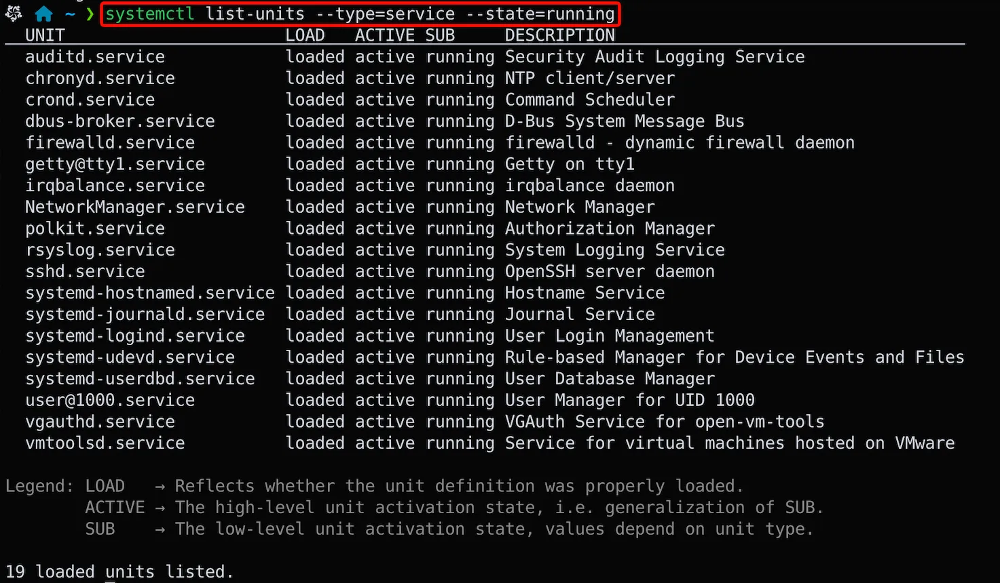 

---

### Essential Network Services: DHCP Server

- **DHCP**: **D**ynamic **H**ost **C**onfiguration **P**rotocol

- **TCP/IP** is the protocol of choice.
- Every client machine must be configured with an IP address.
- This can either be done manually or automatically through **DHCP**.
- To do this manually is tedious and error-prone.
- The client broadcasts a request for IP configuration, the DHCP server responds with IP automatically.

---

### Name Resolution Service

- **Human vs. Machine Addressing:**
  - To access resources, clients (users) rely on easy-to-remember names, whereas computers rely on numeric IP addresses to communicate.
  - *Example:* Accessing a website (www.google.com) or a local printer share (\\prn161\H410).
- **The Limitation of IP Addresses:** Clients don’t know and can’t remember the IP address (they also CAN’T know the IP in a DHCP environment).
- **The Resolution Process:** A dedicated service is needed to **"resolve"** (translate) these static, user-friendly names into their currently assigned, valid IP addresses.

---

### Essential Network Services: Name Resolution Servers

- Name resolution allows you to resolve a name to an IP address – there are two main types:
  - **Domain Name Servers (DNS)** do **Host Name resolution**.
  - **Windows Internet Name Service (WINS)** do **Netbios name resolution** (not common anymore – used to be good for internal networks).
- Clients query either the WINS or DNS servers for the IP of the target system name that they are trying to locate.
- In DHCP environments, having a centralized, dynamic server to manage name resolution is essential.

---

### DNS Server

 

Credit: [What is domain name server (DNS) with example](https://itrelease.com/2021/11/what-is-domain-name-server-dns-with-example/)

---

### Login Server

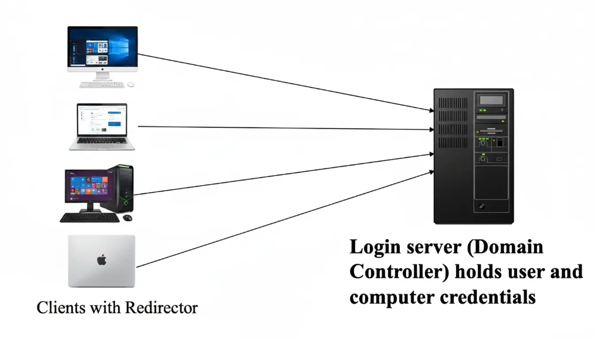

Disclaimer: This image is generated by Google Nano Banana 

---

### Login Servers

- Credential management is critical in running a network.
- In Microsoft parlance, a server that operates as a login server is described as a “**domain controller**”.
- A domain controller holds a copy of the **Active Directory** database – which includes every user, computer, and resource administered on the network (You log into AD at SAIT).
- This allows the administrator to manage every user and computer from a single server – allows “**single sign on**” – credentials can be used across all resources.

---

### File Servers

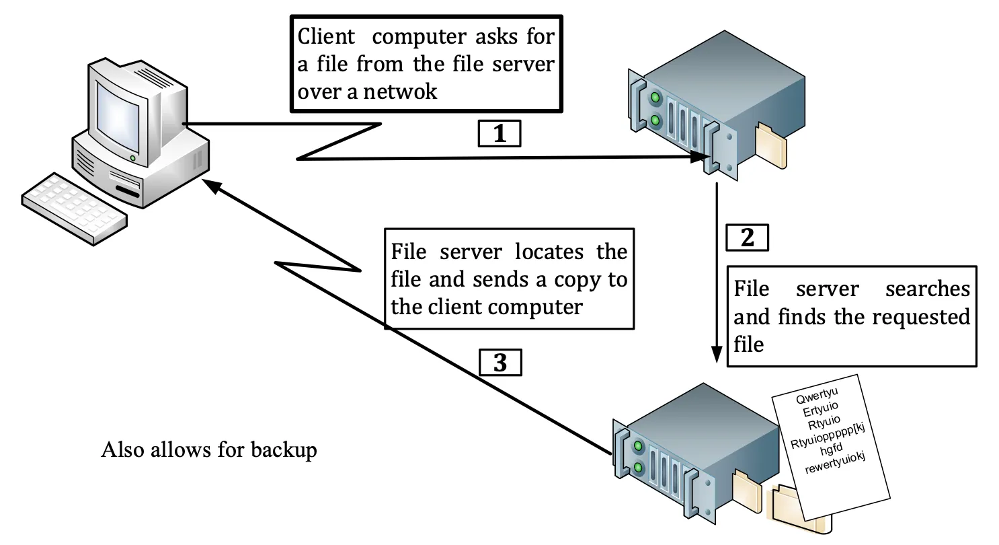 

---

### A Database Server Example

- A database server is a powerful computer system running specialized software ([DBMS](https://www.google.com.hk/search?q=DBMS&ved=2ahUKEwjg4ZGbuYCSAxUeFjQIHQ-3N-oQgK4QegYIAQgAEAY)) that stores, manages, and provides access to structured data for other applications or users (clients) over a network.

  - The user runs client software to create a query

  - The client connects to the Database server

  - The client sends the query to the server

  - The server analyzes the query

  - The server computes the results of the query

  - The server sends the results to the client

  - The client presents the result to the user

---

### A Database Server Example

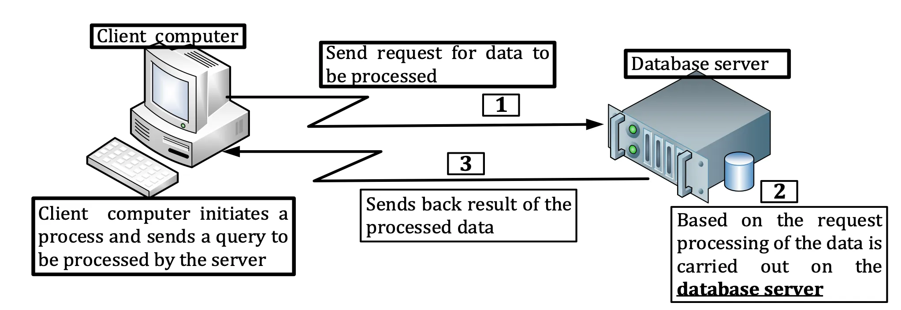 

---

### File Server vs Database Server

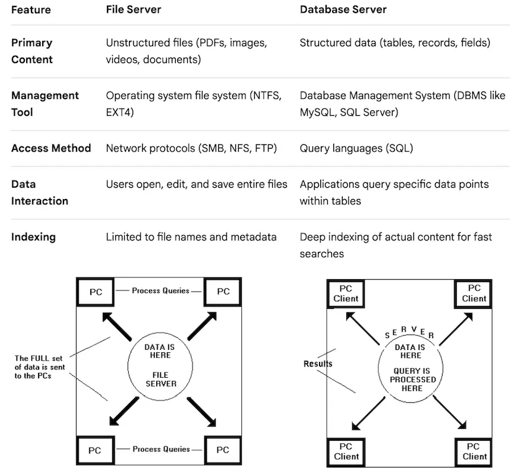  

---

### Web Servers

- **Purpose:** Hosts and delivers web content (HTML, CSS, media) to clients (web browsers) upon request.
- **Protocol:** Communicates primarily using **HTTP** (Port 80) and **HTTPS** (Port 443).
- **Mechanism:** The server listens for a request, retrieves the specific file or generates dynamic content, and sends the response back.
- **Common Examples:** Apache HTTP Server, Nginx, Microsoft IIS.
- Question: What is the client of of web servers?

---

### Virtualization Servers

- **Virtualization Server** or **Hypervisor** is a system with an OS designed to host many other virtual computers inside it – many advantages to this:
  - Segmentation of services.
  - Ease of Management and deployment – less power/space.
  - Cloud based services.
  - **VDI** (Virtual Desktop Infrastructure).
- Examples: **VMware ESXi**, **Microsoft Hyper-V**, **KVM**, and **Xen**.

---

### LAMP Stack

- Often Servers are **Hybrids** – offering more than one service at a time.
- It is good practice to separate out different services – in case a server is compromised, is taken offline, or needs to be rebooted - you don’t want to impact the other services being hosted.
- **LAMP** is a common Linux based server providing Web with a database – i.e., [Drupal](https://new.drupal.org), [WordPress](https://new.drupal.org/).
- **LAMP** stands for **L**inux, **A**pache, **M**ySQL, **P**HP.

---

### Modern Full-Stack

- These are the current industry JavaScript Stacks leaders for high-speed, interactive applications (like social media feeds or dashboards).

  - **MERN:** **M**ongoDB, **E**xpress.js, **R**eact, **N**ode.js.

  - **MEAN:** **M**ongoDB, **E**xpress.js, **A**ngular, **N**ode.js.

- The Python Stacks favored for AI-integrated apps and data-heavy platforms.
  - **Django + PostgreSQL:** Known as the "batteries-included" stack because it comes with built-in security and an admin panel.
  - **FastAPI + React:** A newer, high-performance Python stack designed specifically for modern APIs and machine learning.

---

### Other Different Types of Servers

- Plus a bunch of other different types of servers – firewalls, NAS, Transaction, radius, VPN, etc.
- Often dedicated machines, but not necessarily.
- In our case, we’re running services which are “servers” on platforms like Linux and Windows “servers” – likely on large computers… called “servers”.

---

### Resources:

- https://en.wikipedia.org/wiki/Operating_system
- https://en.wikipedia.org/wiki/List_of_file_systems
- https://onlinecomputertips.com/support-categories/networking/673-peer-to-peer-vs-client-server-networks/
- https://itrelease.com/2021/11/what-is-domain-name-server-dns-with-example/
- https://www.ibm.com/think/topics/lamp-vs-mean