## Server Fundamentals

## DHCP

---

### ARP - What is it?

- We need to review how computers communicate on a network before we can talk about DHCP.
- Computer to computer communication is done at the physical level
  - Uses unique Hardware address (MAC address; Media Access Control)
- IP address is logical addressing
  - Especially useful for internetworking and routing

---

### What Does TCP/IP Provide?

- Open protocol standards
- Independence from specific **physical** network hardware
- A globally unique addressing scheme
- Support for internetworking and routing
- Standardized high-level protocols for consistent, widely available user services

---

### OSI and TCP/IP Model

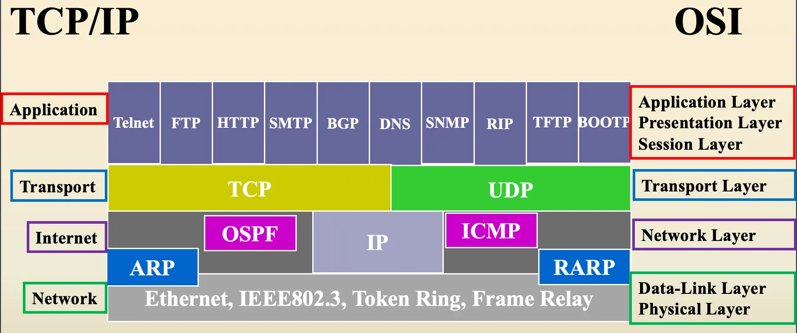 

---

### Now Addresses are Needed

- **Physical Address** (**ex: Hardware Address**)
  - The reference name of the network interface card
  - Is specific to the architecture
- **Logical Address** (**ex: IP Address**)
  - The address of the device within the entire connected network
  - IP address is specific to the transport layer protocol

---

### Physical Address

- MAC addresses are recognizable as six groups of two [hexadecimal](https://en.wikipedia.org/wiki/Hexadecimal) digits, separated by hyphens, colons, or without a separator.
- NIC or MAC address
- Ethernet address (EA)
- Hardware Address 
- Coded into NIC
- 6 Bytes   (AA:BB:CC:XX:YY:ZZ)

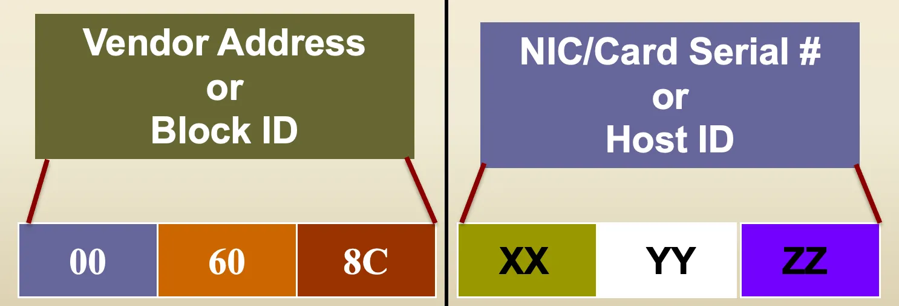 

---

### MAC Address vs. IP Address

- To communicate using TCP/IP we use 32-bit IPv4 or 128-bit IPv6 addresses (logical, network)
- In an Ethernet LAN we use 48-bit MAC addresses (physical, architecture)
- Covert between MAC and IP: Use Lookup Table, Cache Information, or Make the software to do it – a protocol (ARP)

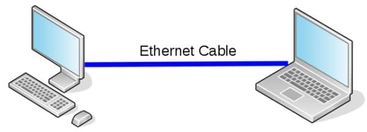 

---

### ARP

- Address Resolution Protocol
- The TCP/IP protocol used to associate an IP address to a MAC address (physical address)

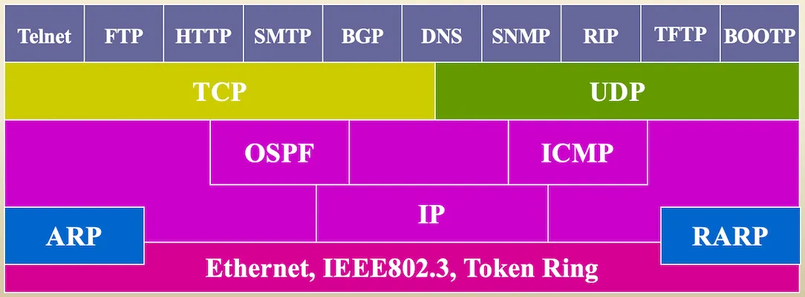 

---

### ARP Cache

- Use `arp -a` command to display ARP cache on Windows and macOS. Use `ip neighbour` on Linux.

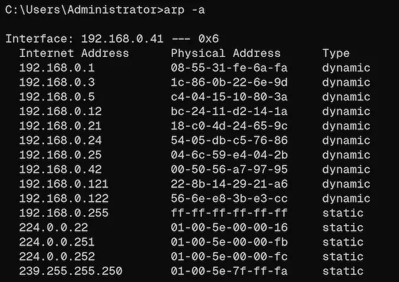 

---

### Network Services

- Independent of OS’s and transport protocols
- RFC - A Request for Comments (RFC) is a publication in a series from the principal technical development and standards-setting bodies for the Internet, most prominently the Internet Engineering Task Force (IETF).
- DHCP - Dynamic Host Configuration Protocol

---

### Configuring Workstations

- For every host on a TCP/IP network, the following must be done each time a new host is added or moved to subnet
  - Select a legal IP address
  - Assign the address, subnet mask and default gateway
  - Can also assign host names, domain names, routers

- This can be done manually (Statically) or Dynamically

---

### DHCP

- An extension of the BOOTP (old table lookup system) mechanism
- Described in RFC2131 which obsoletes RFC1541
- Latest RFC3736 extended several options for DHCPv6
- DHCP uses UDP as its transport protocol
- Client/Server
  - Client sends messages to server -Src port 68, Dst port 67 
  - Server sends messages to client  -Src port 67, Dst port 68 
- Plusses
  - Clients can be dynamically configured
  - You can use multiple servers
  - A server can service more than one subnet
  - The database is dynamic
  - Clients can be renewed without reboot

---

### DHCP Allows

- Manual or static allocation
  - Administrator keeps complete control by assigning the client’s IP address based on MAC address
- Automatic allocation
  - APIPA – automatic private IP addressing
  - Client configures itself with a reserved Class B (169.254.0.0 and 255.255.0.0) if it does not receive a response from a server

- Dynamic allocation
  - DHCP Server assigns an address from a scope of addresses for a specific lease time

---

### DHCP Allows

- Roaming allocation
  - Used where there are many temporary connections
  - Same as dynamic but uses very short lease times and usually small scopes 
  - May cause excessive traffic
- Client Reservation
  - Used to reserve a specific IP address for a specific mac address in a Dynamic scope

---

### DHCP Process - DORA

1.  DHCP**D**iscover - broadcast
2.  DHCP**O**ffer – broadcast or unicast
3.  DHCP**R**equest - broadcast
4.  DHCP**A**ck – broadcast or unicast
5.  Binding

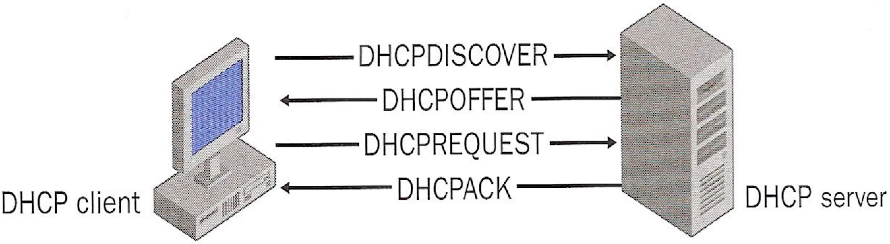

---

### 1 - DHCP Discover

- Broadcasted by the client on the local physical subnet
  - Contains the MAC address of the client (client identifier)
  - MAY include options that suggest values for the network address and lease duration 
  - Relay agents may pass the message on to DHCP servers not on the same physical subnet. 

---

### 2 - DHCP Offer

- Each server will respond with a DHCPOFFER message
  - Includes an available network address and a server identifier
  - Servers need not reserve the offered network address, although the protocol will work more efficiently if the server avoids allocating the offered network address to another client
  - Servers SHOULD check that the offered network address is not already in use; e.g., the server may probe the offered address with an ICMP Echo Request

---

### 3 - DHCP Request

- The client receives one or more DHCPOFFER messages from one or more servers. 
  - The client chooses one server from which to request configuration parameters, based on the configuration parameters offered in the DHCPOFFER messages 
  - The client broadcasts a DHCPREQUEST message that MUST include the 'server identifier' option to indicate which server it has selected, and that MAY include other options specifying desired configuration values. 

---

### 4 - DHCPACK or DHCPNACK

- The servers receive the DHCPREQUEST broadcast from the client. 
  - Those servers not selected by the DHCPREQUEST message use the message as notification that the client has declined that server's offer. 
  - The server selected in the DHCPREQUEST message commits the binding for the client to persistent storage and responds with a DHCPACK message containing the configuration parameters for the requesting client. 
  - If the selected server is unable to satisfy the DHCPREQUEST message (e.g., the requested network address has been allocated), the server SHOULD respond with a DHCPNAK message. 

---

### Binding or DHCPDecline

- The client receives the DHCPACK message with configuration parameters. 
  - The client SHOULD perform a final check on the parameters (e.g., ARP for allocated network address), and notes the duration of the lease specified in the DHCPACK message.
  - When the DHCP client receives the DHCPACK (acknowledge), the DHCP client completes the initialization process of the TCP/IP stack and becomes a bound DHCP client, and is able to use the leased IP address until the lease requires renewal.

---

### Binding or DHCPDecline CONT.

- If the client detects that the address is already in use (e.g., through the use of ARP), the client MUST send a DHCPDECLINE message to the server and restarts the configuration process. The client SHOULD wait a minimum of ten seconds before restarting the configuration process to avoid excessive network traffic in case of looping. 
- If the client receives a DHCPNAK message, the client restarts the configuration process.

---

### DORA in Wireshark

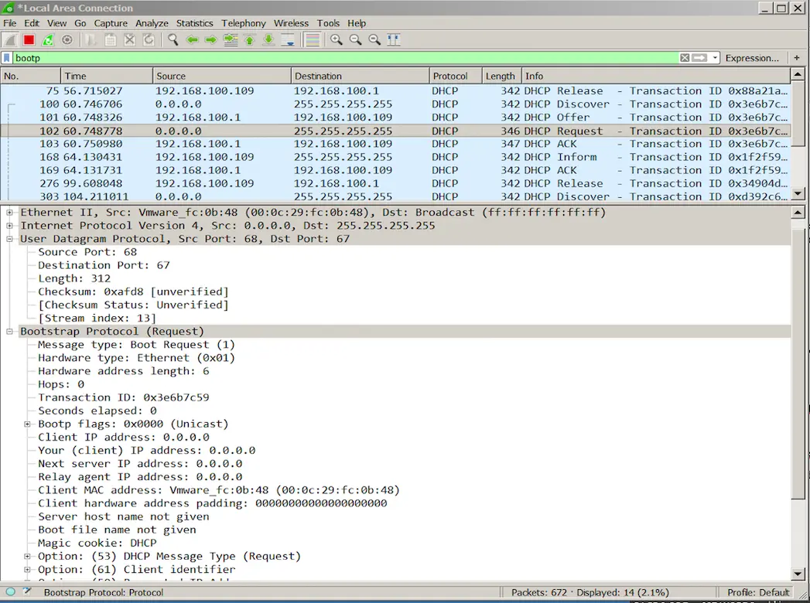

---

### Reusing IP

- If a client remembers and wishes to reuse a previously allocated network address, a client may choose to omit some of the steps and do the following:
  - The client broadcasts a DHCPREQUEST message on its local subnet. The message includes the client's network address in the 'requested IP address' option. 
  - Servers with knowledge of the client's configuration parameters respond with a DHCPACK message to the client. 

---

### DHCP Lease Renewal

- Lease Period is Defined in Server Setup
  - Client must negotiate lease renewal before expiry
  - at 50% lease time – DHCPRequest Unicast to Server
  - at 87.5% lease time - DHCPRequest Broadcast
  - at 100% lease time - DHCPDiscover

- DHCPNAK
  - server determines client is misconfigured 
  - forces client to re-initialize
  - Example, duplicate IP on network
- DHCPRELEASE – sent by client 

---

### DHCP Lease Renewal

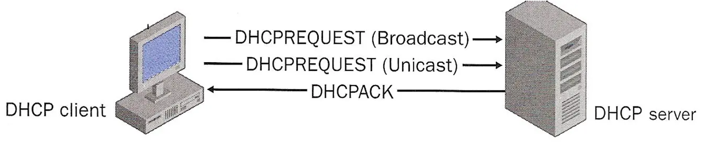

---

### DHCP Relay Agent

- We still have the problem that broadcast messages are usually restricted to subnets
- If you can configure your routers to pass DHCP this cures the problem but increases traffic
- BootP introduced the Relay Agent
  - A specific server service on an OS
  - Relay host is configured with the IP addresses of DHCP services
  - Agent listens for DHCP broadcasts on its local subnets, and edits and sends the packets to the DHCP server
  - This is not a forwarder, any device said to be a forwarder does not alter packets.  For example, a router acting as a DHCP forwarder would simply pass the broadcast packets from one subnet to another.

---

### DHCP Relay Agent (Server)

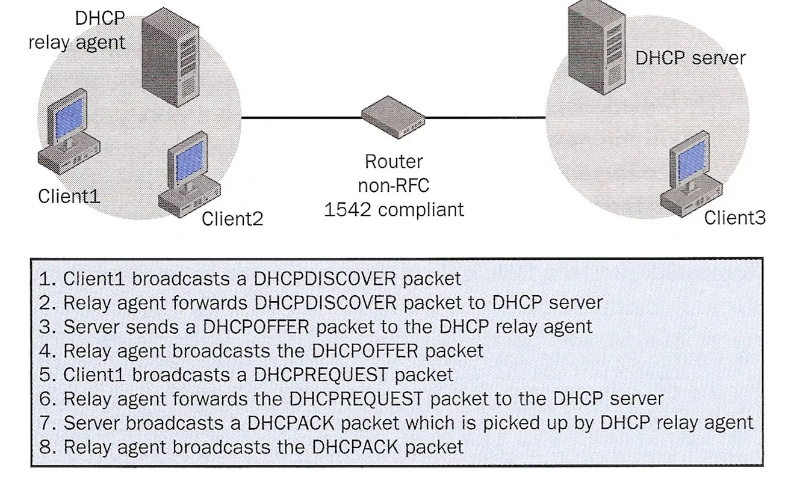 

---

### Manual TCP/IP Addressing

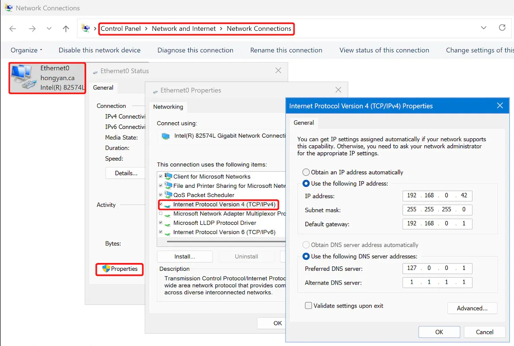 

---

### Dynamic TCP/IP Addressing

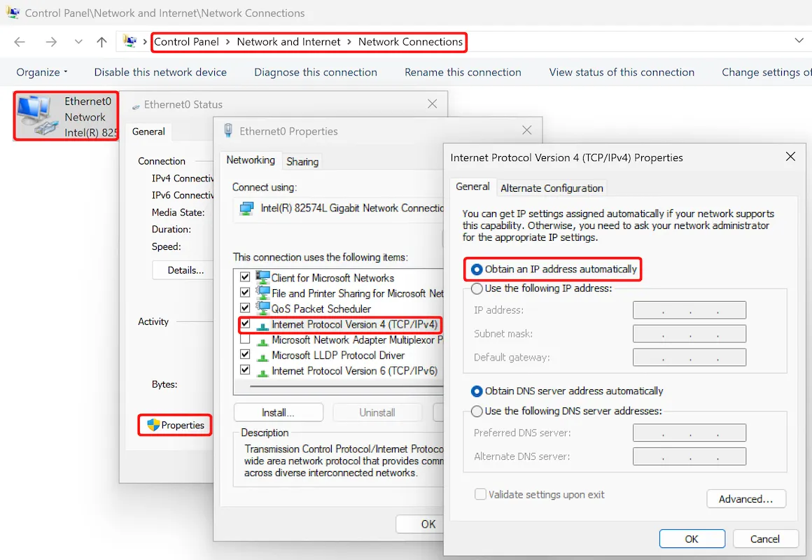 

---

### DHCP Server Requirements - Windows

- Microsoft Windows Server products
- Static IP address (recommended), subnet mask, and default gateway
- The DHCP Server service/Role installed on the server
- Valid range (scope) of addresses

---

### Key Benefits of DHCP

- **Centralized administration of IP configuration**: Manage all IP addresses and settings from a single server.
  
- **Dynamic host configuration**: Automatically assigns IP addresses, subnet masks, gateways, and DNS servers to devices as they connect.
  
- **Seamless IP host configuration**: Devices obtain valid network settings instantly upon joining the network—no manual setup required.
  
- **Flexibility**: Easily supports changing network needs, mobile devices, and temporary guests without reconfiguration.
  
- **Scalability**: Efficiently handles large or growing numbers of devices with minimal administrative effort.

---

### APIPA

- If the DHCP client is unable to locate a DHCP server and is not configured with an alternate configuration, the computer configures itself with a `169.254.0.0/255.255.0.0` address.
- The auto-configured computer then tests to verify that the IP address it has chosen is not already in use by using a gratuitous ARP broadcast. 
- If the chosen IP address is in use, the computer randomly selects another address.

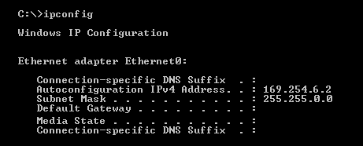 

---

### Configuring Windows DHCP server

1. Give the server static IP address
2. Add DHCP server Role
3. Set up the scopes
4. Set up the lease information
5. Configure any other options
6. Authorize the server in Active Directory (only if it is AD integrated DHCP)
7. Activate the scope
8. View active information

---

### Add DHCP Server Role

- From Server Manager -> Add Roles and Features, follow the Wizard

 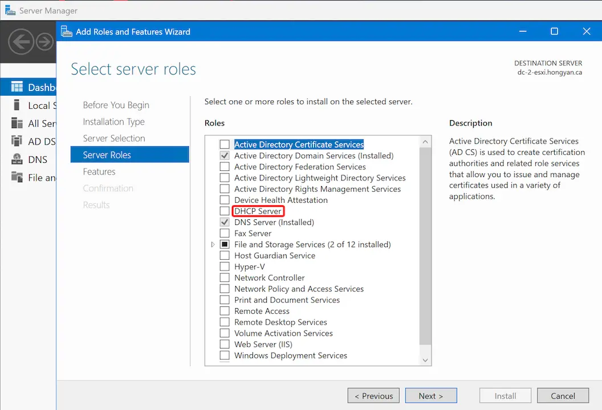 

---

### Configuring the Scope and Lease

- A scope includes the following: 
  - A range of IP addresses that can be leased by the DHCP server
  - Valid Subnet Mask for the pool of IP addresses.
  - Any IP addresses in the IP address pool range that need to be excluded so that they will not be leased to DHCP clients, such as: 
    - IP addresses of the other DHCP servers on the network, 
    - WINS and DNS servers, 
    - Subnet addresses, 
    - Router IP addresses, 
    - Or any range that will be used on the network by devices requiring static IP addresses. 
  - The duration of the IP address lease, which defaults to eight days. 

---

### Authorize Windows DHCP server on Domain

- Authorizing a DHCP server stops “rogue” DHCP servers from operating on your network.
- This Microsoft-specific mechanism is most effective against Windows-based rogues; for broader protection, combine with switch features like DHCP snooping.
- Assumes:
  - You have AD installed
  - All DHCP servers are Windows Servers

---

### Activate/Deactivate Scope

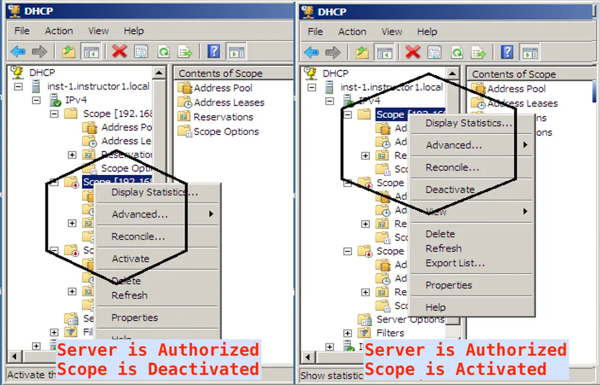 

---

### Reserving Client Addresses

- The DHCP Manager allows the reservation of a specific IP address for a specific host based on its MAC address
  - Domain controllers 
  - Clients' IP addresses assigned by another TCP/IP configuration method
  - Servers such as DNS, Wins or other DHCP
  - Any Routers used to direct network traffic between subnets

---

### Reserving Client Addresses

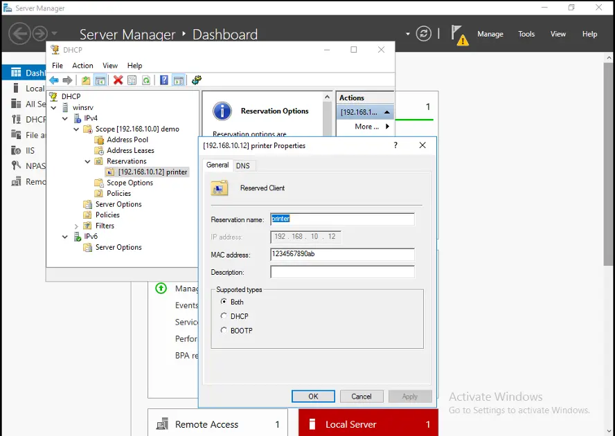 

---

### Configuring DHCP Options

- A DHCP server must provide the DHCP client with the following information:
  - A valid IP address to lease (configured when the DHCP Scope is created).
  - A Subnet Mask (configured when the DHCP Scope is created).
- There are about 63 other predefined DHCP configuration parameters, called scope options, that an administrator can configure through the DHCP Manager for one or all scopes on a DHCP server.
  - Including things like: default gateway, DNS server(s) lP, domain name etc. 

---

### Scope Options vs Server Options

- Scope options apply only to the specific scope, if none found then uses server options; 
- Server options apply to all scopes on the server. 
- Scope options will override server options if both configured

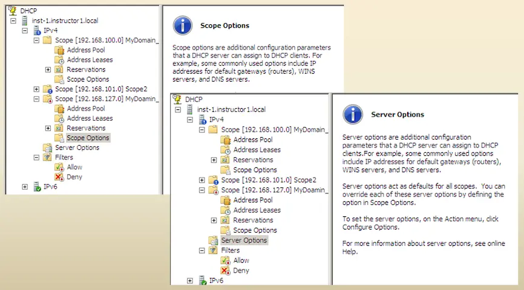 

---

### DHCP Address Exclusions

- DHCP address exclusions in Windows Server allow administrators to reserve specific IP addresses within a defined DHCP scope so they are never leased to clients, ensuring those addresses remain available for static assignment to servers, printers, routers, or other devices that require a fixed IP.

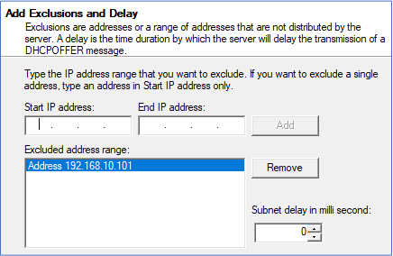 

---

### Configuring Failover for DHCP

- If DHCP server fails – no one gets an IP – can create a second server to operate as a failover which will host part of the scope
  - Failover relationships must have unique names
  - Failover configured for every IPv4 scope between DHCP servers
  - The “Maximum Client Lead Time” (MCLT) determines when a failover partner takes control of the subnet or scope
  - Failover supports two modes: **Hot Standby** Mode and **Load Balancing** Mode
  - Auto State Switchover Interval determines when a failover partner is considered to be down
  - Message authentication can validate the failover messages
  - Firewall rules are auto-configured during DHCP installation