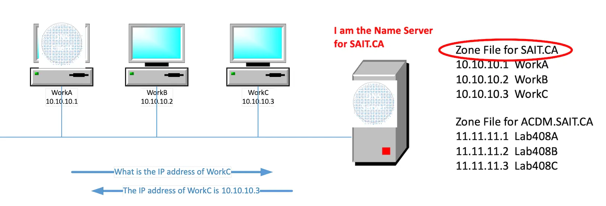
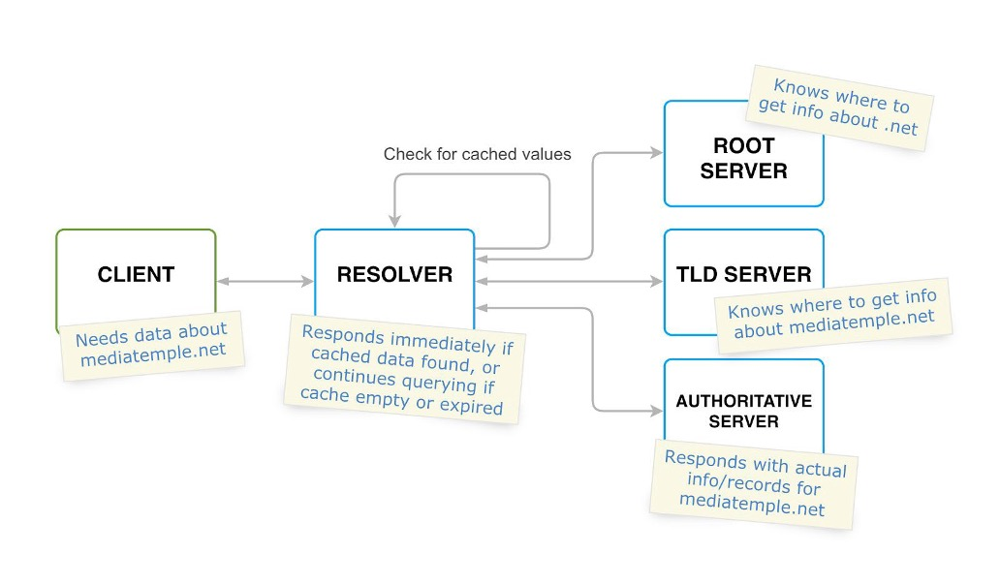
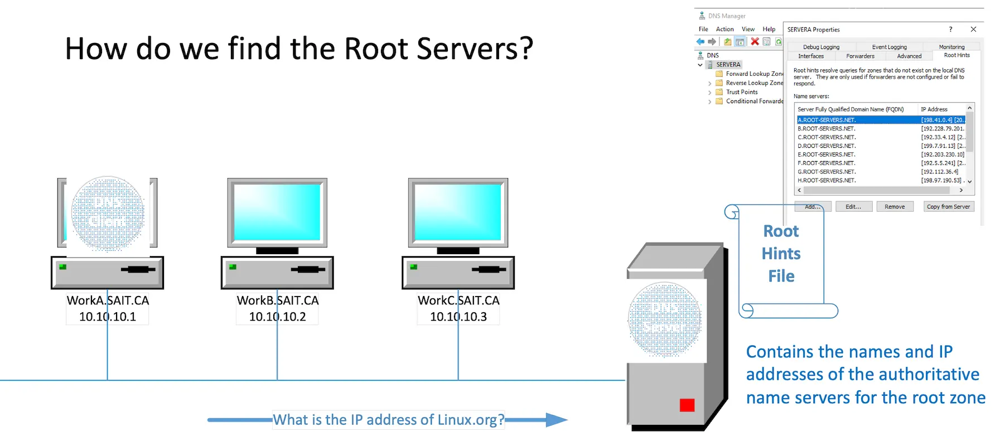
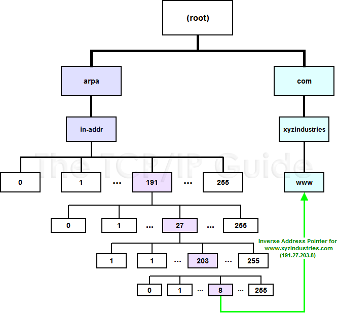
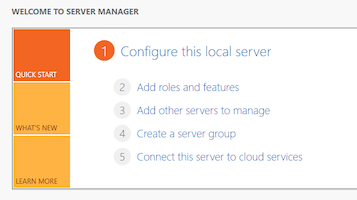
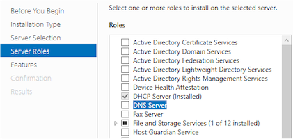
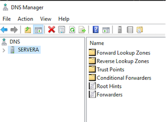
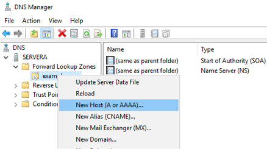
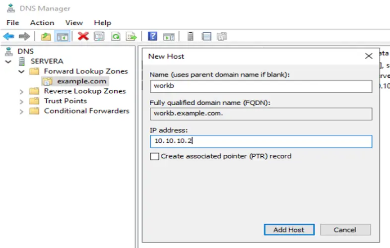

## Server Fundamentals

## DNS on Linux

---

### Name - IP Address Mapping

- With DHCP we found a way to configure our TCP/IP information automatically.
- TCP/IP protocols use the IP address, which uniquely identifies how a host is connected to the Internet. 
- But, people prefer to use names instead of numeric addresses. Therefore, we need a system that can map a name to an address or an address to a name.

---

### Naming Resolution

- In today’s networks, we assign logical addresses, such as with IP addressing. 
- These addresses are hard to remember, especially it is more complicated with IPv6. 
- We need some form of naming service that will allow us to translate logical names (which are easier to remember), into logical addresses. 
- The most common naming service is Domain Name System, or **DNS**.

---

### Naming Resolution

- **DNS** provides a mapping from names to resources of several types.
- **DNS** is one of the most important systems in the Internet infrastructure. Application like web, email, etc., depends heavily on this crucial service. 

 

---

### A little History of the Internet

- [ARPANET (Advanced Research Projects Agency Network)](https://en.wikipedia.org/wiki/ARPANET) was the first wide-area [packet-switched network](https://en.wikipedia.org/wiki/Packet-switched_network) with distributed control and one of the first computer networks to implement the [TCP/IP](https://en.wikipedia.org/wiki/TCP/IP) protocol suite, the technical foundation of the [Internet](https://en.wikipedia.org/wiki/Internet). 
- Initial four hosts: The initial ARPANET configuration linked [UCLA](https://en.wikipedia.org/wiki/UCLA), [ARC](https://en.wikipedia.org/wiki/Augmentation_Research_Center), [UCSB](https://en.wikipedia.org/wiki/UCSB), and the [University of Utah School of Computing](https://en.wikipedia.org/wiki/University_of_Utah_School_of_Computing).
- Applications: [TELNET](https://en.wikipedia.org/wiki/TELNET) for remote time-sharing access and [File Transfer Protocol](https://en.wikipedia.org/wiki/File_Transfer_Protocol) (FTP), the latter used to enable rudimentary electronic mail, were developed and eventually ported to run over the TCP/IP protocol suite. In the 1980s, FTP for email was replaced by the [Simple Mail Transfer Protocol](https://en.wikipedia.org/wiki/Simple_Mail_Transfer_Protocol) and, later, [POP](https://en.wikipedia.org/wiki/Post_Office_Protocol) and [IMAP](https://en.wikipedia.org/wiki/IMAP).

Source: https://en.wikipedia.org/wiki/ARPANET

---

### The `hosts` File

- Simple text file that associates IP addresses with hostnames.
- Acting as a local DNS override for quick lookups or blocking sites.
- In Linux/macOS: `/etc/hosts`
- In Windows: `C:\Windows\System32\drivers\etc\hosts`
- Requires administrator/root privileges to edit.
- Entry syntax: `IP_Address Hostname` (e.g., `127.0.0.1 localhost`)
- Now if I want to contact a host I can use:
  - Its IP address OR
  - Its FQDN (Fully Qualified Domain Name) OR
  - Its hostname or alias

---

### The `hosts` File Activity

- Go to your hosts file and examine your static mappings.
- Do you have a static mapping for any other PC in this room?
- Ping a site on the Internet by FQDN to find it’s IP (SAIT will not allow to ping outside). 
- Create a static mapping using an Alias name for the  printer your hosts file and ping it by your Alias name .

---

### DNS - Domain Name System/Service

- An Internet service that translates Fully Qualified Domain Names (FQDN) into IP addresses. 
- A set of protocols and services on a TCP/IP network which allows users of the network to utilize hierarchical user-friendly names when looking for other hosts instead of having to remember and use their IP addresses. 

---

### DNS and TCP/IP

- DNS can use either UDP or TCP both are based on standard port # 53
- Uses two different packet types: Query and Response 

 

---

### DNS Packets

- Changing of information between client and server is carried out by [two types of DNS messages](https://www.geeksforgeeks.org/computer-networks/dns-message-format/):

  - Query message

  - Response message

 

---

### DNS Names

- Hierarchical
- Case Insensitive
- Maximum Length of 255 octets (bytes),  **limited to 253 ASCII characters in text form**
- Made up of labels
  - Each label within the FQDN is limited to **63 characters/octets**
  - Case insensitive
- Fully Qualified (FQDN) - includes all labels and is globally unique
  - Example: hostname+domain_name www.sait.ca
- Relative DNS name - must have local domain information appended

---

### Domain Name Space

- A distributed database holding the alphanumeric names and IP addresses

 

---

### Activity

- Determine how many root (.) DNS servers exist on the Internet
- How much does it cost to register a `.com` domain?
- How much does it cost to register a `.ca` domain?
- How much does it cost to register a `.ai` domain?
- How much does it cost to register a `.xyz` domain?
- How to register/buy a domain?

---

### Who Can Register a Domain

- Internet Assigned Numbers Authority (IANA) is responsible for management of protocol parameters, Internet number resources and domain names.
- Internet Corporation for Assigned Names and Numbers (ICANN) performs these function on behalf of global Internet community. 
- Domain name registration is done by a “REGISTRAR”; a commercial entity accredited by (ICANN)

---


Credit: https://en.wikipedia.org/wiki/Domain_Name_System

---

### DNS Zones

- A DNS zone is a portion of the DNS namespace that is managed by a specific organization or administrator.
- A DNS zone starts at a domain within the tree and can also extend down into subdomains so that multiple subdomains can be managed by one entity.
- A zone file is a plain text file stored in a DNS server that contains an actual representation of the zone and contains all the records for every domain within the zone. Zone files must always start with a [Start of Authority (SOA) record](https://www.cloudflare.com/learning/dns/dns-records/dns-soa-record/), which contains important information including contact information for the zone administrator.

Source: [What is a DNS zone?](https://www.cloudflare.com/en-ca/learning/dns/glossary/dns-zone/)

---

### DNS Domains

- Domain  - A domain is also part of the name space 
  - A node in the domain name space and all of the nodes below it.
  - Contain both hosts and other domains

 

---

### Authority and Delegation

- Domain delegation gives an organization authority for a domain. 
- Having authority for a domain means that the organization's network administrator is responsible for maintaining the DNS database of hostname and address information for that domain. 
- An organization responsible for a domain may divide it into subdomains to decentralize administration.
- The `ca.` domain is broken into the various provinces, each having their own subdomain. One of the subdomains of the `ab.ca` domain is `sait`.
- The sait administrators could subdivide the `sait.ab.ca` domain in other subdomaina ex: `its.sait.ab.ca`, `sd.sait.ab.ca`, `iss.sait.ab.ca`, etc.
- It is preferable to have one name server with the zone file for each subdomain.

---

### Name Servers

- Purpose of name server is to answer “DNS” questions
- The question is present in both the query and the response, and should be identical.
- The answer consists of the resource records that answer the question. 

- Different types of Name servers
  - Authoritative servers
  - Master (Primary)
  - Slave (Secondary)
  - Caching Server
    - A recursive server
    - Also caching forwarders 

---

### Name Servers

- A DNS nameserver contains at least 1 zone file.

 

---

### Authoritative Name Servers

- Provides authoritative answers for one or more zones  - it holds the zone file for a given zone
- Master or Primary server normally loads data from its own Zone File 
  - One master but can have multiple slave server

- Slave server normally replicates the data from a master server via “zone transfer”   

---

### Recursive Name Servers

- Do the actual lookup of DNS servers based on the question asked by the client
- Answers are obtained from authoritative servers 
- But, answers forwarded to the client is marked as “Non-Authoritative”
- Answers are stored for future reference in cache

---

### Delegation

- Administrators can create subdomains to group hosts
  - According to geography, organizational affiliation or any other criterion
- An administrator of a domain can delegate responsibility for managing a subdomain to someone else
  - But this isn’t required
- The parent domain retains links to the delegated subdomain
  - The parent domain “remembers” who it delegated the subdomain to

---

### Resolver

- Client software that queries name servers
  - Accept queries from programs
  - Query name server
  - Interpret response
  - Return values to program
- Some resolvers will also cache retrieved values 
- In Windows: `ipconfig /displaydns`

---

### Recursive Query

1. You type Microsoft.com into your browser

2. The DNS client checks its DNS cache to see if it already has the IP address for that name. (If it does it can send the address directly back and is called a non-recursive query)

3. If it does not have the address it asks the DNS server.(Name Resolver) (Configured in the IP settings or received from DHCP)

4. In a recursive query the server must return either the IP address requested or an error message.

5. If the DNS server does **not** have the appropriate record, it must use an iterative Query.

---

### Iterative Query

1. The DNS Server (Name Server) checks its DNS cache to see if it already has an answer and if so, it sends it back to the client.

2. If it does not have an answer in the cache it looks at the SOA record in the zone file to see if it is authoritative for the requested domain.

3. If it authoritative for the domain it can look the host up in the zone file and send the requested IP back to the client.

4. If it is not authoritative then it looks in the Root Hints file and queries one of the Root servers. 

---

### Iterative Query

5. The DNS server uses an iterative query to ask the DNS root server to resolve the name `ftp.linux.org`. An iterative query indicates that the server will accept a referral to another server in place of a definitive answer to the query.

6. The DNS server uses an iterative query to ask the `.org` server to resolve the name. Because the name ends with the name `linux.org`, the `.org` server returns a referral to the linux.org server that hosts the `linux.org` zone.

7. The DNS server uses an iterative query to ask the `linux.org` server to resolve the name `ftp.linux.org`. The `linux.org` server finds the answer in its zone data and then returns the answer to the server.

8. The server then returns the result to the client.

---

### Recursive vs. Iterative DNS Query

- A recursive [DNS](https://www.cloudflare.com/learning/dns/what-is-dns/) lookup is where one [DNS server](https://www.cloudflare.com/learning/dns/dns-server-types/) communicates with several other DNS servers to hunt down an [IP address](https://www.cloudflare.com/learning/dns/glossary/what-is-my-ip-address/) and return it to the client.
- This is in contrast to an iterative DNS query, where the client communicates directly with each DNS server involved in the lookup. 
- Read more on [What is recursive DNS?](https://www.cloudflare.com/en-ca/learning/dns/what-is-recursive-dns/)
- [`dig` how to iteratively resolve `www.sait.ca.`](https://digwebinterface.com/?hostnames=www.sait.ca&type=&showcommand=on&colorize=on&trace=on&norecursive=on&useresolver=9.9.9.10&ns=all&nameservers=)

---

### DNS Servers

- Can you spot recursive and iterative DNS queries in this diagram?



---

### Root Hints

 

---

### Reverse Query

- If we know an IP address and want to find the name (Reverse Lookup)
- Reverse Mapping Zone files
- Instead of arranging servers by name, we need to arrange by IP address
- IP address octets must be reversed when building the tree
- Special domain called `in-addr.arpa`
- An additional numerical hierarchy that coexists with the name hierarchy
- If we are searching for 191.27.203.8 it would become `8.203.27.191.in-addr.arpa`
- There are 256 subdomains at every level (8 bits)

---

### Reverse Query

- IP addresses, when read from left to right, get more specific; the IP address starts with the more general information first. 
- FQDNs, in contrast, get more general when read from left to right; the FQDN starts with a specific host name.
- An iterative lookup of a FQDN begins by looking at the root server though, not the `xyzindustries` DNS server. It looks from least-specific to most-specific. Reverse lookups also work from least-specific to most-specific.

---

### Reverse Query Example

 

Credit: [DNS Reverse Name Resolution](http://www.tcpipguide.com/free/t_DNSReverseNameResolutionUsingtheINADDRARPADomain-2.htm)

---

### DNS Data Files

- DNS servers contain the following files:
  - Configuration Files
    - Tells server details about how it is to function
  - Root Cache File
    - Tells server how to contact the root servers
  - Forward-Mapping Zone File
    - Contains Name to IP address mappings
  - Reverse Mapping Zone File
    - Contains IP to Name mappings
  - Reverse Local Host Mapping Zone File
    - Contains UP to Name mapping for the loopback (host name to own IP)

---

### DNS Mapping Files

- Made up of DNS records.
- DNS records are the data elements of DNS.
- A record is a collection of information that specifies how a domain name should be translated into an IP or be handled.
- Kept in the Zone files, Forward, Reverse & Reverse Local Files

---

### DNS Zone File Example


---

### SOA – Start of Authority

- Start of Authority record: indicates that this name server is the primary name server for this zone.
- Central point for all resource records within the domain and maintains the integrity of the domain’s information.
- Foundation of the correct functioning of DNS. 

---

### SOA Record

  1. Primary name server for the domain

  2. Email address for person responsible for domain

  3. Serial number of the record (used to track changes)

  4. TTL: Time to live: how long a record can be cached

  5. Refresh interval: how often secondary name server should check for updates from the primary

  6. Retrieval interval: how often a secondary name server should retry a failed update attempt

  7. Expire interval: length of time a secondary name server should keep trying to receive the SOA record before giving up

  8. Minimum TTL: minimum time that a negative response should be cached by resolver (indication that a domain doesn’t exist)

---

### NS Record

- **Nameserver Record**: Specifies the authoritative name servers for a specific domain
- **Purpose:** Defines which servers are responsible for a domain's DNS records (A, MX, CNAME).
- **Format:** Consists of the owner name (usually `@` for the zone root), TTL, `IN` (class), `NS` (type), and the domain name of the nameserver.

```text
; Authoritative Nameservers
@       IN      NS      ns1.example.com.
@       IN      NS      ns2.example.com.
```

```text
; Delegation for a subdomain
blog    IN      NS      ns1.blogserver.com.
```

---

### A (Host) Record

- Address Record (IPv4) – Used to map hostname to an IPv4 address

- **Structure:** `[Name] [TTL] [Class] [Type] [IP Address]`
- **Example:** `www.example.com. 3600 IN A 192.0.2.1`
- **Root Domain:** `example.com. 3600 IN A 192.0.2.1` or `@ 3600 IN A 192.0.2.1`
- **Subdomain:** `blog 3600 IN A 192.0.2.2` (maps `blog.example.com`) 

---

### AAAA Record

- A DNS AAAA record (Quad-A record) maps a domain name to an IPv6 address within a zone file, enabling website access over the IPv6 internet.

- **Structure:** `Name [TTL] IN AAAA IPv6Address`

- **Example:** 

  ```
  example.com. IN AAAA 2607:f8b0:4009:80a::200e
  ```

---

### PTR Record

- Created in the Reverse DNS Zone to translate IP addresses to hostnames. (Remember the IP address gets reversed for reverse lookup.)
- **Reverse DNS (rDNS):** The process of starting with an IP address and querying the DNS to find the domain name.
- **Location:** PTR records reside in a special reverse lookup zone managed by the entity that owns the IP address block (typically your Internet Service Provider or hosting provider). 

---

### MX Record

- A DNS [MX (Mail Exchange) record](https://www.google.com/search?q=MX+(Mail+Exchange)+record&num=10&newwindow=1&sca_esv=9b069d156a6bdf17&sxsrf=ANbL-n5RvMknoEDNGlbdPn0WpSKAdfSuJw%3A1769046411397&ei=i4Fxafn6F5uA0PEPmouHoQo&ved=2ahUKEwiF7IrZg56SAxVeGTQIHbXiFHwQgK4QegQIARAB&uact=5&oq=dns+zone+file+MX+record&gs_lp=Egxnd3Mtd2l6LXNlcnAiF2RucyB6b25lIGZpbGUgTVggcmVjb3JkMggQIRigARjDBEiYCVCoB1jiB3ACeAGQAQGYAaIBoAGDAqoBAzEuMbgBA8gBAPgBAZgCA6ACa8ICChAAGLADGNYEGEeYAwCIBgGQBgiSBwMyLjGgB68GsgcDMC4xuAdkwgcDMS4yyAcFgAgA&sclient=gws-wiz-serp) in a zone file directs email traffic to the correct mail server for a domain.
- It specifies the hostname of the mail server and a priority value, with lower numbers indicating higher preference (e.g., 10, 20). Proper configuration is essential for email delivery. 

```text
; Name   TTL   Class Type Priority  Mail Server
@        3600  IN    MX   10        mail1.example.com.
@        3600  IN    MX   20        mail2.example.com.
```

---

### TXT Record

- A DNS TXT (text) record is a type of DNS resource record used to associate arbitrary, human- or machine-readable text with a domain, primarily for domain verification (e.g., SSL, Google Workspace), email security (SPF, DKIM, DMARC), and server policy documentation.

- **Purpose:** Verified ownership and security policies.
- **Value Limits:** Maximum of 1024 characters per record, with individual strings within the record limited to 255 characters.

```text
; Name      TTL   Class   Type   Text
@           3600  IN      TXT    "v=spf1 mx ~all"
mail        3600  IN      TXT    "v=DKIM1; k=rsa; p=..."
```

---

### CNAME Record

- A CNAME (Canonical Name) record in a DNS zone file maps an alias subdomain to a true (canonical) domain name, rather than an IP address.

```text
; Zone file fragment
$ORIGIN example.com.
@       IN  A       192.0.2.1        ; A record for root (example.com)
www     IN  CNAME   example.com.     ; www.example.com maps to example.com [5]
blog    IN  CNAME   ghs.google.com.  ; Points to external service [8]
```

---

### DNS Configuration - Linux

- **BIND (Berkeley Internet Name Domain)** is the most widely used, open-source software suite for running DNS (Domain Name System) servers.
- Install BIND packages and enable the service

```shell
sudo dnf install bind bind-utils -y

sudo systemctl enable --now named
```

---

### DNS Configuration - Linux

- Edit `/etc/named.conf`. First, add or edit the two values in the **options** field. One is the DNS server address, and the other is the **allow-query** to **any**.

```
[root@servera ~] # vim /etc/named.conf
listen-on port 53 { 127.0.0.1; 192.168.25.132; };
allow-query { localhost; any; };
```

---

### DNS Configuration - Linux

- Define the forward and reverse zones in the `/etc/named.conf` or `/etc/named.rfc1912.zones` (you can define zones in either of those files).
- The following example appends zone definition details to the `/etc/named.rfc1912.zones` file.

```
[root@servera ~] # vim /etc/named.rfc1912.zones
  zone "example.com" IN { type master;
  file "example.forward.zone";
  allow-update { none; };
};

  zone "25.168.192.in-addr.arpa" IN { 
   type master;
   file "example.reverse.zone";
   allow-update { none; };
};
```

---

### DNS Configuration - Linux

- Create forward and reverse zone files.
- Change the owner of /var/named/YOUR_ZONE_FILE to named:named (optional but highly recommended)
- Verify zone config, named config, rfc file, read named.service status
- Open firewall port 53 for tcp/udp for DNS service
- Add the nameserver IP to /etc/resolv.conf

---

### DNS Configuration - Windows Server

1. In the dashboard, select “Add roles and features”

2. On the Server Roles tab, put a check mark beside DNS Server, and approves the features to add.

3. If you do not have a static IP address configured, you will receive a warning.

4. Complete the installation, including any server restarts.

 

---

### DNS Configuration - Windows Server

- Open the DNS Manager and expand it to view the contents.
- Right-click on the forward Lookup Zone folder and select “Create a new zone”.
- In the new zone, right-click to create new records of the type that are needed.

 

---

### DNS Configuration - Windows Server

- In the new record, be prepared to enter all applicable information including hostname, fully qualified domain name, and IP address. PTR records can be added automatically to the reverse lookup zone as necessary.

 

---

### Review Videos

- [Youtube - DNS Explained](https://www.youtube.com/watch?v=72snZctFFtA)
- [Youtube - CCNA - DNS Explained](https://www.youtube.com/watch?v=FsGUi5pXpLk)
- [Youtube - How DNS Works](https://www.youtube.com/watch?v=Ah7fYex6Ups)

---

### Resources

- https://en.wikipedia.org/wiki/ARPANET
- https://hacklido.com/blog/562-what-is-a-domain-name-server-dns-how-does-it-work
- https://www.cloudflare.com/en-ca/learning/dns/glossary/dns-zone/
- [DNS Zone File](https://www.computernetworkingnotes.com/linux-tutorials/dns-zone-file-format-configuration-and-directives.html)
- https://www.redhat.com/en/blog/dns-configuration-introduction
- [Understanding DNS bind zone file](https://arstechnica.com/gadgets/2020/08/understanding-dns-anatomy-of-a-bind-zone-file/)