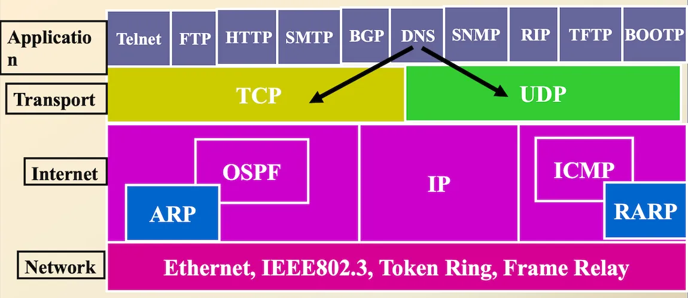
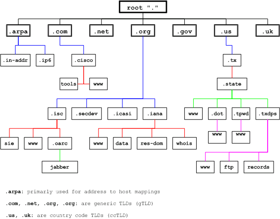

## Server Fundamentals

## DNS on Linux

---

### Name - IP Address Mapping

- With DHCP we found a way to configure our TCP/IP information automatically.
- TCP/IP protocols use the IP address, which uniquely identifies how a host is connected to the Internet. 
- But, people prefer to use names instead of numeric addresses. Therefore, we need a system that can map a name to an address or an address to a name.

---

### Naming Resolution

- In today’s networks, we assign logical addresses, such as with IP addressing. 
- These addresses are hard to remember, especially it is more complicated with IPv6. 
- We need some form of naming service that will allow us to translate logical names (which are easier to remember), into logical addresses. 
- The most common naming service is Domain Name System, or **DNS**.

---

### Naming Resolution

- **DNS** provides a mapping from names to resources of several types.
- **DNS** is one of the most important systems in the Internet infrastructure. Application like web, email, etc., depends heavily on this crucial service. 

 

---

### A little History of the Internet

- [ARPANET (Advanced Research Projects Agency Network)](https://en.wikipedia.org/wiki/ARPANET) was the first wide-area [packet-switched network](https://en.wikipedia.org/wiki/Packet-switched_network) with distributed control and one of the first computer networks to implement the [TCP/IP](https://en.wikipedia.org/wiki/TCP/IP) protocol suite, the technical foundation of the [Internet](https://en.wikipedia.org/wiki/Internet). 
- Initial four hosts: The initial ARPANET configuration linked [UCLA](https://en.wikipedia.org/wiki/UCLA), [ARC](https://en.wikipedia.org/wiki/Augmentation_Research_Center), [UCSB](https://en.wikipedia.org/wiki/UCSB), and the [University of Utah School of Computing](https://en.wikipedia.org/wiki/University_of_Utah_School_of_Computing).
- Applications: [TELNET](https://en.wikipedia.org/wiki/TELNET) for remote time-sharing access and [File Transfer Protocol](https://en.wikipedia.org/wiki/File_Transfer_Protocol) (FTP), the latter used to enable rudimentary electronic mail, were developed and eventually ported to run over the TCP/IP protocol suite. In the 1980s, FTP for email was replaced by the [Simple Mail Transfer Protocol](https://en.wikipedia.org/wiki/Simple_Mail_Transfer_Protocol) and, later, [POP](https://en.wikipedia.org/wiki/Post_Office_Protocol) and [IMAP](https://en.wikipedia.org/wiki/IMAP).

Source: https://en.wikipedia.org/wiki/ARPANET

---

### The `hosts` File

- Simple text file that associates IP addresses with hostnames.
- Acting as a local DNS override for quick lookups or blocking sites.
- In Linux/macOS: `/etc/hosts`
- In Windows: `C:\Windows\System32\drivers\etc\hosts`
- Requires administrator/root privileges to edit.
- Entry syntax: `IP_Address Hostname` (e.g., `127.0.0.1 localhost`)
- Now if I want to contact a host I can use:
  - Its IP address OR
  - Its FQDN (Fully Qualified Domain Name) OR
  - Its hostname or alias

---

### The `hosts` File Activity

- Go to your hosts file and examine your static mappings.
- Do you have a static mapping for any other PC in this room?
- Ping a site on the Internet by FQDN to find it’s IP (SAIT will not allow to ping outside). 
- Create a static mapping using an Alias name for the  printer your hosts file and ping it by your Alias name .

---

### DNS - Domain Name System/Service

- An Internet service that translates Fully Qualified Domain Names (FQDN) into IP addresses. 
- A set of protocols and services on a TCP/IP network which allows users of the network to utilize hierarchical user-friendly names when looking for other hosts instead of having to remember and use their IP addresses. 

---

### DNS and TCP/IP

- DNS can use either UDP or TCP both are based on standard port # 53
- Uses two different packet types: Query and Response 

 

---

### DNS Names

- Hierarchical
- Case Insensitive
- Maximum Length of 255 octets (bytes),  **limited to 253 ASCII characters in text form**
- Made up of labels
  - Each label within the FQDN is limited to **63 characters/octets**
  - Case insensitive
- Fully Qualified (FQDN) - includes all labels and is globally unique
  - Example: hostname+domain_name www.sait.ca
- Relative DNS name - must have local domain information appended

---

### Domain Name Space

- A distributed database holding the alphanumeric names and IP addresses

 

---

### Activity

- Determine how many root (.) DNS servers exist on the Internet
- How much does it cost to register a `.com` domain?
- How much does it cost to register a `.ca` domain?
- How much does it cost to register a `.ai` domain?
- How much does it cost to register a `.xyz` domain?
- How to register/buy a domain?

---

### Who Can Register a Domain

- Internet Assigned Numbers Authority (IANA) is responsible for management of protocol parameters, Internet number resources and domain names.
- Internet Corporation for Assigned Names and Numbers (ICANN) performs these function on behalf of global Internet community. 
- Domain name registration is done by a “REGISTRAR”; a commercial entity accredited by (ICANN)

---

Credit: https://en.wikipedia.org/wiki/Domain_Name_System

---

### DNS Zones

- A DNS zone is a portion of the DNS namespace that is managed by a specific organization or administrator.
- A DNS zone starts at a domain within the tree and can also extend down into subdomains so that multiple subdomains can be managed by one entity.
- A zone file is a plain text file stored in a DNS server that contains an actual representation of the zone and contains all the records for every domain within the zone. Zone files must always start with a [Start of Authority (SOA) record](https://www.cloudflare.com/learning/dns/dns-records/dns-soa-record/), which contains important information including contact information for the zone administrator.

Source: [What is a DNS zone?](https://www.cloudflare.com/en-ca/learning/dns/glossary/dns-zone/)

---

### DNS Domains

- Domain  - A domain is also part of the name space 
  - A node in the domain name space and all of the nodes below it.
  - Contain both hosts and other domains

 

---

### Authority and Delegation

- Domain delegation gives an organization authority for a domain. 
- Having authority for a domain means that the organization's network administrator is responsible for maintaining the DNS database of hostname and address information for that domain. 
- An organization responsible for a domain may divide it into subdomains to decentralize administration.
- The `ca.` domain is broken into the various provinces, each having their own subdomain. One of the subdomains of the `ab.ca` domain is `sait`.
- The sait administrators could subdivide the `sait.ab.ca` domain in other subdomaina ex: `its.sait.ab.ca`, `sd.sait.ab.ca`, `iss.sait.ab.ca`, etc.
- It is preferable to have one name server with the zone file for each subdomain.

---

### Name Servers

- Purpose of name server is to answer “DNS” questions
- The question is present in both the query and the response, and should be identical.
- The answer consists of the resource records that answer the question. 

- Different types of Name servers
  - Authoritative servers
  - Master (Primary)
  - Slave (Secondary)
  - Caching Server
    - A recursive server
    - Also caching forwarders 

---

### DNS Packets

 

---

### Authoritative Name Servers

- Provides authoritative answers for one or more zones  - it holds the zone file for a given zone
- Master or Primary server normally loads data from its own Zone File 
  - One master but can have multiple slave server

- Slave server normally replicates the data from a master server via “zone transfer”   

---

### Recursive Name Servers

- Do the actual lookup of DNS servers based on the question asked by the client
- Answers are obtained from authoritative servers 
- But, answers forwarded to the client is marked as “Non-Authoritative”
- Answers are stored for future reference in cache

---

### Delegation

- Administrators can create subdomains to group hosts
  - According to geography, organizational affiliation or any other criterion
- An administrator of a domain can delegate responsibility for managing a subdomain to someone else
  - But this isn’t required
- The parent domain retains links to the delegated subdomain
  - The parent domain “remembers” who it delegated the subdomain to

---

### Resolver

- Client software that queries name servers
  - Accept queries from programs
  - Query name server
  - Interpret response
  - Return values to program
- Some resolvers will also cache retrieved values 
- In Windows: `ipconfig /displaydns`

---

### Basic DNS Resolution

1. The user types `www.example.com` in the browser's URL input. But the browser does not know the IP address of `www.exmaple.com`
2. The browser sends DNS query packet to a configured DNS resolver.
3. The DNS resolver returns an answer with IP address for `www.example.com`.
4. The browser use the IP address to access `www.example.com`

 

---

---

### Resources

- https://en.wikipedia.org/wiki/ARPANET
- https://hacklido.com/blog/562-what-is-a-domain-name-server-dns-how-does-it-work
- https://www.cloudflare.com/en-ca/learning/dns/glossary/dns-zone/