## Server Fundamentals

## Introduction to

## Linux Server Administration

---

### Text Editors: Nano & Vim

- We have learned about how to create and view text files (and other types of files) by using `touch`, `cat`, `more`, and `less`.
- We use **Nano** and **Vim** (**V**i-**IM**proved) to edit text files.
- **Vim** (or at least a minimal version of **vi**) is pre-installed on virtually all Linux distributions to comply with [POSIX](https://en.wikipedia.org/wiki/POSIX) standards, making it the most reliably available command-line text editor.
- **Nano**, while user-friendly and often the default for certain tools (like `crontab -e` or `visudo` on many systems), is also pre-installed on most modern distributions but may need to be manually installed on minimal or server setups.

---

### Nano

- **Nano** is a simple text editor with an easy-to-use interface.
- Notice the list of keyboard shortcuts across the bottom of the screen, including the Exit command.

 

---

### Vim

 

 

---

### Vim – Vi Improved

- **Vi** is more powerful than Nano but more complex to use.
- It uses different **modes** (insert, edit, remove) for moving the cursor and manipulating text.
- To exit: use `:`, then `q`, then press **Enter**.
- [neovim: Vim-fork focused on extensibility and usability](https://neovim.io/)


---

### Three Reasons to Learn vi/Vim

- **vi** is almost always available. If we have a system with no graphical interface, such as a remote server or a local system with a broken X configuration, this can be a lifesaver. **nano**, while increasingly popular, is still not universal. **POSIX**, a standard for program compatibility on Unix systems, requires that **vi** be present.
- **vi** is lightweight and fast. For many tasks, it’s easier to bring up **vi** than it is to find the graphical text editor in the menus and wait for its multiple megabytes to load. In addition, vi is designed for typing speed. As we will see, a skilled **vi** user never has to lift their fingers from the keyboard while editing.
- We don’t want other Linux and Unix users to think we are cowards.

---

### How Does Linux Identify Objects

- Linux uses specific identifiers to manage the operating system via the command line:

  - **UID** – User Identifier

  - **GID** – Group Identifier

  - **PID** – Process Identifier

  - **Inode** – File Identifier

- Using the command line, we can manage aspects of the operating system using these identifiers.

---

### Users in Linux

- Users are individuals who log in to access files and applications.
- Each user has a unique **username**, **password** and Set of associated **user rights/permissions** (which determine their system access).
- Linux users may optionally have a **home directory** (`/home/username`, `~`, or `$HOME`)
- Management follows the **principle of least privilege**: users only receive the rights needed for their specific work to protect the system and ensure efficiency.

---

### Users in Linux

- User management is based on **a principle of least privilege**:

  - Users are only given the rights and permissions they need to perform only their work

  - Helps to protect the system from accidental or malicious changes

  - Helps to ensure that resources are used efficiently

- Every user has their own unique identifier (**UID**) and each user must also belong to one or more groups; these groups also have unique identifiers (**GID**)

---

### User Account Types

- **Root (Superuser):** Has special privileges and is able to perform all tasks on the system, including creating and modifying other user accounts, installing software, and changing system-wide settings (typically used only by system administrators and other trusted users)
- **Standard (Regular):** Everyday users who log in to the system to perform tasks such as creating and editing files, running applications, and managing their settings. Limited access to perform their work tasks.

---

### Accessing Root Privilege Commands

- Standard users can access root-level commands in two ways:

  - **`sudo`:** This command, accompanied by the appropriate password and membership in the `wheel` group (RHEL) or `sudo` group (Ubuntu/Debian) will allow a standard user to execute a root-level command once.

  - **`su`:** This command, by default, will switch you to the superuser account, so that you can execute multiple commands as the superuser. It can also be used with a username to switch into that account. The `exit` command will bring you back to your regular account. Or use **`sudo -i`** to switch to superuser account.


---

### Groups in Linux

- A group is a collection of users used to define privileges for multiple people at once.
- Users can belong to multiple groups, inheriting permissions from each based on their role.

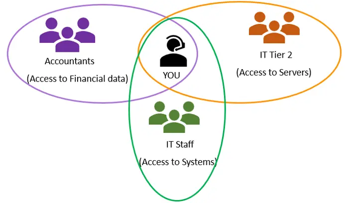

---

### Local User Account Databases

- **`/etc/passwd`:** A readable ASCII file listing user accounts. Many of the accounts listed are neither the root user or one of the regular users. This is because Linux also uses accounts for system-services.
- **`/etc/group`:** A database describing groups and their members.
- **`/etc/shadow`:** A secure file, readable only by root, that stores encrypted passwords.

---

### Local User Account Databases

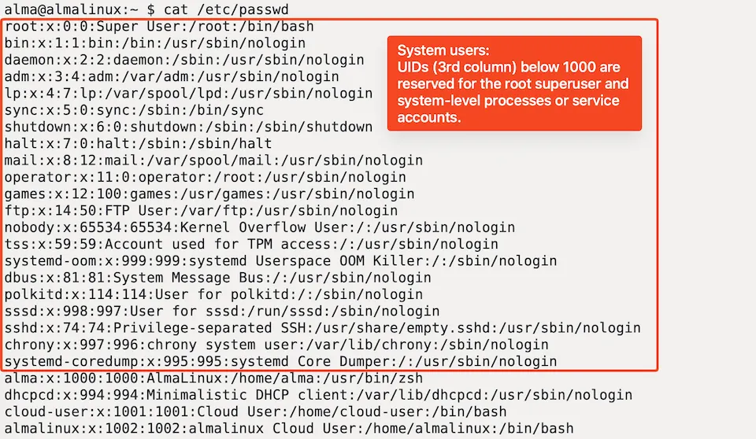

---

### `/etc/passwd` Field Breakdown

- Each line entry contains seven fields separated by colons: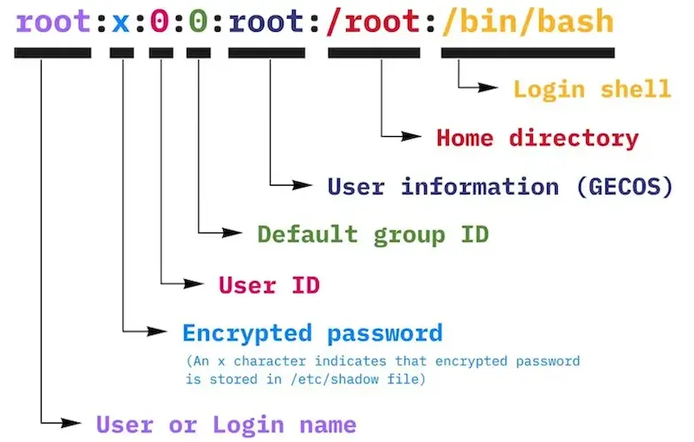

Credit: [`/etc/passwd` group shadow file](https://infosecwriteups.com/what-is-etc-passwd-group-shadow-file-in-linux-bd7b28f353f3)

---

### `/etc/group` Field Breakdown

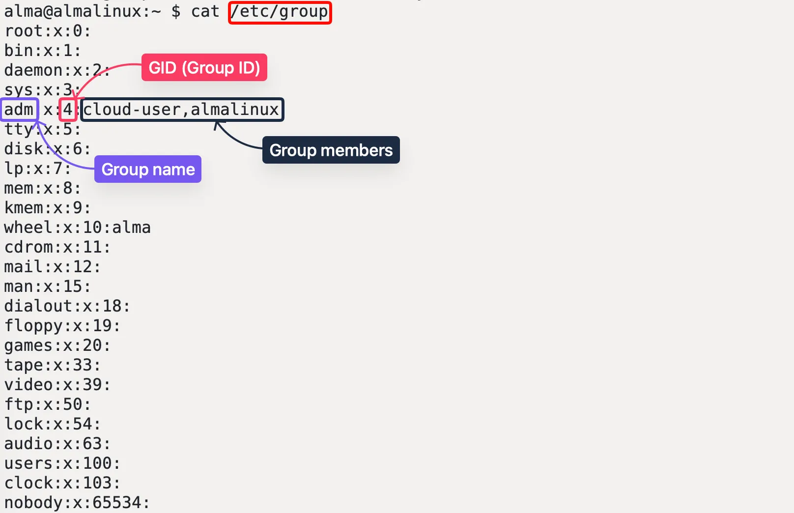

---

### `/etc/shadow` Field Breakdown

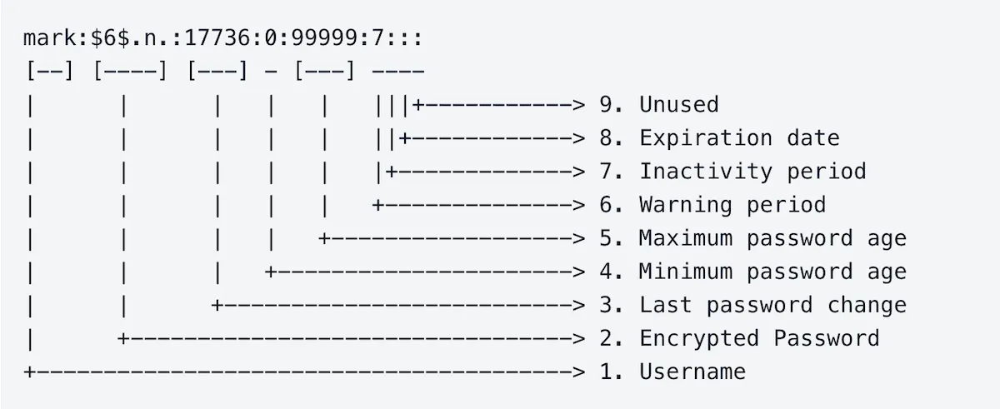 

Credit: https://linuxize.com/post/etc-shadow-file/

---

### Managing User Accounts

- **Root privileges** are required for these commands:

  - **`useradd USERNAME [-p PASSWORD]`:** Creates a new user.

  - **`useradd -m USERNAME`:** Creates a new user with a home directory (if not automatic).

  - **`useradd -m -d HOME_DIR USERNAME`:** Creates  a new user with a specified home directory.

  - **`passwd USERNAME`:** Creates or changes a password.

  - **`userdel USERNAME`:** Permanently removes an account (does not remove the home directory automatically).

  - **`userdel -r USERNAME`:** Permanently removes an account and the home directory.


---

### Managing Groups

- **Root privileges** are required for these commands:
  - **`groupadd GROUPNAME`:** Creates a new group.
  - **`usermod -aG GROUPNAME USERNAME`:** Appends a user to a group.
  - **`groupmems -g GROUPNAME -l`:** Lists group members.
  - **`gpasswd`:** Manages group users and administrators. [More on gpasswd](https://man7.org/linux/man-pages/man1/gpasswd.1.html)


---

### User Defaults

- **`/etc/default/useradd`:** When we decide to add a user from the command line, there are certain choices that are made by default. This file allows the root user to specify:
  - What default group the user should belong to
  - Where the user’s home directory should be created
  - What shell to use.


---

### User Profiles

- **`/etc/skel`:** A directory that contains "skeleton" files (like `.bashrc` and `.bash_profile`) copied to a new user's home directory to ensure uniform initial settings.
- **`skel`** is derived from **skeleton** because it contains the basic structure of the user’s home directory
- The **`/etc/skel`** directory contains files and directories that are automatically copied over to a new user’s home directory when it is created using the **`useradd`** command.
- This will ensure that all the users get the same initial settings and environment.

[Understanding Shell Initialization Files and User Profiles in Linux](https://www.tecmint.com/understanding-shell-initialization-files-and-user-profiles-linux/)

---

### Adding a Temporary User

- You can also create a temporary user by adding an expiry date to the **`adduser`** command.

- The chage command allows an administrator to make changes to a user’s password properties, such as setting or changing expiration dates, how many days a password can be used before changing, etc.

```text
# Add a user studneta that expires on 2026-01-05
$ sudo useradd -e 2026-01-05 studenta -p SuperSecret!

$ sudo chage -l studenta
Last password change.     : Jan 03, 2026
Password expires          : never
Password inactive					: never
Account expires						: Jan 05, 2026
Minimum number of days between password change		: 0
Maximum number of days between password change		: 99999
Number of days of warning before password expires	: 7
```

---

### Understanding File Permissions

- When you execute the command ``ls -l`` in your Linux terminal, it returns a list of files and directories with their respective permissions, among other details.
- The first column represents the file permissions, which we will focus on in this section. The rest of the columns provide additional information such as the number of links, owner, group, size, timestamp, and filename.

```text
$ ls -l

drwxr-xr-x. 4 root root    68 Jun 13 20:25 work
-rw-r--r--. 1 root root  4017 Feb 24  2022 vimrc
```

---

### Permission Settings

 

Credit: https://blog.coderco.io/p/linux-series-ep1-understanding-and

---

### Octal Representation

- In Linux, permissions can be represented in an octal format which translates the combination of read (**r**), write (**w**), and execute (**x**) permissions into a single octal digit. This is done by assigning a numeric value to each type of permission:

  - Read (**r**) = 4

  - Write (**w**) = 2

  - Execute (**x**) = 1

  - No Permission (**-**) = 0

- The sum of these values for a specific entity (user, group, others) forms an octal digit. This makes it easier to set or change permissions.

---

### Octal Representation

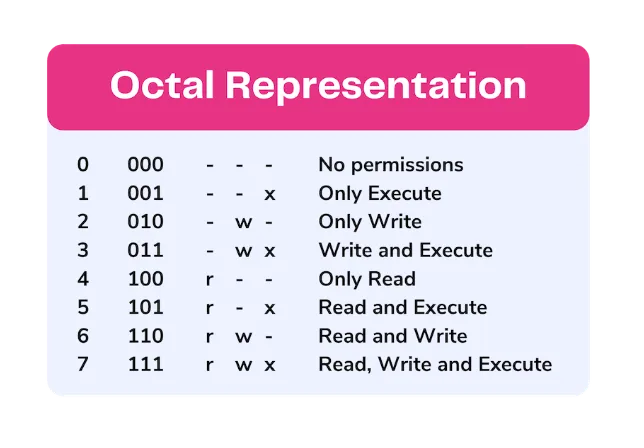 

Credit: https://blog.coderco.io/p/linux-series-ep1-understanding-and

---

### File Permissions Overview

 

Credit: https://study-notes.org/linux-file-permissions.html

---

### Changing File Permissions

- **`chmod`** stands for 'change mode'. It is used to alter the access permissions of file system objects. It supports both octal and symbolic modes. Octal mode: `chmod 640 sample.txt`

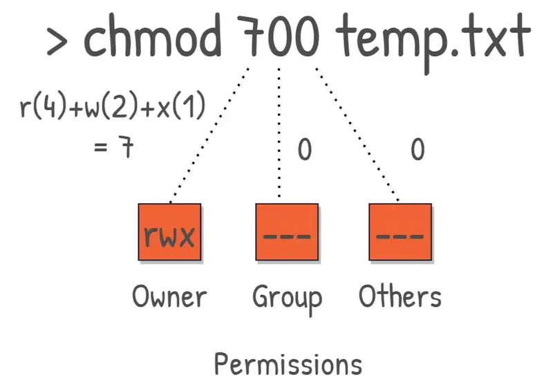 

---

### Changing File Permissions

- **`chmod`** symbolic mode. Use `=` to set permissions:

  `chmod u=rw,g=r,o= sample.txt`

  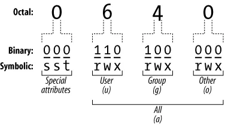 

- **`chmod`** symbolic mode. Use `+` and `-` to change permissions:

  `chmod g+w,o-r sample.txt`

   

---

### Modifying Ownership

- The **`chown`** command, which stands for 'change owner', changes the owner of a file or a directory.
- **`chown USER:GROUP FILE`**: Change both the owner and the group of a file.
- **`chown :GROUP FILE`**: Change the owning group of a file.
- **`chgrp [OPTIONS] GROUP FILE..`**: Changes the group ownership.

---

### `chmod` vs. `chown`

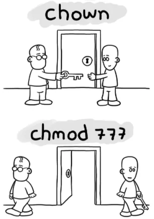 

Credit: https://blog.coderco.io/p/linux-series-ep1-understanding-and

---

### Definitions of Process

- **Process:** An instance of an executable currently being executed. It is a running instance of a program. In simple words - **A process in Linux is nothing but a running application, command, or any other program**(*any command that will start a new task*).
- **Daemon:** A non-interactive process running in the background.
- **Service:** Another name for a daemon.

---

### Processes vs. Jobs

- **Process:** An operating system concept (an instance of an executing program). Owned and controlled by the **kernel**.
- **Job:** A **shell concept** used for managing one or more processes launched from that specific terminal session. Owned and controlled by the **user**.
- Use the **`jobs`** command to see user-owned processes currently running.

---

### Monitoring Processes - ps

- The **`ps`** (process status) command provides a static snapshot of active processes at the moment of execution.
- The `ps auxf` syntax merges four key options:
  - `a`: Displays processes from all users, not just the current user.
  - `u`: Formats output with user-oriented details like CPU and memory usage.
  - `x`: Includes processes without an attached terminal, such as daemons and background services.
  - `f` option stands for full-format listing, which includes additional details about each process.

Read [Using the ps aux Command in Linux](https://hostman.com/tutorials/using-the-ps-aux-command-in-linux/)

---

### Monitoring Processes - top

- **`top`** is a command-line utility included with most versions of Linux.

 

---

### Monitoring Processes - top

- **`top`** provides a dynamic real-time view of a running system.

  - **`PID`:** Process ID.

  - **`USER`:** Process owner.

  - **`PR/NI`:** Process priority and nice value.

  - **`VIRT/RES/SHR`:** Virtual, resident, and shared memory usage.

  - **`S`:** Process status.

  - **`%CPU`:** CPU usage percentage.

  - **`%MEM`:** Memory usage percentage.

  - **`TIME+`:** Total CPU time used.

  - **`COMMAND`:** The command that started the process. 

---

### Monitoring Processes - btop

- [btop](https://github.com/aristocratos/btop): a modern, feature-rich **command-line system resource monitor** for Linux and other operating systems.

 

---

### Terminate a Process

- Obtain the process ID of the process that you want to terminate using `ps aux`.
- Use `kill [signal-number] <PID>` to terminate the process.

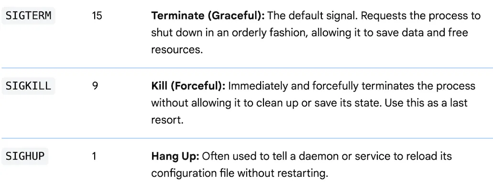 

---

### Foreground Process

- A foreground process is any command or program that occupies the terminal's input and output until it completes or is interrupted. When a process runs in the foreground, it prevents the user from entering further commands into that specific shell instance.

  - **Terminal Control:** The process takes control of the keyboard (standard input) and displays its output directly to the screen.

  - **Execution Limit:** Only one foreground process can run per terminal session at a time.

  - **User Interaction:** The user can interact with the process directly while it is active.

  - **Termination/Suspension:** Can typically be interrupted using `Ctrl+C` or suspended (moved to background) using `Ctrl+Z`.

---

### Background Process

- A background process runs independently of the shell's main thread, allowing the terminal to remain available for other commands while the task executes.
  - **Asynchronous:** Does not block the shell; the user retains immediate control of the command line.
  - **Decoupled Input:** Does not read from the keyboard, preventing interference with foreground tasks.
  - **Job Management:** Identified by a unique Job ID and can be monitored using the `jobs` command.
  - **State Control:** Started by adding `&` to a command or moved from a suspended state using `bg`.

---

### Process Switching

- Moving processes between the foreground and background allows you to manage long-running tasks without losing access to your terminal prompt.

  - **Suspend (`Ctrl+Z`):** Pauses a running foreground process and moves it to a "stopped" state in the background.
- **Background (`bg`):** Resumes a suspended process in the background.
  - **Foreground (`fg`):** Brings a background or suspended process back to the foreground to regain interactive control.
- **Immediate Background (`&`):** Appending an ampersand to a command starts it in the background immediately (e.g., `sleep 100 &`).

---

### systemd

- **systemd** is a Linux initialization system and service manager that includes features like on-demand starting of daemons, mount and automount point maintenance, snapshot support, and processes tracking using Linux control groups. 
- It provides a logging daemon and other tools and utilities to help with common system administration tasks.
- It starts early in the boot process and handles software dependencies and start orders.
- **systemd** will ensure that all dependencies are satisfied. This means if a service relies on another piece of software, systemd will make sure that software is also in the list to start, in the correct order.

---

### Interacting with systemd

- Use the **`systemctl`** command to manage daemons:

  - **`systemctl start/stop <SERVICE>`:** Starts or stops a service for the current session.

  - **`systemctl enable/disable <SERVICE>`:** Sets whether a service starts automatically on boot.

  - **`systemctl status <SERVICE>`:** Displays if and how a service is operating.

- **Analogy:** Think of the Linux Kernel as a restaurant manager. **Processes** are the individual tasks (cooking, cleaning), **Daemons** are the background staff you don't see (dishwashers), and **systemd** is the master schedule ensuring that the oven is preheated before the chef starts cooking the pizza.

---

### `systemctl`

- **`systemctl status firewalld.service`** shows the status of `firewalld`

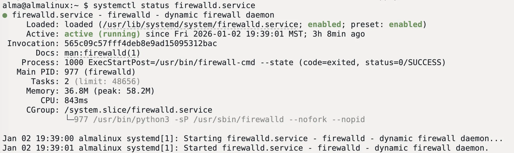 

---

### `systemctl`

- **`systemctl list-units --type=service`** lists all active services.:

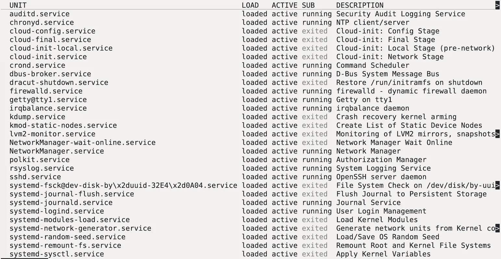 

---

#### System Information

Two vital sources for system information and troubleshooting:

- **`/var/log`:** This directory contains multiple entries (e.g., `/var/log/messages`) for logs from different services that the system is offering. Often, looking at logs can give an administrator a very good idea of what the root of a problem may be.
- **`/proc`:** A directory holding information about every running process and hardware (e.g., `/proc/cpuinfo`).

---

### System Log Files

 

---

### `/proc`

- Linux **`/proc`** is a virtual filesystem (**procfs**) existing only in memory, offering dynamic access to kernel data and processes. It bridges kernel and user space, enabling tools like **`ps`** and **`top`** to fetch real-time system info.

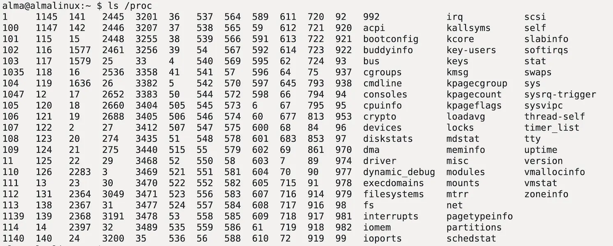 

---

### `/proc/cpuinfo`

- **`/proc/cpuinfo`** is a virtual file that contains CPU information.

 

---

### Network Management - `ip`

- `ifconfig` and `route` are traditional tools for managing IPs in Linux, but are deprecated now.
- The `ip` utility is the modern replacement for `ifconfig`, used to manage network interfaces, IP addresses, and routing tables. It is part of the **iproute2** package and interacts directly with the Linux kernel's networking stack.

- Examples

  - **Show all IP addresses:** `ip addr show` (or `ip a`)

  - **Bring an interface up/down:** `ip link set eth0 up`

  - **Add a temporary IP address:** `ip addr add 192.168.1.50/24 dev eth0`

  - **View the routing table:** `ip route show`

---

### Network Management - `nmcli`

- The `nmcli` (NetworkManager Command-Line Interface) utility is used to control NetworkManager and report network status. It is designed to manage "connections" (logical configurations) and "devices" (physical interfaces).

- Examples

  - **Show all network connections:** `nmcli con show`

  - **Check status of network devices:** `nmcli dev status`

  - **Bring a connection up or down:** `nmcli con up id "MyHomeEthernet"`

  - **Modify a connection to static IP:** `nmcli con mod "eth0" ipv4.addresses 192.168.1.10/24 ipv4.method manual`

---

### Network Management - `nmtui`

- **`nmtui`** (NetworkManager Text User Interface) is a terminal-based tool for configuring networking via a simple, menu-driven interface.

- Key Features
  - **Visual Navigation:** Use arrow keys and menus instead of complex commands.
  - **Connection Management:** Easily add, edit, or delete Ethernet and Wi-Fi profiles.
  - **Hostname Setup:** Quickly set or change the system’s static hostname.
  - **Toggle Connections:** Activate or deactivate network interfaces from an interactive list.


---

### `df` - Disk Filesystem

- `df` can tell you what filesystem a file is part of, used and unused space, and where to find the file systems.
- The `df` command primarily checks disk usage on a mounted filesystem. If you don't include a file name, the output shows the space available on all currently mounted filesystems.
- Disk space is shown in 1K blocks by default. Lists of long numbers (as shown above) can be difficult to parse. If you want to run `df` in its human-readable format, use the `--human-readable` (`-h` for short) option.

```text
# Use `df` against a file
[hong@rhel10 ~]$ df hello.txt
Filesystem            1K-blocks   Used Available Use% Mounted on
/dev/mapper/rhel-home  42442752 684876  41757876   2% /home
```

---

### `df` - Disk Filesystem

```text
# Use `df` to check disk usage on a mounted filesystem
[hong@rhel10 ~]$ df
Filesystem            1K-blocks    Used Available Use% Mounted on
devtmpfs                   4096       0      4096   0% /dev
tmpfs                   8056084       0   8056084   0% /dev/shm
tmpfs                   3222436    8796   3213640   1% /run
efivarfs                    256      56       196  23% /sys/firmware/efi/efivars
/dev/mapper/rhel-root  73334784 3201848  70132936   5% /
/dev/sda2                983040  228652    754388  24% /boot
/dev/sda1                613160    7200    605960   2% /boot/efi
/dev/mapper/rhel-home  42442752  684876  41757876   2% /home
tmpfs                   1611216       0   1611216   0% /run/user/1000
```

```text
# Make the output `--human-readable`
[hong@rhel10 ~]$ df -h
Filesystem             Size  Used Avail Use% Mounted on
devtmpfs               4.0M     0  4.0M   0% /dev
tmpfs                  7.7G     0  7.7G   0% /dev/shm
tmpfs                  3.1G  8.6M  3.1G   1% /run
efivarfs               256K   56K  196K  23% /sys/firmware/efi/efivars
/dev/mapper/rhel-root   70G  3.1G   67G   5% /
/dev/sda2              960M  224M  737M  24% /boot
/dev/sda1              599M  7.1M  592M   2% /boot/efi
/dev/mapper/rhel-home   41G  669M   40G   2% /home
tmpfs                  1.6G     0  1.6G   0% /run/user/1000
```

---

### inodes

- By definition, an inode is an index node. It serves as a unique identifier for a specific piece of metadata on a given filesystem, **except for the name of the file**.
- Each piece of metadata describes what we think of as a file. Size, permissions, owners and groups, date and timestamps, and paths to where the data is stored.
- The name of the file is stored in the File Allocation table, which tracks the names and inodes of files.

```text
[hong@rhel10 ~]$ ls -l -i  # The 1st column is inode number
total 4
50337026 drwxr-xr-x. 2 alma alma    6 Jan 10 16:37 cpsy204
    4976 drwxr-xr-x. 2 alma alma    6 Jan 10 16:37 cpsy204.backup
   14381 -rw-r--r--. 1 alma alma    0 Jan 10 16:37 hello.txt
34457142 drwxr-xr-x. 2 alma alma 4096 Nov 24 19:11 scripts
  401718 -rw-r--r--. 1 alma alma    0 Jan 10 16:38 world.txt
```

---

### inodes

- When Linux runs out of inodes, it can't create new files or directories, even with free disk space, leading to application crashes, failed processes, data loss, and errors like "No space left on device" for actions needing new files (logs, emails, temporary files).
- Every file and directory uses one inode, so a filesystem can become full of inodes from many small files (logs, sessions) before running out of actual data space.
- You can use `df -i` to see number of inodes on a disk or a partition.

```text
[hong@rhel10 ~]$ df -h -i /dev/sda2
Filesystem     Inodes IUsed IFree IUse% Mounted on
/dev/sda2        512K    22  512K    1% /boot
```

---

### Links - Hard Link

- inodes has everything about a file except for the name. Every file on the Linux filesystem starts with a single hard link. The *link* is between the filename and the actual data stored on the filesystem.
- Use `ln {filename1} {filename2}` to create a hard link between a file (filename 1) and a linked file (filename2).

- A hard link is an additional directory entry (filename) pointing to the same **inode** (physical data) on a disk.

  - **Synchronized:** Changes to content, permissions, or timestamps affect all links simultaneously.

  - **Redundancy:** Deleting one link doesn't lose the data; the file persists until the last link is removed.

  - **Constraints:** Works on **files only** (no directories). Must stay within the **same filesystem/partition**.

---

### Links - Hard Link

```text
[hong@rhel10 ~]$ ls
cpsy204  cpsy204.backup  hello.txt  scripts  world.txt

# Create another hard link to hello.txt file
[hong@rhel10 ~]$ ln hello.txt hello2.txt && ls
cpsy204  cpsy204.backup  hello.txt  hello2.txt	scripts  world.txt

# Use `ls -i` to verify that they share the same inode
[hong@rhel10 ~]$ ls -i hello.txt hello2.txt
14381 hello.txt  14381 hello2.txt
```

```text
# When changes are made to `hello.txt`,
# `hello2.txt` reflects those changes.
[hong@rhel10 ~]$ echo 'world' > hello.txt

[hong@rhel10 ~]$ cat hello.txt
world

[hong@rhel10 ~]$ cat hello2.txt
world

# `rm hello2.txt` will not remove `hello.txt`.
# Because there is still one link.
[hong@rhel10 ~]$ rm hello2.txt && ls
cpsy204  cpsy204.backup  hello.txt  scripts  world.txt
```

---

### Links - Soft/Symbolic Link

- By definition, a soft link is not a standard file, but a special file that points to an existing file.
- Commonly referred to as *symbolic links*, soft links link together non-regular and regular files.
- A Soft/Symbolic link uses almost no HDD space, and it uses it’s own unique inode number. If the original file/directory is deleted, you can have a broken link, or a link that points to a non-existent resource.
- Use `ln -s (file path you want to point to) (new file path)` to create a soft link between the original file and a linked file.

 

---

### Links - Soft/Symbolic Link

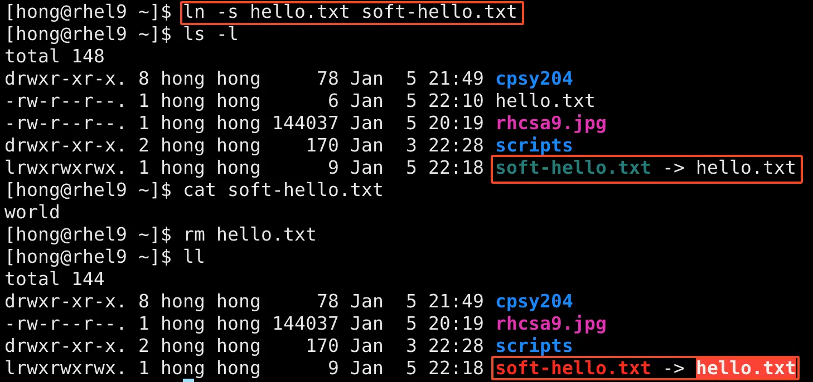 

---

### Sources

- https://infosecwriteups.com/what-is-etc-passwd-group-shadow-file-in-linux-bd7b28f353f3
- https://linuxize.com/post/etc-shadow-file/
- https://linuxize.com/post/how-to-create-users-in-linux-using-the-useradd-command/
- https://www.tecmint.com/understanding-shell-initialization-files-and-user-profiles-linux/
- [File permissions](https://blog.coderco.io/p/linux-series-ep1-understanding-and)
- https://study-notes.org/linux-file-permissions.html
- https://linuxize.com/post/linux-chown-command/

---

### Sources

- https://medium.com/@nakuldesai123/understanding-the-linux-processes-basic-e6900de2454b
- https://hostman.com/tutorials/using-the-ps-aux-command-in-linux/
- https://www.linuxfoundation.org/blog/blog/classic-sysadmin-how-to-kill-a-process-from-the-command-line
- https://docs.oracle.com/cd/E19253-01/817-0403/eoizf/index.html
- https://en.wikipedia.org/wiki/Systemd
- https://docs.kernel.org/filesystems/proc.html
- [RHEL Configuring and managing networking](https://docs.redhat.com/en/documentation/red_hat_enterprise_linux/10/html-single/configuring_and_managing_networking/index)