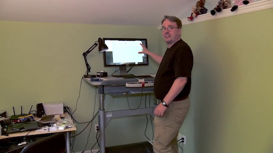
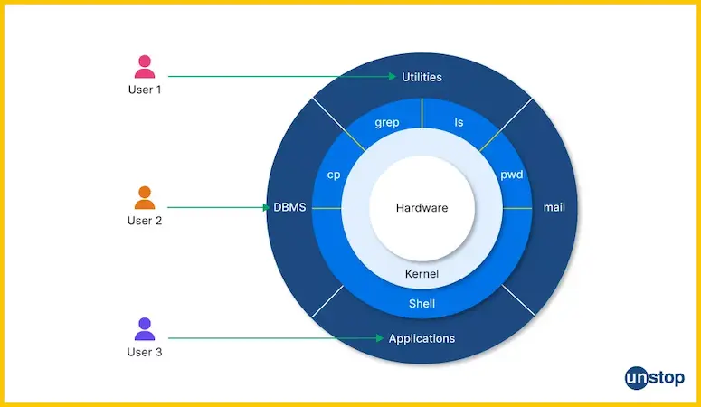
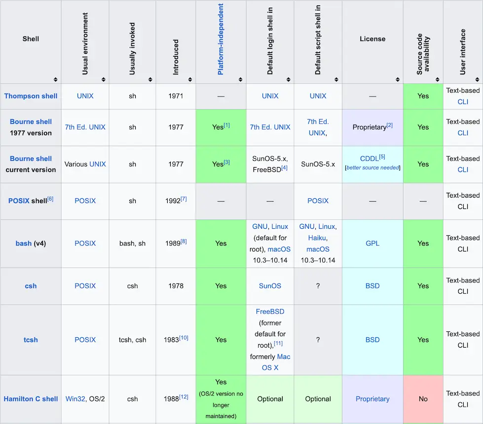
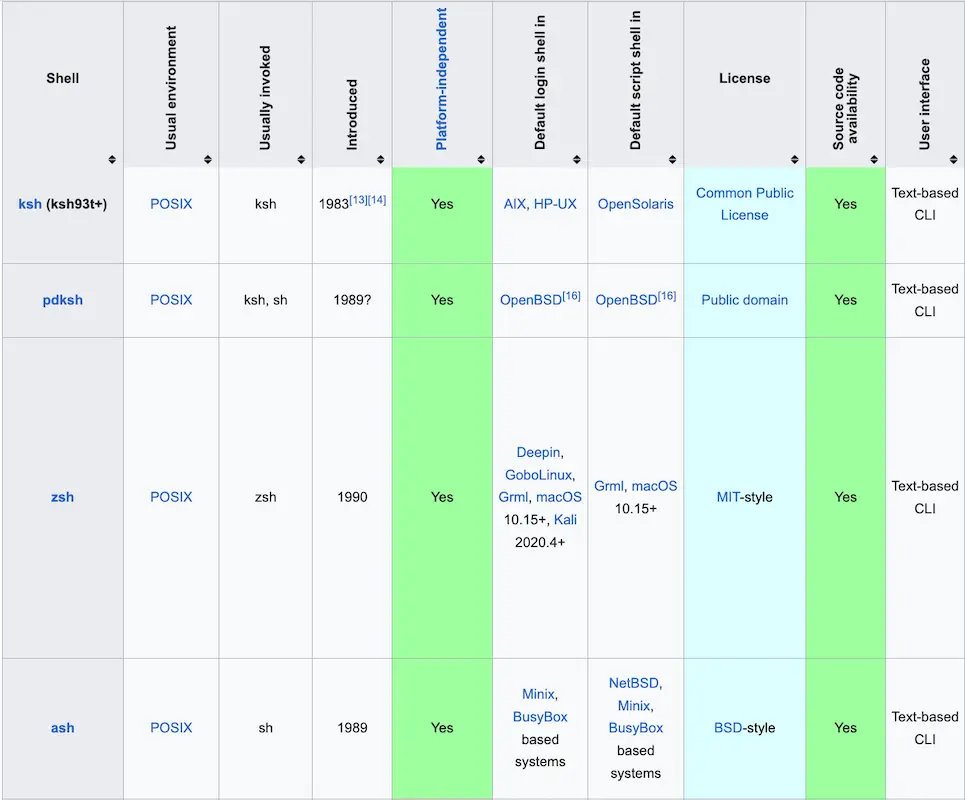
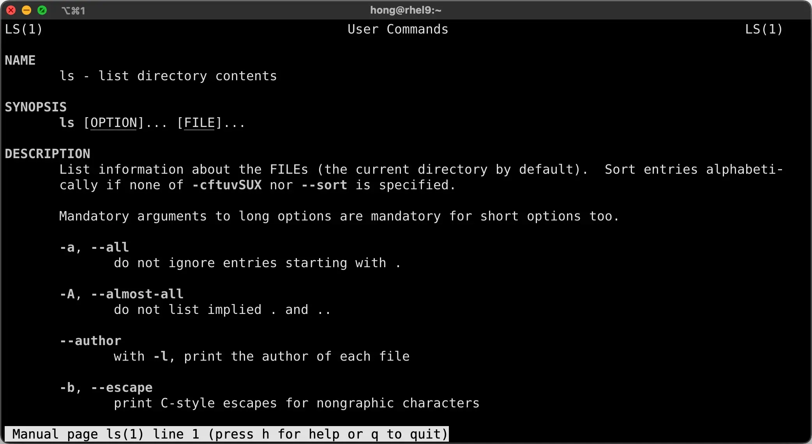
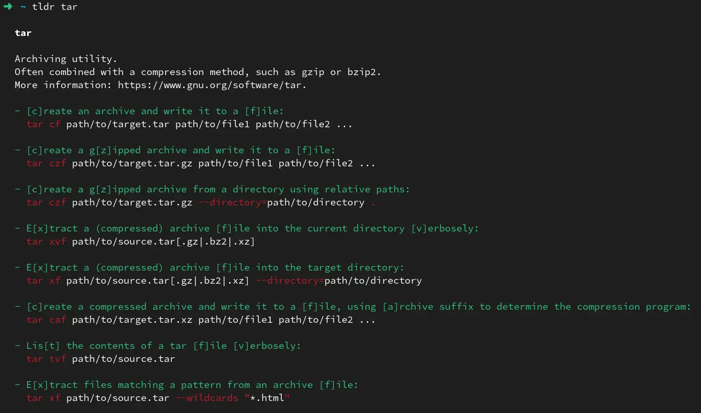
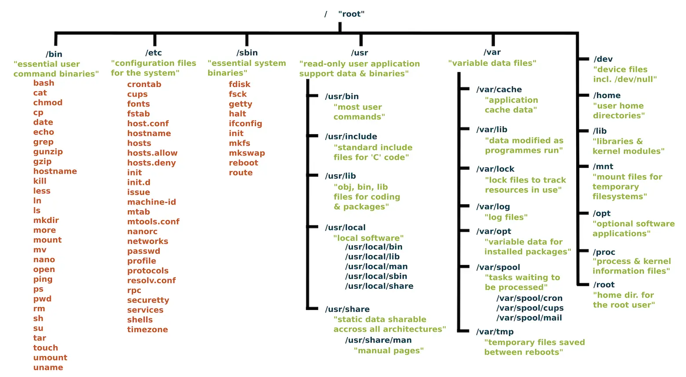
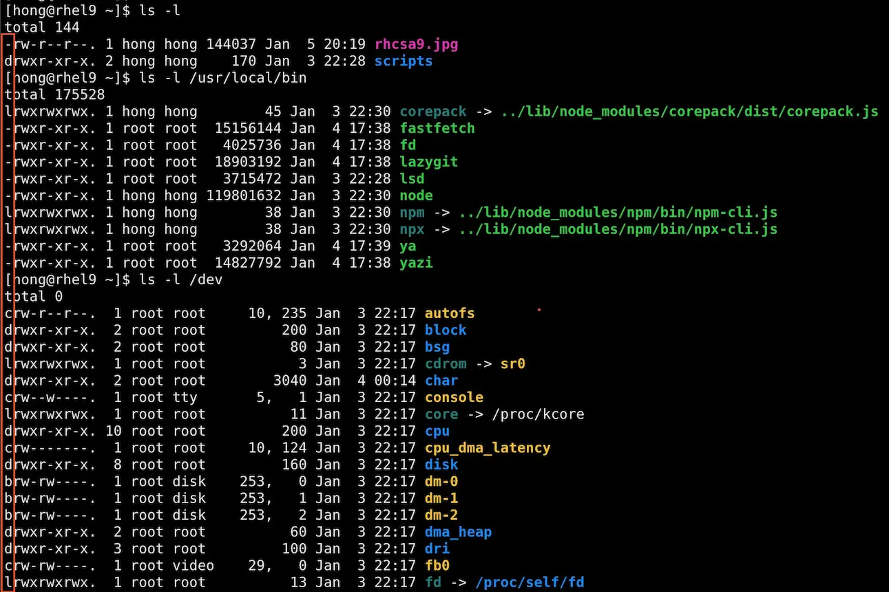

## Server Fundamentals

## Introduction to Linux

---

### What is Linux?

- Linux is a **free and open-source operating system** that serves as a cornerstone in various computing environments, such as:

  - **Servers:** Powering web servers, application servers, and database servers.

  - **Supercomputers:** Used in computational research and simulations.

  - **Mobile Devices:** Android OS is based on the Linux kernel.

---

### Key Features of Linux

- **Stability:** Reliable performance, even under heavy workloads.
- **Security:** Built-in permissions and a strong community-driven development model.
- **Flexibility and Customization:** Highly modular and configurable.
- **Community Support:** Regular updates and patches contributed by developers worldwide.

---

### History of Linux

- **Linux Kernel:** Developed by Linus Torvalds in 1991.
- **Open-source Movement:** Collaboratively maintained by a global community.

 

Credit: https://www.youtube.com/watch?v=jYUZAF3ePFE

---

### Open-Source

- Open-source software (OSS) is computer software that is released under a license in which the copyright holder grants users the rights to use, study, change, and distribute the software and its source code to anyone and for any purpose.

  Credit: https://en.wikipedia.org/wiki/Open-source_software

  - **Philosophy**: Collaboration, transparency, and community-driven innovation.
  - **Operating System Examples**: Linux (Ubuntu, Debian, Fedora), FreeBSD.

  - **Application Examples**: Firefox, LibreOffice, VLC Media Player.

---

### Closed-Source

- **Proprietary software**: Software whose source code is a closely guarded secret. Only the original authors or the company that owns the copyright can see or modify the code.

  - **Philosophy**: Profit-driven, controlled user experience, and vendor-backed stability.


  - **Operating System Examples**: Microsoft Windows, Apple macOS/iOS.


  - **Application Examples**: Microsoft Office, Adobe Photoshop, Spotify

---

### Are All Linux Distros Open-Sourced?

- While Linux is open-sourced, not all of its distributions are; as they may include closed-source components or add-ons. These closed-source components or add-ons can be additional software or drivers that are not publicly available. They are maintained by the Linux distribution provider or a third party.
- These are for profit companies that do not allow for the modification or redistribution of their code. For example, Red Hat Enterprise Linux (RHEL), which combines open-source components with proprietary support services.

---

### Open-Source vs. Closed-Source

 

---

### Open-Source vs. Closed-Source

 

---

### Why Use Linux?

- **Cost-Effectiveness:** Most distributions (distros) are free.

- **Customizability:**

  - Users can modify system behavior.

  - Users can [create their own distro](https://www.linuxfromscratch.org/) if they wish.

  - Even using an established distro, a user can still configure options in a wide variety of combinations.

- **Flexibility:** Install with or without a graphical interface. Suitable for client machines or servers.

- **Security:** Reduced vulnerabilities due to open-source transparency.
- **Performance:** Minimal resource overhead.

[NASA’s Mars Rovers use Linux. So technically, Linux is on Mars!](https://www.theverge.com/2021/2/19/22291324/linux-perseverance-mars-curiosity-ingenuity)

---

### Linux Distributions (Distros)

- **Definition:** a customized version of the Linux operating system.
- It combines the **Linux kernel** (the core of the OS) with a collection of software tools, utilities, and applications, along with a package management system.
- Each distro is designed for specific use cases, audiences, or preferences.


Credit: [https://www.reddit.com/r/DistroHopping](https://www.reddit.com/r/DistroHopping/comments/1hubt22/the_stories_behind_debian_red_hat_and_arch_names/)

---

### Key Components of a Linux Distro

1. **Linux Kernel**: The core part that manages hardware, processes, and system resources.
2. **GNU Tools**: Essential utilities for file management, text editing, and system configuration.
3. **Package Manager**: Handles software installation, updates, and removal (e.g., `apt`, `yum`, `dnf`, `pacman`).
4. **Default Software**: Varies between distros (e.g., desktop environments like GNOME or KDE).
5. **Customization**: Some distros include unique configurations or optimizations for specific tasks.

---

### Popular Distros

- **General-Purpose**:
  - **Ubuntu**: User-friendly, great for beginners.
  - **Fedora**: Focuses on cutting-edge technology.
  - **Debian**: Stable and reliable, ideal for servers.
- **Server-Oriented**:
  - **CentOS**: Popular in enterprise environments (now succeeded by AlmaLinux/Rocky Linux).
  - **Red Hat Enterprise Linux (RHEL)**: Enterprise-level features with paid support.
  - **Ubuntu Server**: Optimized for cloud and container environments.

- **Desktop-Focused:** [Linux Mint](https://linuxmint.com/) , [Pop!_OS](https://pop.system76.com/), [EndeavourOS](https://endeavouros.com/).

---

### Popular Distros

- **Specialized**:

  - **Kali Linux**: Built for penetration testing and cybersecurity.
  - **Arch Linux**: Highly customizable for advanced users.
  - **Raspberry Pi OS**: Tailored for Raspberry Pi hardware.
  - **openSUSE MicroOS**: Designed to host container workloads with automated administration & patching.

- **Lightweight**:

  - **Puppy Linux**: Designed for older or resource-constrained systems.
  - **Tiny Core Linux**: Minimal footprint, super lightweight.

---

### Why Are There So Many Distros?

- The open-source nature of Linux allows anyone to modify and distribute their own version, leading to a wide variety of distros tailored to different needs.

- **Fun Analogy**: Think of a Linux distro as a car:

  - **Kernel**: The engine, driving the whole thing.

  - **Tools & Utilities**: The steering wheel, pedals, and dashboard.

  - **Customizations**: Paint job, seat covers, and radio. Each distro has its own vibe!

---

### Red Hat Enterprise Linux (RHEL)

- **Stability:** Designed for critical environments.
- **Support:** Includes enterprise-grade support services.
- **Security:** Advanced tools like SELinux and patch management.
- **Scalability:** Handles high workloads efficiently.
- **Integration:** Optimized for cloud and container environments.

---

### The Shell

- Linux **shell** refers to the **interface/interpreter program** that takes human commands and parses them for the OS to execute. There are two primary types of shells, i.e., Command-line (CLI) and Graphical User Interface (GUI).

 

Credit: https://unstop.com/blog/linux-shell

---

### **Advantages Of Linux Shell**

- The Linux shell offers several advantages over the graphical user interface (GUIs):

  - **Efficiency:** Tasks can be completed more quickly, as the Linux shell requires fewer actions (clicks, menus) compared to a GUI.

  - **Flexibility:** Users have greater control over the system and can customize or automate tasks using shell scripts within the current shell environment.

  - **Remote Access:** The Linux shell can be accessed remotely, enabling users to manage Linux systems from anywhere with an internet connection.

Credit: https://unstop.com/blog/linux-shell

---

### Key Functions of a Linux Shell

- **Command Interpretation:**
  - Accepts commands from the user and interprets them.
  - Sends the commands to the Linux kernel for execution.
- **Process Management:**
  - Launches and manages processes (e.g., running programs or scripts).
  - Allows process control (e.g., suspending, resuming, terminating processes).
- **File and Directory Operations:**
  - Lets users navigate the file system using commands like `cd`, `ls`, `pwd`.
  - Handles file manipulations such as copying (`cp`), moving (`mv`), and removing (`rm`).

---

### Key Functions of a Linux Shell

- **Environment Management:**
  - Defines environment variables (e.g., `PATH`, `HOME`) that influence program behavior.
  - Allows customization through configuration files like `~/.bashrc` or `/etc/profile`.
- **Input and Output Redirection:**
  - Redirects input/output using symbols:
    - `>`: Redirects output to a file.
    - `<`: Redirects input from a file.
    - `|`: Pipes output from one command to another.
- **Scripting:**
  - Executes sequences of commands stored in script files (e.g., `.sh` files).
  - Supports loops, conditionals, and variables for automation.

---

### How a Linux Shell Works

- It's a loop:
  1. The shell takes user commands and interprets them.
  2. It interacts with the kernel to execute them.
  3. It displays the results.


- You can write your own shell. https://brennan.io/2015/01/16/write-a-shell-in-c/

---

### [Comparison of command shells](https://en.wikipedia.org/wiki/Comparison_of_command_shells)

 

---

[Comparison of command shells](https://en.wikipedia.org/wiki/Comparison_of_command_shells)

 

---

### Change Default Shell

- You can switch from one shell to another by typing the shell’s name (such as `tcsch`, `bash`, or `zsh`) on your command line.
- You can have multiple shells open simultaneously.
- Changing default shell from bash to zsh `chsh -s $(which zsh)`. 
- Read https://www.cyberciti.biz/faq/change-my-default-shell-in-linux-using-chsh/

---

### Bash Shell

- **Configuration Files:**
  - `/etc/profile`: sets up the environment configuration for all users.
  - `~/.profile`: User-specific settings (overrides global).
  - `.bashrc` contains commands that are specific to the Bash shells.
  - The users file will always override the global configuration file
  - Read more on https://www.baeldung.com/linux/bashrc-vs-bash-profile-vs-profile
- **Prompt Symbols:**
  - `$`: Regular user.
  - `#`: Superuser (root).

---

### Super Users

- Standard users cannot make use of some commands, typically the more advanced ones – the ones most likely to damage the system if used incorrectly.
- Best practice is to **NOT** log into the system as the root user unless necessary. For situations where we need to use root commands, we have the `sudo` command.

 

Credit: https://xkcd.com/149/

---

### Superuser Do

- `sudo` stands for "superuser do" and is the master key to your high-privilege admin tasks. 
- Simply preface the intended command with `sudo`. You will then be prompted for a password (you need to enter your user account password, not root’s).
- [Run `sudo` without a password](https://developers.redhat.com/blog/2018/08/15/how-to-enable-sudo-on-rhel).
- The `sudo` privilege is given on a per-user or per-group basis. To ensure that your account has this privilege, you must be added to the sudoers file (`/etc/sudoers`).
  - Red Hat uses the `wheel` group to give users elevated privileges by default.
  - Ubuntu uses the `sudo` group instead.
- [Granting sudo access to a user](https://docs.redhat.com/en/documentation/red_hat_enterprise_linux/8/html/configuring_basic_system_settings/managing-sudo-access_configuring-basic-system-settings#granting-sudo-access-to-a-user_managing-sudo-access)

---

### Getting Help with Commands

- To get help with any command you are looking into, you can add the the `--help` option following the command.
- This brings up information regarding what mandatory and optional information goes along with the command.
- Man pages are the go-to resource for nearly every Linux user working at the command line. Using the man pages is straightforward; simply type the `man` command and include the command you need more information about. For example, to display the manual for the `ls` command, type `man ls`.

---

### Getting Help with Commands

 

---

### Getting Help with Commands

- The [tldr pages](https://tldr.sh/) are a community effort to simplify the beloved [man pages](https://en.wikipedia.org/wiki/Man_page) with practical examples.

 

---

### `whoami`

- The `whoami` command is used to check what user is logged in.
- Not all Linux distros show the username as part of the prompt, which makes this command important to know.
- `id -un` prints the user name as well.

```text
$ id --help
Usage: id [OPTION]... [USER]...
Print user and group information for each specified USER,
or (when USER omitted) for the current user.

  -a             ignore, for compatibility with other versions
  -Z, --context  print only the security context of the process
  -g, --group    print only the effective group ID
  -G, --groups   print all group IDs
  -n, --name     print a name instead of a number, for -ugG
  -r, --real     print the real ID instead of the effective ID, with -ugG
  -u, --user     print only the effective user ID
```

---

### What day is it?

- The date command can be used on its own, or it may include arguments to fine-tune the output.
- The default output is a full timestamp, with the date and time.
- By adding arguments to the command, we can obtain just the current date.

```text
[hong@rhel10 ~]$ date
Mon 05 Jan 2026 08:10:21 PM MST

[hong@rhel10 ~]$ date +%Y/%m/%d
2026/01/05
```

---

### Passwords

- The `passwd` command changes passwords for user accounts.
- A normal user may only change the password for their own account, while the superuser may change the password for any account.
- `passwd` also changes the account or associated password validity period. 

[Managing Linux users with the passwd command](https://www.redhat.com/en/blog/managing-users-passwd)

```text
[hong@rhel10 ~]$ passwd
Changing password for user hong.
Current password:
New password:
Retype new password:
passwd: all authentication tokens updated successfully.

# Notice that a superuser 'breakglass' change the password for user 'hong'
[breakglass@rhel10 ~]$ sudo passwd hong
Changing password for user hong.
New password:
Retype new password:
passwd: all authentication tokens updated successfully.
```

---

### `history`

- The output of the history command details past commands that have been used at the command line.
- You can limit the output by specifying how many commands you would like to see, beginning with the most recent.

```text
[hong@rhel10 ~]$ history 10
   70  sudo su breakglass
   71  history
   72  history 10
   73  htop
   74  top
   75  strace ls
   76  history
   77  pwd
   78  ls /usr/local/bin
   79  history 10
```

---

### `file`

- The file command returns output regarding the type of file being presented, and data regarding that file.

```text
[hong@rhel10 ~]$ file /usr/bin/grep
/usr/bin/grep: ELF 64-bit LSB pie executable, x86-64, version 1 (SYSV),
dynamically linked, interpreter /lib64/ld-linux-x86-64.so.2,
BuildID[sha1]=993e8bbad5cace91b9458c8bdb523dc39011176c, for GNU/Linux 3.2.0,
stripped

[hong@rhel10 ~]$ file rhcsa10.png
rhcsa10.png: PNG image data, 1912 x 986, 8-bit/color RGBA, non-interlaced

[hong@rhel10 ~]$ file rhcsa10.jpg
rhcsa10.jpg: JPEG image data, JFIF standard 1.02, resolution (DPI),
density 72x72, segment length 16, Exif Standard: [TIFF image data,
big-endian, direntries=6, orientation=upper-left, xresolution=86,
yresolution=94, resolutionunit=2], baseline, precision 8, 1912x986,
components 3
```

---

### Concatenate - `cat`

- The `cat` command is important as a basic command because it serves two very important functions:

  - concatenating (merging) files (as the name suggests) 

  - and printing the contents of a file to the screen. Printing the contents of files is by far the more frequent use of this command.

```text
[hong@rhel10 ~]$ cat /etc/passwd
root:x:0:0:root:/root:/bin/bash
bin:x:1:1:bin:/bin:/sbin/nologin
daemon:x:2:2:daemon:/sbin:/sbin/nologin
adm:x:3:4:adm:/var/adm:/sbin/nologin
......
chrony:x:995:992:chrony system user:/var/lib/chrony:/sbin/nologin
sshd:x:74:74:Privilege-separated SSH:/usr/share/empty.sshd:/usr/sbin/nologin
hong:x:1000:1000:Hong Yan:/home/hong:/usr/bin/zsh
breakglass:x:1001:1001::/home/breakglass:/bin/bash
```

- [`bat` is a modern version of `cat` with syntax highlighting, Git integration, and more.](https://www.redhat.com/en/blog/linux-bat-command)

---

### `head`

- The `head` command prints the output of the first ten lines of a file.
- You can configure the number of lines displayed with option `-n`.

```text
# head without command line arguments displays first 10 lines of /etc/passwd file
[hong@rhel10 ~]$ head /etc/passwd
root:x:0:0:root:/root:/bin/bash
bin:x:1:1:bin:/bin:/sbin/nologin
daemon:x:2:2:daemon:/sbin:/sbin/nologin
adm:x:3:4:adm:/var/adm:/sbin/nologin
lp:x:4:7:lp:/var/spool/lpd:/sbin/nologin
sync:x:5:0:sync:/sbin:/bin/sync
shutdown:x:6:0:shutdown:/sbin:/sbin/shutdown
halt:x:7:0:halt:/sbin:/sbin/halt
mail:x:8:12:mail:/var/spool/mail:/sbin/nologin
operator:x:11:0:operator:/root:/sbin/nologin

# Display first 3 lines of /etc/passwd file
[hong@rhel10 ~]$ head -3 /etc/passwd
```

---

### `tail`

- The `tail` command prints the output of the last ten lines of a file.
- You can configure the number of lines displayed with option `-n`.

```text
# Display last 10 lines of /var/log/secure file
[hong@rhel10 ~]$ sudo tail /var/log/secure
Jan  5 20:19:10 rhel10 sshd[35176]: pam_unix(sshd:session): session opened for user hong(uid=1000) by hong(uid=0)
Jan  5 20:19:10 rhel10 sshd[35179]: Received disconnect from 10.0.0.1 port 53200:11: disconnected by user
Jan  5 20:19:10 rhel10 sshd[35179]: Disconnected from user hong 10.0.0.1 port 53200
Jan  5 20:19:10 rhel10 sshd[35176]: pam_unix(sshd:session): session closed for user hong
Jan  5 20:33:45 rhel10 sudo[35221]:    hong : TTY=pts/0 ; PWD=/var/log ; USER=root ; COMMAND=/bin/cat secure
Jan  5 20:33:45 rhel10 sudo[35221]: pam_unix(sudo:session): session opened for user root(uid=0) by hong(uid=1000)
Jan  5 20:33:45 rhel10 sudo[35221]: pam_unix(sudo:session): session closed for user root
Jan  5 20:33:50 rhel10 sudo[35224]:    hong : TTY=pts/0 ; PWD=/var/log ; USER=root ; COMMAND=/bin/tail secure
Jan  5 20:33:50 rhel10 sudo[35224]: pam_unix(sudo:session): session opened for user root(uid=0) by hong(uid=1000)
Jan  5 20:33:50 rhel10 sudo[35224]: pam_unix(sudo:session): session closed for user root
```

---

### `more` and `less`

- The more command is used to display larger files, one screen at a time. You can advance one line at a time by pressing the `Enter` key, or one screen at a time by pressing the `space` bar. (Use `q` to quit)
- The less command gives much the same output as the more command does but adds the ability to scroll forwards (`d` for down) and back (`u` for up) through the text. (Use `q` to quit)
- [When `less` is better than `more`](https://www.redhat.com/en/blog/when-more-less-because-one-tool-never-enough)
  - allows forward and reverse scrolling,
  - allows forward and reverse searching,
  - immediately skips to the end or beginning of the file or output,
  - allows faster access by not loading the entire file into memory at one time.

---

### Word Count with `wc`

- The default output of `wc` is the file's number of lines, words, and characters, followed by its path.
- `wc -l` print the newline counts.

```text
$ wc zombie-apocalypse_plan-A.txt
188  581 3591 zombie-apocalypse_plan-A.txt

$ wc -l /etc/passwd
25 /etc/passwd
```

---

### Repeating commands

- To repeat a command, you can use double exclamation marks `!!`. In UNIX/Linux world, we call `!` a **bang**.
- Repeating the nth command from your bash history (counting up from the bottom) is as simple as using a bang with a minus and the number in question.

```text
$ cat hello.txt 
Hello world ..!
$ !!
cat hello.txt 
Hello world ..!

[hong@rhel10 ~]$ !-3
sudo ls /var/log/secure
/var/log/secure
```

[Bash bang commands: A must-know trick for the command line](https://www.redhat.com/en/blog/bash-bang-commands)

---

### Linux File System

Hierarchical Structure

 

Credit: kindly supplied under a CC By-SA license by Paul Gardner.

---

### [Conventional directory layout](https://en.wikipedia.org/wiki/Unix_filesystem#Conventional_directory_layout)

**Key Directories:**

- `/`: Base of all files and directories.
- `/bin`: Essential binaries (e.g., `ls`, `cp`).
- `/boot`: The `/boot` directory contains files required for starting your system. **DO NOT TOUCH!**
- `/dev`: `/dev` contains device files. Many of these are generated at boot time or even on the fly.
- `/sbin`: System binaries (e.g., `fsck`, `iptables`).
- `/etc`: *etc* stands for “Everything to configure,” as it contains most, if not all system-wide configuration files.
- `/home`: User home directories.
- `/var`: Variable data like logs.
- `/tmp`: Temporary files.

---

### Path

- Quote [Linux Foundation](https://www.linuxfoundation.org/blog/blog/classic-sysadmin-absolute-path-vs-relative-path-in-linux-unix): A path is a unique location to a file or a folder in a file system of an OS. A path to a file is a combination of / and alpha-numeric characters. Source: 

- Absolute path: An absolute path is defined as the specifying the location of a file or directory from the root directory(`/`). In other words we can say absolute path is a complete path from start of actual filesystem from `/` directory.
- You can always get the absolute path of a file with the `realpath` command.
- Relative path: Relative path is defined as path related to the present working directory(`pwd`).

---

### Path - Absolute and Relative

```text
# Absolute path
$ cd /usr/local/bin

# Find out absolute path of relative path
[hong@rhel10 log]$ realpath lastlog
/var/log/lastlog

# Relative path
[hong@rhel10 tmp]$ cd labs
[hong@rhel10 labs]$ tree .
.
├── lab1
├── lab2  <- after `cd lab2` command, you are here.
└── lab3  <- use `cd ../lab3` to go here. `..` means parent folder.
```

```text
[hong@rhel10 labs]$ cd lab2
[hong@rhel10 lab2]$ pwd
/tmp/labs/lab2

# More on `cd` command later
[hong@rhel10 lab2]$ cd ../lab3
[hong@rhel10 lab3]$ pwd
/tmp/labs/lab3
```

---

### List with `ls`

- The `ls` command is used to display the contents of the current folder. This only displays the names of files or folders in the directory.
- The `-l` option signifies the long list format. This shows a lot more information presented to the user than the standard command. You will see the file permissions, the number of links, owner name, owner group, file size, time of last modification, and the file or directory name. This option is used in conjunction with many other options on a regular basis.
- The `-lh` flag is the same long list format command as above, however, the file size is displayed in a human-readable format. Notice the difference between the file size outputs in the previous two screens.
- More on `ls` command: [11 ways to use the `ls` command in Linux](https://www.redhat.com/en/blog/ls-command-options)

---

### List with `ls`

```text
[hong@rhel10 usr]$ ls /usr # Note that `/usr` absolute path is used
bin  games  include  lib  lib64  libexec  local  sbin  share  src  tmp

[hong@rhel10 usr]$ ls -l
total 132
dr-xr-xr-x.   2 root root 28672 Jan  5 21:01 bin
drwxr-xr-x.   2 root root     6 Jun 25  2024 games
drwxr-xr-x.  33 root root  4096 Jan  3 22:26 include
dr-xr-xr-x.  34 root root  4096 Jan  3 22:26 lib
dr-xr-xr-x.  53 root root 32768 Jan  3 22:28 lib64
drwxr-xr-x.  31 root root  4096 Jan  3 22:26 libexec
drwxr-xr-x.  13 root root   140 Jan  3 22:27 local
dr-xr-xr-x.   2 root root 12288 Jan  3 22:21 sbin
drwxr-xr-x. 101 root root  4096 Jan  4 17:38 share
drwxr-xr-x.   4 root root    34 Jan  3 21:18 src
```

```text
[hong@rhel10 usr]$ ls -lh
total 132K
dr-xr-xr-x.   2 root root  28K Jan  5 21:01 bin
drwxr-xr-x.   2 root root    6 Jun 25  2024 games
drwxr-xr-x.  33 root root 4.0K Jan  3 22:26 include
dr-xr-xr-x.  34 root root 4.0K Jan  3 22:26 lib
dr-xr-xr-x.  53 root root  32K Jan  3 22:28 lib64
drwxr-xr-x.  31 root root 4.0K Jan  3 22:26 libexec
drwxr-xr-x.  13 root root  140 Jan  3 22:27 local
dr-xr-xr-x.   2 root root  12K Jan  3 22:21 sbin
drwxr-xr-x. 101 root root 4.0K Jan  4 17:38 share
drwxr-xr-x.   4 root root   34 Jan  3 21:18 src
```

---

### Print Working Directory

- The `pwd` command prints the current/working directory, telling where you are currently located in the filesystem.
- This command comes to your rescue when you get lost in the filesystem, and always prints out the *absolute path*.

```text
[hong@rhel10 ~]$ cd /usr
[hong@rhel10 usr]$ cd local
[hong@rhel10 local]$ cd bin
[hong@rhel10 bin]$ pwd
/usr/local/bin
```

---

### Change Directory with `cd`

- The `cd` command lets you change to a different directory. When you log into a Linux machine or fire up a terminal emulator, by default your working directory is your home directory.
- Absolute and relative paths make more sense when we look at examples for the `cd` command. If you need to move one level up from your working directory, in this case `/home`, we can do this couple of ways. One way is to issue a `cd ..` command relative to your `pwd`. Remember, `..` represents the directory one level above the working directory.
- The other way is to provide the absolute path to the directory: `cd /home`

---

### Change Directory with `cd`

- The `cd` command can be used with a relative path to move you from a sub-directory in a branch to another sub-directory in the same branch.
- If your working directory is deeply nested inside the filesystem and you need to return to your home directory, this is where the `~` comes in with the `cd` command.
- Previous Directory: The `cd -` command can be used to return the user to the last directory they were working in by using the hyphen or dash key.

---

### Change Directory with `cd`

```text
# Go back to your home
[hong@rhel10 bin]$ cd ~
[hong@rhel10 ~]$ pwd
/home/hong

# Go up a level by using double dots `..`
[hong@rhel10 ~]$ cd ..
[hong@rhel10 home]$ pwd
/home

# `cd` without options takes you back to your home
[hong@rhel10 home]$ cd
[hong@rhel10 ~]$ pwd
/home/hong
```

```text
# Use absolute path
[hong@rhel10 ~]$ cd /home

# The `cd /` command can be used to return the user to the
# root directory of the file system by using the forward-slash.
[hong@rhel10 home]$ cd /
[hong@rhel10 /]$ pwd
/
```

---

### Change Directory with `cd`

```text
# `cd -` returns the user to the last directory they were working in
[hong@rhel10 /]$ cd ~
[hong@rhel10 ~]$ pwd
/home/hong
[hong@rhel10 ~]$ cd /usr/local/bin
[hong@rhel10 bin]$ pwd
/usr/local/bin
[hong@rhel10 bin]$ cd -
/home/hong
[hong@rhel10 ~]$ pwd
/home/hong
```

---

### Wildcards

- A wildcard is a special character that can stand for any other character, or, in some cases, a group of characters.

- Wildcards are useful when you work with several files whose names are similar or a file whose name you cannot remember.

- UNIX/Linux supports several wildcard characters to match patterns in filenames or paths.

  - **`\*` (Asterisk):** Matches **zero or more** characters.
    - *Example:* `ls *.txt` lists every file ending in `.txt`.

  - **`?` (Question Mark):** Matches exactly **one** character.
    - *Example:* `ls file?.log` matches `file1.log` or `fileA.log`, but not `file10.log`

---

### Linux File Naming Rules

- Linux gives you a lot of freedom, but following these conventions makes working in the terminal much easier and prevents system errors.

  - **Case Sensitivity:** `File.txt`, `file.txt`, and `FILE.txt` are **three different files**.

  - **Forbidden Characters:** The only strictly forbidden character is the forward slash (`/`), as it is used for directory paths.

  - **Hidden Files:** Any file or directory starting with a dot (`.`) is hidden by default (e.g., `.bashrc`).

- By default, macOS uses **APFS (Case-insensitive)**. This means that while the system remembers exactly how you capitalized a name (Case-preserving), it won't let you have two files with the same name but different casing in the same folder.

---

### Linux File Naming Best Practices

- **Avoid Spaces:** Use underscores (`_`) or hyphens (`-`) instead. Spaces require "escaping" in the terminal (e.g., `cd My\ Folder` vs `cd My_Folder`).
- **Stick to Lowercase:** Prevents confusion and "file not found" errors when moving files between different systems.
- **Avoid Special Characters:** Stay away from symbols like `*`, `?`, `!`, `$`, `&`, and `|`. These have special meanings to the shell and can cause unexpected behavior.
- **ISO Dates:** Use `YYYY-MM-DD` for dates so files sort chronologically by name.

---

### Linux File Types

- The file extension (`.txt`) is not necessarily the file type. Linux has 7 basic file types, but we typically only see 3.
- Of the seven (regular, directory, symbolic link, FIFO special, block special, character special, and socket) we generally only see **regular**, **directory**, and **special**.
- We can see the file type as the first character before permissions in a long listing `ls -l`.

---

### Linux File Types

 

---

### Touch

- The common use for `touch` is to create an empty file as a placeholder.
- Use `touch` to update the last accessed timestamp.

```text
[hong@rhel10 ~]$ ls -l
total 144
-rw-r--r--. 1 hong hong 144037 Jan  5 20:19 rhcsa9.jpg
drwxr-xr-x. 2 hong hong    170 Jan  3 22:28 scripts
# Use `touch` to create an empty file `hello.txt`
[hong@rhel10 ~]$ touch hello.txt
[hong@rhel10 ~]$ ls -l
total 144
-rw-r--r--. 1 hong hong      0 Jan  5 21:33 hello.txt <- The time is 21:33
-rw-r--r--. 1 hong hong 144037 Jan  5 20:19 rhcsa9.jpg
drwxr-xr-x. 2 hong hong    170 Jan  3 22:28 scripts
```

```text
# Two minutes later, use `touch` command against the same
# `hello.txt` file to update the last accessed timestamp.
[hong@rhel10 ~]$ touch hello.txt
[hong@rhel10 ~]$ ls -l
total 144
-rw-r--r--. 1 hong hong      0 Jan  5 21:35 hello.txt <- The time is 21:35
-rw-r--r--. 1 hong hong 144037 Jan  5 20:19 rhcsa9.jpg
drwxr-xr-x. 2 hong hong    170 Jan  3 22:28 scripts
```

---

### Make Directory with `mkdir`

- The `mkdir` command is used to create a new directory in your current directory.
- It can also be used with an absolute path to create a new directory inside a different directory.
- To create a directory with a directory inside of it, use the `-p` option.
- You can run a single `mkdir dir1 dir2` command and list the directory names separated by a space.
- You can also use `mkdir` with curly brackets `{}` to create multiple directories. 
- You can even create a batch of directories starting with the same pattern. Prepend the curly brackets with the pattern and use the brackets to specify the number of directories.

---

### Make Directory with `mkdir`

```text
# Use `mkdir` to make a directory
[hong@rhel10 ~]$ mkdir cpsy204
[hong@rhel10 ~]$ ls -l
total 144
drwxr-xr-x. 2 hong hong      6 Jan  5 21:38 cpsy204
-rw-r--r--. 1 hong hong      0 Jan  5 21:35 hello.txt
-rw-r--r--. 1 hong hong 144037 Jan  5 20:19 rhcsa9.jpg
drwxr-xr-x. 2 hong hong    170 Jan  3 22:28 scripts
```

```
# Make multiple directories
[hong@rhel10 ~]$ mkdir cpsy204/lab1 cpsy204/lab2
[hong@rhel10 ~]$ ls -l cpsy204
total 0
drwxr-xr-x. 2 hong hong 6 Jan  5 21:38 lab1
drwxr-xr-x. 2 hong hong 6 Jan  5 21:38 lab2

[hong@rhel10 ~]$ cd cpsy204/
[hong@rhel10 cpsy204]$ ls -l
total 0
drwxr-xr-x. 2 hong hong 6 Jan  5 21:38 lab1
drwxr-xr-x. 2 hong hong 6 Jan  5 21:38 lab2
```

---

### Make Directory with `mkdir`

```text
# Use `mkdir` with curly brackets `{}` to create multiple directories. 
[hong@rhel10 cpsy204]$ mkdir lab{3..5}
[hong@rhel10 cpsy204]$ ls -l
total 0
drwxr-xr-x. 2 hong hong 6 Jan  5 21:38 lab1
drwxr-xr-x. 2 hong hong 6 Jan  5 21:38 lab2
drwxr-xr-x. 2 hong hong 6 Jan  5 21:40 lab3
drwxr-xr-x. 2 hong hong 6 Jan  5 21:40 lab4
drwxr-xr-x. 2 hong hong 6 Jan  5 21:40 lab5
```

```text
# To create a directory with a directory inside of it,
# use the `-p` option.
[hong@rhel10 cpsy204]$ mkdir -p lab6/components/part1
[hong@rhel10 cpsy204]$ tree .
.
├── lab1
├── lab2
├── lab3
├── lab4
├── lab5
└── lab6
    └── components
        └── part1
```

---

### Copy File or Directory with `cp`

- The `cp` command copies both files and directories.
- This command has many options, but the basic syntax is simple.
- Run `cp {source} {destination}` to copy from one place (source) to another (destination).

```text
[hong@rhel10 ~]$ ls -l
total 144
drwxr-xr-x. 8 hong hong     78 Jan  5 21:49 cpsy204
-rw-r--r--. 1 hong hong      0 Jan  5 21:35 hello.txt

# Use `cp` command to copy files
[hong@rhel10 ~]$ cp hello.txt world.txt
[hong@rhel10 ~]$ ls -l
total 144
drwxr-xr-x. 8 hong hong     78 Jan  5 21:49 cpsy204
-rw-r--r--. 1 hong hong      0 Jan  5 21:35 hello.txt
-rw-r--r--. 1 hong hong      0 Jan  5 21:49 world.txt
```

---

### Copy File or Directory with `cp`

- To copy an entire directory with its contents, use the `-R` option.

```text
# Use `cp -R` or `cp -r` command to copy directories
# If source_file designates a directory, cp copies the directory
# and the entire subtree connected at that point.

# Option:  -R, -r, --recursive
#              copy directories recursively

[hong@rhel10 ~]$ cp -R cpsy204 cpsy204.backup
[hong@rhel10 ~]$ ls -l
total 144
drwxr-xr-x. 8 hong hong     78 Jan  5 21:49 cpsy204
drwxr-xr-x. 8 hong hong     78 Jan  5 21:49 cpsy204.backup
-rw-r--r--. 1 hong hong      0 Jan  5 21:35 hello.txt
-rw-r--r--. 1 hong hong      0 Jan  5 21:49 world.txt
```

---

### Move File or Directory with `mv`

- The `mv {source} {destination}` command moves both directories and files. 
- You also use the `mv` command to rename directories and files if the destination doesn't already exist.

```text
[hong@rhel10 ~]$ ls -l
total 144
drwxr-xr-x. 8 hong hong     78 Jan  5 21:43 cpsy204
-rw-r--r--. 1 hong hong      0 Jan  5 21:35 hello.txt

# Use `mv` commmand to rename a file.
[hong@rhel10 ~]$ mv hello.txt hello-world.txt
[hong@rhel10 ~]$ ls -l
total 144
drwxr-xr-x. 8 hong hong     78 Jan  5 21:43 cpsy204
-rw-r--r--. 1 hong hong      0 Jan  5 21:35 hello-world.txt
```

---

### Move File or Directory with `mv`

- If the destination is already existing directory, then the source will be moved inside the destination directory.

```text
[hong@rhel10 ~]$ tree cpsy204
cpsy204
├── lab1
├── lab2
├── lab3
├── lab4
├── lab5
└── lab6
    └── components
        └── part1
```

```text
# Use `mv` command to move `hello-world.txt` under `cpsy204`
[hong@rhel10 ~]$ mv hello-world.txt cpsy204/
[hong@rhel10 ~]$ tree cpsy204/
cpsy204/
├── hello-world.txt
├── lab1
├── lab2
├── lab3
├── lab4
├── lab5
└── lab6
    └── components
        └── part1
```

---

### Remove/Delete File and Directory with `rm`

- Use the `rm` command when you're sure you're ready to erase data permanently.
- To delete a file, use `rm {file}`.
- When a directory is empty, it can be removed using the `rmdir` command. When there are files and folders inside a directory, `rmdir` does not work.

```text
[hong@rhel10 ~]$ ls
cpsy204  cpsy204.backup  hello.txt  scripts  world.txt

# Remove a file
[hong@rhel10 ~]$ rm world.txt
[hong@rhel10 ~]$ ls
cpsy204  cpsy204.backup  hello.txt  scripts

[hong@rhel10 ~]$ mkdir empty-folder && ls
cpsy204  cpsy204.backup  empty-folder  hello.txt  scripts  world.txt

# Remove an empty directory
[hong@rhel10 ~]$ rmdir empty-folder && ls
cpsy204  cpsy204.backup  hello.txt  scripts  world.txt
```

---

### Remove/Delete File and Directory with `rm`

- We must use the `rm –r` command to recursively remove each file and folder at each level of the directory until the top-level directory is empty and can be removed.

```text
# Remove a directory with files and folders in it
[hong@rhel10 ~]$ tree cpsy204.backup/
cpsy204.backup/
├── lab1
├── lab2
├── lab3
├── lab4
├── lab5
└── lab6
    └── components
        └── part1
```

```text
# `cpsy204.backup` has files and directories in it.
# `rmdir` won't work.
[hong@rhel10 ~]$ rmdir cpsy204.backup/
rmdir: failed to remove 'cpsy204.backup/': Directory not empty

# Use `rm -r` to recursively delete all files and directories
# in `cpsy204.backup`, then delete the empty `cpsy204.backup` directory
[hong@rhel10 ~]$ rm -r cpsy204.backup/
```

---

### Find Files with `find`

- The `find` command searches for files and directories in a directory hierarchy based on user-defined criteria.

  - **Basic Syntax:** `find [path] [expression] [action]`

  - **Search by Name:** `find . -name "results.csv"` (Case-insensitive: `-iname`).

  - **Search by Type:** `find /var/log -type d` (Use `f` for files, `d` for directories).

  - **Search by Size:** `find /home -size +100M` (Finds files larger than 100MB).

  - **Search by Time:** `find /tmp -mmin -10` (Modified in the last 10 minutes).

  - **Execute Actions:** `find . -name "*.log" -delete` (Finds and removes log files).

---

### Standard Streams

- Standard Streams - Every command has three default "channels":

  - **Standard Input (stdin):** Data going into the command (File Descriptor 0).

  - **Standard Output (stdout):** Normal output (File Descriptor 1).

  - **Standard Error (stderr):** Error messages (File Descriptor 2).

---

### Redirection & Piping

- Redirection and piping control the flow of data between commands, files, and the terminal.

- **Redirection (Command ↔ File)**. It's used to send a command's output to a file or read input from a file.

  - **`>`**: Redirects stdout to a file (**overwrites**).

  - **`>>`**: Redirects stdout to a file (**appends**).

  - **`<`**: Reads stdin from a file.

  - **`2>`**: Redirects only the error messages (stderr) to a file.

- **Piping (Command ↔ Command)**. The **`|`** symbol takes the **stdout** of one command and feeds it directly into the **stdin** of the next.
  - *Example:* `ls -l | grep ".txt"` (List files, then filter for ".txt"). More on `grep` later.

---

### Extract Text with `cut`

- The `cut` command extracts specific sections from each line of a file or piped output, usually by "cutting" columns out of structured text.
- You must specify **one** of these to tell `cut` what to extract:
  - **`-f` (Fields):** Extracts columns based on a delimiter (most common).
  - **`-c` (Characters):** Extracts by specific character position.
  - **`-b` (Bytes):** Extracts by byte position (useful for fixed-width non-text files).
- When using fields (`-f`), `cut` needs to know how the columns are separated.
  - **Default:** If no delimiter is specified, `cut` assumes a **Tab**.
  - **Custom:** Use `-d` followed by the separator (e.g., `cut -d ','` for CSV files).

---

### Extract Text with `cut`

```text
# Extracting User Information from /etc/passwd
# The /etc/passwd file uses a colon (:) as a delimiter.
# To get a list of all usernames (the 1st field):
$ cut -d ':' -f 1 /etc/passwd
root
bin
daemon
adm
......
alma
dhcpcd
cloud-user
almalinux
```

```text
# To get the username (1st field) and their home directory (6th field)
$ cut -d ':' -f 1,6 /etc/passwd
root:/root
bin:/bin
daemon:/sbin
......
alma:/home/alma
dhcpcd:/var/lib/dhcpcd
cloud-user:/home/cloud-user
almalinux:/home/almalinux
```

---

### Search for Specific Text Patterns with `grep`

- **Core Syntax**: `grep [options] "pattern" [file_name]`
- **Common Use Cases**:
  - **Search a single file:** `grep "error" server.log`
  - **Search through multiple files:** `grep "TODO" *.py`
  - **Pipe from another command:** `ps aux | grep "python"`
  - **Search recursively for a string:** `grep -r "API_KEY" ./src`
- `grep` becomes significantly more powerful when using symbols:
  - `^` : Matches the start of a line (e.g., `^Start`).
  - `$` : Matches the end of a line (e.g., `End$`).
  - `.` : Matches any single character.

[A beginner’s guide to regular expressions with grep](https://developers.redhat.com/articles/2022/09/14/beginners-guide-regular-expressions-grep#)

---

### `sort`

- The `sort` command is a powerful utility used to reorder the lines of a text file or command output. By default, it sorts lines **alphabetically** and writes the results to standard output.
  - **Basic Syntax:** `sort [options] [file]`
  - **Reverse Order (`-r`):** Reverses the result to descending order (Z-A or high-to-low).
  - **Unique Results (`-u`):** Outputs only the first of an identical run of lines (removes duplicates).
  - **Human-Readable (`-h`):** Properly sorts file sizes like 2K, 1G, and 5M.
- Examples
  - Sort numbers in descending order: `sort -nr data.txt`
  - Sort and remove duplicates in one step: `sort -u list.txt`
  - Find the largest files in a directory: `du -h | sort -hr`

---

### `uniq`

- The `uniq` utility is used to filter out or report repeated lines in a file. It is most effective when paired with the `sort` command, as `uniq` **only detects duplicate lines that are adjacent**.
  - **Basic Syntax:** `uniq [options] [input] [output]`
  - **Remove Duplicates (Default):** Deletes consecutive identical lines, leaving only one instance of each.
  - **Show Only Duplicates (`-d`):** Only prints the lines that were repeated; ignores unique lines.
  - **Show Only Unique (`-u`):** Only prints lines that occurred exactly once in the file.
- Examples
  - **The Standard Workflow:** `sort file.txt | uniq` *(Sorts the file first so duplicates are adjacent, then removes them.)*
  - **Generate a Frequency List:** `sort words.txt | uniq -c | sort -nr` *(Counts occurrences and then sorts them from highest to lowest frequency.)*

---

### `comm`

- The `comm` utility compares two **sorted** files line by line and identifies unique and common lines. It outputs three columns: (1) lines unique to file1, (2) lines unique to file2, and (3) lines common to both.
- Examples
  - **Find common lines:** `comm -12 sorted_list1.txt sorted_list2.txt`
  - **Find lines in A that aren't in B:** `comm -23 fileA.txt fileB.txt`
  - **Compare command outputs:** `comm -12 <(ls dir1 | sort) <(ls dir2 | sort)`

---

### `diff`

- The `diff` utility compares two files or directories line by line to find differences. Unlike `comm`, it does not require files to be sorted and provides detailed instructions on how to change the first file to match the second.

- Examples

  - **Standard comparison:** `diff file1.txt file2.txt`

  - **Unified format (common for patches):** `diff -u file1.txt file2.txt`

  - **Compare directories:** `diff -r dir1/ dir2/`

  - **Ignore whitespace changes:** `diff -w file1.txt file2.txt`

---

### `cmp`

- The `cmp` utility performs a byte-by-byte comparison of two files. It is faster than `diff` because it stops at the first difference found, making it the ideal tool for checking if binary files (like images or executables) are identical.

- Examples

  - **Check if files are identical:** `cmp file1.bin file2.bin`

  - **Show decimal byte and line number of first difference:** `cmp file1.txt file2.txt`

  - **Show all differing bytes (long format):** `cmp -l file1.bin file2.bin`

  - **Silent mode (check exit status only):** `cmp -s file1.zip file2.zip`

---

### Don't Panic! 🤯

- Your brain currently feels like a terminal flooded with `stderr` messages, and you’re convinced your "head disk" is at 99% capacity. Don't worry—this is a standard part of the Linux kernel installation in your mind!
  - **Syntax Overload:** It’s okay to mix up `ip addr` and `ifconfig` or forget `tar` flags (nobody remembers those anyway).
  - **Be Patient:** Learning isn't a sprint; it's a long-running background process. Your brain is just indexing.
  - **Keep Practicing:** Every "command not found" error you fix is a level-up for your sysadmin skills.
  - **The Secret:** Even pros use `man`, `tldr`, or AI daily. Don't memorize everything—just know it exists.

---

### Time for "Operation Overlord"

- Go to D2L, look at the overlord.
- Can work with a partner if you like – you’ll need to make your own submission if the hall of victory.
- The instruction list is quite long – may want to copy the list of instructions out onto your windows machine ([notepad++](https://notepad-plus-plus.org/) maybe?) Plus keep a list of the last user/password combination you used so if you need to come back to it, you don’t have to start at beginning.
- You’re first challenge will be to figure out how to ssh into overlord.grimshay.ca
- Your next challenge will be to figure out some login credentials that work…. bwahahahaha! 
