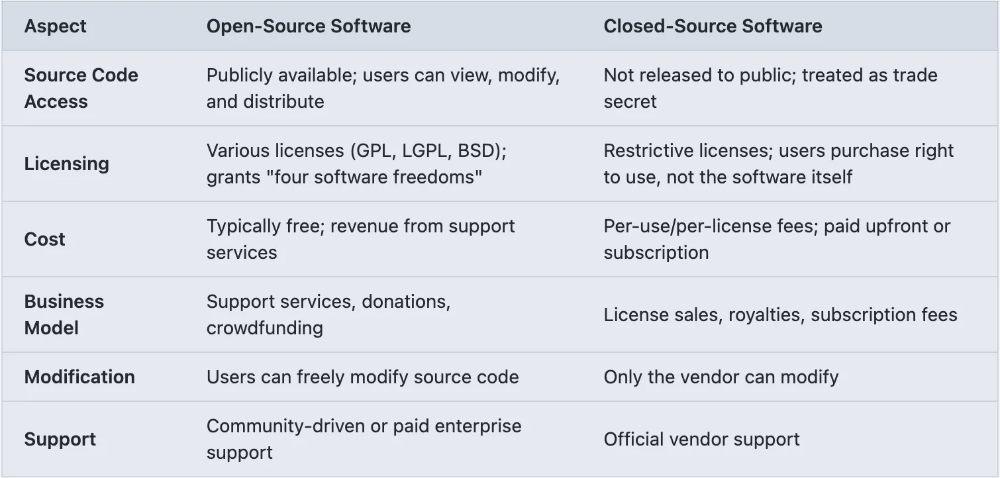
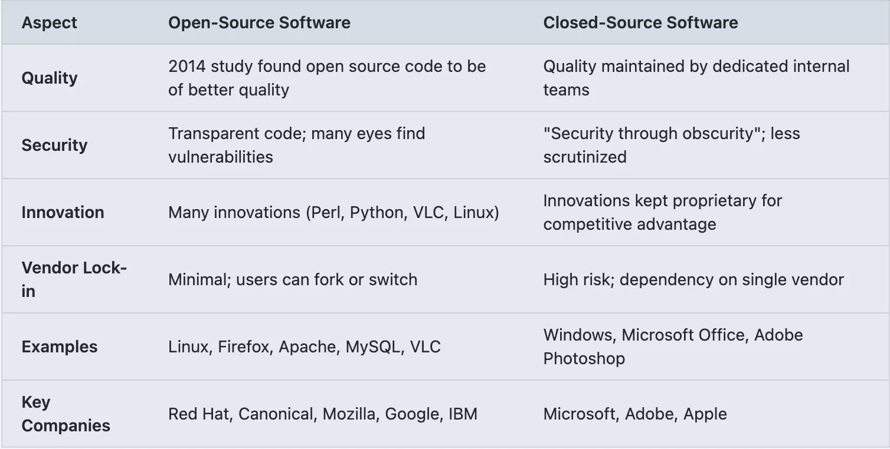

## Server

## Fundamentals

### Introduction to Linux

---

### What is Linux?

- **Definition**: Linux is a free, open-source operating system kernel that serves as the foundation for various distributions.
- **Origins**: Developed by **Linus Torvalds** in 1991 as a personal project; it has since become the most widely used kernel in the world.

- **Key Characteristics**: **Stability, Security, and Flexibility**

- **The Ecosystem**: It is maintained by a global community of developers and the [Linux Foundation](https://www.linuxfoundation.org/).

---

### Open-source software (OSS)

- Software whose source code is available to the public. Anyone can view, modify, and (usually) redistribute the code.

  - **Philosophy**: Collaboration, transparency, and community-driven innovation.

  - **Operating System Examples**: Linux (Ubuntu, Debian, Fedora), FreeBSD.

  - **Application Examples**: Firefox, LibreOffice, VLC Media Player.

---

### Closed-source software

- **Proprietary software**: Software whose source code is a closely guarded secret. Only the original authors or the company that owns the copyright can see or modify the code.

  - **Philosophy**: Profit-driven, controlled user experience, and vendor-backed stability.

  - **Operating System Examples**: Microsoft Windows, Apple macOS/iOS.

  - **Application Examples**: Microsoft Office, Adobe Photoshop, Spotify

---

### Open-source vs. Closed-source

---

### Open-source vs. Closed-source

---

### Why Linux for Servers?

- **Cost**: Eliminates expensive per-seat licensing fees found in Windows Server.
- **Customization**: Administrators can install only the necessary components, reducing the "attack surface" (security risk).
- **Control**: Everything is a file. You can configure the entire system via text files without needing a bulky Graphical User Interface (GUI).
- **Performance**: Linux uses significantly fewer system resources than Windows, leaving more RAM and CPU available for applications.

---

### Understanding Distributions

- A **Distribution (Distro)** is the Linux kernel bundled with a shell, package manager, and system utilities.

- **Community Distros**: Developed by volunteers. **Debian** (stability), **Arch** (cutting-edge), **Mint** (beginner-friendly).
- **Enterprise Distros**: Developed by corporations for business-critical environments. **Red Hat Enterprise Linux (RHEL), Ubuntu**. 
- **Key Differences**:
  - **Package Management**: Different distros use different tools (e.g., `dnf`/`yum` for RHEL, `apt` for Ubuntu, `pacman` for Arch).
  - **Release Cycle**: Some update every few months; others focus on long-term stability (LTS).

[Linux Distro Market Share](https://commandlinux.com/statistics/most-popular-linux-distributions-market-share/)

---

Sources:

https://en.wikipedia.org/wiki/Comparison_of_open-source_and_closed-source_software