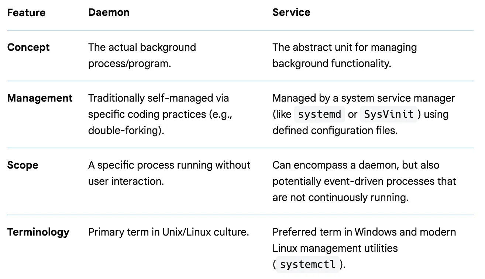

## Linux Daemon, Service and `systemd`

---

### What is a Daemon in Linux

- **Definition**: A "**daemon**" is a program that runs as a **background process** rather than under the direct control of an interactive user.
- **Naming Convention**: Customarily, daemon names end with the letter **"d"** to identify them (e.g., `sshd` for SSH connections or `syslogd` for logging).
- **Function**: They often start at **boot time** to respond to network requests, hardware activity, or scheduled tasks.
- **Origin**: The term was inspired by "Maxwell's demon" and represents a helpful "guardian angel" spirit working tirelessly in the background.

---

### What is a Service in Linux

- **Definition**: A "**service**" refers to a higher-level **management concept** or configuration unit, typically managed by a service manager like `systemd` in modern Linux distributions.
- **Management Object**: In the context of modern Linux, a service is a **representation of a system resource** or application managed by a system manager.
- **Service Units**: Specifically, systemd uses `.service` unit files to control how an application is started, stopped, and supervised.
- **Encapsulation**: It includes the instructions for process tracking, resource limits, and **automatic recovery** if the process fails.

---

### Daemon vs. Service



---

### Linux Boot Process


---

### What is `systemd`

- **System and Service Manager**: systemd is a comprehensive software suite designed to **unify service configuration** and behaviour across Linux distributions.
- **PID 1**: It runs as the very **first process** during boot (Process Identifier 1), acting as the root of the user-space process tree.
- **Large Suite**: It is not just one program but a collection of over **69 individual binaries**, including `journald` (logging), `logind` (session management), and `networkd` (network configuration).

---

### Why Do We Need `systemd`

- **Parallel Startup**: It implements **aggressive parallelization** during system initialization, starting services concurrently to reduce total boot time.
- **Dependency Management**: It provides a robust framework for representing complex **dependencies between services**, ensuring they start in the correct order.
- **Process Tracking**: systemd uses **Linux Control Groups (cgroups)** to track processes, ensuring daemons cannot "escape" management even by double-forking.
- **Standardization**: It eliminates pointless differences between distributions by providing a consistent solution for logging, device management, and scheduled tasks.

---

### Alternatives to `systemd`

- **SysV init**: The traditional, script-based initialization system that systemd largely replaced.
- **Upstart**: An event-driven init system previously used by Ubuntu and Fedora.
- **OpenRC**: A smaller, faster, and more modular alternative used by distributions like [Gentoo](https://wiki.gentoo.org/wiki/OpenRC), [Alpine Linux](https://wiki.alpinelinux.org/wiki/OpenRC).
- **runit**: A lightweight init system focused on simplicity.
- **Devuan**: A specific [Debian fork](https://www.devuan.org/) created to provide a version of the OS entirely **without systemd**.

---

### Available `systemd` Unit Types


- There are more: Scope unit, Slice unit, Snapshot unit, Socket unit, Swap unit and Timer unit.

---

### `systemd` Unit Files Locations

 

---

### Analogy: Daemon, Service and Unit File

- Think of a **Daemon** as a specialized worker who stays in the basement to keep the building's heat and electricity running.
  
- **`systemd`** is the highly organized building manager.
- The **Unit File** is the manager's handbook that dictates exactly when the worker starts, what tools they can use, and what to do if they get sick and need to be replaced.

---

### Configuring a `systemd` Unit File

- In `systemd`, a **unit** refers to any resource that the system knows how to operate on and manage. This is the primary object that the `systemd` tools use. These resources are defined using configuration files called unit files.
- **Unit files** use a declarative [**INI-style syntax**](https://en.wikipedia.org/wiki/INI_file) that allows you to see easily the purpose and effects of a unit upon activation.
- Custom units are stored in `/etc/systemd/system/`.

---

### `systemd` Unit File Structure

- Unit file Standard Sections:
  - **[Unit]**: Contains generic metadata and **ordering dependencies** (e.g., `Description`, `After`, `Requires`)
  - **[Service]**: Contains type-specific directives for execution (e.g., `ExecStart`, `Type`, `Restart`)
  - **[Install]**: Defines how the unit is enabled at boot (e.g., `WantedBy=multi-user.target`)

---

### Examples of systemd Unit Files

```ini
# Save this file to /etc/systemd/system/print-date-time.service
[Unit]
Description=Prints the date and time for demonstration

[Service]
Restart=always
ExecStart=/usr/local/bin/print-date-time.sh

[Install]
WantedBy=multi-user.target
```

```bash
#!/bin/bash
# /usr/local/bin/print-date-time.sh prints date and time to 
# /var/log/print-date-time.log every 5 seconds:
while true
do
  date >> /var/log/print-date-time.log
  sleep 5
done
# Observe the log: tail -f /var/log/print-date-time.log
```

---

### Example of Creating a Custom Service

```shell
# Enable the print-date-time service
sudo systemctl enable print-date-time.service [--now]

# Start the print-date-time service
sudo systemctl start print-date-time.service

# Stop the print-date-time service
sudo systemctl stop print-date-time.service

# Disable the print-date-time service
sudo systemctl disable print-date-time.service

# List all available services and their current status
sudo systemctl list-units -t service --all
```

---

### Managing Services with `systemctl`

- The **systemctl** utility is the central tool for controlling the **systemd** init system and service manager. It provides a consistent interface to perform the following **operational tasks**:
  - **start**: Activates a service in the **current session**.
  - **stop**: Deactivates a running service immediately.
  - **restart**: Shuts down a service and **immediately starts it again**; if the unit is not running, this command will start it.
  - **reload**: Instructs a service to **reload its configuration** without interrupting its execution or stopping the process.
  - **status**: Displays a comprehensive overview of a service's current state, including its **Active/Inactive** status, main **PID**, and recent log entries.

---

### Boot Configuration and Masking

- Beyond managing active processes, **systemctl** handles how services behave when the system **boots up**:
  - **enable**: Configures a service to **start automatically** during the boot process by creating symbolic links in the systemd configuration directories.
  - **disable**: Prevents a service from starting automatically at boot, though it can **still be started manually**.
  - **is-enabled**: Checks the current installation status to verify if a unit is set to start at boot.
  - **mask**: Links a unit file to `/dev/null`, making it **impossible to load or start** the service, even manually or as a dependency.
  - **unmask**: Removes the mask, allowing the service to be loaded and used once again.

---

### Applying Unit Changes: `daemon-reload`

- When you **create new unit files** or **modify existing ones** in directories like `/etc/systemd/system/`, the system manager is not immediately aware of these changes.
  - **Function**: The `systemctl daemon-reload` command forces systemd to **re-scan all unit files**, recreate the entire dependency tree, and reload the manager configuration.
  - **Importance**: You must execute this command after any manual edits to unit files to avoid a **mismatch** between the state of the manager and the actual files on the disk.
  - **Execution**: It ensures that any subsequent `start` or `enable` commands use the **most recent version** of the unit configuration.

---

### Centralized Logging with `journalctl`

- **`journalctl`** is the primary command-line interface for accessing the **systemd journal**, a centralized logging solution.
  - **Structured Format**: Unlike traditional text logs, the journal stores data in a **structured binary format**, which includes rich metadata like service names, timestamps, and process IDs.
  - **Binary Advantage**: This format allows logs to be displayed in **various output modes** (such as JSON or verbose) on-demand without manual conversion.
  - **Scope**: It aggregates messages from the **kernel**, **initrd**, and all **user-space services**, providing a unified view of the system's history.

```shell
sudo journalctl -u firewalld.service
Jan 02 19:39:00 almalinux systemd[1]: Starting firewalld.service - firewalld - dynamic firewall daemon...
Jan 02 19:39:01 almalinux systemd[1]: Started firewalld.service - firewalld - dynamic firewall daemon.
```

---

### `journalctl` Filtering and Monitoring

- Because the journal can contain hundreds of thousands of lines, **filtering** is essential for effective troubleshooting.
  - **Filter by Unit (`-u`)**: Shows only logs associated with a **specific service** (e.g., `journalctl -u sshd`)
  - **Filter by Boot (`-b`)**: Limits output to the **current boot session**; you can also use `-b -1` to view the previous boot
  - **Follow Mode (`-f`)**: Acts like `tail -f`, allowing you to monitor **live events** as they are written to the journal in real-time
  - **Time Ranges**: Uses `--since` and `--until` flags to isolate events within a **specific temporal window** (e.g., `journalctl --since "1 hour ago"`)

---

### Analogy: `systemctl` and `journalctl`

- **`systemctl`** is the **remote control** used to turn your appliances (services) on and off or program them to run at specific times.
- **`journalctl`** is the **security camera footage** and **activity log**. You use the remote to manage the house, but when something breaks or goes missing, you check the logs to see exactly what happened and when.

---

### Sources

- https://en.wikipedia.org/wiki/Daemon_(computing)
- [systemd(1) — Linux manual page](https://www.man7.org/linux/man-pages/man1/systemd.1.html)
- [systemd.unit — Unit configuration](https://www.freedesktop.org/software/systemd/man/latest/systemd.unit.html)
- [Red Hat - Managing Services with systemd](https://docs.redhat.com/en/documentation/red_hat_enterprise_linux/7/html/system_administrators_guide/chap-managing_services_with_systemd)
- https://www.0xkato.xyz/linux-boot/
- [Linux Boot Process Explained](https://blog.bytebytego.com/p/ep88-linux-boot-process-explained)
- [SUSE Linux - Setting Up a `systemd` Service](https://documentation.suse.com/smart/systems-management/html/systemd-setting-up-service/index.html)