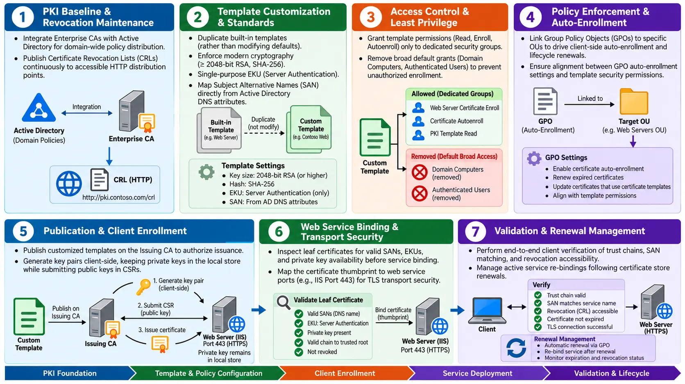
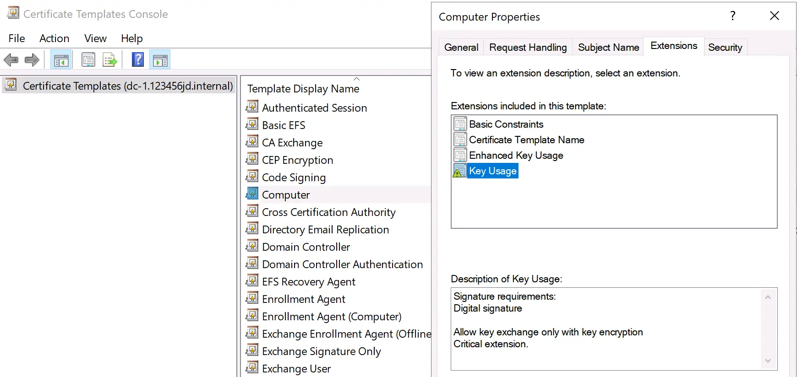
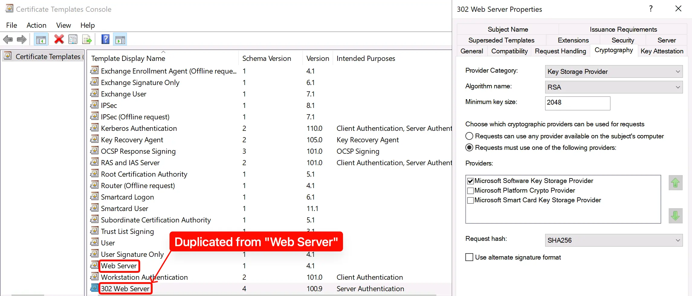
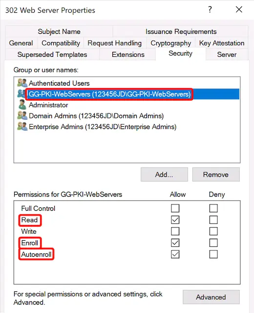
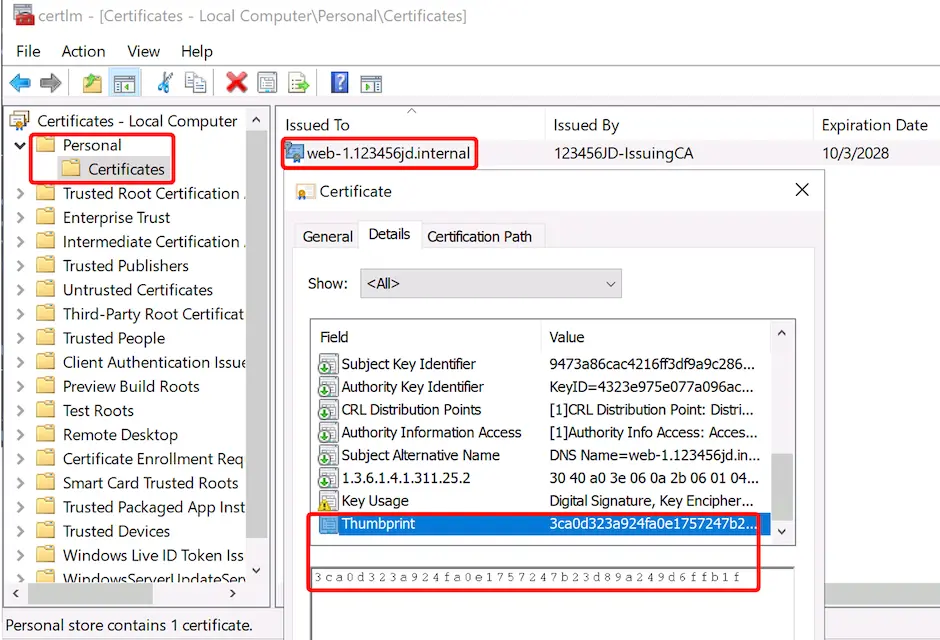
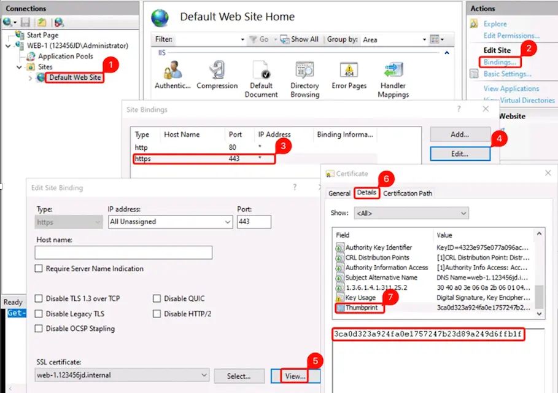
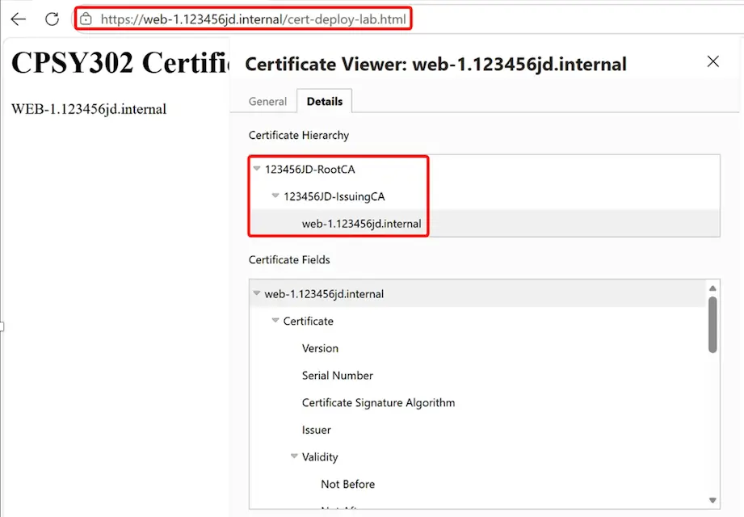

## Advanced Servers

## Certificate Deployment

---

### Certificate Deployment Workflow

---

###  Certificate Templates

- A certificate template is a set of certificate rules
- It defines the certificate’s purpose
- It defines key and cryptographic requirements
- It defines who may request the certificate
- It tells the client how to create a valid request

- Microsoft describes templates as rules applied to certificate requests and instructions used by clients when creating requests.

---

### Certificate Template Example

---

### Enterprise CA and Templates

- Certificate templates are stored in Active Directory
- Templates can be shared across Enterprise CAs in the forest
- Only an **Enterprise CA** can issue template-based certificates
- A Standalone CA does not use AD-integrated templates

---

### Why Duplicate a Template

- Built-in templates provide starting points
- A duplicated template can be customized
- The original template remains unchanged
- The new template can have one clear purpose
- Permissions can be limited to the intended computers

- **Note:** Choose the existing template that most closely matches the required certificate, then customize the copy.

---

### Duplicated Template

---

### What a Template Controls

- A template can define:

  - Certificate subject and identity information

  - Certificate validity and renewal settings

  - Key type, size, and permitted operations

  - Enhanced Key Usage

  - Enrollment and auto-enrollment permissions

  - Whether special features such as key archival are required

---

### Template Compatibility

- Template compatibility controls available features
- It also identifies supported CA and client versions
- Newer template versions provide additional options
- Auto-enrollment requires a template that supports it
- Select compatibility based on actual environment requirements

- **Note:** Do not select newer compatibility settings unless the participating systems support them.

---

### Publishing a Template

- Creating a template does not automatically make it usable
- The template is stored in Active Directory
- An Issuing CA must be authorized to issue it
- Publishing connects the template to that CA
- Different CAs may publish different templates

- **Example:** A template may exist in the forest but remain unavailable until an Enterprise Issuing CA publishes it.

---

### Template Permissions

- Template permissions control access:

  - **Read:** Discover and examine the template

  - **Enroll:** Request a certificate from the template

  - **Autoenroll:** Receive the certificate automatically

  - Permissions are normally assigned to AD groups

  - Only the intended users or computers should receive access

- Certificate templates allow administrators to control which users and computers can read templates and enrol for certificates.

---

### Template Permissions

---

### Requirements for Auto-Enrollment

- For computer auto-enrollment, the computer normally needs:

  - Permission to read the template

  - Permission to enrol using the template

  - Permission to auto-enroll

  - Membership in the correct AD security group

  - Access to a CA that publishes the template

- If one gate is missing, auto-enrollment cannot complete as intended.

---

### Certificate Enrollment

- Enrollment is the process of requesting a certificate
- The client creates or accesses a key pair
- The client creates a certificate request
- The CA evaluates the request against the template
- An approved certificate is issued and installed

- **Note:** The certificate contains the public key. The private key normally remains on the requesting computer.

---

### Manual vs. Automatic Enrollment

- **Manual enrollment**

  - A user or administrator starts the request

  - Useful for special or controlled certificates

- **Auto-enrollment**

  - Windows starts the request automatically

  - Useful for larger numbers of domain users or computers

  - Supports consistent certificate deployment

---

### Auto-Enrollment

- Auto-enrollment uses Active Directory certificate policy
- Eligible domain members discover available templates
- The client checks template permissions
- The client requests a matching certificate
- The issued certificate is installed automatically

- Auto-enrollment can also help renew certificates and respond to template updates.

---

### Group Policy’s Role

- Group Policy tells Windows:

  - Whether auto-enrollment is enabled

  - Whether computer or user policy applies

  - Whether expired certificates should be renewed

  - Whether pending requests should be updated

  - Whether certificate-template changes should be applied

- Group Policy activates the client-side auto-enrollment behaviour; it does not replace template permissions.

---

### Two Policies Must Agree

- Group Policy starts the process. The template decides whether the request is allowed.

- Auto-enrollment requires both sides:

- **Group Policy**: Tells the client to perform auto-enrollment

- **Certificate template**:

  - Defines eligibility and permissions

  - Defines the certificate that may be issued

---

### Auto-Enrollment Lifecycle

- Auto-enrollment can help manage:

  - Initial certificate enrollment

  - Certificate renewal

  - Pending certificate requests

  - Certificates affected by template updates

  - Removal or replacement of unsuitable certificates

- This reduces repetitive manual work but still depends on correctly designed templates and permissions.

---

### Certificate Purpose

- A certificate should have a clearly defined job
- Its purpose is recorded in certificate extensions
- Applications check whether the purpose is acceptable
- A valid certificate may still be unsuitable for an application
- Use only the purposes required for the intended service

---

### Enhanced Key Usage

- EKU means **Enhanced Key Usage**
- EKU identifies approved certificate purposes
- **Server Authentication** identifies a server to clients
- **Client Authentication** identifies a client to a server
- Applications can reject a certificate with the wrong EKU

- Microsoft documents different EKUs for Server Authentication and Client Authentication and notes that authenticating applications check for the required purpose.

---

### Purpose-Specific Templates

- A web server normally needs Server Authentication
- A client certificate normally needs Client Authentication
- These purposes should not be combined without a reason
- Separate templates make policy easier to understand
- Limited-purpose certificates reduce unintended use

---

### The Issued Certificate

- After successful enrollment:

  - The certificate appears in a certificate store

  - A computer certificate normally uses the Local Computer context

  - Its private key is associated with that computer

  - Services can locate certificates available to the computer

  - Not every installed certificate is suitable for every service

---

### Inspect Before Use

- Before using an issued certificate, verify:

  - Subject or Subject Alternative Name

  - Issuing CA

  - Validity period

  - Enhanced Key Usage

  - Certificate chain

  - Presence of the matching private key

- **Note:** Seeing a certificate in a store does not prove that it is suitable for IIS.

---

### Inspect Before Use

---

### IIS Server Certificate

- An appropriate IIS server certificate should:

  - Identify the server’s DNS name

  - Include Server Authentication

  - Be within its validity period

  - Chain to a trusted Root CA

  - Have an accessible matching private key

- IIS cannot successfully use a server certificate when the matching private key is missing or inaccessible. 

---

### HTTPS Binding

- An HTTPS binding connects a website to a certificate
- The binding tells IIS which certificate to present
- The server uses the matching private key during TLS
- The client receives the server certificate and supporting chain
- The binding does not make an incorrect certificate valid

- **Note:** Installing a certificate and assigning it to a website are separate concepts.

---

### IIS HTTPS Binding

---

### HTTPS Using TLS

- The client connects to the IIS server
- The server presents its certificate
- The client validates the server’s identity
- TLS negotiates protected communication
- Application data is then encrypted and integrity-protected

- Windows uses **Schannel** to provide TLS authentication and encryption for client-server communication.

---

### Client Validation

- The client checks:

  - Does the certificate identify the requested server?

  - Is the certificate currently valid?

  - Does it include Server Authentication?

  - Does the chain reach a trusted Root CA?

  - Has a certificate in the chain been revoked?

- Windows certificate validation includes chain, time, revocation, usage, and server-identity checks.

---

### Browser Certificate Viewer

---

### Name Matching

- The client connects using a DNS name
- The certificate must represent that identity
- A certificate for a different server should be rejected
- Subject Alternative Name is used for DNS identities
- Using the correct URL is part of successful validation

- **Example:** A certificate for `web01.example.com` should not be accepted for `web02.example.com`.

---

### Revocation in Deployment

- The Issuing CA publishes revocation information
- Clients use the certificate’s CDP information
- A current CRL must be available
- A revoked certificate should fail validation
- An expired or unreachable CRL may interrupt certificate use

---

### Common HTTPS Failures

- HTTPS may fail because:

  - The certificate has the wrong DNS identity

  - Server Authentication is missing

  - The matching private key is unavailable

  - The chain cannot reach a trusted root

  - A certificate is expired or revoked

  - Current revocation information cannot be reached

---

### Modern Terminology and Practice

- Say **HTTPS using TLS**, not “SSL,”
- IIS may still use “SSL” in some interface labels
- Do not use SHA-1 for new certificate designs
- Avoiding RSA keys smaller than 2048 bits
- Avoid unnecessary all-purpose certificates
- Use purpose-specific templates and current cryptography

- Windows can reject certificates using outdated algorithms such as MD5 and SHA-1, while current Windows documentation treats TLS as the modern protocol family.

---

### Key Takeaways

- Certificate templates are stored directly in AD and can only be issued by an Enterprise CA.
- Administrators should duplicate built-in templates to customize deployment settings while leaving original templates intact.
- A newly created template remains completely unusable until an authorized Issuing CA explicitly publishes it.
- Successful computer auto-enrollment requires granting Read, Enroll, and Autoenroll permissions to appropriate AD security groups.

---

### Key Takeaways

- The client generates the key pair locally and keeps the private key while submitting only the public key to the CA.
- Auto-enrollment requires both client Group Policy and template security permissions to permit the request.
- Every certificate must include the specific Enhanced Key Usage required by the service, such as Server Authentication for web servers.
- HTTPS bindings fail if the server cannot access the certificate's matching private key.
- Clients validate web certificates by confirming the name in the Subject Alternative Name matches the URL and the revocation list is reachable.

---

### Resources

- [Server Certificate Deployment Overview](https://learn.microsoft.com/en-us/windows-server/networking/core-network-guide/cncg/server-certs/server-certificate-deployment-overview)
- [Microsoft PKI Planning and Deploying Certificate Services](https://www.petenetlive.com/KB/Article/0001309)
- [Manage certificate templates](https://learn.microsoft.com/en-us/windows-server/identity/ad-cs/manage-certificate-templates)
- [Key Archival Security Considerations](https://learn.microsoft.com/en-us/openspecs/windows_protocols/ms-wcce/95f13be7-e0e9-4e58-9762-228bb086e7f7)

---

### AI Disclaimer

- Concepts were sketched by hand on an iPad using an Apple Pencil, with ChatGPT Images 2.5 used for final rendering.
- Every AI-generated illustration is manually reviewed and verified.