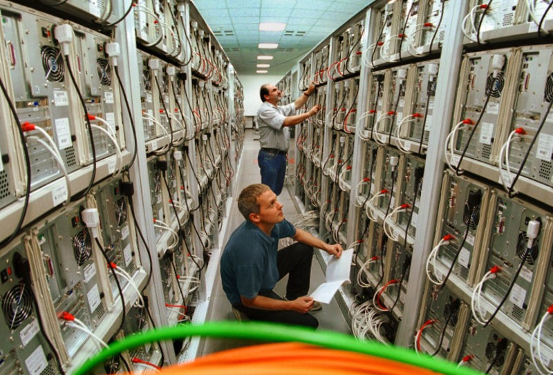
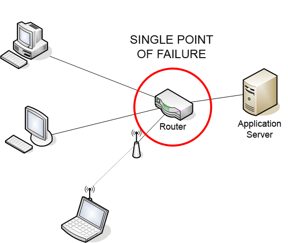
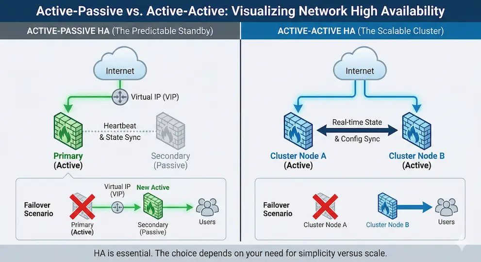
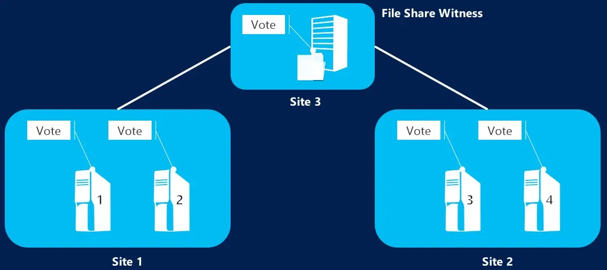
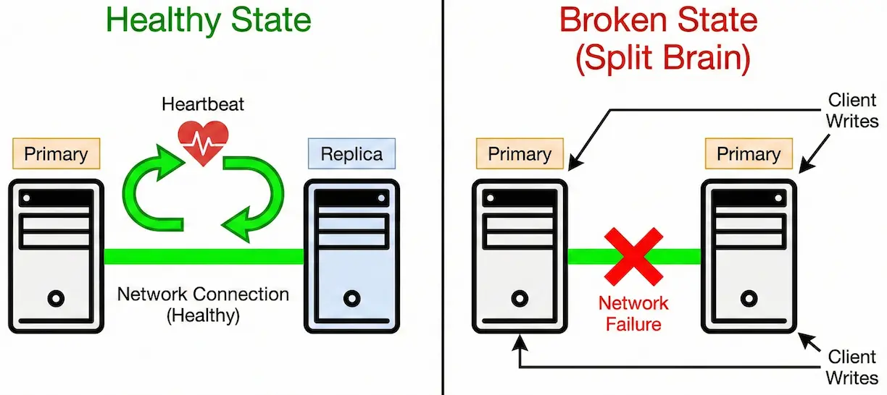
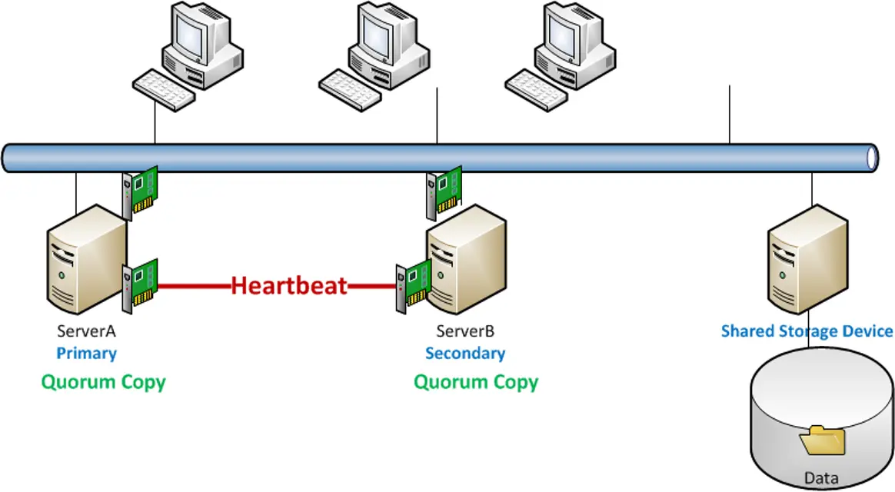
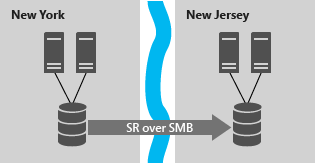
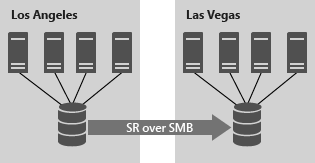
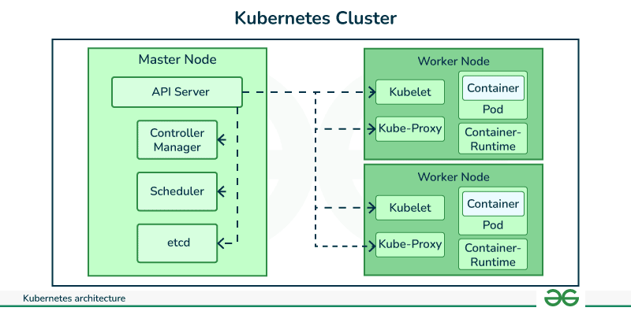
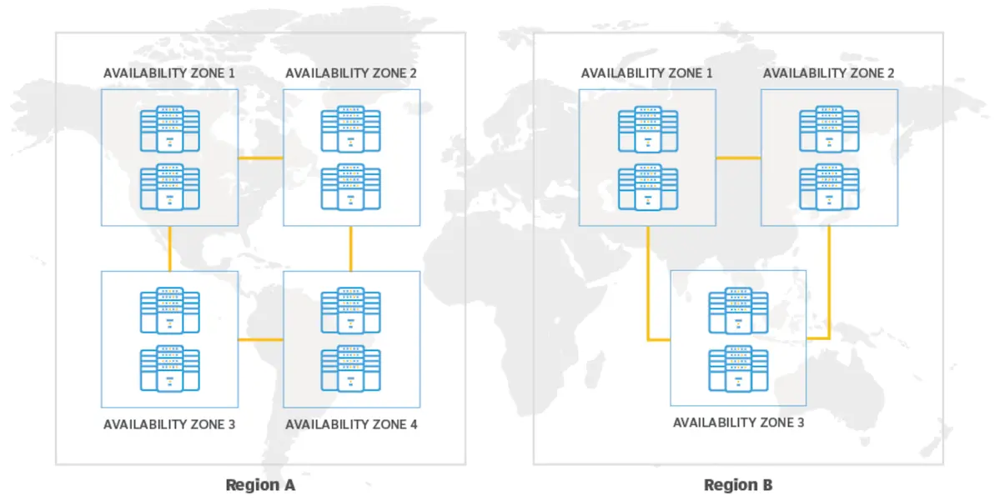

## Advanced Servers

## Computer Cluster

---

### Computer Cluster

- A **computer cluster** is a group of independent computers called **nodes**.
- Nodes cooperate to provide one or more services or workloads.
- Clients normally access the service as a single logical resource.
- Cluster software coordinates node membership, workload placement, health, and recovery.
- A cluster is a system design, not simply a collection of connected servers.

---

### Computer Cluster

Credit: [Cluster at the Chemnitz University of Technology](https://en.wikipedia.org/wiki/Computer_cluster)

---

### Clustering Goals

- **High availability:** Reduce service interruption after failures.
- **Resilience:** Recover from component or service failures.
- **Scalability:** Add capacity as demand grows.
- **Load distribution:** Spread client requests across service instances.
- **High-performance computing:** Divide computational work across processors or nodes.
- These goals can overlap, but they are **not interchangeable**.

---

### Cluster Terms

- **Node:** Computer participating in the cluster.
- **Membership:** Current set of participating nodes.
- **Primary**: Provides cluster resources to clients during normal operations.
- **Secondary or Standby**: Provides cluster resources to clients during failure conditions.
- **Quorum and witness**: Configuration and state information for the cluster.
- **Resource or workload:** Service managed by the cluster.

---

### Cluster Terms

- **Cluster Virtual Name**: Name used by clients to access the resources of the cluster.
- **Cluster Virtual IP**: IP address used by clients to access the resources of the cluster.
- **Heartbeat:** Repeated communication used to help detect node availability.
- **Heartbeat network**: A private network used for heartbeat communication – no other traffic.

---

### Availability and Fault Tolerance

- **Availability** describes whether a service is usable when required.
- **High availability** attempts to restore service quickly after a failure.
- **Fault tolerance** aims to continue operating with little or no interruption.
- **Redundancy** provides extra components that can replace failed components.
- The required design depends on the acceptable interruption and data-loss risk.
- Clustering improves availability but cannot guarantee that failures are invisible.

---

### Failure Domains

- A **failure domain** is a resource or group of resources that can fail together.
- Examples include:
  - Server
  - Rack
  - Power circuit
  - Network switch
  - Storage system
  - Availability zone
- Redundant components should be placed in **independent failure domains**.

---

### Single Points of Failure

- A **single point of failure (SPOF)** can interrupt the entire service if it fails.
- Adding a second server is not enough if both depend on:
  - One network path
  - One power source
  - One storage controller
  - One load balancer
  - One site
- High availability requires examining the complete dependency chain.
- Redundancy should include compute, network, power, storage, and service access paths.

---

### Single Points of Failure

Credit: https://en.wikipedia.org/wiki/Single_point_of_failure

---

### Active and Passive

- In an **active/passive** design, one node normally hosts the workload.
- A standby node is prepared to take ownership after a failure.
- Benefits include:
  - Simpler ownership
  - Predictable data access
  - Easier failure analysis
- Standby capacity may be unused during normal operation.
- The standby must have enough capacity to run the failed workload.

---

### Active and Active

- In an **active/active** design, multiple nodes perform useful work.
- Different workloads may be owned by different nodes.
- Some applications can run multiple service instances simultaneously.
- Active/active designs improve resource utilization.
- Remaining nodes must absorb additional work after a failure.
- Active/active does not mean every workload can safely write to the same data.

---

### Active-Passive vs. Active-Active

Credit: [Active-Active vs. Active-Passive HA](https://www.linkedin.com/pulse/active-active-vs-active-passive-ha-designing-non-stop-dharmdasani-pzicc/)

---

### Health Monitoring

- Cluster software continuously evaluates nodes and managed resources.
- **Node monitoring** detects membership or communication changes.
- **Resource monitoring** checks whether the service is functioning.
- A running process is not always a healthy application.
- Health checks should test the service behaviour that matters to clients.
- Repeated checks and thresholds help prevent reactions to temporary faults.

---

### Failover

- **Failover** moves or restarts a workload on another node.
- **Planned failover** supports maintenance or controlled migration.
- **Unplanned failover** responds to hardware, operating-system, network, or service failure.
- A typical recovery sequence is:
  - Detect failure
  - Confirm safe ownership
  - Select a target node
  - Start required dependencies
  - Restore client access
- Faster detection is useful only when the decision is accurate.

---

### Failback and Dependencies

- **Failback** returns a workload to a preferred node after recovery.
- Automatic failback can cause unnecessary movement after an unstable failure.
- Clustered workloads often contain dependent resources.
- Example dependency order: Storage > Network identity > Database or application > Client access
- Start, stop, placement, and colocation rules must reflect these relationships.
- Recovery is a coordinated process, not simply starting one service.

---

### Windows Failover Clustering

- **Windows Server Failover Clustering (WSFC)** provides high availability for supported workloads.
- Independent Windows servers form the cluster nodes.
- Applications and services are represented as **clustered roles** and resources.
- The cluster monitors node and role health.
- A failed role may be restarted locally or moved to another node.
- Common examples include clustered virtual machines, file services, and supported database workloads.

---

### Resource Ownership

- A clustered resource has an **owner node**.
- The owner is responsible for the resource’s current operation.
- Clients use a logical service identity rather than a node’s physical identity.
- The service name or address follows the workload during failover.
- Ownership prevents uncontrolled simultaneous access to resources that permit only one active instance.
- A cluster must know **where the workload is running** and **who may run it**.

---

### Cluster Shared Volumes

- A **Cluster Shared Volume (CSV)** allows multiple WSFC nodes to access the same shared volume.
- CSVs operate over NTFS or ReFS storage.
- Clustered roles can move between nodes without dismounting and remounting the volume.
- A coordinator node still manages specific storage coordination tasks.
- CSVs are commonly associated with clustered Hyper-V storage and scale-out file services.
- CSV availability still depends on resilient storage and cluster networks.

---

### Quorum

- **Quorum** is the cluster’s voting mechanism for determining whether it may continue operating.
- A cluster must maintain an authoritative partition.
- Quorum is not merely a disk containing configuration information.
- It answers: **Does this partition have enough votes to make safe decisions?**
- A partition without quorum stops clustered operations.
- This protects data integrity during node and communication failures.

---

### Quorum

Credit: [What is a quorum witness?](https://learn.microsoft.com/en-us/windows-server/failover-clustering/what-is-quorum-witness)

---

### Votes and Majority

- Cluster nodes normally participate in voting.
- A witness may also contribute a vote.
- A functioning cluster partition requires **more than half of the active votes**.
- Majority prevents two equal partitions from both becoming authoritative.
- Quorum determines whether the cluster may operate.
- It does not determine whether the application itself is healthy.

---

### Quorum Witnesses

- A **witness** provides an additional vote for quorum decisions.
- Windows Server supports:
  - **Disk witness:** Shared cluster disk
  - **File share witness:** SMB file share outside the cluster
  - **Cloud witness:** Azure Blob Storage provides arbitration
- A witness should be independent of the failure domains it helps arbitrate.
- Witnesses do not host application data.
- Witness selection should match the storage, network, and site design.

---

### Dynamic Quorum

- **Dynamic quorum** can adjust node votes as cluster membership changes.
- It helps the cluster remain operational during sequential node shutdowns or failures.
- It does not allow the cluster to survive an immediate loss of the voting majority.
- Modern Windows clusters can also manage whether the witness vote is currently needed.
- Dynamic voting improves flexibility but does not replace sound failure-domain design.
- Quorum configuration should be reviewed whenever nodes, sites, or storage change.

---

### Split-Brain

- **Split-brain** occurs when isolated cluster partitions each believe they should operate the workload.
- A failed communication path does not prove that the other node is powered off.
- Competing owners may attempt to write to the same data.
- Possible results include:
  - Data corruption
  - Conflicting updates
  - Duplicate service identities
  - Application inconsistency
- Majority quorum permits only one authoritative partition to continue.

---

### Split-Brain

Credit: [Split Brain Problem in System Design](https://designgurus.substack.com/p/system-design-essentials-learn-split)

---

### Fencing

- **Fencing** isolates a node before its resources start elsewhere.
- Linux HA commonly calls fencing **STONITH** (Shoot The Other Node In The Head).
- A node may be fenced through:
  - Power control
  - Hypervisor control
  - Storage isolation
  - Network isolation
- The goal is certainty that the old owner can no longer access the protected resource.
- Safe failover may require fencing even when the failed node appears unresponsive.

---

### Linux HA Stack

- **Corosync** provides cluster communication, membership, and quorum information.
- **Pacemaker** is the cluster resource manager.
- **Resource agents** start, stop, and monitor services.
- **Fence agents** isolate unsafe nodes.
- Pacemaker uses membership and health information to determine resource placement and recovery.
- Linux HA can support active/passive, N+1, and other redundancy designs.

---

### Shared Storage

- Shared-storage clusters allow multiple nodes to reach the same storage system.
- Possible technologies include: SAN, NAS, iSCSI, Shared disks.
- Shared storage simplifies access to one authoritative data copy.
- It may also create shared controllers, fabrics, or arrays that require redundancy.
- Ownership controls are essential when the filesystem or application permits only one writer.
- Shared storage is one design option, not a requirement for every cluster.

---

### Failover Cluster with NAS

---

### Replicated Storage

- Replicated storage maintains data copies on separate systems or sites.
- **Synchronous replication** waits for the remote copy before acknowledging the write.
- It supports stronger consistency but depends on low latency and sufficient bandwidth.
- **Asynchronous replication** acknowledges locally and transfers changes afterward.
- It tolerates longer distances but may lose recent changes during failure.
- Replication can remove one shared-storage dependency while adding consistency and recovery decisions.

---

### Replicated Storage

Credit: [Storage Replica overview](https://learn.microsoft.com/en-us/windows-server/storage/storage-replica/storage-replica-overview)

---

### HA, DR, and Backups

- **High availability:** Keeps a service running through local component failures.
- **Disaster recovery:** Restores service after major site or regional failure.
- **Scalability:** Increases capacity for growing demand.
- **Backup:** Preserves recoverable point-in-time data.
- Replication can copy accidental deletion or corruption to every replica.
- Clustering and replication do **not** replace tested backups.

---

### Linux Load Balancing

- Software such as **HAProxy** or **NGINX** can distribute traffic across backend servers.
- **Layer 4** balancing uses transport-level connections and addressing.
- **Layer 7** balancing can make application-aware decisions for protocols such as HTTP.
- Health checks remove failed backends from normal traffic rotation.
- Recovered backends can be returned after successful checks.
- The load balancer itself also requires a high-availability design.

---

### Balancing Algorithms

- **Round robin:** Selects servers sequentially.
- **Weighted round robin:** Sends more work to higher-capacity servers.
- **Least connections:** Selects the server with fewer active connections.
- **Hash-based selection:** Uses client or request information to choose a backend.
- **Session persistence:** Attempts to keep related client requests on the same backend.
- The best algorithm depends on server capacity, connection duration, application state, and traffic behaviour.

---

### Kubernetes Clusters

- A Kubernetes cluster contains a **control plane** and **worker nodes**.
- The control plane stores desired state, schedules workloads, and runs controllers.
- Worker nodes host application **Pods**.
- Controllers maintain the requested number of replicas.
- Failed containers can restart, and lost Pods can be replaced or rescheduled.
- Services direct traffic to available Pod endpoints.
- Kubernetes manages replaceable workload instances rather than simply moving one traditional server role.

---

### Kubernetes Clusters

Credit: [k8s Cluster Architecture](https://www.geeksforgeeks.org/devops/kubernetes-cluster/)

---

### Cloud-Aware Availability

- Cloud platforms organize infrastructure into **zones** and **regions**.
- Workloads gain resilience when replicas span independent failure domains.
- Managed load balancers can route traffic toward healthy backends.
- Autoscaling changes capacity; it does not replace redundancy or data protection.
- Replicated state must match the required consistency and recovery objectives.
- Windows clusters can use a cloud witness for quorum without placing application data in the cloud witness.

---

### Regions vs. Availability Zones

Credit: [Understand AWS Regions vs.AZ](https://www.techtarget.com/it-infrastructure/tip/Understand-AWS-Regions-vs-Availability-Zones)

---

### Troubleshooting Clusters

- Identify the failed layer before changing the configuration.
- Check in this order:
  - Node and resource health
  - Cluster membership and communication
  - Quorum and witness availability
  - Fencing or isolation status
  - Storage access and data consistency
  - Resource dependencies and ownership
  - Service name, IP, load balancer, and client access
- Confirm whether the event is a node failure, resource failure, network partition, or monitoring failure.

---

### Key Takeaways

- Clusters coordinate independent nodes to provide managed workloads.
- High availability, scalability, load balancing, and HPC solve different problems.
- HA depends on redundancy across complete failure domains.
- Health monitoring detects problems; failover performs recovery.
- Resource dependencies determine safe start and stop order.
- Clustering improves availability but cannot eliminate every interruption.

---

### Key Takeaways

- Quorum ensures that only an authoritative cluster partition continues operating.
- Witnesses help maintain a voting majority.
- Fencing prevents an uncertain node from accessing protected resources.
- Shared and replicated storage create different consistency and failure trade-offs.
- Containers and cloud services extend clustering through desired state, replicas, zones, and managed recovery.
- **Reliable clusters are designed, monitored, tested, and maintained as complete systems.**

---

### Resources

- https://en.wikipedia.org/wiki/Computer_cluster
- [Active-Active vs. Active-Passive HA](https://www.linkedin.com/pulse/active-active-vs-active-passive-ha-designing-non-stop-dharmdasani-pzicc/)
- [Failover Clustering](https://learn.microsoft.com/en-us/windows-server/failover-clustering/failover-clustering-overview)
- [What is a quorum witness?](https://learn.microsoft.com/en-us/windows-server/failover-clustering/what-is-quorum-witness)
- [Split Brain Problem in System Design](https://designgurus.substack.com/p/system-design-essentials-learn-split)
- [Storage Replica overview](https://learn.microsoft.com/en-us/windows-server/storage/storage-replica/storage-replica-overview)
- [HAProxy Health checks](https://www.haproxy.com/documentation/haproxy-configuration-tutorials/reliability/health-checks/)
- [k8s Cluster Architecture](https://kubernetes.io/docs/concepts/architecture/)
- [Understand AWS Regions vs.AZ](https://www.techtarget.com/it-infrastructure/tip/Understand-AWS-Regions-vs-Availability-Zones)