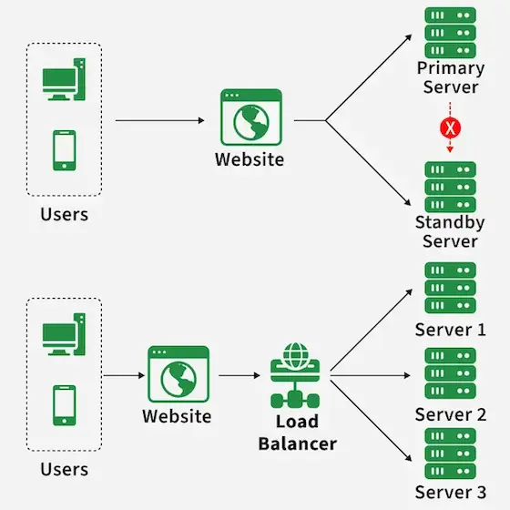
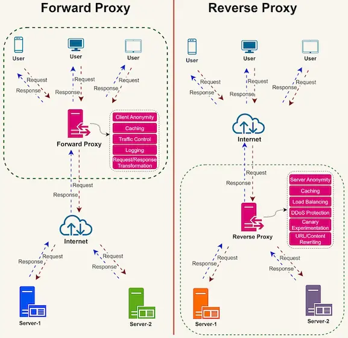

## Advanced Servers

## High Availability and Load Balancing

---

### From Clusters to Load Balancing

- A cluster provides **redundancy** by allowing multiple systems to support the same service.
- In an **active/passive** design, redundancy is mainly used for **failover** — another node takes over when the active node fails.
- Web applications often use an **active/active** approach where multiple servers provide the same service at the same time.
- This creates a new question: **If several servers are available, which one should handle each client request?**

---

### From Clusters to Load Balancing

- A **load balancer** answers this question by distributing incoming traffic across available backend servers.
- With health-aware load balancing, failed backends can be removed from service while healthy backends continue responding.
- We are now shifting our focus from **recovering workloads after failure** to **distributing traffic across multiple active servers**.

---

### Why Active/Active Web Services?

- Multiple web servers can run the same application simultaneously.
- Every backend handles production traffic.
- Adding backends can increase capacity.
- Losing one backend does not require transferring service ownership.
- The load balancer simply stops selecting the failed instance.
- This model works best when application instances are interchangeable and state is managed appropriately.

---

### Failover vs. Load Balancing

- **Failover**
  - Restarts or moves a workload after failure.
  - Commonly changes the active service owner.
- **Load balancing**
  - Distributes traffic across available service instances.
  - Operates during normal service, not only after failure.
- Health-aware load balancing can support HA.
- **Load balancing is not the same as failover or complete HA.**

---

### Failover vs. Load Balancing

Credit: [Load Balancing Vs Failover](https://www.geeksforgeeks.org/system-design/load-balancing-vs-failover/)

---

### Load-Balancing Architecture

- A load-balanced service normally contains:
  - Client-facing endpoint
  - Frontend or listener
  - Routing policy
  - Backend pool
  - Health-check system
  - Application dependencies
- Clients connect to the service endpoint.
- The load balancer selects an eligible backend.
- Individual backend identities are normally hidden from clients.

---

### Frontend and Listener

- The **frontend** is the client-facing side of the load balancer.
- It is identified by a service name and IP address.
- A **listener** accepts traffic on a configured protocol and port.
- Examples:
  - HTTP on TCP 80
  - HTTPS on TCP 443
  - Application-specific TCP service
- One load balancer can expose multiple listeners.
- Listener rules determine where accepted traffic goes.

---

### Forward and Reverse Proxies

- A **forward proxy** represents clients.
  - Clients send outbound requests through the proxy.
  - Common in web filtering and controlled Internet access.
- A **reverse proxy** represents servers.
  - Clients connect to the proxy as if it were the application.
  - The proxy forwards requests to internal backends.
- Load balancing is a common reverse-proxy function.

---

### Forward Proxy vs. Reverse Proxy

Credit: [Proxy vs Reverse Proxy](https://levelup.gitconnected.com/proxy-vs-reverse-proxy-whats-the-difference-472644cc8324)

---

### Reverse-Proxy Flow

- The client connects to the reverse proxy.
- The proxy accepts and interprets the request.
- A routing rule identifies the backend pool.
- A balancing algorithm selects an eligible backend.
- The proxy creates or reuses a backend connection.
- The backend returns its response to the proxy.
- The proxy returns the response to the client.

---

### Backend Pools

- A **backend pool** contains instances that can provide the service.
- NGINX calls a backend pool an **upstream group**.
- Backends may be identified by:
  - IP address
  - Hostname
  - Port
  - Service-discovery record
- Only eligible backends should receive new traffic.
- Eligibility depends on configuration, health, capacity, and maintenance state.

---

### Scaling and Maintenance

- **Horizontal scaling** adds or removes backend instances.
- New backends increase potential service capacity.
- Removing a backend should avoid interrupting existing work.
- **Draining** stops or reduces new assignments while existing connections complete.
- Maintenance mode intentionally removes a backend from selection.
- Some platforms use **slow start** to gradually restore a recovered backend’s traffic share.

---

### Layer 4 Load Balancing

- **Layer 4** operates at the transport layer.
- Selection normally uses information such as:
  - Protocol
  - Source and destination addresses
  - Source and destination ports
- Typical traffic includes TCP and UDP.
- The load balancer does not need to interpret HTTP paths or cookies.
- Layer 4 is useful for non-HTTP services, long-lived connections, and simpler forwarding.

---

### Layer 7 Load Balancing

- **Layer 7** understands an application protocol.
- HTTP/HTTPS routing can inspect:
  - Hostname
  - URL path
  - Header
  - Cookie
  - Method
  - Query string
- Different requests can be routed to different backend pools.
- Layer 7 provides greater routing flexibility.
- It also requires more application awareness and processing.

---

### Layer 4 vs. Layer 7

- **Layer 4**
  - Connection-oriented decisions
  - TCP/UDP support
  - Limited content awareness
  - Lower routing complexity
- **Layer 7**
  - Request-oriented decisions
  - HTTP/HTTPS awareness
  - Content-based routing
  - Easier integration with TLS termination and web security
- Select the layer according to the protocol and routing requirements—not product preference.

---

### TLS Handling

- A reverse proxy may terminate the client’s TLS connection.
- **TLS termination** centralizes certificates and HTTPS policy.
- Traffic from proxy to backend may then use:
  - Unencrypted HTTP on a trusted network
  - A new TLS connection
- **Re-encryption** protects the backend path but adds certificate and processing requirements.
- TLS placement affects security, visibility, troubleshooting, and performance.

---

### Proxy Headers

- The backend normally sees the proxy as its direct network peer.
- Important request context may need to be forwarded.
- Common information includes:
  - Original `Host`
  - Original client address
  - Original protocol
  - Original destination port
- Common headers include `Forwarded`, `X-Forwarded-For`, and `X-Forwarded-Proto`.
- Backends should trust forwarded identity information only from approved proxies.

---

### Connections and Timeouts

- Client and backend connections are separate in a reverse-proxy design.
- Connection reuse reduces repeated connection setup.
- Important timeout categories include:
  - Client idle timeout
  - Backend connection timeout
  - Backend response timeout
  - Queue timeout
- Timeouts that are too short reject legitimate slow requests.
- Timeouts that are too long retain failed or stalled work.
- Values should reflect application behaviour and service objectives.

---

### Health-Check Purpose

- Health checks determine whether a backend should receive new work.
- A useful check should represent the service clients require.
- Possible questions include:
  - Is the port reachable?
  - Does HTTP respond?
  - Is the correct status returned?
  - Is expected content present?
  - Are required dependencies available?
- A running process is not necessarily a healthy application.

---

### TCP and Application Checks

- **TCP check**
  - Attempts to establish a transport connection.
  - Confirms that a port accepts connections.
  - Does not prove that the application returns correct data.
- **HTTP check**
  - Requests a specific application path.
  - Can evaluate status codes.
  - Some products can also evaluate headers or response content.
- Deeper checks provide better confidence but may create more dependencies.

---

### Passive and Active Checks

- **Passive health checking**
  - Observes real client transactions.
  - Requires traffic before failure can be observed.
- **Active health checking**
  - Sends independent probes on a schedule.
  - Can identify a failure without waiting for a client request.
- Both approaches use failure and recovery criteria.
- Some systems combine passive observations with active probes.

---

### `nginx` Passive Failure Handling

- [nginx](https://nginx.org/) monitors upstream communication during real requests.
- `max_fails` defines how many unsuccessful attempts trigger unavailability.
- `fail_timeout` defines:
  - The failure-counting period
  - How long the backend remains unavailable
- Defaults are one failed attempt and ten seconds.
- What counts as failure depends on proxy retry settings.
- Client impact depends on the failure type, retry policy, request, and whether a response has begun.

---

### Thresholds and Recovery

- Health policy normally includes:
  - Check interval
  - Timeout
  - Failure threshold
  - Success threshold
  - Recovery behaviour
- Fast detection reduces time spent using a failed backend.
- Aggressive thresholds can remove a backend after a temporary delay.
- **Flapping** repeatedly removes and restores an unstable backend.
- Multiple successful checks and slow start can make re-entry safer.

---

### Round Robin and Weights

- **Round robin**
  - Selects backends in sequence.
  - Suitable for similar servers and similar requests.
- **Weighted round robin**
  - Gives some backends a larger traffic share.
  - Useful when backend capacity differs.
- A weight expresses intended relative distribution.
- It does not directly measure CPU, memory pressure, or response cost.
- Failed or ineligible backends are excluded from normal selection.

---

### Least Connections and Least Time

- **Least connections**
  - Chooses the backend with fewer active connections.
  - Useful when connection durations vary.
  - Can account for backend weights.
- **Weighted least connections**
  - Combines connection count with intended capacity.
- **Least response time**
  - Uses measured latency plus connection information where supported.
  - Can react to slower backends.
- No algorithm can compensate for incorrect health or capacity information.

---

### Hashing and Random Selection

- **IP hash**
  - Maps a client address to a backend.
  - Provides simple client affinity.
- **Generic hash**
  - Uses a selected key such as URI or session value.
- **Consistent hashing**
  - Reduces remapping when pool membership changes.
  - Useful for caches and partitioned state.
- **Random two-choice**
  - Samples two backends and selects the better candidate.
  - Useful when multiple load balancers do not share a complete traffic view.

---

### Equal Requests Are Not Equal Load

- One request may complete in milliseconds.
- Another may run a database report for several seconds.
- Long-lived connections remain active longer than short requests.
- Backends may have different CPU, memory, or storage performance.
- Round robin can produce equal request counts but unequal resource use.
- Weights, least connections, latency measurements, and capacity limits address different parts of this problem.

---

### Sessions and State

- Stateless backends can process any request from any client.
- Local session state creates a dependency on one backend.
- **Session persistence** attempts to return related requests to that backend.
- Persistence may use:
  - Client address
  - Load-balancer cookie
  - Application cookie
  - Request-key hash
- If the sticky backend fails, its local session may be lost.
- Shared session stores generally improve scaling and resilience.

---

### Failure Behaviour

- **One backend fails:** Traffic continues through healthy backends.
- **Backend becomes slow:** Capacity drops before the service fully fails.
- **All backends fail:** The frontend may remain reachable but cannot provide the application.
- **Dependency fails:** Every web server may pass a shallow check while real requests fail.
- **Backend recovers:** Checks or passive traffic determine re-entry.
- Surviving backends must have enough capacity for the redistributed workload.

---

### Redundant Front Ends

- One self-managed load balancer remains a **single point of failure**.
- Production designs may use:
  - Multiple load-balancer instances
  - Floating or virtual service addresses
  - Health-based DNS
  - Anycast or distributed front ends
  - Managed load-balancing services
- Frontends should not share the same host, power, network, or zone dependency.
- Redundant backends alone do not create end-to-end HA.

---

### Monitoring

- Monitor:
  - Request and connection rate
  - Backend health
  - Response codes and latency
  - Retries and timeouts
  - Queue depth and saturation
  - Traffic distribution by backend

---

### Troubleshooting

- Troubleshoot in order:

  **Client/DNS → listener → routing rule → backend pool → network path → application → state/dependencies**

- Aggregate frontend success can hide one failing or underperforming backend.

- Identify the failed layer before changing multiple components.

---

### Cloud Load Balancing

- **AWS:** Application Load Balancer provides Layer 7 HTTP/HTTPS routing; Network Load Balancer provides Layer 4 TCP/UDP/TLS distribution.
- **Azure:** Standard Load Balancer provides regional Layer 4 distribution; Application Gateway provides regional Layer 7 web routing.
- **Google Cloud:** Application Load Balancers handle HTTP/HTTPS; proxy and passthrough Network Load Balancers support transport and additional network protocols.

---

### Key Takeaways

- **Load balancing** distributes client traffic across multiple available backend servers.
- Load balancing supports **scalability** by allowing additional backend servers to share the workload.
- Health-aware load balancing also supports **high availability** by avoiding unhealthy backends.
- **Failover and load balancing are different concepts:**
  - Failover restores or moves a workload after failure.
  - Load balancing continuously distributes traffic during normal operation.
- **Active/active** works well for web services because multiple backend servers can process requests simultaneously.

---

### Key Takeaways

- A **reverse proxy** provides a single client-facing endpoint while hiding the individual backend servers.
- **Layer 4** load balancing makes decisions using transport information such as IP addresses and ports.
- **Layer 7** load balancing understands application protocols such as HTTP and can route using hostnames, paths, headers, or cookies.
- **Health checks** determine which backends are eligible to receive traffic and when recovered servers can return to service.

---

### Key Takeaways

- Load-balancing algorithms should match the workload: **Round robin** distributes requests sequentially; **Weighted round robin** accounts for different backend capacities; **Least connections** considers current connection load; **Hash-based methods** can provide predictable backend selection or session persistence.

- Stateless applications are easier to scale because any healthy backend can process a request.

- Stateful applications may require **session persistence** or a shared external session store.

---

### Key Takeaways

- Multiple backend servers do not provide complete HA if there is only **one load balancer**.
- Production designs also make the **load-balancer tier redundant** or use managed cloud load-balancing services.

- Monitoring backend health, latency, errors, connections, and traffic distribution is essential for troubleshooting.
- **Reliable load balancing combines redundant backends, meaningful health checks, appropriate algorithms, resilient application state, and a highly available frontend.**

---

### Resources

- [High Availability vs. Fault Tolerance](https://www.spiceworks.com/networking/high-availability-fault-tolerance-comparison/)
- [Load Balancing Vs Failover](https://www.geeksforgeeks.org/system-design/load-balancing-vs-failover/)
- [How Elastic Load Balancing works](https://docs.aws.amazon.com/elasticloadbalancing/latest/userguide/how-elastic-load-balancing-works.html)
- [Proxy vs Reverse Proxy](https://levelup.gitconnected.com/proxy-vs-reverse-proxy-whats-the-difference-472644cc8324)
- [nginx documentation](https://nginx.org/en/docs/)