## Advanced Servers

## Hybrid Identity with Microsoft Entra ID

---

### Why Hybrid Identity Matters

- Many organizations still run **Active Directory Domain Services** on-premises
- Users also need Microsoft 365, Azure, and other cloud applications
- Separate accounts increase administrative work and confuse users
- **Hybrid identity** connects the on-premises and cloud identity environments

---

### Active Directory Domain Services

- **AD DS** is a directory service commonly hosted on Windows Server
- Domain controllers store users, computers, groups, and security information
- AD DS commonly uses **Kerberos**, **NTLM**, **LDAP**, DNS, and Group Policy
- It is designed for domain-based access to organizational resources

---

### Microsoft Entra ID

- Microsoft Entra ID is a cloud identity and access management service
- It provides identities for Microsoft 365, Azure, SaaS, and custom applications
- It supports modern authentication protocols such as **OAuth**, **OpenID Connect**, and **SAML**
- Conditional Access can evaluate user, device, application, location, and risk signals

---

### AD DS and Microsoft Entra ID

<table>
  <thead>
    <tr>
      <th>AD DS</th>
      <th>Microsoft Entra ID</th>
    </tr>
  </thead>
  <tbody>
    <tr>
      <td>Forest and domain</td>
      <td>Tenant</td>
    </tr>
    <tr>
      <td>Domain controllers</td>
      <td>Microsoft-managed cloud service</td>
    </tr>
    <tr>
      <td>Kerberos, NTLM, and LDAP</td>
      <td>OAuth, OpenID Connect, and SAML</td>
    </tr>
    <tr>
      <td>Group Policy</td>
      <td>Conditional Access and Intune integration</td>
    </tr>
  </tbody>
</table>

---

### What Is Hybrid Identity?

- Hybrid identity gives a user a common identity across AD DS and Microsoft Entra ID
- Provisioning creates or removes corresponding cloud objects
- Synchronization keeps selected identity information consistent
- An authentication method determines where credentials are validated
- Users can access both on-premises and cloud resources

---

### Hybrid Identity

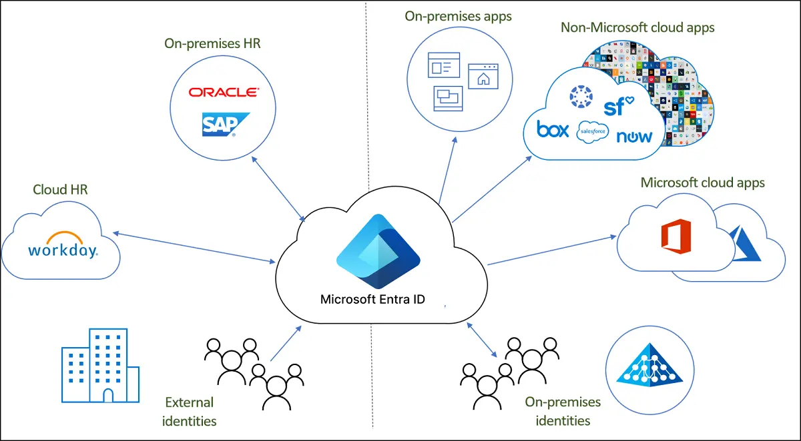

Credit: [What is identity provisioning?](https://learn.microsoft.com/en-us/entra/identity/hybrid/what-is-provisioning)

---

### One User, Two Directories

- The user has an object in on-premises AD DS
- A related user object exists in Microsoft Entra ID
- Synchronization links and updates the two objects
- The directories remain different services with different capabilities
- Hybrid identity does not merge AD DS and Entra ID into one database

---

### Separate Decisions

- **Provisioning:** Which objects should exist in Microsoft Entra ID?
- **Synchronization:** Which attributes should move between directories?
- **Authentication:** Where should the user prove their identity?
- **Single sign-on:** How can repeated credential prompts be reduced?

---

### Provisioning and Synchronization

- Provisioning creates, updates, and removes cloud identity objects
- Synchronization detects changes in the source directory
- Selected attributes are exported to Microsoft Entra ID
- Password hash synchronization is an optional authentication-related feature
- Synchronization alone does not provide single sign-on

---

### Source of Authority

- On-premises AD DS normally remains the source for synchronized users
- Administrators make most user attribute changes in AD DS
- The synchronization service exports those changes to Microsoft Entra ID
- Some cloud-to-AD features use writeback or cloud provisioning
- Ownership of each attribute should be planned before deployment

---

### Single Forest and Single Tenant

- One AD DS forest supplies identities to one Microsoft Entra tenant
- The forest may contain one or more AD domains
- This is the most common hybrid identity topology
- It avoids the identity-matching challenges of multi-forest designs
- Password hash synchronization is the normal starting point

---

### Basic Topology

1. Users and groups are created in on-premises AD DS
2. A synchronization service reads the selected objects
3. Corresponding objects are created in Microsoft Entra ID
4. Users authenticate by using the selected sign-in method
5. Microsoft Entra ID issues tokens for cloud applications

---

### Synchronization Platforms

- **Microsoft Entra Connect Sync** runs a full synchronization engine on-premises
- **Microsoft Entra Cloud Sync** uses lightweight on-premises agents
- Both can synchronize a single forest to a single tenant
- Cloud Sync configuration and orchestration are managed in Microsoft Entra ID
- Feature requirements determine which platform should be used

---

### Microsoft Entra Connect Sync

- Provides extensive synchronization rules and filtering options
- Supports device synchronization for Microsoft Entra hybrid join
- Can configure PHS (Password Hash Synchronization), PTA (Pass-through Authentication), Seamless SSO, and AD FS (Active Directory Federation Services) integration
- Requires a dedicated, secured Windows Server
- Only one active Connect Sync server should export to a tenant

---

### Microsoft Entra Connect Sync

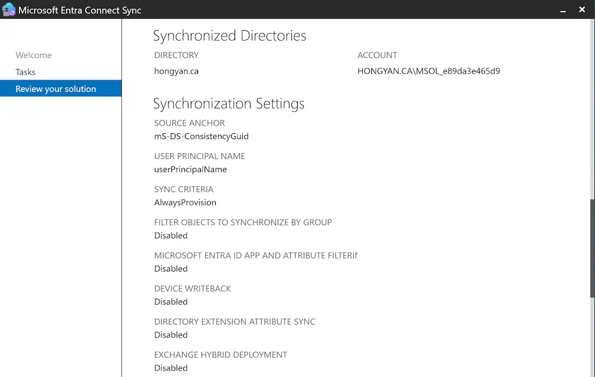

---

### Microsoft Entra Cloud Sync

- Uses lightweight agents instead of a full on-premises sync engine
- Stores synchronization configuration in Microsoft Entra ID
- Supports users, groups, contacts, and password hash synchronization
- Supports multiple active agents for availability
- Microsoft positions Cloud Sync as its strategic synchronization platform

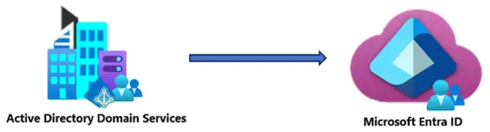

---

### Connect Sync or Cloud Sync?

<table>
  <thead>
    <tr>
      <th>Requirement</th>
      <th>Typical Choice</th>
    </tr>
  </thead>
  <tbody>
    <tr>
      <td>Basic users, groups, contacts, and PHS</td>
      <td>Evaluate Cloud Sync first</td>
    </tr>
    <tr>
      <td>Hybrid device synchronization</td>
      <td>Connect Sync</td>
    </tr>
    <tr>
      <td>Integrated PTA or AD FS configuration</td>
      <td>Connect Sync</td>
    </tr>
    <tr>
      <td>Disconnected forests</td>
      <td>Cloud Sync</td>
    </tr>
  </tbody>
</table>

---

### Preparing On-Premises Identities

- Identify which users, groups, and organizational units should synchronize
- Correct duplicate or invalid directory attributes before the first sync
- Use Microsoft IdFix to locate common directory problems
- Review existing cloud accounts to prevent unintended duplicate users
- Test with a small group before expanding the synchronization scope

---

### User Principal Name

- The **UPN** commonly becomes the user’s Microsoft Entra sign-in name
- A UPN looks like an email address, such as `alex@contoso.com`
- The UPN suffix should match a verified domain in Microsoft Entra ID
- An internal suffix such as `contoso.local` cannot be publicly verified
- Add a routable UPN suffix before synchronizing users

---

### Verified Custom Domain

- Every tenant includes a domain such as `contoso.onmicrosoft.com`
- Organizations normally add a public domain such as `contoso.com`
- Microsoft verifies domain ownership through a public DNS record
- A verified domain lets users keep a familiar sign-in name
- Complete verification before the initial production synchronization

---

### Custom Domain

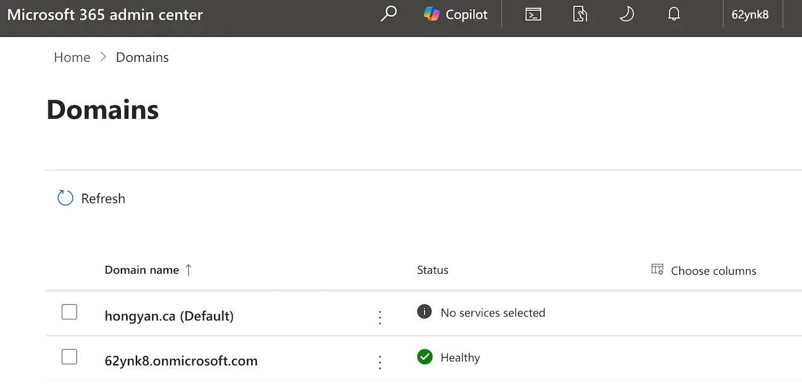

---

### Common Synchronized Objects

- Users and selected user attributes
- Security groups and distribution groups
- Group memberships
- Contacts
- Devices when Connect Sync and hybrid join are used

---

### Authentication Choices

- **Password Hash Synchronization:** Microsoft Entra ID validates the password
- **Pass-through Authentication:** An on-premises agent validates the password against AD DS
- **Federation:** Microsoft Entra ID redirects authentication to AD FS or another identity provider
- All three methods still require the user object to exist in Microsoft Entra ID

---

### Password Hash Synchronization

- PHS synchronizes a derived hash of the on-premises password hash
- Microsoft Entra ID performs the cloud authentication
- Users enter the same password used with on-premises AD DS
- The clear-text password is never synchronized
- PHS is the simplest option for most organizations

---

### Password Hash Synchronization

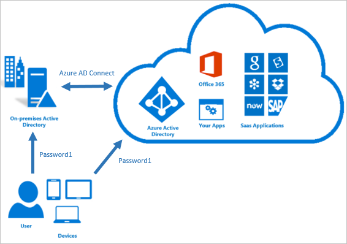

Credit: [What is PHS with Microsoft Entra ID](https://learn.microsoft.com/en-us/entra/identity/hybrid/connect/whatis-phs)

---

### PHS Authentication Flow

1. The user enters a username and password on the Microsoft Entra sign-in page
2. Microsoft Entra ID transforms the submitted password
3. Entra ID compares the result with the stored password-derived hash
4. Conditional Access and MFA requirements are evaluated
5. Entra ID issues tokens when authentication succeeds

---

### How PHS Works

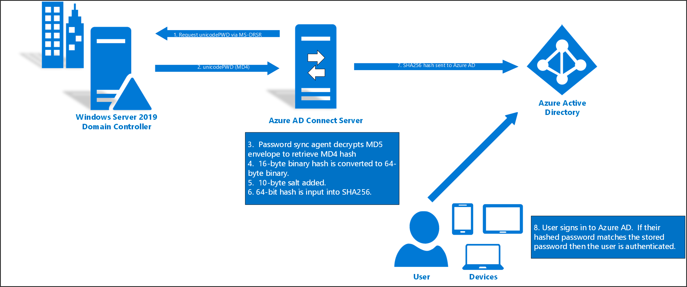

Credit: [How password hash synchronization works](https://learn.microsoft.com/en-us/entra/identity/hybrid/connect/how-to-connect-password-hash-synchronization)

---

### PHS Password Processing

- AD DS stores an NT password hash, not the clear-text password
- The synchronization agent retrieves the hash through the AD replication protocol
- The agent adds a per-user salt and applies additional hashing
- Entra ID receives the resulting password-derived hash over TLS
- The original reusable AD hash is not stored in Microsoft Entra ID

---

### PHS Strengths

- Requires the least authentication infrastructure
- Cloud sign-in continues during an on-premises outage
- Supports leaked-credential detection with Microsoft Entra ID Protection
- Can provide backup authentication for PTA or federation
- Password changes normally synchronize within minutes

---

### PHS Limitations

- On-premises account changes are not enforced instantly in the cloud
- A disabled account may retain access until synchronization and token controls take effect
- AD account lockout and password-expired states are not directly synchronized
- PHS stores a password-derived hash in Microsoft Entra ID
- Organizations must understand the timing of identity and password changes

---

### Pass-through Authentication

- PTA keeps password validation against on-premises AD DS
- Users enter credentials on the Microsoft Entra sign-in page
- A lightweight authentication agent handles the validation request
- The password is encrypted and is not stored in Microsoft Entra ID
- Microsoft Entra ID still issues the application tokens

---

### Pass-through Authentication

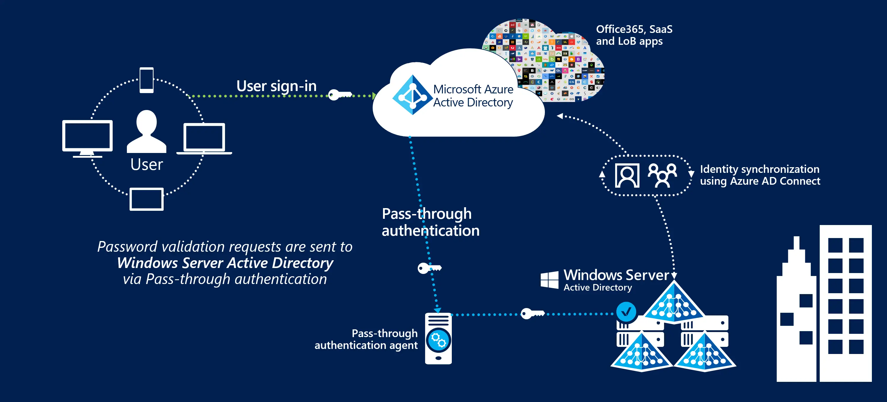

Credit: [What is Microsoft Entra pass-through authentication](https://learn.microsoft.com/en-us/entra/identity/hybrid/connect/how-to-connect-pta)

---

### PTA Authentication Flow

1. The user submits credentials to Microsoft Entra ID
2. Entra ID places an encrypted validation request in a tenant-specific queue
3. An on-premises PTA agent retrieves the request
4. The agent validates the credentials against a domain controller
5. The result returns to Entra ID for token issuance

---

### How PTA Works

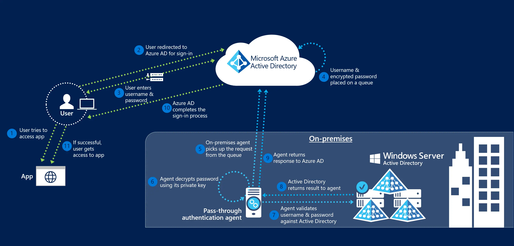

Credit: [How does Microsoft Entra PTA work](https://learn.microsoft.com/en-us/entra/identity/hybrid/connect/how-to-connect-pta-how-it-works)

---

### PTA Agent Architecture

- Agents make outbound connections to Microsoft Entra ID
- No inbound Internet connection is required
- Each agent must reach writable domain controllers
- Multiple agents provide redundancy and distribute requests
- Microsoft recommends three agents for production availability

---

### PTA Strengths and Limitations

- Enforces disabled, locked, expired-password, and sign-in-hour conditions during authentication
- Avoids storing a password-derived hash for the primary sign-in method
- Depends on agents, domain controllers, networking, and Internet access
- PHS can provide backup authentication, but failover requires an administrative change

---

### Federated Authentication

- Federation establishes trust between Entra ID and another identity provider
- AD FS is Microsoft’s on-premises federation service
- Microsoft Entra ID redirects users to the federation service
- The federation service authenticates users and issues signed claims
- Entra ID validates the claims before issuing cloud tokens

---

### Federated Authentication

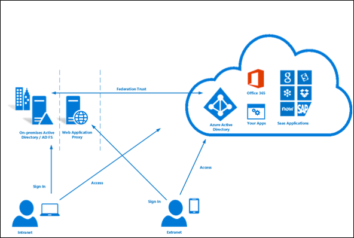

Credit:[What is federation with Microsoft Entra ID](https://learn.microsoft.com/en-us/entra/identity/hybrid/connect/whatis-fed)

---

### Federation Authentication Flow

1. The user requests access to a cloud application
2. Microsoft Entra ID identifies the user’s federated domain
3. The browser is redirected to AD FS or another trusted provider
4. The provider authenticates the user against AD DS
5. Entra ID validates the signed assertion and issues tokens

---

### Federation Infrastructure

- Internal AD FS servers authenticate users and issue security tokens
- Web Application Proxy servers publish AD FS for external users
- Load balancers provide service availability
- DNS, certificates, firewalls, and token-signing keys require ongoing management
- A production design must remove single points of failure

---

### Federation Strengths and Limitations

- Supports specialized authentication and third-party identity providers
- Can support third-party MFA or smartcard requirements
- Provides flexible claims and sign-in behavior
- Creates the largest on-premises dependency
- Requires more servers, monitoring, certificates, and troubleshooting

---

### AuthN Method Comparison

<table>
  <thead>
    <tr>
      <th>Feature</th>
      <th>PHS</th>
      <th>PTA</th>
      <th>Federation</th>
    </tr>
  </thead>
  <tbody>
    <tr>
      <td>Password validation</td>
      <td>Entra ID</td>
      <td>AD DS through agent</td>
      <td>AD FS or other provider</td>
    </tr>
    <tr>
      <td>On-premises sign-in dependency</td>
      <td>No</td>
      <td>Yes</td>
      <td>Yes</td>
    </tr>
    <tr>
      <td>Complexity</td>
      <td>Low</td>
      <td>Medium</td>
      <td>High</td>
    </tr>
    <tr>
      <td>Normal recommendation</td>
      <td>Default</td>
      <td>When AD validation is required</td>
      <td>For specialized requirements</td>
    </tr>
  </tbody>
</table>

---

### Choosing an Authentication Method

- Start with PHS when Microsoft Entra ID can meet the authentication requirements
- Consider PTA when each password sign-in must be validated by AD DS
- Use federation when a required authentication feature is unavailable in Entra ID
- Enable PHS as a backup when PTA or federation is selected
- Document the business requirement behind the final choice

---

### Choosing an Authentication Method

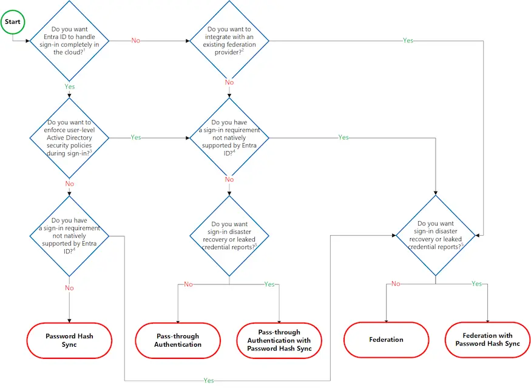

---

### Same Password or Single Sign-On?

- PHS and PTA allow the same password in both environments
- Reusing a password does not automatically provide SSO
- SSO means the user gains access without entering credentials again
- Device registration and authentication tokens provide modern SSO
- Seamless SSO can assist domain-joined devices on the corporate network

---

### Primary Refresh Token

- A **Primary Refresh Token** is a Microsoft Entra device authentication token
- Microsoft Entra joined, hybrid joined, or registered devices can receive a PRT
- The PRT helps the device request tokens for supported applications
- Users receive SSO without repeatedly entering their passwords
- PRT-based SSO is preferred for current Windows devices

---

### Microsoft Entra Seamless SSO

- Seamless SSO works with PHS or PTA
- It uses Kerberos for domain-joined devices on the corporate network
- Setup creates an `AZUREADSSOACC` computer account in AD DS
- If Seamless SSO fails, the normal sign-in page appears
- It does not apply to AD FS federation

---

### Microsoft Entra Seamless SSO

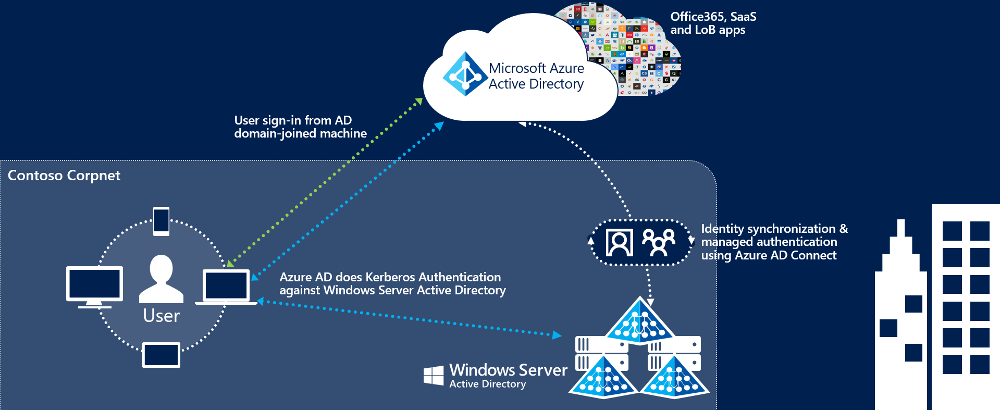

Credit: [Microsoft Entra seamless single sign-on](https://learn.microsoft.com/en-us/entra/identity/hybrid/connect/how-to-connect-sso)

---

### Device Identity Options

- **AD joined:** The device joins the on-premises AD DS domain
- **Microsoft Entra joined:** The device joins Microsoft Entra ID directly
- **Microsoft Entra hybrid joined:** The device joins AD DS and registers with Entra ID
- **Microsoft Entra registered:** A personal device registers a work account
- Device state can become a condition in Conditional Access

---

### Device Identity Options

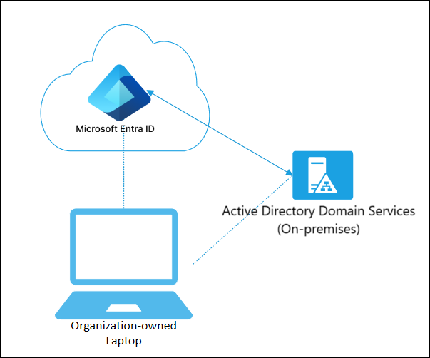

Credit: [Microsoft Entra hybrid joined devices](https://learn.microsoft.com/en-us/entra/identity/devices/concept-hybrid-join)

---

### Integration Plan

- Create or identify the Microsoft Entra tenant
- Add and verify the organization’s public domain
- Clean directory attributes and update user UPNs
- Select Connect Sync or Cloud Sync
- Select the authentication and SSO design

---

### Microsoft Entra Connect Server

- Install Connect Sync on a domain-joined Windows Server with the full GUI
- Use a supported Windows Server release and enable TLS 1.2
- Provide DNS and network access to AD DS and Microsoft Entra endpoints
- Restrict administration because the server handles privileged identity data
- Treat the server as a control-plane security asset

---

### Express or Custom Installation

- **Express settings** support the common single forest, single tenant, and PHS design
- Express settings synchronize the default scope with limited choices
- **Custom settings** provide filtering and additional sign-in methods
- Use custom settings for PTA, AD FS, staging mode, or selected organizational units
- Review the scope before allowing the initial synchronization to start

---

### Initial Synchronization

- Import selected objects from AD DS
- Apply synchronization rules and join matching objects
- Export new or changed objects to Microsoft Entra ID
- Review synchronization errors before expanding the scope
- Confirm that users have the expected cloud sign-in names

---

### Validation Tests

- Confirm that a test user appears in the correct tenant
- Verify the UPN, group memberships, and synchronization source
- Test sign-in to `https://myapps.microsoft.com`
- Change the on-premises password and observe the selected authentication method
- Test SSO from an appropriate corporate device

---

### Availability During an Outage

- PHS cloud authentication continues when on-premises AD DS is unavailable
- PTA fails if no authentication agent can reach a domain controller
- Federation fails if users cannot reach the federation service
- A Connect staging server protects synchronization, not active user authentication
- PHS backup reduces the risk of extended PTA or federation outages

---

### Security Practices

- Require MFA and use Conditional Access for cloud applications
- Maintain cloud-only emergency access accounts
- Limit administrative access to synchronization and authentication servers
- Monitor sign-in, synchronization, and agent health information
- Keep connectors, agents, certificates, and server software current

---

### Common Troubleshooting Checks

- Confirm that the user is inside the synchronization scope
- Check that the UPN suffix matches a verified custom domain
- Review duplicate attributes and synchronization errors
- Verify PTA agent or AD FS service health when applicable
- Test DNS, time synchronization, certificates, and outbound connectivity

---

### Scenario Questions

1. The organization wants the simplest and most resilient cloud sign-in method. Which method fits best?
2. Every password sign-in must immediately respect AD account lockout and sign-in hours. Which method fits best?
3. The organization requires an existing third-party federation provider. Which method fits best?
4. The main office loses connectivity to its domain controllers. Which method is most likely to keep cloud sign-in working?

---

### Scenario Answers

1. **Password Hash Synchronization**
2. **Pass-through Authentication**
3. **Federated Authentication**
4. **Password Hash Synchronization**

---

### Key Takeaways

- Hybrid identity links on-premises AD DS identities with Microsoft Entra ID
- Synchronization, authentication, and SSO solve different problems
- PHS is the normal starting point because it is simple and resilient
- PTA and federation add on-premises dependencies for specific requirements
- A successful deployment begins with clean identities and verified sign-in domains

---

### Resources

- [What is hybrid identity with Microsoft Entra ID?](https://learn.microsoft.com/en-us/entra/identity/hybrid/whatis-hybrid-identity)
- [Choose the right authentication method](https://learn.microsoft.com/en-us/entra/identity/hybrid/connect/choose-ad-authn)
- [Microsoft Entra Connect supported topologies](https://learn.microsoft.com/en-us/entra/identity/hybrid/connect/plan-connect-topologies)
- [Microsoft Entra seamless single sign-on](https://learn.microsoft.com/en-us/entra/identity/hybrid/connect/how-to-connect-sso)
- [Microsoft Entra Cloud Sync decision guide](https://learn.microsoft.com/en-us/entra/identity/hybrid/cloud-sync/connect-to-cloud-sync-decision-guide)
