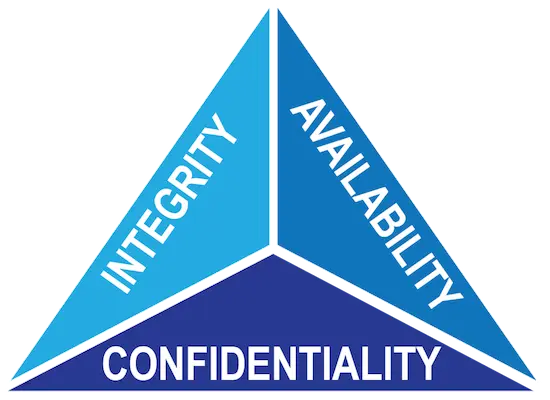
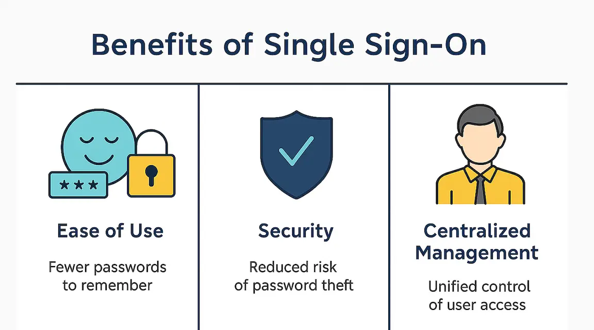
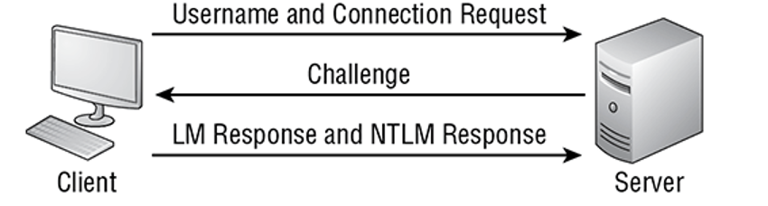
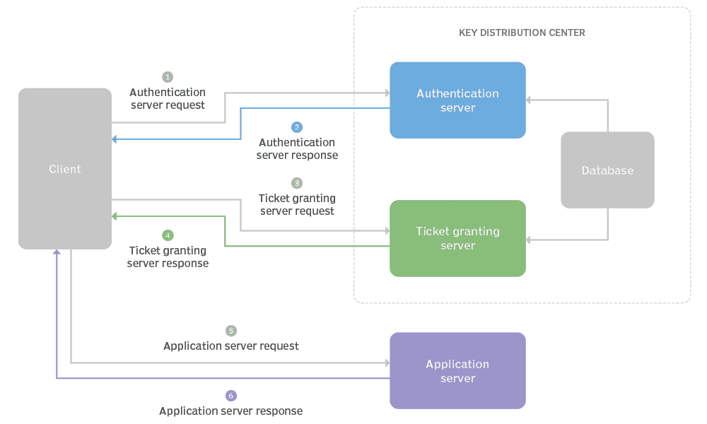
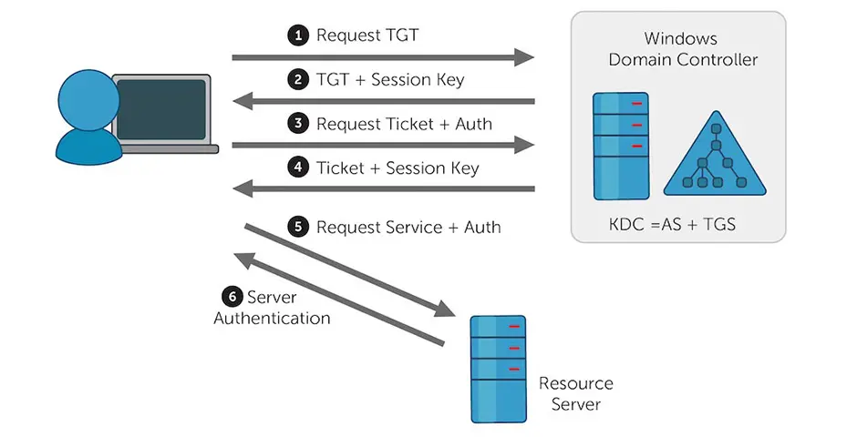
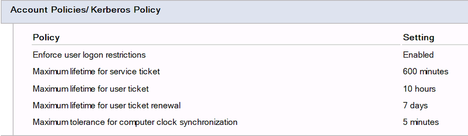
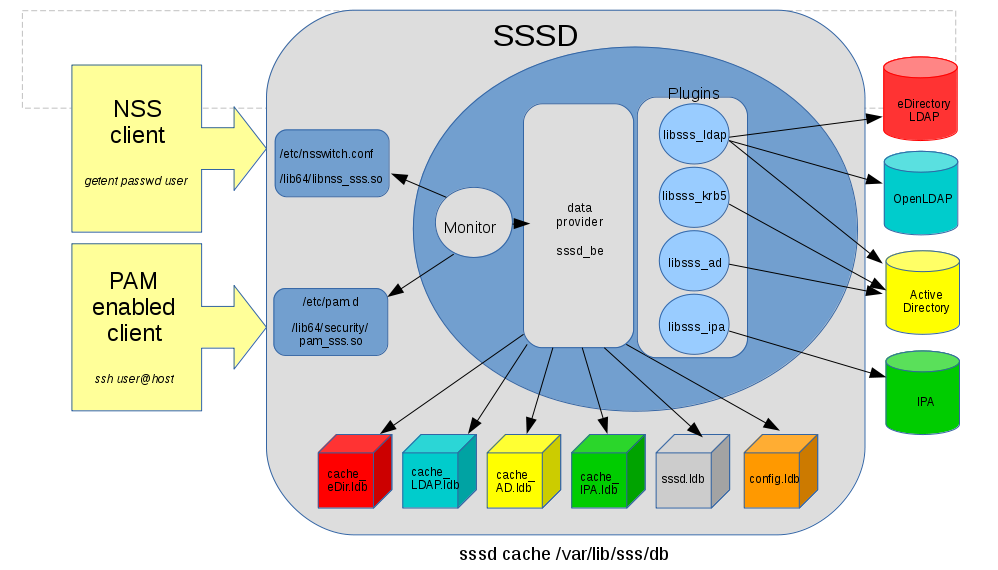

## Advanced Servers

## Kerberos Fundamentals

---

### CIA Triad

- "**CIA triad**" stands for **Confidentiality**, **Integrity**, and **Availability**.
- The CIA triad is a common model that forms the basis for the development of security systems.

---

### CIA Triad

- **Confidentiality** involves the efforts of an organization to make sure data is kept secret or private.
- **Integrity** involves making sure your data is trustworthy and free from tampering. The integrity of your data is maintained only if the data is authentic, accurate, and reliable.
- **Availability** means that systems, networks, and applications must be functioning as they should and when they should.

---

### Security in Windows

- Windows enterprise security is built around **identities, authentication, and authorization**.
- Active Directory provides centralized users, computers, groups, and policies.
- Kerberos is the primary authentication protocol in an AD domain.
- Security groups and permissions control access after authentication.
- DNS and time synchronization are critical supporting services.

---

### Authentication (AuthN)

- Authentication answers: **Who are you?**
- A system needs evidence that an identity is legitimate.
- Sending reusable passwords across the network creates security risks.
- Modern authentication protocols prove identity without repeatedly transmitting the password.
- Kerberos uses cryptographic keys and tickets to accomplish this.

---

### Authorization (AuthZ)

- **Authorization** determines what an authenticated identity (user, application, or service) can do and which resources it can access within a system.
- In most systems, authorization follows **authentication (AuthN)**. Once the system knows who you are, authorization determines what you’re allowed to do.

---

### Authorization (AuthZ)

- **Authorization** ensures that every authenticated identity operates within defined boundaries. Without it, a user who logs in successfully (**AuthN**) could access all sensitive data and perform any action (**AuthZ** failure).
- In **Zero Trust** architectures, authorization decisions are continuously evaluated throughout a session, not only at initial access.

---

### Authentication vs. Authorization

- **Authentication:** Who are you?
- **Authorization:** What are you allowed to do?
- Kerberos primarily provides authentication.
- Active Directory groups help organize authorization.
- **AGDLP** briefly summarizes Microsoft's recommendations for implementing role-based access controls (**RBAC**) using nested groups in a native-mode Active Directory (AD) domain.

---

### Single Sign-On

- **Single Sign-On (SSO)** allows users to authenticate once and access multiple authorized services.
- The user receives reusable authentication credentials called **tickets**.
- New services can be accessed without repeatedly entering the password.
- Each service still performs its own authorization checks.

---

### Single Sign-On

- Older systems required to authenticate over and over, making it very easy to capture.
- Being part of an enterprise network is an important piece of this – a user will have a centralized account – resources across the network will all recognize this credentials.
- As admins, we can then control the authorization for resources across the network

---

Credit: [What Is Single Sign-On (SSO) and How It Works](https://aws.plainenglish.io/what-is-single-sign-on-sso-and-how-it-works-596b4c0423fb)

---

#### NT LAN Manager (NTLM)

- Older Windows challenge-response authentication technology.
- Does not provide the same ticket-based SSO model.
- Still appears in Windows environments when Kerberos cannot be used.
- Modern AD environments should normally prefer Kerberos when possible.

---

#### Kerberos Authentication

- Kerberos is a standards-based network authentication protocol ([RFC 4120](https://www.rfc-editor.org/info/rfc4120/)).
- Active Directory uses **Kerberos Version 5**.
- Kerberos provides ticket-based authentication.
- Passwords do not need to be presented to every network service.
- Kerberos supports **mutual authentication**.

---

#### Kerberos Components

- **Client:** User or computer requesting access.
- **KDC:** Key Distribution Center.
- **AS:** Authentication Service.
- **TGS:** Ticket-Granting Service.
- **Application Server:** Provides the requested resource.
- In Active Directory, domain controllers provide KDC services.

---

#### Key Distribution Center

- The **KDC** provides two major Kerberos services:

  - Authentication Service (AS)

  - Ticket-Granting Service (TGS)

- **AS:** Provides the initial Ticket-Granting Ticket.
- **TGS:** Provides tickets for individual services.

---

#### Kerberos Uses Shared Secrets

- Kerberos identities have cryptographic keys.
- A user's credentials are associated with a long-term key.
- Services and computer accounts also have keys.
- The KDC knows the keys required to issue protected tickets.
- Temporary **session keys** are created for authenticated sessions.

---

#### Kerberos Does Not Send Your Password Everywhere

- The password is not sent to every file server or application.
- The client proves possession of the appropriate secret during authentication.
- The KDC issues protected tickets.
- Services validate tickets instead of asking for the user's password again.

---

### Kerberos Authentication Process

---

### How Kerberos Works

- The client authenticates itself to the **Authentication Server (AS)** which is part of the **[key distribution center](https://en.wikipedia.org/wiki/Key_distribution_center)** **(KDC)**.
- The KDC issues a **ticket-granting ticket (TGT)**, which is time stamped and encrypts it using the **ticket-granting service's (TGS)** secret key and returns the encrypted result to the user's workstation. This is done infrequently, typically at user logon; the TGT expires at some point although it may be transparently renewed by the user's session manager while they are logged in.

---

### How Kerberos Works

- When the client needs to communicate with a service on another node (a "**principal**"), the client sends the TGT to the TGS, which is another component of the KDC and usually shares the same host as the authentication server.
- The service must have already been registered with the TGS with a **Service Principal Name (SPN)**. The client uses the SPN to request access to this service.
- After verifying that the TGT is valid and that the user is permitted to access the requested service, the TGS issues a **service ticket (ST)** and session keys to the client.
- The client then sends the ticket to the **service server (SS)** along with its service request.

---

### Kerberos Realm

- A **realm** is an administrative Kerberos namespace.
- An Active Directory domain also functions as a Kerberos realm.
- The Kerberos realm normally matches the AD DNS domain.
- Realm names are conventionally written in uppercase:
  - AD domain: **sait.ca**
  - Kerberos Realm: **SAIT.CA**

---

### Kerberos Principals

- A **principal** is an identity known to Kerberos.
- Common Examples of Kerberos Principals:
  - **Standard User Principal**: `johndoe@SAIT.CA`
  - **Administrative User Principal**:  `johndoe/admin@SAIT.CA`
  - **Host Principal**:  `host/server1.sait.ca@SAIT.CA`
  - **Service Principal Name (SPN)**:  `nfs/storage01.sait.ca@SAIT.CA`
  - **HTTP Web Service Principal**:  `HTTP/www.example.com@EXAMPLE.COM`

---

### Service Principal Names

- A **Service Principal Name (SPN)** identifies a particular service.
- Kerberos needs to know **which service** the client wants to access.
- SPN Examples:
  - `host/server01`
  - `cifs/fileserver01`

- **SMB** commonly uses the `cifs` service class.

---

### AD Authn with Kerberos

- The user signs in with a **username, password, and domain**.
- The Windows Kerberos client needs to locate a Domain Controller.
- Active Directory publishes Domain Controllers through **DNS SRV records**.
- The Domain Controller also provides the **Kerberos Key Distribution Center (KDC)**.

---

### The Client Proves Its Identity

- The client does **not** send the user's plaintext password to the Domain Controller.
- The password is used locally to derive cryptographic key material.
- Kerberos pre-authentication proves that the client knows the correct secret.
- A timestamp helps protect the authentication exchange against replay attacks.

---

### The AS Exchange

- The client contacts the KDC's **Authentication Service (AS)**.
- The client sends an **AS-REQ** requesting initial Kerberos credentials.
- The Domain Controller verifies the user and pre-authentication information.
- If authentication succeeds, the KDC returns an **AS-REP**.
- The AS-REP contains the user's **Ticket-Granting Ticket (TGT)**.

---

### The Ticket-Granting Ticket

- The **TGT** proves that the KDC has authenticated the user.
- The client caches the TGT for later use.
- The user does not need to enter their password every time they access a domain service.
- The TGT is issued for the special Kerberos service:  `krbtgt/DOMAIN`
- This is the foundation of Kerberos **Single Sign-On**.

---

### Now the Client Wants a Resource

- Suppose the user wants to access a domain file server.
- The client needs a **service ticket** for that specific service.
- The client sends its TGT to the KDC's **Ticket-Granting Service (TGS)**.
- The requested service is identified by a **Service Principal Name (SPN)**: `cifs/fileserver.sait.ca`

---

### The TGS Exchange

- The client sends a **TGS-REQ** containing its TGT and the requested service.
- The KDC validates the TGT.
- If successful, the KDC returns a **TGS-REP**.
- The TGS-REP contains a **service ticket** for the requested resource.

---

### Using the Service Ticket

- The client now contacts the resource directly.
- The client presents the **service ticket**.
- The server validates the ticket using its own Kerberos key.
- The server now knows the authenticated identity of the user.
- The server then performs its own **authorization** checks.

---

### The DC Is Not in Every Request

- After the service ticket is issued:

  - The client can present the service ticket directly to the service.

  - The user's password is not sent to the file server.

  - The service ticket can be reused during its valid lifetime.

  - This makes Kerberos efficient for enterprise **Single Sign-On**.

---

### Windows Event ID 4768

- [Windows event ID 4768](https://learn.microsoft.com/en-us/previous-versions/windows/it-pro/windows-10/security/threat-protection/auditing/event-4768) is generated every time the KDC attempts to validate credentials.

---

### Why Time Matters

- Kerberos uses timestamps to help prevent replay attacks.
- Clients, servers, and domain controllers need synchronized clocks.
- Excessive clock skew can cause authentication to fail.
- Active Directory commonly uses a default tolerance of approximately **5 minutes**.

---

### Replay Protection

- An attacker should not be able to capture an authentication message and simply reuse it later.

  - Kerberos uses:

  - Timestamps

  - Authenticators

  - Ticket lifetimes

  - Replay detection

  - Freshness is an important part of Kerberos authentication.

---

### Ticket Lifetimes

- Kerberos tickets are temporary. Typical Active Directory defaults include:

  - **TGT:** 10 hours

  - **Service ticket:** 600 minutes

  - **Clock tolerance:** 5 minutes

---

### Kerberos Policy

- Active Directory Kerberos Policy controls settings such as:

  - Maximum user-ticket lifetime

  - Maximum service-ticket lifetime

  - Maximum ticket-renewal lifetime

  - Clock-synchronization tolerance

  - User logon restrictions

- Administrators can change these values through Kerberos Policy.

---

### Linux and Active Directory

- Linux systems can use **Active Directory accounts** for centralized authentication.
- The Linux server must be able to:
  - Find the Active Directory domain.
  - Communicate with the Domain Controller.
  - Authenticate users with Kerberos.
  - Resolve AD users and groups as Linux identities.
- **SSSD** provides the identity and authentication integration.

---

### SSSD

- **SSSD — System Security Services Daemon**
- Connects Linux to remote identity providers such as Active Directory.
- Provides:
  - User and group lookup
  - Authentication
  - Identity caching
  - Access control integration
- SSSD works with Linux **NSS** and **PAM**.

---

### AD Integration with SSSD

Credit: [Linux Active Directory Integration with SSSD](https://blog.ronnyvdb.net/2019/02/22/howto-linux-active-directory-integration-with-sssd/)

---

### Before Joining the Domain

- The Linux server must first be able to find and communicate with Active Directory.

- AD DNS allows Linux to locate Domain Controllers.
- Kerberos requires synchronized time.
- Kerberos authentication should work before attempting the domain join.

---

### Discovering Active Directory

- Active Directory publishes services through **DNS SRV records**.
- Linux can discover:
  - LDAP services
  - Kerberos services
  - Domain Controllers
- `realmd` uses this information to discover the AD domain.

---

### Joining the AD Domain

- Linux discovers the Active Directory domain.
- An authorized AD account authenticates to the Domain Controller.
- A **computer account** is created in Active Directory.
- Machine credentials are established.
- Kerberos configuration and keys are created.
- **SSSD** is configured to use Active Directory.

---

### Linux Becomes a Domain Member

- After the join, Active Directory contains a computer identity for the Linux server.

- The Linux server now has a trusted relationship with the domain.
- Machine credentials allow it to communicate securely with AD.
- **SSSD** can query AD for users and groups.

---

### AD Users Need Linux Identities

- Active Directory and Linux represent identities differently:

  - Active Directory provides: User account, Security groups, Security identifiers

  - Linux expects: Username, UID, GID, Group memberships, Home directory, Login shell

- **SSSD** bridges these two identity models.

---

### NSS and Domain Users

- **NSS** (**Name Service Switch**) allows Linux applications to look up users and groups.

- Domain users can appear to Linux applications like normal Linux identities.
- Tools such as `id` and `getent` use **NSS**.

---

### PAM and Domain Authentication

- **PAM** (**Pluggable Authentication Modules**) handles authentication for services such as: console login, `su`, SSH.

- **PAM** handles the Linux login process.
- **SSSD** communicates with Active Directory.
- **PAM** with **SSSD**:  User Login -> PAM -> SSD -> Active Directory 

---

### Domain User Authentication

- When an AD user logs in to Linux:

  - **SSSD** identifies the domain user.

  - Kerberos authenticates the credentials against Active Directory.

  - Linux creates an authenticated session if access is permitted.

- The Domain Controller is still the Kerberos KDC.
- Successful authentication provides Kerberos credentials for the domain user.

---

### Key Takeaways

- Kerberos is a **ticket-based authentication protocol** designed for secure network authentication and **Single Sign-On (SSO)**.
- The **KDC** provides two services: **Authentication Service (AS)** and **Ticket-Granting Service (TGS)**.
- The **AS exchange** authenticates the user and provides a **Ticket-Granting Ticket (TGT)**.
- The **TGS exchange** uses the TGT to obtain a **service ticket** for a specific service.
- Kerberos depends on **DNS, synchronized time, principals, and cryptographic keys**.
- **Kerberos authenticates; applications authorize.**

---

### Key Takeaways

- Active Directory uses **Kerberos V5** as its primary domain authentication protocol.
- A **Domain Controller** also provides the Kerberos **KDC**.
- Windows uses **DNS SRV records** to locate Domain Controllers.
- At logon, the client performs an **AS-REQ / AS-REP** exchange and receives a TGT for `krbtgt`.
- When accessing a network service, the client performs a **TGS-REQ / TGS-REP** exchange to obtain a service ticket.
- This ticket-based process provides **Single Sign-On** without repeatedly sending the user's password.

---

### Key Takeaways

- Linux can use **Active Directory** as a centralized identity and authentication source.
- **SSSD** integrates AD identities with Linux.
- **Kerberos** authenticates the domain user against the AD Domain Controller.
- **NSS** makes AD users and groups visible to Linux.
- **PAM** integrates domain authentication with Linux login, `su`, and SSH.
- After successful authentication, the domain user can receive a **TGT** and use Kerberos SSO.

---

### Resources

- [CIA Triad](https://www.fortinet.com/resources/cyberglossary/cia-triad)
- https://auth0.com/intro-to-iam/what-is-authentication
- https://auth0.com/intro-to-iam/what-is-authorization
- https://en.wikipedia.org/wiki/Kerberos_(protocol)
- [Kerberos Network Authentication Service (V5) Synopsis](https://learn.microsoft.com/en-us/openspecs/windows_protocols/ms-kile/b4af186e-b2ff-43f9-b18e-eedb366abf13)
- [Windows event ID 4768](https://learn.microsoft.com/en-us/previous-versions/windows/it-pro/windows-10/security/threat-protection/auditing/event-4768)
- [Linux Active Directory Integration with SSSD](https://blog.ronnyvdb.net/2019/02/22/howto-linux-active-directory-integration-with-sssd/)
- [SSSD and UID and GID Numbers](https://docs.redhat.com/en/documentation/red_hat_enterprise_linux/6/html/deployment_guide/sssd-system-uids)