## Advanced Servers

## Linux Monitoring

---

### Why is Monitoring Important

- **Core Infrastructure Role:** Linux servers form the backbone of modern enterprise, cloud infrastructure, web applications.
- **Operational Goal:** Maintaining smooth, reliable performance across all hosted workloads is essential.
- **Role of Monitoring & Alerting:** Enables system administrators to safeguard uptime, optimize performance, and harden security.
- **Proactive Prevention:** Identifies potential system anomalies and risks early, preventing them from escalating into major outages.

---

### Why Linux Monitoring Matters

- **Performance:** Detect high CPU, memory, disk, or network usage before it affects users.
- **Security:** Identify unusual processes, failed logins, or suspicious behavior early.
- **Compliance:** Maintain audit trails and meet regulatory or industry-specific requirements.
- **Availability:** Prevent outages and reduce Mean Time to Recovery (MTTR).
- **Efficiency:** Optimize resources, avoid over-provisioning, and streamline operations.

Source: https://tuxcare.com/blog/linux-monitoring/

---

### System Performance Metrics

- **CPU Usage**: Load percentage, idle time, and context switching.

- **Memory Usage**: RAM consumption, swap utilization, and buffer/cache metrics.

- **Disk I/O**: Read/write speeds, latency, and disk queue length.

---

### Network Metrics

- **Bandwidth Usage**: Incoming and outgoing traffic statistics.

- **Latency & Packet Loss**: Connectivity health and round-trip time.

- **Open Ports & Connections**: Identifying unauthorized or excessive connections.

---

### System Health Metrics

- **Load Average**: A measure of CPU demand over time.

- **Disk Space Usage**: Preventing full partitions that could disrupt services.

- **System Temperature**: Avoiding hardware failures due to overheating.

---

### Security Metrics

- **Failed Login Attempts**: Signs of brute-force attacks.

- **Process Anomalies**: Detecting rogue or compromised processes.

- **Firewall Logs**: Monitoring for unauthorized access attempts.

---

### The Monitoring Mindset

- **Observe the Symptom:** Note the specific behavior, error, or slowdown occurring on the system.
- **Establish a Baseline:** Compare current behavior against normal operational metrics to confirm anomalies.
- **Narrow the Stressed Resource:** Pinpoint the constrained hardware or OS subsystem (CPU, memory, disk I/O, or network).

---

### The Monitoring Mindset

- **Identify the Responsible Process/Service:** Trace the bottleneck to the exact PID, application, or daemon causing the load.
- **Correlate Metrics with Logs:** Cross-reference resource spikes against system, application, and access logs for root-cause context.
- **Change One Thing & Measure:** Apply a single fix or tuning parameter, then re-measure to evaluate the impact.

---

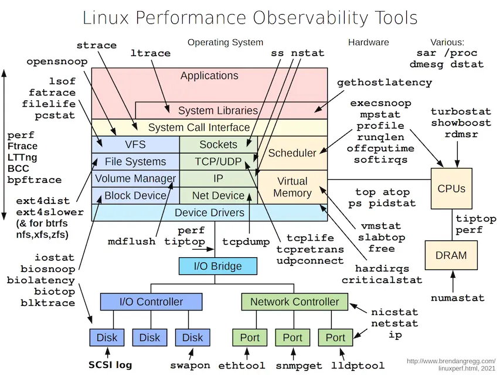

Credit: https://www.brendangregg.com/linuxperf.html

---

### `top` Command

- The Linux `top` command is an interactive utility that displays active processes alongside overall CPU, memory, and uptime metrics in real-time:

  - Displays a live list of running processes with resource consumption details

  - Shows overall CPU usage, memory usage, and load averages

  - Updates system statistics continuously without restarting the command

Read: [`top` Command with Examples](https://www.geeksforgeeks.org/linux-unix/top-command-in-linux-with-examples/)

---

### `top` Command

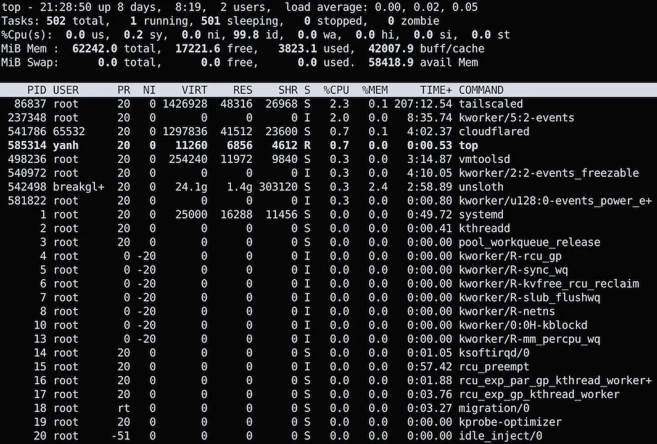

---

### `htop` - Visual on CPU Metrics

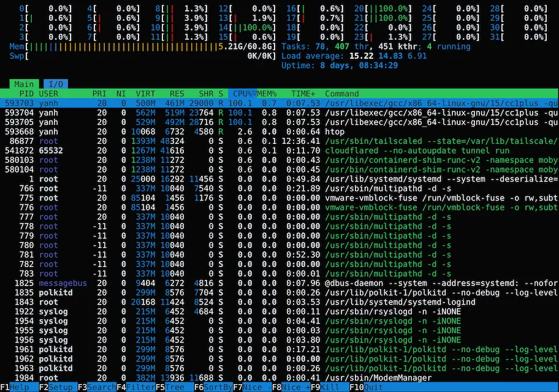

---

### `btop` - the Lamborghini of `top`s

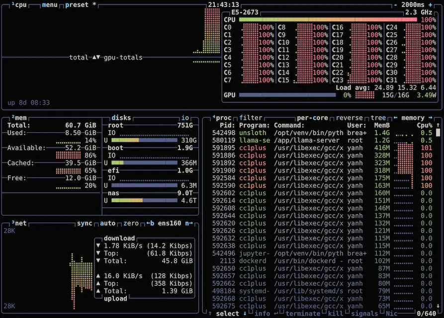

---

### `ps` (Process Status) command

- `ps`  in Linux is a built-in utility used to view a **snapshot of currently running processes** on your system.
- Unlike `top` or `htop`, which provide real-time updates, `ps` gives a static picture of the exact moment it is executed.

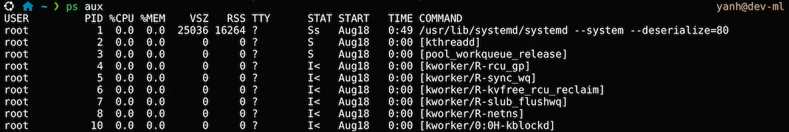

Read: [`ps` Command](https://manpages.ubuntu.com/manpages/noble/man1/ps.1.html)

---

### `sysstat` Package - `mpstat`

- `mpstat` reports individual and overall processor (CPU) performance and utilization statistics

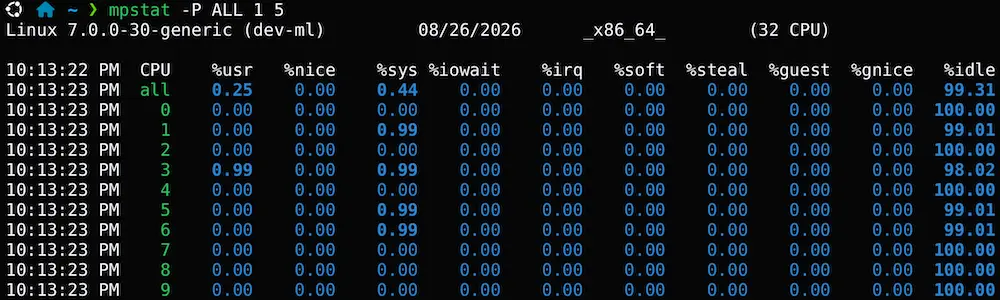

---

### `sysstat` Package - `pidstat`

- `pidstat` reports detailed resource utilization statistics for individual tasks or processes managed by the kernel

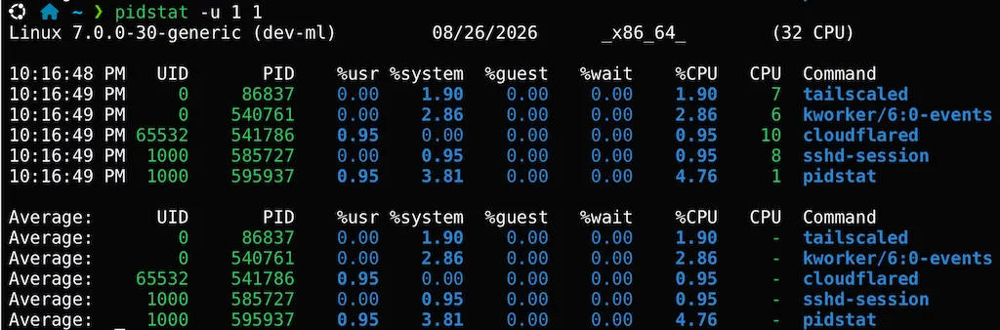

---

### `vmstat` - Pressure in One Screen

- `vmstat` reports real-time and average system performance data, including memory, processes, CPU, and disk input/output.

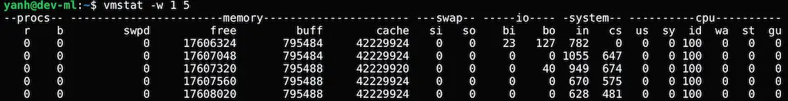

Read: [Exploring virtual memory with `vmstat`](https://www.redhat.com/en/blog/linux-commands-vmstat)

---

###  `iotop` - Storage Performance

- `iotop` is a command-line utility in Linux that monitors disk input/output (I/O) usage in real time, similar to how the `top` command monitors CPU and memory.

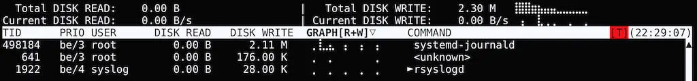

---

### `df` - Storage Capacity

- **`df` (disk free) command** displays the amount of available and used disk space on your mounted file systems.

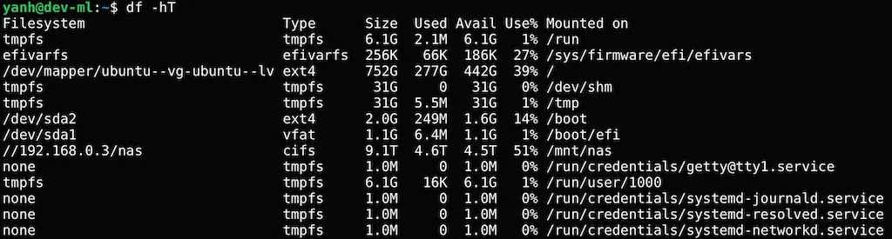

---

### `du` - Storage Consumption

- **`du` (disk usage) command** in Linux is a standard utility used to estimate and track the space consumed by files and directories. Learn [`du` and the options](https://www.redhat.com/en/blog/du-command-options).

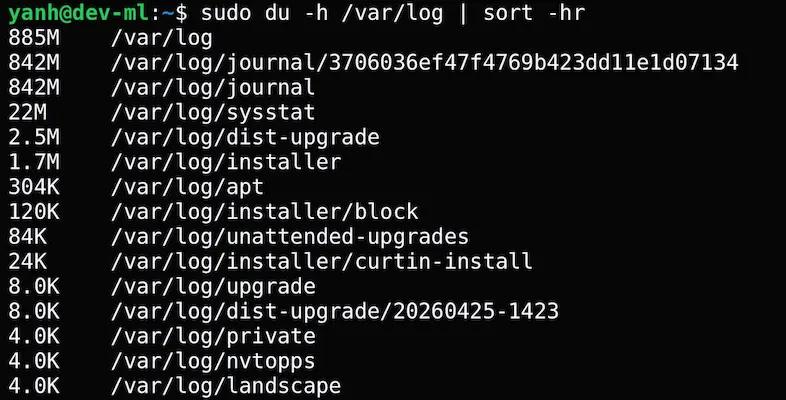

---

### `lsblk` - Block Device Information

- The `lsblk` command in Linux lists information about all available or specified block devices like hard drives, solid-state drives, and partitions in a tree-like format.

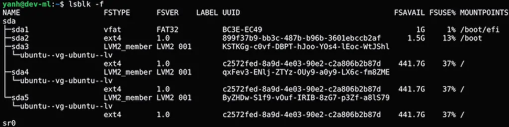

---

### `iostat` - Storage Performance

- `iostat` is a tool used to monitor system input/output (I/O) performance and CPU utilization.

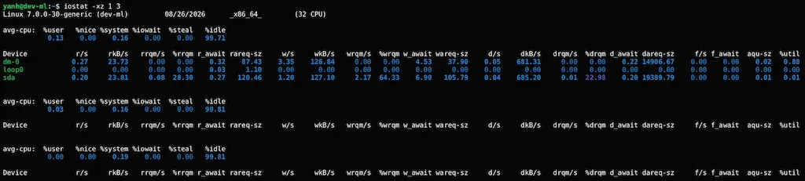

---

### `ip -s link` - Network Monitoring

- **`ip` command** in Linux is a powerful command-line utility used to network configure, manage, and troubleshoot network interfaces, IP addresses, and routing tables.
- The `watch -n 2 'ip -s link'` command monitors network interface statistics (like packets transmitted, received, and errors) in real time.

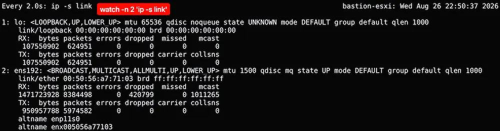

---

### `ss` - Sockets and Listening Services

- **`ss` command** (Socket Statistics) is a powerful Linux command-line utility used to dump socket statistics and display detailed network connection information. It serves as the modern, much faster replacement for the deprecated `netstat` command.

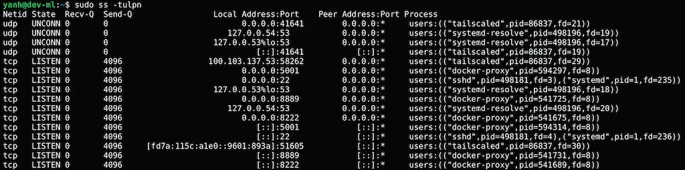

---

### `iftop` - Who is Using the Network

- **`iftop` command** (Interface TOP) is a real-time network bandwidth monitoring tool for Linux.

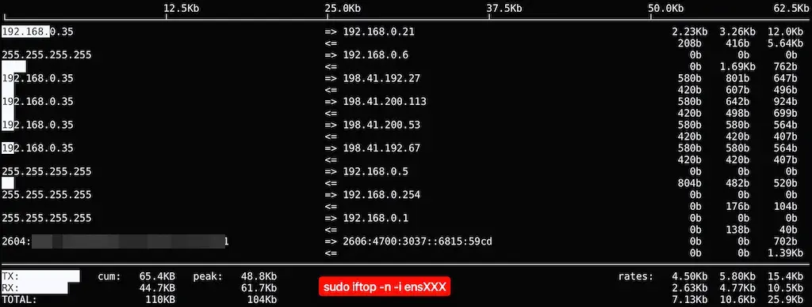

---

### `systemctl` for `systemd` Introspection

- `systemctl --failed` lists all systemd units (such as services, sockets, or timers) that have entered a **failed** state, making it quick to spot crashed or misconfigured system components.
- `systemctl show ssh -p ActiveState -p SubState -p MainPID` displays only the active state, sub-state, and main process ID (PID) of the SSH service.

---

### `journalctl` - Query and View logs

- **`journalctl` command** is a powerful Linux utility used to query and view logs generated by the **`systemd-journald`** service.

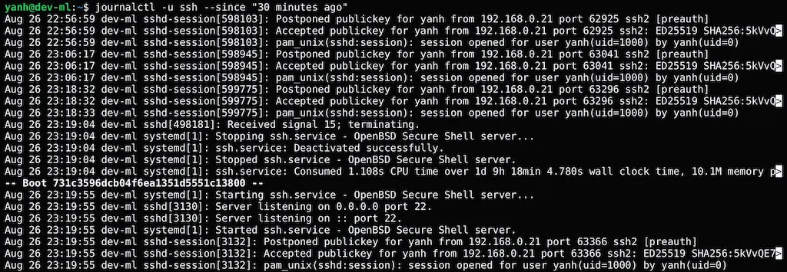

---

### Linux Troubleshooting Workflow

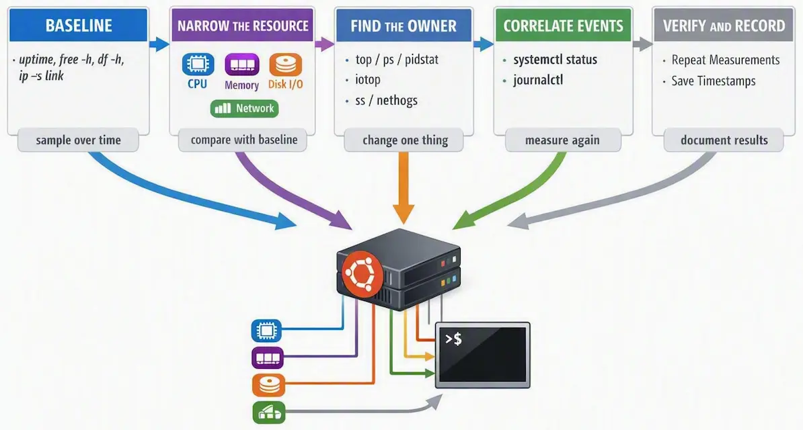

---

### Open-Source Monitoring Solutions

- [**Nagios**](https://www.nagios.org/)

  - One of the most widely used monitoring tools for servers and applications.

  - Provides comprehensive alerting and logging capabilities.

  - Supports plugins to extend functionality.

---

### Open-Source Monitoring Solutions

- [**Zabbix**](https://www.zabbix.com/)

  - Enterprise-grade monitoring tool with automatic detection of network devices.

  - Offers visualization with dashboards and graphs.

  - Supports distributed monitoring for large-scale environments.

---

### Open-Source Monitoring Solutions

- **[Prometheus](https://prometheus.io/) & [Grafana](https://grafana.com/)**
  - **Prometheus**: Time-series database for collecting real-time metrics.
  - **Grafana**: Visualization tool that integrates with Prometheus for creating dashboards.
  - Highly scalable and commonly used for cloud monitoring.

---

### Open-Source Monitoring Solutions

- [**Netdata**](https://www.netdata.cloud/)
  - Lightweight monitoring tool for real-time performance tracking.
  - User-friendly web-based interface with detailed system insights.

---

### Resources

- [2026 Linux Monitoring: 10+ Ways To Monitor, Tools & More for Sysadmins](https://tuxcare.com/blog/linux-monitoring/)
- [Top 10 ways to monitor Linux in the console - Jeff Geerling](https://www.jeffgeerling.com/blog/2025/top-10-ways-monitor-linux-console/)
- [Video: Top 10 ways to monitor Linux in the console - Jeff Geerling](https://www.youtube.com/watch?v=4isEhE2rvmA)
- [Stay Ahead of the Game: Essential Tools and Techniques for Linux Server Monitoring | Linux Journal](https://www.linuxjournal.com/content/stay-ahead-game-essential-tools-and-techniques-linux-server-monitoring)
- [Linux Performance](https://www.brendangregg.com/linuxperf.html)

---

### Resources

- [`top` Command in Linux](https://www.geeksforgeeks.org/linux-unix/top-command-in-linux-with-examples/)
- [`ps` command](https://manpages.ubuntu.com/manpages/noble/man1/ps.1.html)
- [`ip` command](https://man7.org/linux/man-pages/man8/ip.8.html)
- [`systemctl` command](https://man7.org/linux/man-pages/man1/systemctl.1.html)
- [`journalctl` command](https://man7.org/linux/man-pages/man1/journalctl.1.html)