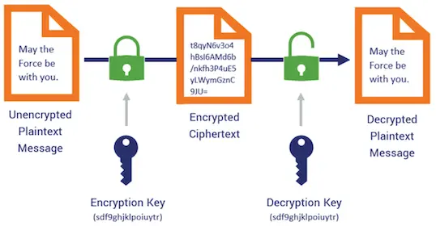
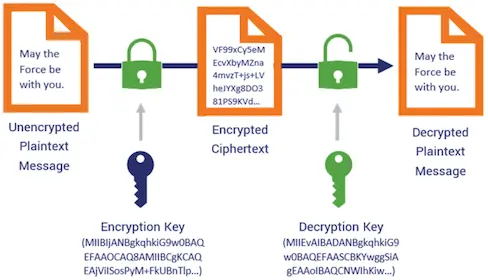
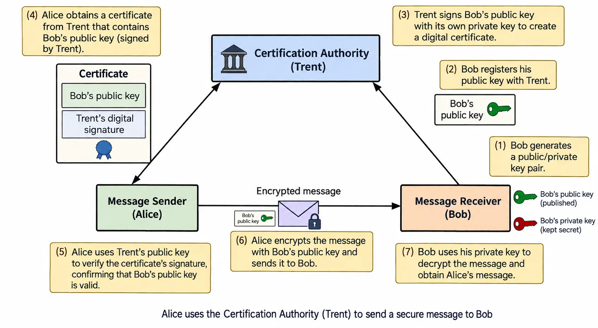
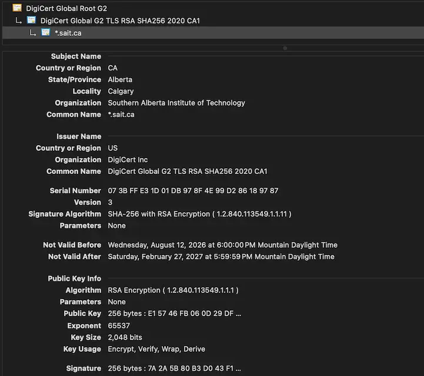
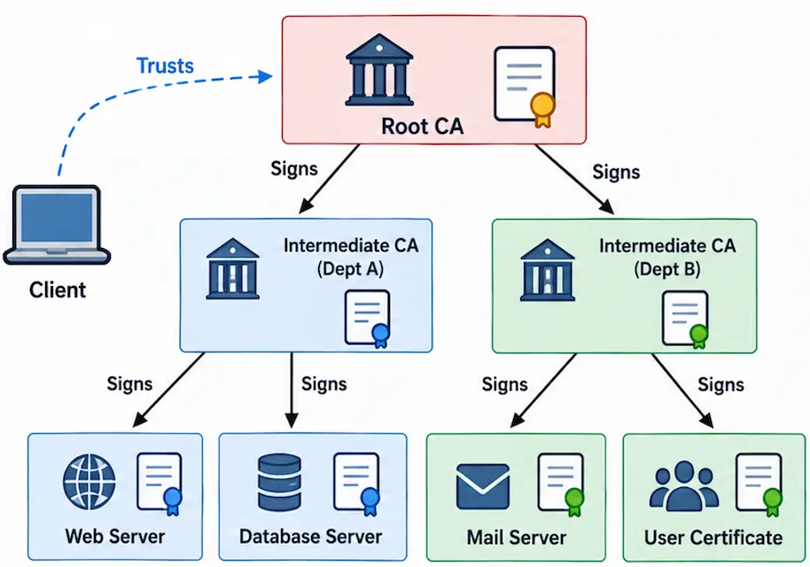
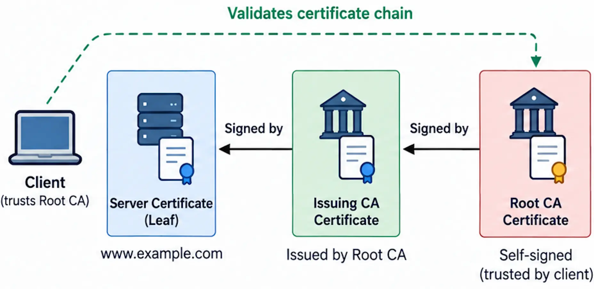
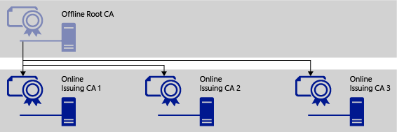
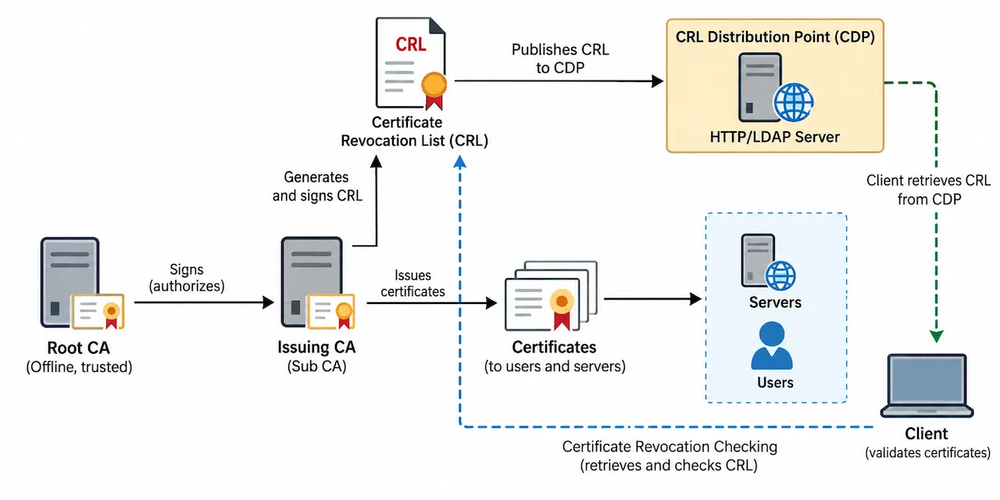
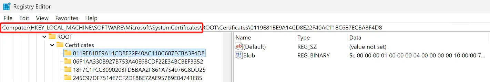
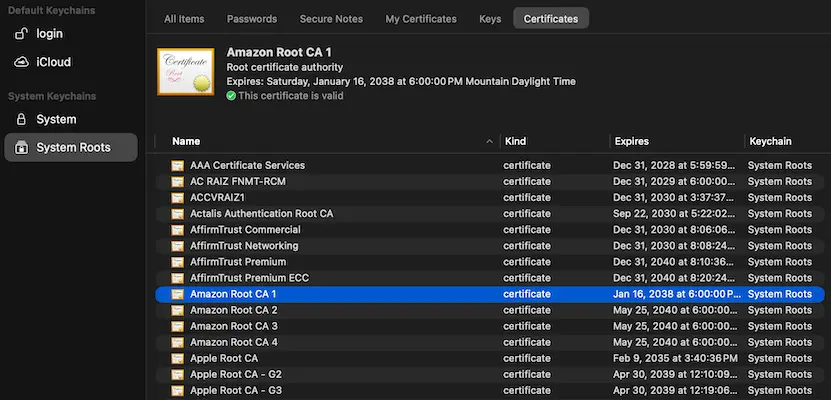

## Advanced Servers

## PKI - Certificates and Trust

---

### Symmetric Encryption

- Uses **one shared secret key**. The same key is used to encrypt and decrypt data.
- Both sides must already have the secret key.
- Very fast and efficient. Commonly used to encrypt large amounts of data.
- **Challenge:** How to securely share the secret key?

---

### Asymmetric Encryption

- Uses a **pair of related keys**: **Public key** can be shared with anyone; **Private key** kept secret by the owner.
- Data encrypted with one key requires the related key.
- The two keys **do not need to be secretly shared**.
- **New challenge:** Alice has Bob's public key, but how does she know it **really belongs to Bob**?

---

### The Identity Problem

- Encryption can protect a connection
- But encryption does **not automatically prove identity**
- A public key may be genuine but belong to the wrong person
- We need a trusted way to connect an identity to a public key

- **Example:** A server gives you a public key. How do you know it really belongs to the server you intended to contact?

---

### The Missing Question

- A public key is only data
- The key does not identify its owner by itself
- An attacker could present a different public key
- The receiver needs a trusted statement about ownership
- A digital certificate provides that statement

---

### What Is a Digital Certificate?

- A certificate is a signed electronic identity document
- It identifies a user, computer, service, or CA
- It contains the subject’s public key
- It identifies the organization that issued it
- It defines when and how the certificate may be used

---

### Certificate or Private Key?

- **Certificate**

  - Contains identity information and the public key

  - Can normally be shared

  - Is signed by a CA

- **Private key**

  - Is stored separately and must be protected

  - Proves control of the certificate

  - Must not be sent with the certificate

---

### Certificate in Action

---

### What PKI Provides

- **Encryption** protects confidentiality
- **Digital signatures** help prove origin and integrity
- **Authentication** connects the key to an identity
- **PKI** provides the trust system around these operations

- Active Directory Certificate Services (AD CS) supports encryption, digital signatures, and authentication by associating certificate keys with users, computers, and devices.

---

### Reading a Certificate

- Important fields include:

  - **Subject:** Who the certificate identifies

  - **Issuer:** The CA that signed the certificate

  - **Serial number:** A unique number assigned by the issuer

  - **Valid from / valid to:** The certificate’s lifetime

  - **Public key:** The subject’s public key

  - **Extensions:** Names, purposes, constraints, and locations

---

### Inspect a Certificate

---

### Digital Signatures on Certificates

- The CA calculates a digest of the certificate data
- The CA signs the result with its private key
- A client verifies the signature using the CA’s public key
- A valid signature shows that the certificate was not altered
- Trust still depends on whether the client trusts the CA

- A valid signature proves integrity and issuer control; it does not mean that every statement in a certificate should automatically be trusted.

---

### What Is a Certification Authority

- A Certification Authority is a trusted certificate issuer
- It reviews or validates certificate requests
- It signs approved certificates
- It renews and revokes certificates
- It publishes information required for validation

- AD CS uses root and subordinate CAs to issue certificates and manage certificate validity.

---

### Conceptual Certificate Issuance

- A subject creates a public/private key pair
- The subject creates a certificate request
- The CA evaluates the request
- The CA signs an approved certificate
- The certificate is returned to the subject
- Other systems can validate the CA’s signature

- Note: The private key normally remains under the subject’s control.

---

### Trust Is Delegated

- A client does not need to know every server personally
- The client trusts selected Root CAs
- A trusted Root CA can certify another CA
- That CA can issue certificates to services
- Trust is delegated through signed certificates

---

### Trust Is Delegated

---

### The Certificate Chain

- A normal enterprise chain contains:

  - A server or user certificate

  - An Issuing CA certificate

  - A Root CA certificate

- To validate the leaf certificate, the client checks the certificates that connect it to a trusted root.

---

### The Certificate Chain

---

### Root, Subordinate, and Issuing CAs

- The **Root CA** is the trust anchor
- A **Subordinate CA** is certified by another CA
- An **Issuing CA** issues certificates to users, computers, and services
- A subordinate CA can also be an issuing CA
- Separating CA roles limits exposure of the root

---

### Why Use Two Tiers

- **Tier 1: Root CA**

  - Protects the top-level signing key

  - Certifies the Issuing CA

  - Is used only for limited operations

- **Tier 2: Issuing CA**

  - Remains available to the domain

  - Processes normal certificate requests

  - Issues and revokes operational certificates

---

### Standalone Root CA

- Does not depend on Active Directory
- Is not used for routine auto-enrollment
- Uses controlled administrative approval
- Issues very few certificates
- Can remain disconnected during normal operations

---

### ADCS - Enterprise Issuing CA

- Is integrated with Active Directory
- Can use certificate templates
- Can use AD identities and groups
- Supports automated enterprise enrollment
- Must remain available for normal certificate services

- Note: Only Enterprise CAs issue certificates from AD-integrated certificate templates.

---

### Two-Tier Hierarchy

- By pairing an offline root CA with online subordinate CAs, the widely recommended two-tier hierarchy provides an optimal, cost-effective balance of security, scalability, and manageability for most organizations.

Credit: [Securing PKI: Planning a CA Hierarchy](https://learn.microsoft.com/en-us/previous-versions/windows/it-pro/windows-server-2012-r2-and-2012/)

---

### Why Take the Root CA Offline

- The Root CA private key protects the entire hierarchy
- A network-connected system has more exposure
- Daily issuance does not require the Root CA
- The Issuing CA handles routine operations
- The Root CA is brought online only for controlled tasks

- Note: In secure deployments, Microsoft recommends that the Root CA be offline and physically secured.

---

### Offline Does Not Mean Forgotten

- An offline Root CA still requires:

  - Physical protection

  - Secure administrator access

  - CA database and key backups

  - Planned certificate renewal

  - Planned Root CA CRL publication

  - Documented startup and shutdown procedures

---

###  Authority Information Access

- AIA means **Authority Information Access**
- AIA identifies where an issuing CA certificate can be obtained
- It helps a client find a missing intermediate certificate
- It helps complete the certificate chain
- AIA does not automatically make an unknown Root CA trusted

- Note: Windows can use an AIA URL to retrieve missing intermediate CA certificates during chain building. 

---

### Expiration and Revocation

- **Expiration**

  - Occurs at the planned end of validity

  - Is recorded directly in the certificate

- **Revocation**

  - Cancels a certificate before it expires

  - May occur after key compromise or incorrect issuance

  - Requires clients to obtain updated status information

---

### CRL and CDP

- A CRL is a **Certificate Revocation List**
- It contains serial numbers of revoked certificates
- The CA signs the CRL
- A CDP is a **CRL Distribution Point**
- The CDP tells clients where the CRL can be retrieved

- A current CRL must be reachable if an application requires revocation checking.

---

### Two-Tier PKI with CRL and CDP

---

### Publishing and Distribution

- **Publishing** places a CA certificate or CRL at a location
- **Distribution** makes that location reachable by clients
- A file share may be used for CA publication
- HTTP may be used for client retrieval
- DNS provides a stable name for the publication service

- Note: AIA and CDP addresses should be planned before certificates are issued because previously issued certificates continue to contain their original locations.

---

### How a Client Validates a Certificate

- The client asks:

  - Is the certificate currently valid?

  - Is every signature in the chain valid?

  - Can the chain reach a trusted root?

  - Is the certificate permitted for this use?

  - Has any certificate been revoked?

  - Does the identity match the expected service?

- [Microsoft’s Schannel guidance](https://learn.microsoft.com/en-us/windows-server/security/tls/tls-ssl-schannel-ssp-overview) includes chain, time, revocation, usage, trust, and server-identity checks.

---

### Certificates Revoked

- [Several Iranian banking websites and digital platforms have had their SSL/TLS certificates revoked](https://digiato.global/report/iran-banks-tls-certificate-revocations/) by international CAs due to US sanctions against Iran.
- Once revoked, client browsers verifying status (via CRL or OCSP) will immediately display severe security warnings, blocking normal HTTPS access.
- Replacing global CAs with untrusted local/national root CAs forces users to manually install root certs, fatally weakening their security against Man-in-the-Middle attacks.
- Read: [US Sanctions Cripple Iranian Bank SSL Certificates](https://securityonline.info/iranian-bank-ssl-certificates/)

---

### Why Certificates Are Necessary

- **Mitigating Man-in-the-Middle (MitM) Attacks:** Distributing public keys directly over untrusted channels exposes users to tampering and impersonation.   
- **Delegated Verification:** Digital certificates cryptographically bind an entity's identity to their public key via a Certificate Authority’s (CA) signature.   
- **Rule of Thumb:** If you can obtain a trusted public key directly out-of-band, a CA is not required; otherwise, a trusted CA acts as the verification proxy.

---

### Proprietary vs. Open PKI Standards

- **Avoid "Security through Obscurity":** In-house, proprietary encryption or authentication schemes are inherently risky; single organizations cannot match the global peer-review of standard cryptography.   
- **Open Standards ≠ Leaked Secrets:** Use publicly audited, standardized PKI protocols while keeping implementation credentials and private internal network details confidential.   
- **Resilience:** If standard protocols are exposed, security remains intact; if proprietary "secret" schemes leak, security completely collapses.

---

### Why Should We Trust a CA

- **The Root of Trust:** Trusting a CA functions like trusting a bank or food vendor—it is grounded in reputation, regulation, and social consensus rather than pure mathematics.   
- **Pre-installed Trust Anchors:** Browsers and operating systems come pre-packaged with trusted root certificates; users inherently delegate trust to reputable software vendors.   
- **Beyond Hierarchical Chains:** CA hierarchies do not create trust out of nothing; digital trust always builds upon existing external channels, real-world credentials, and established multi-source reputation.

---

### `Windows` Certificate Store

- **Storage Architecture:** Registry-backed binary stores managed via CryptoAPI/CNG rather than flat filesystem files.

- **GUI Management:** `certlm.msc` (Local Machine) or `certmgr.msc` (Current User).
- **Registry Locations**:

---

### `Linux` Certificate Trust Bundles

- **Storage Architecture:** Plaintext PEM certificate drop directories compiled by distribution scripts into a monolithic runtime bundle.

- **Debian / Ubuntu:**

  - Drop `.crt` files to path: `/usr/local/share/ca-certificates/*.crt`

  - Compiled Bundle: `/etc/ssl/certs/ca-certificates.crt`

  - Update Command: `sudo update-ca-certificates`

---

### `macOS` Keychain Architecture

- **Storage Architecture:** Binary Apple Keychain databases split strictly by privilege and System Integrity Protection (SIP).

- **GUI Management:** **Keychain Access.app**

---

### Resources

- [Asymmetric vs Symmetric Encryption](https://www.thesslstore.com/blog/asymmetric-vs-symmetric-encryption/)
- [Securing PKI: Planning a CA Hierarchy](https://learn.microsoft.com/en-us/previous-versions/windows/it-pro/windows-server-2012-r2-and-2012/)
- [Microsoft PKI Planning and Deploying Certificate Services](https://www.petenetlive.com/KB/Article/0001309)
- [Schannel SSP Technical Overview](https://learn.microsoft.com/en-us/previous-versions/windows/it-pro/windows-server-2012-r2-and-2012/dn786429(v=ws.11))
- [TLS/SSL overview (Schannel SSP)](https://learn.microsoft.com/en-us/windows-server/security/tls/tls-ssl-schannel-ssp-overview) 

---

### AI Disclaimer

- M365 Copilot was used to select topics about PKI.
- I sketch concepts on my iPad with an Apple Pencil and use ChatGPT Images 2.5 to render them. Every AI-generated illustration is manually reviewed and verified.