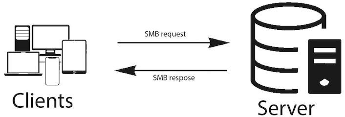
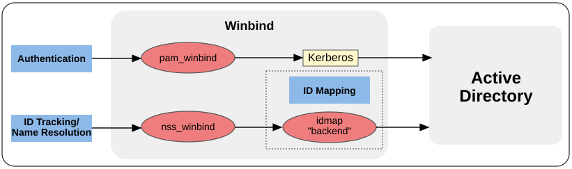
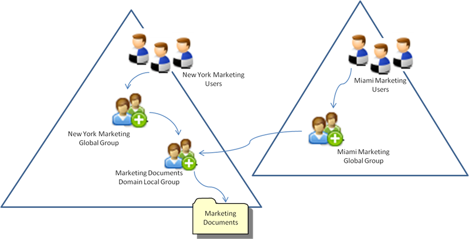

## Advanced Servers

## Samba File Services with AD

---

### Server Message Block

- **SMB — Server Message Block**
- **SMB** is a network protocol used to access shared resources.
- Common SMB resources include **Files**, **Folders** and **Printers**
- **SMB** is the primary file-sharing protocol used in modern Windows environments.
- Centralized file services make it easier to manage **Access permissions**, **Shared data**, **Backups** and **Security**.
- Modern SMB normally communicates over **TCP port 445**.

---

### SMB Client and Server

- SMB uses a **client-server model**.
- **SMB Client:** Requests access to a shared resource.
- **SMB Server:** Hosts and manages the shared resource.
- A Windows workstation commonly acts as the SMB client.
- Windows Server or Linux with Samba can act as the SMB server.

---

### UNC Paths

- Windows commonly accesses **SMB** resources using a **UNC path**.
- **UNC — Universal Naming Convention**
- Basic format: `\\server\share`

- The first component `\\server` identifies the server.
- The second component `\share` identifies the share.
- The share name does not need to match the server's local directory name.
- Multiple shares can exist on the same SMB server.

---

### SMB Dialects

- An SMB **dialect** is a version of the SMB protocol.
- The client and server negotiate a compatible dialect when establishing a connection.
- Modern systems normally use **SMB 2.x or SMB 3.x**.
- **SMB 3.1.1** provides modern security and protocol capabilities.
- **SMB 1** is obsolete and should normally remain disabled.
- **SMB 3** introduced major improvements for enterprise environments: performance, availability, encryption, signing and resiliency.

---

### SMB Signing

- **SMB signing** protects SMB messages from unauthorized modification.
- The sender cryptographically signs SMB messages.
- The receiver verifies the signature.
- Signing helps protect against **man-in-the-middle tampering**.
- Signing protects message integrity but does not replace encryption.

---

### SMB Encryption

- SMB encryption protects SMB data while it travels across the network.
- Encryption provides **confidentiality** for SMB traffic.
- SMB signing primarily protects **integrity**.
- Modern SMB versions can support both.
- Security requirements determine whether these features are supported or required.

---

### Samba

- [**Samba**](https://www.samba.org/) is an open-source implementation of the SMB protocol.
- Samba allows Linux and Unix systems to communicate with Windows SMB clients.
- Samba can provide:
  - File sharing
  - Printer sharing
  - Active Directory integration
  - Domain membership
- A Linux server running Samba can operate as an enterprise SMB file server.

---

### Samba Server Components

- Samba contains several services and supporting components.
- Important components include:
  - **smbd**
  - **winbindd**
  - Kerberos integration
  - NSS integration
  - Active Directory domain membership
- Each component performs a different part of the file-service process.

---

### `smbd`

- **smbd** is the Samba SMB file-server daemon.
- It accepts SMB connections from clients.
- It provides access to configured shares.
- It evaluates Samba share configuration.
- It performs file operations against the Linux filesystem.
- Share definitions are normally stored in **`smb.conf`**.

---

### Active Directory Member Server

- A server can join an existing **Active Directory domain**.
- The server becomes a **domain member**.
- A member server uses AD identities but does not become a Domain Controller.
- Active Directory continues to provide:
  - Users
  - Groups
  - Authentication
  - Kerberos services
- The member server provides its own application or resource services.

---

### Samba as a Domain Member

- Samba can operate as an Active Directory member server.
- Domain membership allows Samba to recognize AD users and groups.
- Domain identities can then be used to control SMB resources.
- Windows users can access Linux-hosted shares using their domain identities.
- This creates a bridge between **Windows identity services** and the **Linux filesystem**.

---

### Domain Membership

- Joining a computer to Active Directory creates a **computer account** (also known as a machine account).
- The computer becomes an identity in the domain. It has credentials separate from normal user accounts.
- A trust relationship is established between the computer and Active Directory.
- The computer receives credentials used for ongoing domain communication.
- Administrators do not provide their passwords for every future domain operation.

---

### Kerberos Fundamentals Review

- Active Directory uses **Kerberos** as its primary authentication protocol.
- A domain user normally receives a **Ticket-Granting Ticket (TGT)** after authentication.
- The TGT can later be used to request tickets for network services.
- SMB is one of those network services.
- This allows SMB to participate in enterprise **Single Sign-On**.

---

### Kerberos and Samba

- Suppose a domain user accesses:  `\\fileserver.example.com\Team`
- Clients need to authenticate to the SMB service (commonly uses the **cifs** service class) on that server.
- **Kerberos** identifies the requested service using a **Service Principal Name (SPN)**.
- The client can request a Kerberos service ticket for the file service.
- Samba and the Linux filesystem still determine what the authenticated user may do.

---

### The `cifs` Service

- A Kerberos SMB service can be represented as: `cifs/fileserver.example.com`

- **cifs** identifies the SMB file service.
- The hostname identifies the server providing the service.
- The KDC issues a service ticket for that specific service.
- The client presents the ticket when connecting to the SMB server.

---

### Active Directory and Linux Identities

- Active Directory and Linux represent identities differently.
- Active Directory primarily uses **Security Identifiers (SIDs)**.
- Linux filesystems use:
  - User IDs (**UIDs**)
  - Group IDs (**GIDs**)
- A Linux SMB server needs a way to connect these identity models.

---

### Security Identifiers

- A **SID — Security Identifier** uniquely identifies a Windows security principal.
- Security principals include:
  - Users
  - Groups
  - Computers
- Windows permissions are fundamentally associated with SIDs.
- Linux filesystems do not normally use Windows SIDs directly.

---

### Linux UID and GID

- Linux identifies users using a numeric **UID**.
- Linux identifies groups using a numeric **GID**.
- Files and directories store ownership using these numeric identities.
- Linux therefore needs a usable UID/GID representation of an AD identity.
- This is where **Winbind** becomes important.

---

### `Winbind`

- **Winbind** integrates Samba with Windows domain identities.
- It allows Linux to resolve Active Directory users and groups.
- Winbind can map: AD user SID → Linux UID, AD group SID → Linux GID
- This allows domain identities to participate in Linux filesystem permissions.
- **winbindd** is the Winbind daemon.

---

### Name Service Switch

- **NSS — Name Service Switch**
- NSS determines where Linux looks for users and groups.
- Traditional Linux identities may come from:
  - `/etc/passwd`
  - `/etc/group`
- NSS can also query external identity sources.
- Winbind can become one of those identity sources.

---

### NSS with Winbind

- **libnss-winbind** connects Linux NSS to Winbind.
- Domain users can then appear to Linux applications like normal Linux users.
- Domain groups can appear like normal Linux groups.
- Commands and applications can resolve domain identities into UIDs and GIDs.
- This allows Linux filesystem permissions to reference AD identities.

---

### Identity Resolution

- Authentication and identity resolution are related but different.
- A user may successfully authenticate to Active Directory.
- Linux must still determine:
  - Who the user is locally
  - Their UID
  - Their GIDs
  - Their group memberships
- Authorization depends on this resolved identity information.

---

### `SSSD`

- **SSSD — System Security Services Daemon**
- SSSD can integrate Linux systems with identity providers such as Active Directory.
- It commonly provides:
  - User lookup
  - Group lookup
  - Authentication
  - Identity caching
  - Access control integration
- SSSD is commonly used for Linux login integration.

---

### `Winbind` vs. `SSSD`

- Both Winbind and SSSD can integrate Linux with Active Directory.
- **SSSD** is commonly used for general Linux identity and login integration.
- **Winbind** is tightly integrated with Samba.
- Samba member file servers commonly use Winbind for domain identity mapping.
- The appropriate identity stack depends on the server's role.

---

### `realmd`

- **realmd** helps Linux discover and join identity domains.
- It can discover Active Directory using DNS.
- realmd coordinates other tools rather than replacing them.
- Different domain-join configurations can use different identity stacks.
- The selected stack should match the intended server role.

---

### DNS `SRV` Records

- A Linux server must locate Active Directory services before joining the domain.
- Active Directory publishes services through **DNS SRV records**. Important services include: LDAP, Kerberos and Domain Controllers.
- An SRV record can contain: Service, Protocol, Priority, Weight, Port, Target.
- Correct DNS configuration is therefore fundamental to AD integration.

---

### From AD Identity to File Access

- Active Directory authenticates the user.
- Winbind resolves the domain identity.
- Linux receives usable UID and GID information.
- Samba evaluates SMB authorization.
- The Linux filesystem evaluates filesystem authorization.
- Successful file access requires the entire chain to work.

---

### Role-Based Access Control

- **RBAC — Role-Based Access Control**
- Permissions are assigned according to organizational roles rather than individual users.
- Users receive access by becoming members of appropriate groups.
- Group-based authorization is easier to manage than large numbers of direct user permissions.
- Active Directory security groups provide the foundation for this model.

---

### AGDLP

- **AGDLP** is a common Active Directory group-nesting model.
- AGDLP stands for: **Accounts → Global Groups → Domain Local Groups → Permissions**

- Each layer has a different purpose.
- The model separates organizational roles from resource permissions.

---

### AGDLP

Credit: [All about AGDLP group scope for active directory](https://www.infosecinstitute.com/resources/general-security/agdlp-group-scope-active-directory-account-global-domain-local-permissions/)

---

### Why AGDLP?

- Users change jobs.
- Employees join and leave departments.
- Resources change.
- Permissions change.
- AGDLP separates these changes into manageable layers.
- Administrators can change role membership without redesigning resource permissions.

---

### Separation of Concerns

- **Global groups:** Who performs this organizational role?
- **Domain Local groups:** What permission does this resource provide?
- **Resource ACL:** What operations does that permission allow?
- Each layer has one clear responsibility.
- This makes access-control designs easier to understand and troubleshoot.

---

### Samba Authorization

- Samba provides an authorization layer at the SMB protocol level.
- Share configuration can determine:
  - Who may connect
  - Who receives read access
  - Who receives write access
  - Whether guest access is permitted
- Samba authorization happens before or alongside filesystem access checks.

---

### Samba Share Configuration

- Samba shares are normally defined in **`smb.conf`**.
- A share definition can specify:
  - Share name
  - Filesystem path
  - Authorized users or groups
  - Read/write behavior
  - File creation behavior
- Group-based rules are preferable to large lists of individual users.

---

### `valid users`

- Samba's **valid users** setting can restrict who may access a share.
- Users outside the permitted identities are rejected.
- AD groups can be used in these authorization rules.
- Permission groups are more scalable than individual user entries.
- This creates an SMB-level access boundary.

---

### Read-Only by Default

- A share can be configured as **read-only by default**.
- Specific authorized groups can then receive write access.
- This follows the principle of granting only the access that is required.
- Read-only users can consume information without modifying it.
- Modify users receive additional capabilities.

---

#### `write list`

- Samba can define a **write list**.
- Members of the listed groups can receive write access.
- Other authorized users can remain read-only.
- This allows multiple permission levels within the same share.
- Group membership determines the user's effective Samba access.

---

### Samba Is Not the Filesystem

- Samba controls access through the SMB service.
- The actual files still exist on a Linux filesystem.
- Linux independently evaluates filesystem permissions.
- Samba cannot simply ignore a Linux filesystem denial.
- This creates **two authorization layers**.

---

### Two Authorization Layers

- **Layer 1: Samba authorization**
  - Controls SMB access.
- **Layer 2: Linux filesystem authorization**
  - Controls access to files and directories.
- Both layers must permit the requested operation.
- A failure in either layer can produce **Access Denied**.

---

### POSIX ACLs

- Traditional Unix/Linux permissions restrict you to defining rights for a single owner, a single group, and everyone else.
- POSIX ACLs (**ACL — Access Control List**) provide a flexible, fine-grained access control mechanism for files and directories that goes beyond the traditional UNIX owner/group/other permission model.
- POSIX ACLs allow you to grant or deny explicit read, write, and execute permissions to **multiple individual users and specific groups**.

---

### Access ACLs

- An **access ACL** controls permissions on an existing file or directory.
- It can contain entries for: Owner, Named users, Owning group, Named groups, Mask, Others.
- Access ACLs are rules applied directly to a file or directory to dictate **current access rights**.

---

### Default ACLs

- Rules applied **only to directories**.
- They act as **blueprints/templates**: any new file or subdirectory created inside that directory automatically inherits these permissions.
- New files and subdirectories receive ACL information based on the parent directory.
- Default ACLs do not retroactively modify existing files.
- They help maintain consistent permissions over time.

---

### Why Inheritance Matters

- Shared folders continuously receive new files and directories.
- Permissions must remain consistent as users create content.
- Without appropriate inheritance:
  - New files may receive unexpected groups.
  - Read-only users may lose access.
  - Modify users may be unable to collaborate.
- File-server design must consider both current and future objects.

---

### The ACL Mask

- POSIX ACLs contain a **mask (m:)**.
- Defines the maximum allowed permissions for all Named users, Named groups, and the Owning group.
- Even if a user is granted `rwx`, if the mask is set to `r--`, their effective permission is restricted to read-only.

---

### `setgid` on Shared Directories

- Linux directories can use the **setgid** bit.
- New files and subdirectories inherit the directory's group ownership.
- This is useful for collaborative shared directories.
- Without setgid, new objects may use the creator's primary group.
- Consistent group ownership helps maintain predictable access.

---

### `setgid` and Default ACLs

- **setgid** helps control inherited group ownership.
- **Default ACLs** help control inherited permissions.
- They solve different but related problems.
- Enterprise shared directories often use both.
- Correct inheritance prevents permissions from gradually becoming inconsistent.

---

### File Creation Permissions

- Samba can influence permissions assigned to newly created files and directories.
- Linux filesystem rules still apply.
- File creation settings should support the intended access model.
- Shared files should not accidentally become world-accessible.
- New objects should preserve the required group collaboration model.

---

### Windows Clinet SMB Connection

- **Connect:** A Windows client connects to a Samba share using SMB.
- **Authenticate:** In a domain, Kerberos can provide Single Sign-On (SSO).
- **Authorize:** Samba checks share permissions, then Linux checks file-system permissions.
- **SSO ≠ Access:** SSO avoids repeated logins but does not bypass permissions.

---

### Access Token Lifecycle

- **Logon Token:** Windows creates an access token when the user signs in.
- **Identity & Groups:** The token contains the user's identity and group memberships.
- **Group Changes:** Existing tokens do not automatically reflect later group membership changes.
- **Refresh:** Signing out and back in creates a new token with updated memberships.

---

### SMB Connection Process

- **Connect:** Client and Samba establish an SMB connection.
- **Negotiate:** They agree on an SMB version and supported capabilities.
- **Authenticate:** The user's identity is authenticated, typically with Kerberos in an AD environment.
- **Create Session:** Samba creates an authenticated SMB session used for subsequent file access.

---

### Dependency Chain

- Troubleshoot file access as an **end-to-end dependency chain**:
  - DNS and time
  - Kerberos and Active Directory
  - Machine trust
  - Winbind identity resolution
  - Group membership
  - Samba authorization
  - Linux ACLs
  - SMB client session
- **Find the failed layer before changing the configuration.**

---

### Key Takeaways

- **SMB** provides network file sharing in Windows environments.
- **Samba** allows Linux systems to provide SMB services.
- **Samba** can operate as an **Active Directory member server**.
- **smbd** provides the SMB file service.
- **Winbind** connects AD identities to the Linux identity model.
- **NSS** makes those identities available to Linux applications.

---

### Key Takeaways

- Active Directory uses **Kerberos** for domain authentication.
- SMB commonly uses the Kerberos **cifs** service class.
- A Samba domain member has its own **computer account and machine trust**.
- Kerberos establishes identity.
- Samba and Linux determine authorization.
- **Authentication does not automatically grant resource access.**

---

### Key Takeaways

- **AGDLP** separates accounts, organizational roles, resource permission groups, and permissions.
- Global groups commonly represent roles.
- Domain Local groups commonly represent resource permissions.
- Permissions should be assigned to groups rather than individual users.
- Nested group membership determines effective access.

---

### Key Takeaways

- Samba and Linux provide **two independent authorization layers**.
- Both layers must permit an operation.
- POSIX ACLs extend traditional Linux permissions.
- Default ACLs support permission inheritance.
- The ACL mask can limit effective permissions.
- `setgid` helps maintain consistent group ownership.

---

### Resources

- [Server Message Block Protocol](https://asmed.com/comptia-net-server-message-block-protocol-smb/)
- https://www.samba.org/
- [winbindd](https://www.samba.org/samba/docs/current/man-html/winbindd.8.html)
- [All about AGDLP group scope for active directory](https://www.infosecinstitute.com/resources/general-security/agdlp-group-scope-active-directory-account-global-domain-local-permissions/)
- [`smb.conf`](https://www.samba.org/samba/docs/current/man-html/smb.conf.5.html)
- [POSIX Access Control Lists](https://docs.redhat.com/en/documentation/red_hat_gluster_storage/3/html/administration_guide/sect-posix_access_control_lists)
- [Setuid, Setgid, and the Sticky Bit](https://www.cbtnuggets.com/blog/technology/system-admin/linux-file-permissions-understanding-setuid-setgid-and-the-sticky-bit)