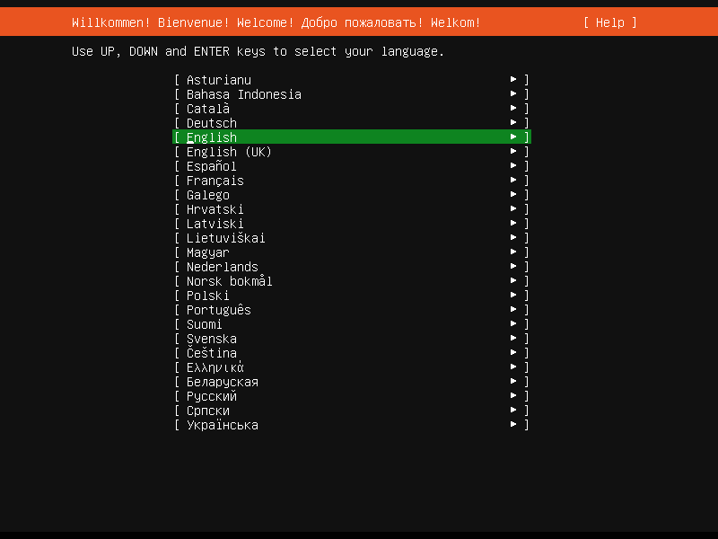
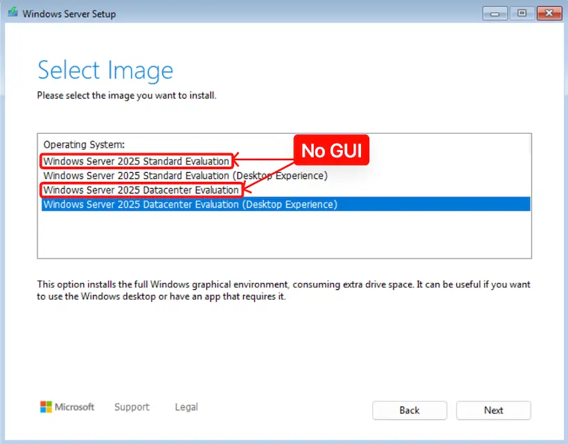
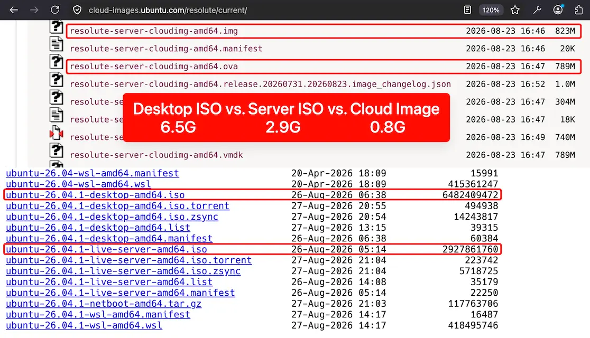
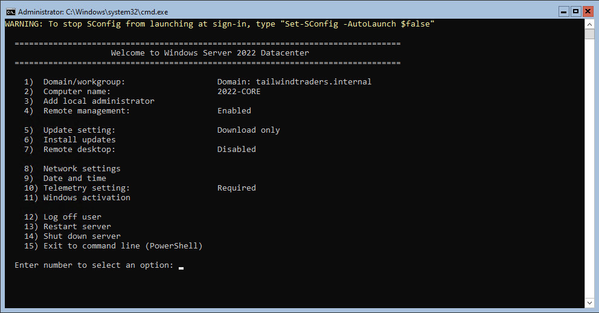
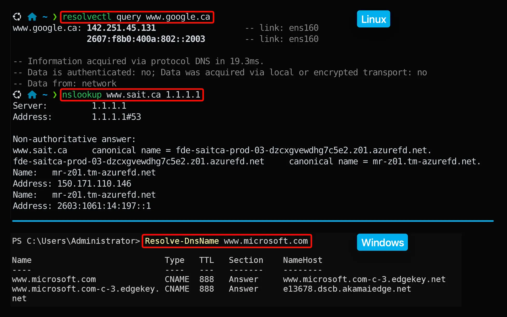
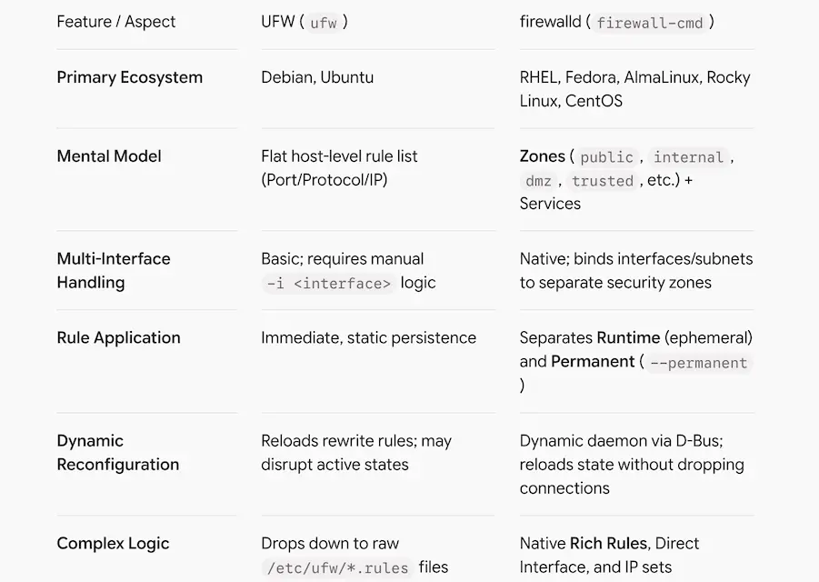
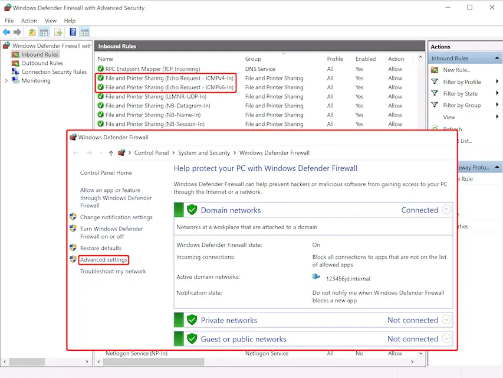
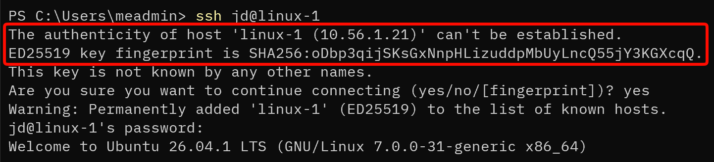
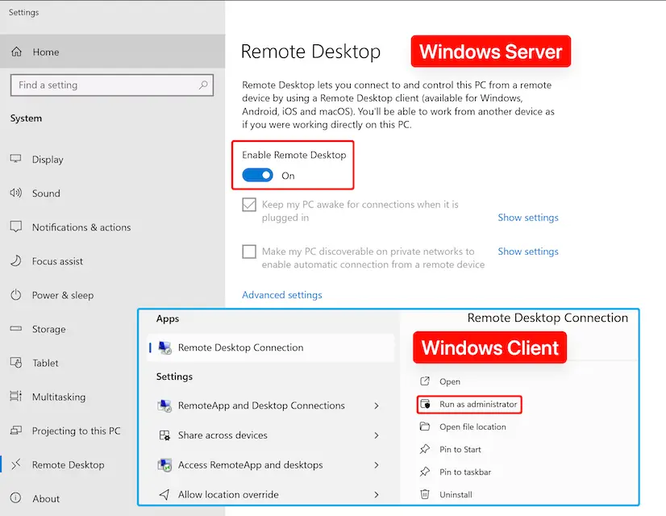
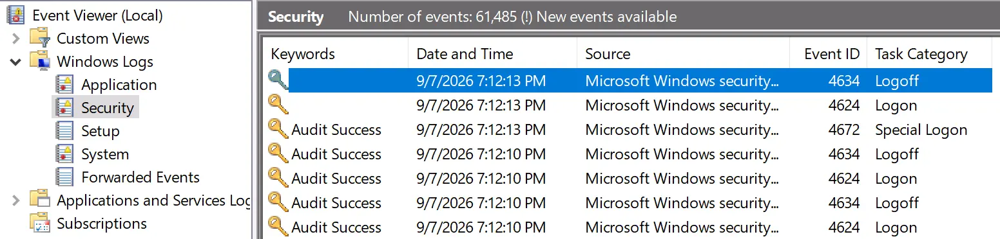

## Advanced Servers

## Systems Overview

---

### Modern System Administration

- Administration now spans local systems, virtual infrastructure, cloud services, identity, and automation.
  - Keep an accurate inventory of devices, operating systems, services, owners, and dependencies.
  - Manage identity and privilege across local accounts, Active Directory, and cloud identity.
  - Operate Windows and Linux through remote tools, scripts, APIs, and configuration policy.
  - Detect failures and security events through logs, metrics, alerts, and tested recovery procedures.

---

### Manage Clients

- GPO’s, AD users, remote access (C$, RDP, SSH, Third-Party Control Suites)
- What local users exist?
- What softwares are installed?
- How are they imaged? 

---

### Manage Servers

- In the server room, colocation, or cloud?
- Local vs. AD accounts?
- Are they on physical servers – how big should they be?
- Scripting – maintaining and automating connectivity and services
- What if something goes wrong? … From blue screen to ransomware…

---

### In This Course

- We will try to reinforce some best practices and techniques
  - Troubleshooting
  - Remote access and management
  - Permissions and privilege
  - Installing and managing various services
  - Both Windows and Linux – but process is the same

---

### Troubleshooting

- As a sysadmin, you need to figure things out. ChatGPT is as good as the context you provid.
- Don't skip Internet search and reading. It’s a slower approach to start with, but it leads to understanding which allows you to do it on your own later.

- Start with the protocol and the service dependency chain.
- Observe current state before changing configuration.
- Make the smallest reversible change, then verify the result.
- Record commands, evidence, and rollback steps so another administrator can reproduce the work.

---

### Network Protocols

- There are protocols for a reason – it standardizes how things are done – and it makes things work between and within systems
- If you understand the protocol, your approach will work and you don’t have to figure out what is going on from scratch

---

### Service Dependency Model

- It is a **visual or logical map** that shows how different software applications, system services, and infrastructure components rely on each other to function.
- **Isolates root causes:** Prevents you from guessing by revealing which upstream component actually triggered a cascading failure.
- **Predicts impact:** Shows what other systems will go offline if a specific database, API, or host service fails.
- **Speeds up triage:** Cuts down time spent looking at symptoms by letting you trace errors from the client down to the failing dependency.

---

### Service Dependency Model

- Troubleshooting incidents become easier when you test from the lowest relevant layer upward.
  - Foundation: Power and hypervisor; Interface and IP configuration; Route and firewall policy; Name resolution.
  - Service: Process is running; Correct address and port; Authentication and authorization; Application data and dependencies.
- Example: A successful ping proves limited IP reachability. It does not prove that DNS, the application port, authentication, or the service itself works.

---

### Lab Platform Baseline - Linux

- Ubuntu Linux Server 26.04.1 LTS (Long Term Support)
- systemd and the `systemd-journald`
- OpenSSH, UFW (Uncomplicated Firewall), and `apt` (Advanced Packaging Tool)
- Text based configuration
- Automation-ready administration

---

### Ubuntu Server Installation



---

### Lab Platform Baseline - Windows

- Windows Server 2022/2025
- Windows Server Core or Desktop Experience
- PowerShell and SConfig on Windows Core Server
- Windows Firewall
- RDP if GUI is installed, RSAT (Server Manager on Windows 10/11) and Admin Center

---

### Windows Server Installation



---

### Minimal Server Installations

- Ubuntu Server and Windows Server Core reduce the local interface and unnecessary components.
- A smaller image usually needs less storage and exposes fewer components to patch or attack.
- Windows Server Core is the recommended installation option. It’s a smaller installation that includes the core components of Windows Server and supports all server roles but does not include a GUI.
- Containers package applications. They do not replace a server VM in every design.

---

### Ubuntu Linux Sizes



---

### Windows Server Core

- **Windows Server Core** is the installation option without the traditional desktop GUI. It provides a command-line focused environment with a smaller footprint.
- Without the GUI, most administration can be performed using **PowerShell** or remote management tools. PowerShell is very powerful, but detailed PowerShell administration is **outside the scope of this course**.

---

### Configure Windows Server Core

- **SConfig** is the primary way to configure and manage common aspects of the operating system.



---

### CLI Foundations

- Fluency comes from discovery, safe composition, and reading command output.
- Windows and Linux shared concepts
  - Absolute vs. relative paths
  - Understand internal, external, commands, command history
  - Current directory and environment
  - Pipelines and redirection
  - Exit codes and error streams
  - Quoting, wildcards, and variables

---

### CLI Foundations

- Discover before guessing
  - Sh, Bash, Zsh: `man`, `--help`, `type`, https://cheat.sh/
  - PowerShell: `Get-Help` and `Get-Command`
  - Use tab completion — double tab sometimes.
  - Inspect scopes before complex administrative operations.
  - Simulate first (e.g., utilizing PowerShell's `-WhatIf` and `-Confirm` flags, or checking tool-specific dry-run flags like `rsync --dry-run`).

---

### CLI Learning Curve

- Commands, flags, and syntax must be memorized or looked up — intimidating for beginners compared to point-and-click GUIs.
- Errors are often cryptic and require understanding of underlying system concepts to troubleshoot.
- Mastery takes time and repetition, but proficiency compounds quickly once the fundamentals click.
- It's worth it because most modern DevOps tooling live in the terminal; fluency is a prerequisite for the modern IT stack.
- Cloud VMs, containers, and servers rarely have GUIs; CLI remains the universal interface across every platform.

---

### CLI Advantages in the AI Era

- **AI supercharges CLI productivity**: tools like Claude Code and ChatGPT/Codex can generate, explain, and debug commands on demand, dramatically flattening the learning curve.
- **Automation-first**: CLI output is plain text, making it trivially easy to pipe into scripts, AI agents, and automation pipelines that GUIs simply can't match.
- **Precision and repeatability**: commands are explicit and scriptable, enabling reproducible infrastructure (IaC) that AI can read, generate, and audit.

---

### Network Troubleshooting

- Test one dependency at a time and preserve the evidence from each step.
  1. Confirm the interface, address, prefix, gateway, and DNS servers.
  2. Check the local route to the destination.
  3. Test the target IP and the specific TCP or UDP port.
  4. Resolve the fully qualified domain name with the intended DNS server.
  5. Inspect host and network firewall decisions, then check the service logs.

---

### DNS Resolution

- The client checks Windows local policies and Group Policies (NRPT), the hosts file, and cached answers before querying a DNS server.
- Use FQDN when ambiguity matters. Search suffixes can change single-label queries.
- Modern hardened Windows Server baselines disable LLMNR and NetBIOS over TCP/IP to reduce spoofing risk.
- IPv6 can be active even when IPv4 is the focus. Test and document both stacks instead of disabling IPv6 as a shortcut.

---

### DNS Resolution Verification



---

### Host Firewall Troubleshooting

- Keep the host firewall enabled and permit only the traffic the service requires.
- Inbound traffic normally needs an explicit allow rule. Outbound defaults vary by platform and policy.
- Stateful inspection allows reply traffic for an established connection without opening an unrelated inbound path.
- Scope rules by profile or zone, protocol, local port, application, interface, and source address as appropriate.
- Treat a firewall rule as configuration: name it, document its purpose, test it, and remove it when the service retires.

---

### `firewalld` - RHEL Default

- **firewalld** organizes stateful rules around zones and separates runtime changes from permanent configuration.
- Bind each connection, interface, or source to the intended zone.
- Prefer a named service definition over a raw port when one exists.
- Use policies for traffic between zones or for forwarding scenarios.

```shell
sudo firewall-cmd --get-active-zones
sudo firewall-cmd --zone=public --add-service=ssh --permanent
sudo firewall-cmd --reload
sudo firewall-cmd --zone=public --list-all
```

---

### UFW - Ubuntu Default

- UFW (Uncomplicated Firewall) is a user-friendly command-line tool used to manage netfilter firewall rules. It provides a concise interface for common host firewall rules.
- Allow the management path before enabling UFW on a remote server.
- Use application profiles when packages provide them.
- Review rule order and IPv4 or IPv6 coverage after every change.

```shell
sudo ufw status verbose
sudo ufw allow OpenSSH
sudo ufw enable
sudo ufw status numbered
```

---

### `firewalld` vs. UFW



---

### Windows Firewall

- Windows Firewall applies Domain, Private, and Public profiles, sometimes at the same time on different interfaces.
- Use the Windows Defender Firewall with Advanced Security console or `NetSecurity` cmdlets.
- Enable a built-in rule group when it matches the service instead of recreating its rules.
- Check effective policy because local rules and Group Policy can combine.

```powershell
Get-NetConnectionProfile
Get-NetFirewallProfile
Get-NetFirewallRule -Enabled True | Select DisplayName,Direction,Action
Test-NetConnection server01 -Port 5985
```

---

### Windows Firewall



---

### Identity and Least Privilege

- Administrative access should identify the person, the role, the device, and the resource.
- Use a standard account for daily work and a separate named account for administrative tasks.
- Grant the minimum role needed and limit where privileged accounts can sign in.
- Require strong authentication for remote administration and protect the administrator workstation.
- Avoid shared administrator credentials because they weaken accountability and complicate revocation.

---

### Windows Local Admin Accounts

- Every Windows server retains local security principals even when it joins a domain.
- Use domain or managed identities for routine administration where practical.
- [Windows LAPS](https://learn.microsoft.com/en-us/windows-server/identity/laps/laps-overview) rotates a local administrator password and stores it in Active Directory or Microsoft.
- Entra ID with controlled retrieval.
- Limit who can retrieve the password and audit retrieval or rotation events.
- Keep a tested recovery path for systems that cannot contact the directory.

---

### Linux Privilege with `sudo`

- **`sudo`** grants a command under policy without creating a long-lived root shell.
- Put local policy in a validated file under `/etc/sudoers.d` when appropriate.
- Grant commands or roles deliberately. Broad ALL permissions carry the same risk as unrestricted root access.
- Use `visudo` so syntax errors do not lock out administration.
- Review sudo logs and remove temporary privilege when the work ends.
- [Windows 11 has `sudo`](https://learn.microsoft.com/en-us/windows/advanced-settings/sudo/), Windows Server doesn't.

---

### Remote Admin Options

- Command and automation
  - SSH for Linux, network devices, and Windows OpenSSH
  - PowerShell remoting for Windows administration
  - APIs and configuration tools for repeatable changes
- GUI administration 
  - RSAT and Server Manager
  - Windows Admin Center
  - RDP for tasks that truly need an interactive desktop

---

### SSH

- **SSH (Secure Shell)** provides secure remote access to the command line of another computer or network device.
- SSH is similar to **Telnet**, but it **encrypts all traffic** between the client and server and provides stronger authentication.
- SSH is a standard method for remotely connecting to **Linux/Unix/BSD systems and network devices** such as routers and switches. You can also **SSH into a Windows** computer.
- The **SSH server service** is commonly available on Linux systems, although whether it is installed and enabled by default depends on the Linux distribution and installation.

---

### SSH Host Keys

- Verify a new server host key fingerprint through a trusted channel before accepting it.
- Investigate a changed host key. It can indicate a rebuilt server, a naming error, or an attack.
- Use the client configuration file for stable host aliases, usernames, ports, and identity files.



---

### SSH Public Key Authentication

- Use `ssh-keygen` to generate a key pair, public and private.
- A client proves possession of a private key. The private key never leaves the client.
- Protect private keys with a passphrase and an agent or hardware-backed key where suitable.
- The server stores authorized public keys under the target account.
- Remove keys when access ends and avoid copying one private key across administrators.
- [SSH Public Key Authentication Configuration](https://github.com/sait-lab/devops/blob/main/Setup%20SSH%20Key-Based%20Authentication.md)

---

### SSH Server Hardening

- Disable password authentication only after every required account has a tested alternative.
- Restrict exposure with the host firewall and upstream network controls.
- Changing port 22 can reduce noise, but it does not replace strong authentication or patching.

```
# Edit /etc/ssh/sshd_config and /etc/ssh/sshd_config.d/xxxxx.conf
PermitRootLogin no
AllowGroups ssh-admins
PubkeyAuthentication yes

# Checks the SSH configuration for errors
# then reloads SSH only if the check succeeds:
# sudo sshd -t && sudo systemctl reload ssh
```

---

### SSH Client

- **OpenSSH clients** are built into Linux, macOS, and modern versions of Windows. Third-party SSH clients such as **PuTTY** can also be used.

-  Basic connection syntax: `ssh user@system`. `user` is the account on the system you want to log in as. `system` can be the hostname, FQDN, or IP address of the remote system.

- SSH client syntax example: `ssh user1@linuxserver` or `ssh user1@192.168.1.20`

- If no username is specified (`ssh linuxserver`), SSH normally uses your **current local username**.

---

### SSH Client

- On the first connection, SSH typically asks you to verify and accept the server's host key.
- You are then authenticated, commonly using a password or SSH key.
- The server may display a login banner before or after authentication.
- For domain-based usernames, the exact syntax depends on how the server is configured. For example (note the two `@`): `ssh 'user1@mydomain'@linuxserver`

---

### Stronger SSH Authentication

- **FIDO2/U2F** security-key types can require possession of a hardware authenticator and user presence.
- OpenSSH **certificates** let a trusted CA issue short-lived user or host credentials at scale.
- **PAM (Pluggable Authentication Modules)** can combine SSH with organization-specific multifactor controls or corporate SSO on Linux.
- **GSSAPI / Kerberos** is single sign-on mechanism featuring centralized ticket granting, typically integrated with Active Directory or FreeIPA environments.

---

### Windows Remote Management

- Use **SConfig** for common initial configuration tasks such as setting the hostname, configuring networking, joining a domain, and managing updates.
- After initial setup, the server can be managed remotely using **Server Manager** from another Windows Server or **RSAT (Remote Server Administration Tools)** from a Windows client.
- Use **Windows Admin Center** for browser-based server management.
- Use PowerShell remoting for repeatable work on one server or many servers.

---

### RDP

- Don’t forget you can run remote desktop to connect to a windows machine – if permitted.
- In a domain, a sysadmin would have a regular account that they would use to do their regular work, and a secondary admin account that they would use to elevate their rights – this account would be a member of a group that would give them the rights to carry out their job.
- The administrator account is often renamed and disabled, and protected with a strong password
  When you have multiple users who are carrying out administrative tasks, you shouldn’t just be “sharing” the/an administrator account.

---

### RDP



---

### RDP Security

- Do not publish TCP 3389 directly to the internet. Use a managed gateway, VPN, or controlled administrative network.
- Require Network Level Authentication and strong multifactor authentication at the access boundary.
  Use named privileged accounts and restrict which groups can connect.
- Limit clipboard, drive, printer, and device redirection when the task does not need them.
- End disconnected sessions and review successful and failed logons.

---

### Logs and Observability

- If you run into issues, the machine will often throw an error – **READ** and understand it. Often the error that it shows has little or nothing to do with the actual problem.
- Go to logs to investigate further, do research on the Internet on the error
  - Event viewer in Windows
  - `/var/log` in Linux – messages is the system log, but each service install its own log as well
- Record timestamps with a time zone. Correlating events across systems depends on synchronized clocks.

---

### Linux Logs

- Linux logs record **system, service, security, and application events** for monitoring and troubleshooting.
- Modern Linux systems often use **`systemd-journald`**; view its logs with **`journalctl`**.
- Useful logs include **authentication attempts, service failures, kernel messages, and system errors**.
- The `ss` command is a modern utility used to dump socket statistics and display network connection information.

```bash
systemctl status ssh
journalctl -u ssh --since '30 min ago'
journalctl -p warning..alert
ss -tlunp
```

---

### Windows Event Viewer



```
Get-Service sshd
Get-WinEvent System -MaxEvents 50

$f=@{LogName='Security';Id=4625}
Get-WinEvent -FilterHashtable $f

Get-NetTCPConnection -State Listen
```

---

### Disciplined Troubleshooting Loop

- A good incident record separates symptoms, evidence, hypotheses, changes, and results
  1. State the expected behavior and the exact observed symptom.
  2. Define scope: one user, one host, one subnet, or every client.
  3. Collect current state and recent changes before restarting services.
  4. Test the most likely explanation with a small reversible action (VM or file system snapshot).
  5. Verify service recovery, review side effects, and document the cause and prevention.

---

### Resource Challenges

- Between this course and virtualization, plus projects… you will be under a LOT of pressure to store and run many VM’s on your laptop.
- They take a lot of space and resources — you can use external drives to store machines, but it is very risky (and slow) to run them on the external drive.
- Think about drive space requirements we talked about earlier with no GUI.
- Snapshots are useful for recovery, but keeping too many can consume significant disk space.
- Power off the virtual machine before taking a snapshot when possible to ensure a consistent state.

---

### Reusable Windows Images

- Prepare the image, apply updates, and confirm that installed applications support `sysprep`.
- Generalization removes system-specific information so the image can create new machines safely.
- Capture the powered-off generalized image and treat it as immutable source material.
- Don't run your master VM; whenever you need a new VM, simply copy the master folder and run the new copy.
- Apply naming, networking, domain join, and secrets during deployment rather than baking them into the image.

```cmd
sysprep.exe /generalize /oobe /shutdown
```

---

### Reusable Linux Images

- Canonical publishes supported [Ubuntu cloud images](https://cloud-images.ubuntu.com/) for VMware, Hyper-V, KVM, OpenStack, and public clouds.
- **`cloud-init`** can set the hostname, network, users, SSH keys, packages, and scripts from instance data.
- Keep the base image patched and small. Put environment-specific state in version-controlled configuration.
- For a manual clone, regenerate machine identity and host credentials using the platform procedure.

---

### Snapshot vs. Clone

- Snapshot
  - Short rollback point before a risky change
  - Depends on the base virtual disk
  - Can grow and reduce performance
  - Delete after validation
- Clone or Template
  - Creates another deployable machine
  - Must handle unique identity and credentials
  - Linked clones depend on a parent
  - Useful for repeatable labs
- A snapshot is not a backup. Protect important lab work with a separate copy or VM folder backup.

---

### Automation and IaC

- Repeatable administration replaces undocumented console changes with reviewable state.
- Start with shell scripts and PowerShell that check current state before changing it.
- Use version control for scripts, configuration snippets, and lab documentation.
- Keep secrets outside source files and rotate any credential that reaches a repository.
- At larger scale, use configuration tools such as Ansible, Desired State Configuration, or platform policy.
- Make automation observable with clear output, exit codes, logs, and safe reruns.

---

### Resources

- https://firewalld.org/
- [Ubuntu Server Firewall](https://ubuntu.com/server/docs/how-to/security/firewalls/)
- [Windows LAPS](https://learn.microsoft.com/en-us/windows-server/identity/laps/laps-overview)
- [SSH Public Key Authentication](https://www.ssh.com/academy/ssh/public-key-authentication)
- [Key-based authentication in OpenSSH for Windows](https://learn.microsoft.com/en-us/windows-server/administration/openssh/openssh_keymanagement)
- https://www.ssh.com/academy/ssh/host-key
- https://github.com/sait-lab/devops/blob/main/ssh.md

---

### Resources

- https://wiki.archlinux.org/title/Systemd/Journal
- https://learn.microsoft.com/en-us/shows/inside/event-viewer
- [Sysprep (Generalize) a Windows installation](https://learn.microsoft.com/en-us/windows-hardware/manufacture/desktop/sysprep--generalize--a-windows-installation)
- https://cloud-init.io/
- [Desired State Configuration (DSC) for Windows](https://learn.microsoft.com/en-us/powershell/dsc/getting-started/wingettingstarted)
- https://docs.ansible.com/

