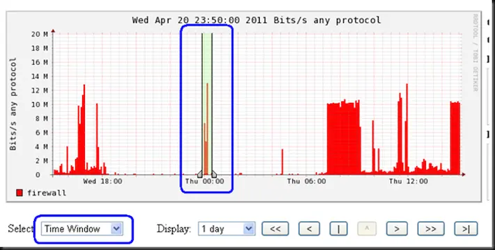
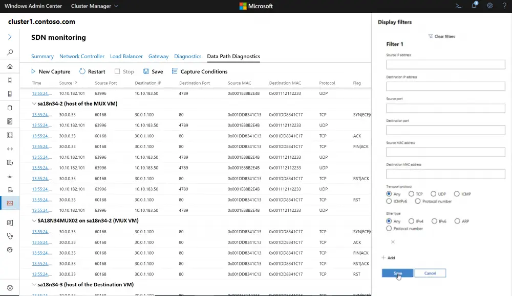
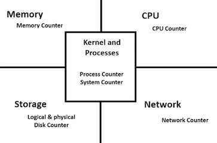
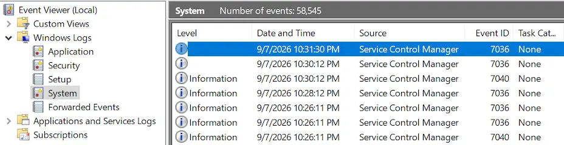
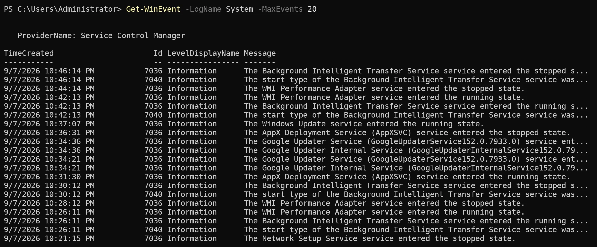
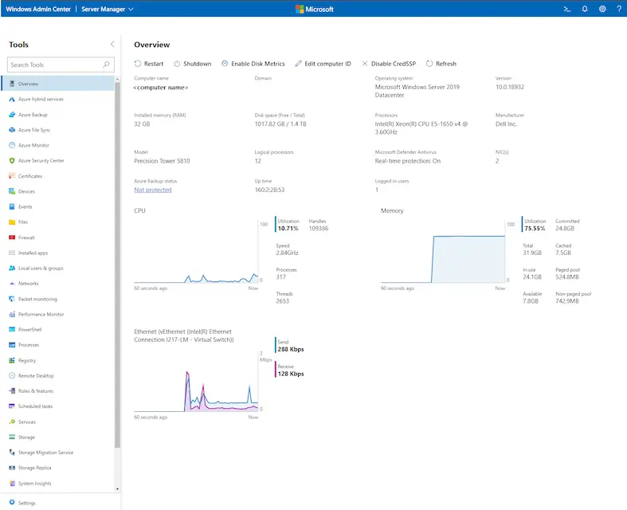

## Advanced Servers

## Windows Server Monitoring

---

### Why Monitoring Matters

- Applications depend on operating systems, networks, storage, identity, services, and increasingly hybrid infrastructure. Monitoring should help administrators:
  - Detect degradation before a complete failure.
  - Reduce time spent guessing.
  - Verify whether patches or configuration changes improved performance.
  - Support capacity planning.
  - Connect technical symptoms to user impact.

---

### Complexity Creates More Failure Paths

- Traditional component-by-component monitoring can produce **silos**: one team sees a network graph, another sees server counters, while neither sees the complete transaction.
- A useful monitoring system needs two levels:
  - Wide view: Which service, server, or dependency is unhealthy?
  - Deep view: Which process, counter, event, packet flow, or device explains it?

---

### Metrics, Logs, and Traces

<table>
  <thead>
    <tr>
      <th>Type</th>
      <th>Answeres</th>
      <th>Windows examples</th>
    </tr>
  </thead>
  <tbody>
    <tr>
      <td><strong>Metrics</strong></td>
      <td>How much?<br>How fast?</td>
      <td>Performance counters, CPU utilization, storage latency</td>
    </tr>
    <tr>
      <td><strong>Logs/<br>events</strong></td>
      <td>What happened?</td>
      <td>OS, App, Security, and role-specific events</td>
    </tr>
    <tr>
      <td><strong>Traces</strong></td>
      <td>What happened along the way?</td>
      <td>ETW traces, packet captures, application traces</td>
    </tr>
    <tr>
      <td><strong>Context</strong></td>
      <td>What changed?</td>
      <td>Patch, deployment, scheduled task, configuration change</td>
    </tr>
  </tbody>
</table>

---

### Observability

- Observability is the natural evolution of monitoring that recognizes the dynamic nature of modern infrastructure and applications.
- Observability encompasses all monitoring practices and extends them to address the challenges of today's applications, including unknown failure conditions.
- Building with observability in mind can help avoid the problems of per-layer monitoring and provide a more comprehensive view of the infrastructure.

---

### Monitoring vs. Observability

- **Monitoring** tests known conditions: high latency, stopped service, failed request, low capacity.
- **Observability** combines telemetry so administrators can investigate conditions they did not predict beforehand. Azure Monitor, for example, brings metrics, logs, traces, and events into a unified analysis experience.
- Observability does not replace monitoring. It broadens troubleshooting from “Did my predefined alert fire?” to “What evidence explains this unexpected behavior?”

---

### Monitoring and Baselining

- A baseline records normal behavior for a defined server role, workload, time, and configuration. 
  - Normal versus incident window
  - Quiet versus peak period
  - Before versus after change
  - Current growth versus available capacity

---

### Build a Useful Baseline

- A baseline should include:
  - Server role, hardware/VM allocation, and software version
  - Typical concurrent demand and scheduled jobs
  - Response time or completion time
  - CPU, memory/commit, storage latency/throughput, and network traffic
  - Process/service activity and relevant events

---

### Sample Interval

- Choose a sample interval that preserves the phenomenon.
- Short captures reveal brief spikes; longer intervals support trends.
- Performance Monitor displays at most 1,000 graph points before visually combining samples, so always inspect minimum, maximum, and time range.

---

### Troubleshooting Loop

1. Observe the user-visible symptom.
2. Define the affected time window.
3. Compare with the baseline.
4. Isolate CPU, memory, storage, or network.
5. Identify the responsible process, service, role, or client.
6. Correlate counters with events and traces.
7. Change one variable; re-measure and document.
8. If the problem persists, go back to 1.

---

### Start with Task Manager

- Use Task Manager for an immediate snapshot:
  - **Processes:** per-process CPU, memory, disk, and network activity
  - **Performance:** system-level resource graphs
  - **Details:** PID, status, user, threads, and additional columns
  - **Services:** service state and process association
  - **Analyze wait chain:** investigate an unresponsive process

- Task Manager is an in-box (included with Windows by default) process and resource-monitoring tool, but a live snapshot cannot explain an incident that already ended.

---

### Drill Down: Resource Monitor

- Use Resource Monitor to correlate individual processes with:
  - CPU usage and associated services
  - Hard faults and committed memory
  - File-level disk activity
  - TCP connections, listening ports, and network activity
- Use case: Task Manager identifies a busy process; Resource Monitor reveals which files, endpoints, or services are associated with it. Microsoft includes Resource Monitor as a process-level CPU, memory, disk, and network tool in current Windows Server training.

---

### Performance Monitor

- Windows Performance Monitor (`perfmon`) provides live graphs, Data Collector Sets, and reports. Instances distinguish resources such as processors, disks, network adapters, and processes.
- Windows Performance Counters provide detailed metrics on CPU, memory, disk, and network activity, helping administrators monitor performance and identify bottlenecks.
- Counter-path structure:<br> `\Counter Set(Instance)\Counter Name`

---

### PowerShell `Get-Counter`

- `Get-Counter` supports local and remote computers, sample intervals, maximum samples, and continuous collection.
- Performance Counter names can change depending on the Windows display language.

```powershell
# Discover locally available counter paths:
Get-Counter -ListSet *
(Get-Counter -ListSet Memory).Paths
(Get-Counter -ListSet PhysicalDisk).PathsWithInstances

# Sample CPU every two seconds:
Get-Counter '\Processor(_Total)\% Processor Time' -SampleInterval 2 -MaxSamples 10
```

---

### Data Collector Sets

- Data Collector Set in Windows groups performance counters, event logs, and system data into a single package to monitor system health and diagnose issues over time.
- **User Defined** sets: Custom sets that you create and configure yourself to track specific metrics.
- **System** sets: Built-in templates provided by Windows, such as **System Diagnostics** and **System Performance**, which record baseline data automatically.

---

### Breakout: Network Monitoring

- Your users say, “The network is slow.” Discuss with your classmates:
  - What would you measure before blaming bandwidth?
  - Which evidence distinguishes congestion, packet loss, a server bottleneck, and a slow application?
  - Which data identifies top senders, receivers, conversations, and protocols?
  - What baseline period would you choose?

---

### Monitoring the Network Traffic

- Understand **who is communicating, what traffic is flowing, and how network resources are being used.**

  - Nodes and active users

  - Operating and overhead protocols

  - Unicast, broadcast, and multicast traffic

  - Current, average, and peak utilization

  - Conversations or flows

  - Top senders and receivers

  - Application and server endpoints

---

### Peak/Average/Current Utilization

- **Peak:** reveals the highest observed demand but requires time context.
- **Current:** a short observation useful for an active incident.

- **Average:** summarizes a selected period but can hide bursts.

- **Sustained utilization:** helps distinguish normal bursts from persistent pressure.

---

### Peak Utilization

- Peak periods will occur throughout the day. You should examine peak periods to
  - Determine which users, protocols, and devices are creating the peaks. 
  - Determine high utilization periods.



---

### Average and Current Utilization

- **Average Utilization** 
  - Calculated utilization level over time. 
  - Must be interpreted against link speed, expected workload, errors, retransmissions, latency, and baseline.

- **Current Utilization** 
  - The utilization averaged over a small time period. Typical sampling times for analyzers range from 100 ms to 10 seconds. 
  - Utilization at any time helps determine how busy a resource is

---

### Packet Monitor (Pktmon)

- [Packet Monitor (**Pktmon**)](https://learn.microsoft.com/en-us/windows-server/networking/technologies/pktmon/pktmon) is an in-box, cross-component network diagnostics tool for Windows. It can be used for packet capture, filtering, drop detection, and network troubleshooting.
- **Pktmon** is particularly useful where virtual switches, containers, or software-defined networking add internal packet-processing stages.

---

### Packet Monitor Example



---

### Server Workload

- Identify the server role: file/print, web, application, database or domain services
- Determine what users, applications, or services are requesting from the system
- Measure expected user load, concurrent sessions, and transaction volume
- Define acceptable response times for common or business-critical tasks
- Understand when peak usage occurs and how workload changes over time

---

### Server Workload

- Identify components that restrict data flow or slow overall performance
- Check CPU, memory, storage, and network utilization for bottlenecks
- Establish the system’s normal operating range and maximum capacity
- Determine which resources are likely to become constrained first
- Estimate how performance and capacity may change as users, data, or workloads grow

---

### Breakout: Web Server Monitoring

- You have a web server serving the official website of your company. Discuss with your classmates:
  - What would indicate slow pages, failed requests, or overloaded services?
  - What counters would you include in your Data Collector sets? In layman's terms, what things would you monitor on your web server?

---

### Monitoring a Web Server

- Monitor the web server from both the **user experience** and **system resource** perspectives to detect performance, availability, and dependency issues. Things to monitor:

  - User-visible availability and response time

  - HTTP request rate and error rate

  - Worker-process CPU and memory

  - Storage latency and free space

  - Network throughput, retransmissions, and connections

  - IIS/Application and System events

---

### Core Performance Resources

- Four hardware components of a server that affect its performance: CPU, Memory, Storage, and Network.
- But bottlenecks are not determined by server role. Slapping more RAM, disks, and network cards onto a sluggish system is like bolting a jet engine onto a shopping cart with a locked front wheel.



---

### CPU Troubleshooting Scenario

- **Symptom:** File access slows during backup.
- **Evidence**: Total CPU is high. Privileged time and DPC activity increase. System process is prominent. Network throughput and storage writes rise together.
- Do not conclude “buy a faster CPU” yet. Investigate:
  1. Which scheduled process started?
  2. Is the load user mode or privileged mode?
  3. Are storage latency, retransmissions, or NIC errors also increasing?
  4. Do System events identify driver or device problems?

---

### Memory Troubleshooting Scenario

- **Symptom:** An application becomes progressively slower over several days.
- **Evidence:** Available memory steadily decreases. The application’s working set and private memory continue to grow. Paging activity increases and response time worsens.
- Do not conclude “add more RAM” yet. Investigate:
  1. Which process is using increasing amounts memory?
  2. Does memory usage drop when load decreases?
  3. Are paging and disk activity increasing?
  4. Do logs show memory errors or crashes?

---

### Storage Troubleshooting Scenario

- **Symptom:** Databases are slow, but CPU and network utilization appear normal.
- **Evidence:** Storage latency is above baseline, I/O queues increase, or background processes generate heavy disk activity.
- Do not conclude “buy more SSDs” yet. Investigate:
  1. Is read/write latency above baseline?
  2. Which process or volume is generating the I/O?
  3. Are queues, throughput, or free space abnormal?
  4. Do logs or recent changes indicate storage, driver, or background-task issues?

---

### Windows Even Viewer

- **System:** services, drivers, storage, networking, resource exhaustion

- **Application:** application and role failures

- **Security:** audited security activity



---

### `Get-Event`

- The [`Get-Event`](https://learn.microsoft.com/en-us/powershell/module/microsoft.powershell.utility/get-event) cmdlet gets events in the PowerShell event queue for the current session. When an event occurs, it is added to the event queue.



---

### Hybrid Monitoring

- **Windows Admin Center** can centrally expose CPU, memory, network, events, disks, processes, services, PowerShell, Performance Monitor, Pktmon, Azure Monitor, and System Insights. Use the right scope:

  - **Local incident:** Task Manager or Resource Monitor

  - **Historical host evidence:** PerfMon/Data Collector Set

  - **Hybrid aggregation and alerting:** Azure Monitor

  - **Deep network path:** Pktmon

  - **Deep kernel/application trace:** ETW/WPR/WPA

---

### Windows Admin Center



---

### Key Takeaways

- **Monitoring starts with a baseline.** Know what normal looks like before diagnosing abnormal behavior.
- **Use multiple sources of evidence.** Metrics show performance, logs show events, traces show activity, and context explains what changed.
- **Troubleshoot systematically.** Define the symptom, compare with the baseline, isolate the resource, identify the responsible process, and correlate the evidence.

---

### Key Takeaways

- **CPU, memory, storage, and network are the core performance resources**, but high utilization alone does not identify the root cause.
- **Do not jump straight to hardware upgrades.** Correlate performance data, processes, events, workloads, and recent changes before making a fix.
- **Choose the right tool for the job.** Use Task Manager and Resource Monitor for live investigation, PerfMon for historical data, Pktmon for network troubleshooting, and Windows Admin Center for hybrid monitoring.

---

### Resources

- [Working with Data Collector sets](https://learn.microsoft.com/en-us/dynamics365/business-central/dev-itpro/administration/monitor-work-with-data-collector-sets)
- [Packet Monitor (Pktmon)](https://learn.microsoft.com/en-us/windows-server/networking/technologies/pktmon/pktmon)
- [Network-Related Performance Counters](https://learn.microsoft.com/en-ca/windows-server/networking/technologies/network-subsystem/net-sub-performance-counters)
- [`Get-Event`](https://learn.microsoft.com/en-us/powershell/module/microsoft.powershell.utility/get-event)
- [Windows Admin Center](https://learn.microsoft.com/en-us/windows-server/manage/windows-admin-center/overview)
- [Troubleshoot performance problems in Windows](https://learn.microsoft.com/en-ca/troubleshoot/windows-server/performance/troubleshoot-performance-problems-in-windows)