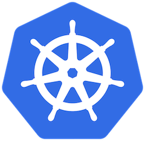

### What is Cloud-native

- Cloud-native refers to a specific approach to building, deploying, and managing applications in cloud environments, leveraging the inherent capabilities of cloud computing platforms.
- It uses technologies such as *containers*, *Kubernetes*, *immutable infrastructure*, and *microservices* to develop scalable applications that are built to run in the cloud.
- Cloud-native definitions from [Wikipedia](https://en.wikipedia.org/wiki/Cloud-native_computing), [CNCF](https://github.com/cncf/toc/blob/main/DEFINITION.md), [AWS](https://aws.amazon.com/what-is/cloud-native/), [Azure](https://cloud.google.com/learn/what-is-cloud-native), and [Google Cloud](https://cloud.google.com/learn/what-is-cloud-native).

---

### Essential Elements

- **It is containerized**. Each part (applications, processes, etc.) is packaged in its own container. This facilitates reproducibility, transparency, and resource isolation.
- **It is dynamically managed**. Containers are actively orchestrated to optimize resource utilization.
- **It is microservices-oriented**. Applications are segmented into microservices, which significantly increases their overall agility and maintainability.

---

### Cloud-native Application Benefits

- Saves money by monitoring and scaling application resources through cloud orchestration, i.e., container schedulers
- Allows teams to ship updates and drive value for customers more quickly
- Aligns operations with business goals
- Reduces time spent on maintenance, meaning more time can be spent focusing on business goals

---

### Common Cloud-native Challenges

- Managing multiple versions of software across different cloud providers
- Scaling applications up and down quickly
- Managing complexity as more services and components are added to the mix
- Dealing with ephemeral infrastructure, which can make debugging and troubleshooting difficult
- Ensuring efficient use of resources, as the pay-as-you-go model of the cloud can quickly get expensive
- Making sure all components work together seamlessly

---

### Common Cloud-native Challenges

- The key to cloud-native development is to use tools like Kubernetes, Docker containers, and Terraform/Ansible to automate deployment, configuration management, and infrastructure provisioning.
- Organizations need to be aware of these challenges and have the necessary strategies and solutions in place to address them as they arise.

---

### Terms (A Lot of Jargon)

- Containerization: Containerization is the process of packaging applications and dependencies as images and then running them as containers.
- Orchestration: an orchestrator is a system that deploys applications and dynamically responds to changes.
- Microservices: applications are built from many small, specialized, independent parts that work together to form a useful application.

---

### Terms (A Lot of Jargon)

- Immutable infrastructure: an IT infrastructure management approach where components are not modified after deployment.
- Cloud-native: cloud-native applications possess cloud-like features such as auto-scaling, self-healing, automated updates, rollbacks, and more. Simply running a regular application in the public cloud does **NOT** make it cloud-native.
- Kubernetes is an orchestrator of containerized cloud-native microservices applications.

---

### Building Blocks - Containers

- [Containers](https://about.gitlab.com/blog/2017/11/30/containers-kubernetes-basics/) are an [alternative way to package applications](https://searchitoperations.techtarget.com/tip/What-are-containers-and-how-do-they-work) versus building for virtual machines (VMs) or physical servers directly.
- Everything needed to run an application (such as code, system libraries, and settings) is included in a container image — a lightweight, standalone, executable package of software.
- Containers can run inside of a VM or on a physical server. Containers hold an application’s libraries and processes, but don't include an operating system, making them lightweight.

---

### Building Blocks - Containers

- In the end, fewer servers are needed to run multiple instances of an application, which reduces cost and makes them easier to scale.
- Some other [benefits of containers](https://tsa.com/top-5-benefits-of-containerization/) include faster deployment, better portability and scalability, and improved security.

---

### Building Blocks - Orchestrators

- Once the containers are set, an orchestrator is needed to get them running.
- Container orchestrators direct how and where containers run, fix any that go down, and determine if more are needed.
- When it comes to container orchestrators, also known as schedulers, Kubernetes is the clear-cut [market winner](https://about.gitlab.com/blog/2018/08/02/top-five-cloud-trends/).

---

### Building Blocks - Microservices

- To make apps run more smoothly, they can be broken down into smaller parts, or microservices, to make them easier to scale based on load.
- Microservices infrastructure also makes it easier and faster for engineers to develop an app. Smaller teams can be formed and assigned to take ownership of individual components of the app’s development, allowing engineers to code without potentially impacting another part of the project.
- More on microservices later.

---

### Monolithic Architecture

- With monolithic architectures, all processes are tightly coupled and run as a single service. This means that if one process of the application experiences a spike in demand, the entire architecture must be scaled.
- Adding or improving a monolithic application’s features becomes more complex as the code base grows. This complexity limits experimentation and makes it difficult to implement new ideas.
- Monolithic architectures add risk for application availability because many dependent and tightly coupled processes increase the impact of a single process failure.

---

#### Advantages of Monolithic Architecture

- **Simple to Develop and Deploy**: Developers can get started and keep adding code modules as needed, and the entire application code base and dependencies can be installed in a single environment, making deployment more straightforward
- **Enhanced Performance**: The unified structure of monolithic architecture allows for efficient data exchange mechanisms within the system, potentially leading to enhanced performance.

---

#### Advantages of Monolithic Architecture

- **Less Network Latency and Security Issues**: There are fewer network calls between different parts of the application. This reduces network latency and can lead to fewer security issues.
- **Focus on One Application**: Monolithic architecture allows developers to concentrate on a single application, with all code located in one place. This can make debugging and tracing data movement within the same programming environment easier.

---

#### Disadvantages of Monolithic Architecture

- **Difficult to Manage as it Grows**: As the application grows, it can become complex and challenging to update or change over time. 
- **Entire Redeployment for Small Changes**: When developers introduce new changes to a monolithic application, they must retest and redeploy the entire system on the server.
- **Lack of Scalability and Flexibility**: The entire application must be scaled as requirements change, leading to resource wastage because not all parts of the application need to be at peak capacity.

---

#### Disadvantages of Monolithic Architecture

- **Difficult to Adopt New Technology**: Monolithic architecture limits the ability to introduce new features and technologies in existing applications. There are multiple dependencies that slow down progress.
- **Less Reliability**: A minor error in the code base can cause the whole application to fail, presenting a single point of failure. 

---

### Microservices Architecture

- With a microservices architecture, an application is built as independent components that run each application process as a service.
- These services communicate via a well-defined interface using lightweight APIs. Services are built for business capabilities and each service performs a single function.
- Because they are independently run, each service can be updated, deployed, and scaled to meet demand for specific functions of an application.

---

#### Advantages of Microservices Architecture

- **Agility in Development**: Microservices allow for faster development and deployment cycles, as individual services can be developed, tested, and deployed independently.
- **Flexible Scaling**: Individual services can be scaled independently based on demand, allowing for more efficient use of resources.
- **Supports Horizontal Scaling**: Microservices support distributed systems where each component receives its own computing resources, allowing for independent scaling.

---

#### Advantages of Microservices Architecture

- **Different Technology per Microservice**: The independence of microservices allows developers to use different technologies and frameworks for different services, fostering innovation and flexibility.
- **System Remains Intact if One Microservice Fails**: The failure of a single microservice does not bring down the entire system, enhancing overall reliability.

---

#### Disadvantages of Microservices Architecture

- **More Complex**: Microservices require more planning, design, and coordination, making the architecture more complex to implement and manage.
- **Complicated Independent Deployment**: Each microservice must be deployed independently, which can be more challenging and time-consuming.

---

#### Disadvantages of Microservices Architecture

- **Network latency**: The communication between microservices can lead to increased network usage and latency, potentially affecting performance.
- **Less Secure and Difficult Debugging**: Security can be more challenging to manage across multiple independent services, and debugging may require coordinated efforts across different parts of the system.

---

### Monolithic vs. Microservices

 

---

### From Monolithic to Microservices

- Monolithic architecture is a great way to get your business started. It’s easy to implement and helps you ship quicker. But as you scale, onboard more customers, and have more features to work with, the same architecture can become difficult to maintain.
- The same was the case with [Uber](https://www.uber.com/en-IN/blog/service-oriented-architecture/) which decided to revamp its architecture using the [Service-Oriented Architecture (SOA) principles](https://aws.amazon.com/what-is/service-oriented-architecture/) — an older variant of the microservice approach.

---

### From Monolithic to Microservices

 

Credit: [AWS](https://aws.amazon.com/microservices/)

---

### Microservices

 

Credit: [Microsoft](https://learn.microsoft.com/en-us/azure/architecture/guide/architecture-styles/microservices)

---

### Best practices of Microservices

- Model services around the business domain.
- Decentralize everything. Individual teams are responsible for designing and building services. Avoid sharing code or data schemas.
- Data storage should be private to the service that owns the data. Use the best storage for each service and data type.
- Services communicate through well-designed APIs. Avoid leaking implementation details. APIs should model the domain, not the internal implementation of the service.

---

### Best practices of Microservices

- Avoid coupling between services. Causes of coupling include shared database schemas and rigid communication protocols.
- Offload cross-cutting concerns, such as authentication and SSL termination, to the gateway.
- Keep domain knowledge out of the gateway. The gateway should handle and route client requests without any knowledge of the business rules or domain logic. Otherwise, the gateway becomes a dependency and can cause coupling between services.

---

### Best practices of Microservices

- Services should have loose coupling and high functional cohesion. Functions that are likely to change together should be packaged and deployed together. If they reside in separate services, those services end up being tightly coupled, because a change in one service will require updating the other service. Overly chatty communication between two services may be a symptom of tight coupling and low cohesion.
- Isolate failures. Use resiliency strategies to prevent failures within a service from cascading.

---

### Kubernetes

- Kubernetes is an orchestrator of containerized cloud-native microservices applications.
- Kubernetes deploys, scales, self-heals, and updates applications where individual application features are packaged and deployed as containers.

---

### History of Kubernetes

- Kubernetes was developed by a group of Google engineers partly in response to Amazon Web Services (AWS) and Docker. AWS changed the world when it invented modern cloud computing, and the rest of the industry needed to catch up.
- Google had built their own cloud but needed a way to abstract the value of AWS and make it as easy as possible for customers to get off AWS and onto their cloud.

---

### History of Kubernetes

- Google already ran their own production apps, such as Search and Gmail, on billions of containers per week.
- At the same time, Docker was taking the world by storm, and users needed help managing explosive container growth.
- This led a group of Google engineers to take the lessons they’d learned using their internal container management tools and create a new tool called Kubernetes.

---

### History of Kubernetes

- In 2014, Google open-sourced Kubernetes and donated it to the newly formed [CNCF - Cloud Native Computing Foundation](https://www.cncf.io/).
- Kubernetes is over 11 years old and has experienced incredible growth and adoption. At its core, it still does the two things the rest of the industry need:
  - It abstracts infrastructure (such as AWS)
  - It simplifies applications portability
- Kubernetes: The Documentary [PART 1](https://www.youtube.com/watch?v=BE77h7dmoQU), [PART 2](https://www.youtube.com/watch?v=318elIq37PE)

---

### Kubernetes and Docker

- All the early versions of Kubernetes shipped with Docker as its container runtime. This means Kubernetes used Docker for low-level tasks such as creating, starting, and stopping containers.
- However , two things happened:
  1. Docker got bloated
  2. People created lots of Docker alternatives
- As a result, the Kubernetes project created the container runtime interface (CRI) to make the runtime layer pluggable.

---

### Kubernetes and Docker

- You can now pick and choose the best runtimes for your needs. For example, some runtimes provide better isolation, some provide better performance, some use GPU, and more. You can have multiple runtimes on the same node.
- Kubernetes 1.24 finally removed support for Docker as a runtime as it was bloated and overkill for what Kubernetes needed. Since then, most new Kubernetes clusters ship with containerd (pronounced “container dee”) as the default runtime.

---

### Kubernetes and Docker

- Fortunately, containerd is a stripped-down version of Docker optimized for Kubernetes, that fully supports applications containerized by Docker.
- In fact, Docker, containerd, and Kubernetes all work with images and containers that implement the Open Container Initiative (OCI) standards.
- In 2016 and 2017, Docker Swarm, Mesosphere DCOS, and Kubernetes competed to become the industry standard container orchestrator. Kubernetes won.

---

### Kubernetes

- Most people pronounce Kubernetes as “koo-ber-net-eez”.
- It's often shortened to K8s and pronounced as “kates”. The number 8 replaces the eight characters between the “K” and the “s”.
- The word Kubernetes originates from the Greek word for helmsman which is the person who steers a ship.

      

---

### Kubernetes - The OS of the Cloud

- Kubernetes is the de facto platform for cloud-native applications, and we sometimes call it the operating system (OS) of the cloud. It abstracts the differences between cloud platforms the same way that operating systems like Linux and Windows abstract the differences between servers:
  - Linux and Windows abstract server resources and schedule application processes.
  - Kubernetes abstracts cloud resources and schedules application microservices.

---

### Kubernetes - The OS of the Cloud

- You can schedule applications on Kubernetes without caring if they’re running on AWS, Azure, GCP, or your on-premises data center. This makes Kubernetes a key enabler for:
  - Hybrid cloud
  - Multi-cloud
  - Cloud migrations
- Kubernetes makes it easier to deploy to one cloud today and migrate to another cloud tomorrow.

---

### Application scheduling

- One of the main things an OS does is simplify the scheduling of work tasks.
- Computers are complex collections of hardware resources such as CPU, memory, storage, and networking. Thankfully, modern operating systems hide most of this, making the world of application development a far friendlier place.
- Do you care which CPU core, memory DIMM, or flash chip your browser uses? Most of the time, we let the OS decide.

---

### Application scheduling

- At a high level, a cloud or data center is a complex collection of resources and services. Kubernetes abstracts most of this, making the resources easier to consume.
- Do you care which compute node, which failure zone, or which storage volume your app uses? Most of the time, you’ll be happy to let Kubernetes decide.

---

### Kubernetes Components

- A Kubernetes cluster is one or more **nodes** providing CPU, memory, and other resources for application use.
- Two node types: **control plane** nodes and **worker** nodes.

  

---

### Kubernetes Cluster Nodes

- **Control plane** nodes and **worker** nodes can be physical servers, virtual machines, or cloud instances, and both can run on ARM and AMD64/x86-64.
- Control plane nodes must be Linux, but worker nodes can be Linux or Windows.
- Control plane nodes implement the Kubernetes intelligence, and every cluster needs at least one. However, you should have three or five for high availability (HA).

---

### Kubernetes Cluster Nodes

- Every control plane node runs every control plane service. These include the API server , the scheduler, and the controllers that implement cloud-native features such as self-healing, autoscaling, and rollouts.
- In development and test environments, user apps often run on control plane nodes. In production, they're typically restricted to worker nodes, letting control plane nodes focus on cluster management.

---

### Control Plane Components

- [kube-apiserver](https://kubernetes.io/docs/concepts/architecture/#kube-apiserver): The core component server that exposes the Kubernetes HTTP API.

- [etcd](https://kubernetes.io/docs/concepts/architecture/#etcd): Consistent and highly-available key value store for all API server data.
- [kube-scheduler](https://kubernetes.io/docs/concepts/architecture/#kube-scheduler): Looks for Pods not yet bound to a node, and assigns each Pod to a suitable node.
- [kube-controller-manager](https://kubernetes.io/docs/concepts/architecture/#kube-controller-manager): Runs [controllers](https://kubernetes.io/docs/concepts/architecture/controller/) to implement Kubernetes API behavior.
- [cloud-controller-manager](https://kubernetes.io/docs/concepts/architecture/#cloud-controller-manager) (optional): Integrates with underlying cloud provider(s).

---

### Node Components

- [kubelet](https://kubernetes.io/docs/concepts/architecture/#kubelet): Ensures that Pods are running, including their containers.
- [kube-proxy](https://kubernetes.io/docs/concepts/architecture/#kube-proxy) (optional): Maintains network rules on nodes to implement [Services](https://kubernetes.io/docs/concepts/services-networking/service/).
- [Container runtime](https://kubernetes.io/docs/concepts/architecture/#container-runtime): Software responsible for running containers. Read [Container Runtimes](https://kubernetes.io/docs/setup/production-environment/container-runtimes/) to learn more.
- Your cluster may require additional software on each node; for example, you might also run [systemd](https://systemd.io/) on a Linux node to supervise local components.

---

### Packaging apps for Kubernetes

- Kubernetes runs containers, VMs, Wasm apps, and more. However, all of them need wrapping in **Pods** before they’ll run on Kubernetes.
- Courier analogy: Couriers ship books, clothes, food, electronics, and more using approved packaging and labels. **All you have to do** is package and label the goods, then the courier manages logistics, including transport, local hub hand-offs, and delivery. They also offer tracking, delivery updates, and confirmation of successful delivery.

---

### Packaging apps for Kubernetes

- Once your application is wrapped in a Pod, you give the Pod to Kubernetes, and Kubernetes runs it.
- This includes the complex logistics of choosing appropriate nodes, joining networks, attaching volumes, and more. Kubernetes even lets you query apps and make changes.
- You'll almost always wrap pods in higher-level controllers for advanced features.
- Courier analogy: insurance for the goods you’re shipping, signature/photographic proof of delivery, express delivery services, and more.

---

### Pods and Nodes

- A Pod is a group of one or more application containers (such as Docker) and includes shared storage (volumes), IP address and information about how to run them.

  

---

### Pods and Nodes

- A Pod always runs on a **Node**. A Node can have multiple pods, and the Kubernetes control plane automatically handles scheduling the pods across the Nodes in the cluster.

  

---

### The Declarative Model

- The declarative model and desired state are at the core of how Kubernetes operates. They work on three basic principles:
  - Desired state
  - Observed state
  - Reconciliation
- Desired state is what you want, observed state is what you have, and reconciliation is the process of keeping observed state in sync with desired state.

---

### The Declarative Model

1. You define the desired application state in a YAML manifest file.
2. You post the YAML file to the Kubernetes API server.
3. Kubernetes stores the desired state as a record of intent in the cluster store.
4. A controller detects a mismatch between the cluster's observed state and the desired state.
5. The controller applies changes to align the observed state with the desired state.
6. The controller continuously runs, ensuring the observed state matches the desired state.

---

### Using Pods

- The following is an example of a Pod which consists of a container running the image `nginx:1.14.2`.

```yaml
apiVersion: v1
kind: Pod
metadata:
  name: nginx
spec:
  containers:
  - name: nginx
    image: nginx:1.14.2
    ports:
    - containerPort: 80
```

---

### Using Pods

- To create the Pod shown above, run the following command:

```shell
kubectl apply -f https://k8s.io/examples/pods/simple-pod.yaml
```

- Pods are generally not created directly. Instead, create them using workload resources such as [Deployment](https://kubernetes.io/docs/concepts/workloads/controllers/deployment/) or [Job](https://kubernetes.io/docs/concepts/workloads/controllers/job/).
- Read more about [Concepts of Pods](https://kubernetes.io/docs/concepts/workloads/pods/).
- Read more about [Pod Lifecycle](https://kubernetes.io/docs/concepts/workloads/pods/pod-lifecycle/).

---

### Deployments

- A Deployment manages a set of Pods to run an application workload, usually one that doesn't maintain state.
- A *Deployment* provides declarative updates for [Pods](https://kubernetes.io/docs/concepts/workloads/pods/).
- You describe a *desired state* in a Deployment, and the Deployment [Controller](https://kubernetes.io/docs/concepts/architecture/controller/) changes the actual state to the desired state at a controlled rate.

---

### Deployment, Pod, and Node

 

---

### Creating a Deployment

```yaml
apiVersion: apps/v1
kind: Deployment
metadata:
  name: nginx-deployment
  labels:
    app: nginx
spec:
  replicas: 3
  selector:
    matchLabels:
      app: nginx
  template:
    metadata:
      labels:
        app: nginx
    spec:
      containers:
      - name: nginx
        image: nginx:1.14.2
        ports:
        - containerPort: 80
```

---

### Service

- Expose an application running in your cluster behind a single outward-facing endpoint, even when the workload is split across multiple backends.
- In Kubernetes, a Service is a method for exposing a network application that is running as one or more [Pods](https://kubernetes.io/docs/concepts/workloads/pods/) in your cluster.

---

### Ephemeral Nature of Pods

- If you use a [Deployment](https://kubernetes.io/docs/concepts/workloads/controllers/deployment/) to run your app, that Deployment can create and destroy Pods dynamically. From one moment to the next, you don't know how many of those Pods are working and healthy; you might not even know what those healthy Pods are named.
- Kubernetes [Pods](https://kubernetes.io/docs/concepts/workloads/pods/) are created and destroyed to match the desired state of your cluster. Pods are ephemeral resources (you should not expect that an individual Pod is reliable and durable).

---

### Ephemeral Nature of Pods

- If some set of Pods (call them "backends") provides functionality to other Pods (call them "frontends") inside your cluster, how do the frontends find out and keep track of which IP address to connect to, so that the frontend can use the backend part of the workload?
- You use a Service to make that set of Pods available on the network so that clients can interact with it.

---

### Defining a Service

```yaml
apiVersion: v1
kind: Service
metadata:
  name: my-service
spec:
  selector:
    app.kubernetes.io/name: MyApp
  ports:
    - protocol: TCP
      port: 80
      targetPort: 9376
```

- Read more about Service at https://kubernetes.io/docs/concepts/services-networking/service/

---

### Key Takeaways

- Cloud-native applications leverage containers, Kubernetes, and microservices for scalability and cloud optimization.
- Containers package applications with dependencies, ensuring reproducibility and resource isolation.
- Microservices break applications into small, independent components for agility and maintainability.
- Monolithic architectures are simpler to develop but harder to scale and maintain as they grow.
- Microservices enable independent scaling and technology choices but increase complexity and network latency.

---

### Key Takeaways

- Kubernetes abstracts cloud infrastructure, simplifying hybrid and multi-cloud deployments.
- Kubernetes orchestrates containers, managing deployment, scaling, and self-healing of applications.
- The declarative model defines desired state in YAML, with controllers ensuring alignment with observed state.
- Pods, the smallest Kubernetes unit, wrap containers and run on nodes managed by the control plane.
- Services expose applications across Pods.

---

### Sources:

- https://about.gitlab.com/topics/cloud-native/
- https://aws.amazon.com/microservices/
- https://learn.microsoft.com/en-us/azure/architecture/guide/architecture-styles/microservices
- https://dashbird.io/knowledge-base/well-architected/monolith-vs-microservices/
- https://kubernetes.io/docs/concepts/
- https://kubernetes.io/docs/tutorials/kubernetes-basics/explore/explore-intro/